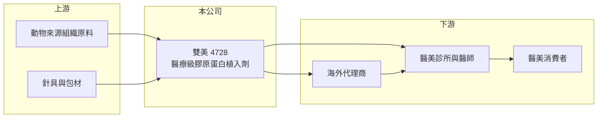

# 4728 雙美

> 上櫃｜[[產業索引-生技醫療業|生技醫療業]]｜上市（櫃）日期 2012/01/10

# 第一章：企業模式與商業藍圖

> [!info] 撰寫說明
> 精簡版，由 Claude 依公開資料整理，架構比照 [[2330台積電]] 的四章研究，資料截至 2026-10-08。來源：Goodinfo 年度經營績效頁（2019 至 2025 年）、櫃買中心開放資料（基本資料、2026 年第二季資產負債與綜合損益、每月營收、本益比殖利率）、nStock 公司簡介；產品取證與市場細節憑既有知識撰寫，已標「待校對」。公開資料有限。#待校對

雙美生物科技（股票代號：4728，以下簡稱雙美）是台灣少數能自行生產醫療級[[膠原蛋白]]植入劑的醫材公司，產品主要用於醫美診所的填補與除皺療程。雙美的商業模式是「高門檻醫材加上醫美消費」，近年也是台灣生技醫療類股中獲利能力最突出的公司之一。

- **核心業務：** 雙美 2001 年成立，2012 年 1 月上櫃，登記地址位於台南市新市區（櫃買中心開放資料、nStock）。營業項目是研究、開發、製造與銷售生醫材料級膠原蛋白及相關產品，並兼營保養品批發與進出口（nStock）。核心產品是注射用膠原蛋白植入劑，屬於高風險等級的[[第三類醫材]]，需要完整的臨床與法規審查才能上市。#待校對
- **營收結構：** 產品別與地區別比重本次未查得。依既有知識，營收以膠原蛋白植入劑為主，市場以台灣醫美診所與中國大陸為主，另有保養品等周邊產品（待校對）。毛利率長期在 78% 至 86% 之間（Goodinfo），顯示營收主力是高附加價值的醫材，而非一般消費品。
- **營運據點：** 研發與生產集中在台南。醫療級膠原蛋白須從動物組織萃取並純化，製程需控制病毒去活化與免疫原性，工廠與製程本身就是主要的進入門檻。
- **長期方向：** 2020 至 2025 年營收從 8.56 億元成長到 20.3 億元（Goodinfo），2026 年 1 至 8 月累計營收再較去年同期成長約 24%（櫃買中心每月營收）。長期成長取決於海外市場的取證與通路擴張，以及新的膠原蛋白應用產品能否延伸產品線。

# 第二章：護城河深度與競爭優勢

雙美的護城河來自醫材許可證、製程技術與醫師使用習慣，三者都需要長時間累積。

- **競爭優勢：** 第三類醫材的取證需要臨床試驗與多年審查，每進入一個新國家都要重新取得[[醫材許可證]]，後進者很難短期追上。醫美診所的醫師一旦熟悉某個產品的手感與效果，更換產品的意願低，這讓雙美在已取證市場具有定價能力，毛利率長期維持在 80% 上下就是證明。
- **主要對手：** 醫美填充劑市場的主流是玻尿酸，國際品牌如 Allergan、Galderma 的產品市占高；膠原蛋白類產品則有中國本土廠商與其他國際品牌。#待校對 台灣同樣做醫美材料的公司有 [[1786科妍]]（玻尿酸）。
- **產品定位：** 膠原蛋白與玻尿酸在效果與適應部位上有所區隔，膠原蛋白常用於細紋與膚質改善。醫美消費者對「天然成分」與「膚質改善」的偏好，是膠原蛋白類產品近年成長的背景（推估）。
- **觀察重點：** 第一，海外新市場取證與銷售的進度；第二，中國市場的競爭與價格變化；第三，營收成長的同時，毛利率能否維持在 75% 以上。

# 第三章：財務體質與盈利規模

資料日期：2026-10-08，表格是撰寫當時的快照；最新月營收、毛利率、累計 EPS 由自動排程寫在本筆記的屬性欄位（月營收、毛利率、累計EPS 等）。#待校對

雙美的財務特徵是高毛利、高營業利益率、高 ROE，加上高配息，是典型的輕資產高報酬企業。

| 年度 | 營收（新台幣） | [[毛利率]] | [[營業利益率]] | EPS（元） | [[ROE]] |
|---|---|---|---|---|---|
| 2021 | 10.4 億 | 86.4% | 35.5% | 4.51 | 25.7% |
| 2022 | 14.0 億 | 85.2% | 54.9% | 9.80 | 45.5% |
| 2023 | 16.9 億 | 83.2% | 53.0% | 11.49 | 45.5% |
| 2024 | 18.2 億 | 81.3% | 51.0% | 12.47 | 46.2% |
| 2025 | 20.3 億 | 78.4% | 49.3% | 13.33 | 46.4% |
| 2026 上半年 | 11.83 億 | 80.5% | 52.5% | 8.52 | 未查得 |

- **營收規模：** 2020 至 2025 年營收年複合成長率約 19%（推算），EPS 由 4.37 元成長到 13.33 元。營收與獲利同步成長，代表規模擴大的同時沒有犧牲定價。
- **獲利：** 營業利益率連續四年維持在 49% 以上，2021 至 2025 年平均 ROE 約 42%（推算）。毛利率從 86% 緩步降到 78%，可能與產品組合或市場價格變化有關（推估），是需要留意的趨勢。
- **財務特色：** 2026 年第二季底總資產 20.0 億元、總負債 5.70 億元、權益 14.3 億元（櫃買中心資料），股本僅 5.45 億元，推估沒有重大有息負債。2025 年度現金股利每股 12.10 元，約為當年 EPS 的 91%（櫃買中心本益比殖利率資料，推算），公司把大部分獲利發還股東。

**[[ROIC]] 與 [[WACC]]：**
- ROIC（推算）：2025 年營業利益約 20.3 億元 × 49.3% ≈ 10.0 億元，稅後（稅率 20%）約 8.0 億元。投入資本以權益 14.3 億元計（有息負債假設為 0），ROIC 約 56%（推算）。若以 2026 年上半年營業利益 6.22 億元年化，ROIC 約 70%（推算）。
- WACC（推算）：無風險利率 1.75%、市場風險溢酬 6%，β 取醫材公司常見值 0.9（假設），股東權益成本約 7.2%；幾乎無負債，WACC 約 7.2%（推算）。
- 結論：ROIC 長期是 WACC 的數倍，代表雙美每投入一元資本都能創造遠高於資金成本的報酬。這種程度的超額報酬，來自醫材許可證與製程技術的高門檻，也是高配息率能持續的基礎。

# 第四章：總體風險與地緣政治

雙美的風險主要來自醫美消費景氣、市場集中與法規。

- **產業週期：** 醫美屬於可選消費，經濟下行時消費者會減少療程。不過醫美客群的消費力相對強，過去幾年營收仍持續成長，景氣敏感度低於一般消費品（推估）。
- **營運風險：** 營收集中在少數產品與市場，若主要市場出現強勢競爭者或價格戰，獲利會受影響。原料來自動物組織，原料來源的疫病與供應穩定性是潛在風險。
- **法規風險：** 醫美產品受各國醫材法規嚴格監管，若發生不良事件或法規收緊，可能影響銷售或取證進度。中國市場另有政策變動與通路管理風險。#待校對
- **其他風險：** 外銷收入受匯率影響；高配息政策意味著保留盈餘有限，若未來需要大額擴廠或併購，可能需要調整股利政策。

# 專有名詞解析

## 應用

- **[[醫美填充劑]]**：注射到皮下以填補凹陷或改善皺紋的醫材，常見成分為玻尿酸與膠原蛋白。

## 產業

- **[[膠原蛋白]]**：人體皮膚與結締組織的主要蛋白質，醫療級膠原蛋白可製成植入劑、人工皮與敷料。
- **[[第三類醫材]]**：台灣醫療器材依風險分為三級，第三類風險最高，上市前須提出臨床資料並經嚴格審查。
- **[[醫材許可證]]**：醫療器材在各國上市前須取得的主管機關許可，每個國家要分別申請。

# 核心供應鏈

- 上游：動物來源的膠原蛋白原料、預充填針具與包材供應商。
- 下游／客戶：台灣醫美診所與醫師、海外代理商（推估），最終為醫美消費者。#待校對
- 同業：[[1786科妍]]，以及國際玻尿酸與膠原蛋白[[醫美填充劑]]品牌。

## 最新新聞
<!-- news:start -->
<!-- news:end -->

## 相關連結
- [公開資訊觀測站](https://mopsov.twse.com.tw/mops/web/t05st03?step=1&firstin=1&co_id=4728)
- [Goodinfo](https://goodinfo.tw/tw/StockDetail.asp?STOCK_ID=4728)
- [Yahoo 股市](https://tw.stock.yahoo.com/quote/4728)
- [鉅亨網新聞](https://www.cnyes.com/twstock/4728/news)
