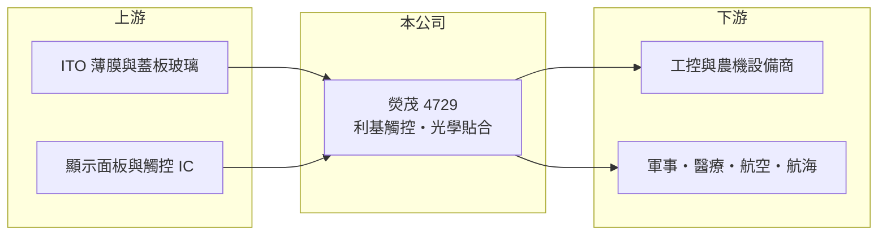

# 4729 熒茂

> 上櫃｜[[產業索引-光電業|光電業]]｜上市（櫃）日期 2009/02/24

# 第一章：企業模式與商業藍圖

> [!info] 撰寫說明
> 精簡版，由 Claude 依公開資料整理，架構比照 [[2330台積電]]，資料截至 2026-10-07。來源：工商時報 2026-07-27 報導、winvest.tw 營收快訊。#待校對

熒茂是專做工控、軍用與醫療等利基應用的觸控面板廠，客戶以歐洲為主。

- **核心業務：** 熒茂以利基型觸控面板為基礎，向下整合[[光學貼合]]與觸控模組，以[[電容式觸控]]產品為主（推估）。
- **營收結構：** 工控應用約占營收 3 至 4 成，包括工廠內與戶外的控制面板；其餘為軍事、醫療、航空、航海等特殊應用。
- **營運據點：** 生產據點本次未查證；客戶分布在德國、瑞典、荷蘭、比利時、法國、土耳其與日本等地。
- **長期方向：** 擴大軍用（德國與日本潛艦訂單）、歐洲農耕機與手持式檢測儀器等應用。

# 第二章：護城河深度與競爭優勢

熒茂避開消費性市場，在少量多樣、認證門檻高的利基市場經營。

- **競爭優勢：** 軍事、醫療與航空客戶重視可靠度與長期供貨，產品認證時間長，客戶不易更換供應商。
- **主要對手：** [[3673TPK-KY]]、[[3622洋華]]等觸控廠，以及歐美的工業顯示整合商（推估）。
- **觀察重點：** 2026 年下半年月營收年增近兩成能否延續，以及農耕機訂單明年出貨進度。

# 第三章：財務體質與盈利規模

資料日期：2026-10-07，以下數字是撰寫當時的快照；最新月營收、毛利率、累計 EPS 由自動排程寫在本筆記的屬性欄位（月營收、毛利率、累計EPS 等）。#待校對

熒茂營收規模約每月 1 億元，獲利微薄但為正。

- **營收規模：** 2026 年上半年合併營收約 5.28 億元、年減 4.15%；7 月 9,812.9 萬元、年增 18.56%，8 月 9,569.4 萬元、年增 18.79%。
- **獲利：** 2026 年第一季 EPS 0.04 元，[[毛利率]]約 24.6%，營業利益約 347 萬元。
- **財務特色：** 第一季稅後純益約 510 萬元，獲利占營收比例低，費用結構對獲利影響大。

# 第四章：總體風險與地緣政治

熒茂的風險在於訂單規模小且波動，以及歐洲市場景氣。

- **產業週期：** 工控與農機需求受歐洲製造業景氣影響；軍工訂單則取決於各國國防預算。
- **營運風險：** 少量多樣的接單模式使營收逐月起伏大，大型專案延後會直接影響當季營收。
- **其他風險：** 歐元與美元匯率波動；軍用產品可能受出口管制規範影響。

# 專有名詞解析

## 半導體

- **[[電容式觸控]]**：偵測手指接觸造成的微小電容變化來判斷位置的觸控技術，是筆電觸控板與手機螢幕的主流。

## 應用

- **[[光學貼合]]**：以光學膠把觸控面板、蓋板與顯示器貼合在一起，減少反光並提高耐用度。

# 核心供應鏈

- 上游：ITO 薄膜、蓋板玻璃、顯示面板與觸控 IC 供應商
- 下游／客戶：歐洲與日本的工控、農機、軍事、醫療與航太設備商
- 同業：[[3673TPK-KY]]、[[3622洋華]]、[[3623富晶通]]

## 最新新聞
<!-- news:start -->
<!-- news:end -->

## 相關連結
- [公開資訊觀測站](https://mopsov.twse.com.tw/mops/web/t05st03?step=1&firstin=1&co_id=4729)
- [Goodinfo](https://goodinfo.tw/tw/StockDetail.asp?STOCK_ID=4729)
- [Yahoo 股市](https://tw.stock.yahoo.com/quote/4729)
- [鉅亨網新聞](https://www.cnyes.com/twstock/4729/news)
