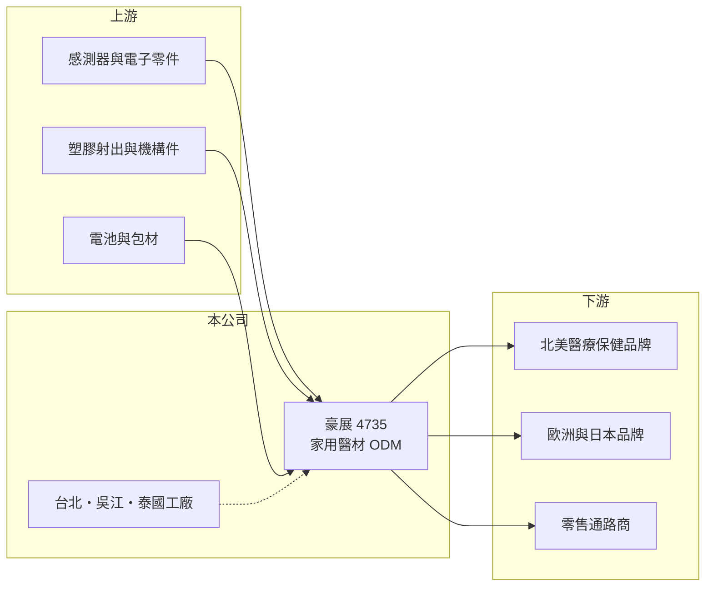

# 4735 豪展

> 上櫃｜[[產業索引-生技醫療業|生技醫療業]]｜上市（櫃）日期 2011/08/16

# 第一章：企業模式與商業藍圖

> [!info] 撰寫說明
> 精簡版，由 Claude 依公開資料整理，架構比照 [[2330台積電]] 的四章研究，資料截至 2026-10-08。來源：Goodinfo 年度經營績效頁（2019 至 2025 年）、櫃買中心開放資料（基本資料、2026 年第二季資產負債與綜合損益、每月營收、本益比殖利率）、Poorstock 豪展法說會整理（2024 至 2025 年）；客戶代號對應的公司名稱未經證實，已標「待校對」。#待校對

豪展醫療科技（股票代號：4735，以下簡稱豪展）是一家家用醫療器材的設計與代工廠，產品包括耳溫槍、非接觸式體溫計、血壓計、霧化器、吸鼻器與吸乳器。豪展的定位是「歐美日醫療保健品牌背後的設計製造夥伴」，營收大起大落的原因主要來自疫情期間體溫計的爆發性需求。

- **核心業務：** 豪展 1996 年成立，2011 年 8 月上櫃（櫃買中心開放資料）。以 [[ODM]] 為主，替北美、歐洲與日本的醫療保健品牌設計並生產家用醫材，並與通路商合作開發通路[[自有品牌]]產品（Poorstock 法說會整理）。2023 年起新產品線聚焦除蝨機、霧化器、吸乳器與血氧計（同上）。
- **營收結構：** 產品別與地區別比重本次未查得。客戶包括北美、歐洲與日本的多家品牌，其中 Helen of Troy 曾頒發供應商獎項給豪展（Poorstock 整理），推估北美品牌客戶占營收相當比重（推估）。#待校對 代工模式下，營收高度依賴少數大客戶的新品計畫與庫存政策。
- **營運據點：** 生產據點在台北、江蘇吳江與泰國。泰國新廠 2024 年 11 月動工、2025 年 12 月開工典禮，預計 2026 年 3 月量產（Poorstock 整理），目的是因應美中貿易戰與美國關稅，分散中國產能。
- **長期方向：** 公司持續累積專利（已核准約 85 項），規劃 2027 年起陸續推出北美與日本客戶的新品項，並爭取電動吸乳器的保險給付（Poorstock 整理）。產品線從單一體溫計擴大到呼吸照護與母嬰用品，是降低疫情後需求衰退衝擊的長期策略。

# 第二章：護城河深度與競爭優勢

豪展的競爭力在於設計能力、醫材認證經驗與國際品牌客戶關係，但家用醫材代工的競爭者眾多。

- **競爭優勢：** 家用醫材雖然單價不高，但需要通過美國 [[FDA]] 510(k)、歐盟 CE 等醫材認證，品牌商更換代工廠必須重新驗證與送審，形成轉換成本。豪展能同時提供設計與製造，與客戶綁定較深，比單純組裝的代工廠更有議價能力。
- **主要對手：** 台灣同業有 [[3373熱映]]、[[1781合世]] 等體溫計與家用醫材廠，以及百略醫學（Microlife），中國則有大量低成本的家用醫材製造商。#待校對 價格競爭在疫情後需求回落時特別明顯。
- **供應鏈布局：** 泰國廠讓豪展可以提供「非中國製造」的選項，符合品牌客戶[[中國加一]]的需求，在美國關稅提高的環境下，這可能成為爭取美國客戶訂單的差異化條件。
- **觀察重點：** 第一，泰國廠量產後的良率與成本；第二，新產品線（霧化器、吸乳器）的營收占比；第三，2027 年起北美與日本客戶新品的出貨規模。

# 第三章：財務體質與盈利規模

資料日期：2026-10-08，表格是撰寫當時的快照；最新月營收、毛利率、累計 EPS 由自動排程寫在本筆記的屬性欄位（月營收、毛利率、累計EPS 等）。#待校對

豪展的財務數字有明顯的疫情紅利痕跡：2020 至 2021 年營收與獲利暴增，之後回到正常水準。

| 年度 | 營收（新台幣） | [[毛利率]] | [[營業利益率]] | EPS（元） | [[ROE]] |
|---|---|---|---|---|---|
| 2021 | 23.3 億 | 29.0% | 16.8% | 8.65 | 33.9% |
| 2022 | 12.0 億 | 29.7% | 9.70% | 2.75 | 10.9% |
| 2023 | 8.79 億 | 30.1% | 1.69% | 1.17 | 4.75% |
| 2024 | 9.27 億 | 27.5% | 1.68% | 1.62 | 6.70% |
| 2025 | 9.36 億 | 31.6% | 4.95% | 2.46 | 10.2% |
| 2026 上半年 | 4.88 億 | 31.1% | 7.8% | 4.37 | 未查得 |

- **營收規模：** 2019 年營收 12.5 億元，2020 年疫情期間衝到 26 億元、EPS 14.66 元（Goodinfo），2023 年回落到 8.79 億元。2020 至 2025 年營收年複合成長率約 -18.5%（推算），這個數字主要反映高基期，而不是本業萎縮。2026 年 1 至 8 月累計營收較去年同期成長約 15%（櫃買中心每月營收）。
- **獲利：** 毛利率長期穩定在 27% 至 32%，營業利益率則隨營收規模大幅變化。2021 至 2025 年平均 ROE 約 13%（推算）。2026 年上半年稅前淨利 1.77 億元，遠高於營業利益 0.38 億元（櫃買中心資料），EPS 主要來自業外收益，來源本次未查得，不宜視為本業常態。
- **財務特色：** 2026 年第二季底總資產 18.0 億元、總負債 6.74 億元、權益 11.3 億元（櫃買中心資料）。2025 年度現金股利每股 2.00 元，約為當年 EPS 的 81%（櫃買中心本益比殖利率資料，推算），配息率高。

**[[ROIC]] 與 [[WACC]]：**
- ROIC（推算）：2025 年營業利益約 9.36 億元 × 4.95% ≈ 0.46 億元，稅後約 0.37 億元。有息負債未查得，假設約 3 億元（泰國建廠），加上權益 11.3 億元，投入資本約 14.3 億元，ROIC 約 2.6%（推算）。2026 年上半年營業利益年化後，ROIC 約 4.2%（推算）。2021 年營業利益率 16.8% 時 ROIC 推估超過 20%（推算）。
- WACC（推算）：無風險利率 1.75%、市場風險溢酬 6%，β 取醫材代工常見值 0.8（假設），股東權益成本約 6.6%；負債成本 2.5%、稅後 2.0%，負債約占投入資本 21%，WACC 約 5.6%（推算）。
- 結論：疫情期間 ROIC 遠高於 WACC，2023 年後本業 ROIC 低於資金成本。泰國廠量產與新產品若能把營業利益率拉回 10% 以上，ROIC 才能穩定超過 WACC。

# 第四章：總體風險與地緣政治

豪展的風險來自需求波動、客戶集中與產能轉移。

- **產業週期：** 體溫計等產品的需求受流感與疫情影響，屬於事件驅動的波動。2020 年的爆發性需求不會常態化，投資人應以 2023 年後的水準作為基礎。
- **營運風險：** 營收集中在少數國際品牌客戶，客戶的新品計畫延後或轉單，都會直接影響營收。泰國新廠的量產初期可能面臨良率與成本偏高的問題，折舊也會增加。
- **其他風險：** 美國關稅政策與美中貿易關係是產能布局的主要考量；以美元報價為主（推估），新台幣升值會壓縮毛利；各國醫材法規（如歐盟 [[CE MDR]]）趨嚴，增加認證成本。

# 專有名詞解析

## 產業

- **[[ODM]]**：原廠委託設計製造，代工廠負責產品設計與生產，再以客戶品牌出貨。
- **[[自有品牌]]**：公司以自己的品牌直接銷售產品，承擔行銷成本，但毛利與定價權較高。
- **[[FDA]]**：美國食品藥物管理局，負責藥品與醫療器材的上市審查，取得許可才能在美國銷售。
- **[[CE MDR]]**：歐盟醫療器材法規，2021 年起取代舊指令，對臨床證據與上市後監督的要求更嚴格。
- **[[中國加一]]**：品牌商為分散風險，在中國以外再增加至少一個生產基地的供應鏈策略。

# 核心供應鏈

- 上游：紅外線感測器、壓力感測器、電子零件、塑膠射出件、電池與包材供應商。
- 下游／客戶：北美、歐洲與日本的醫療保健品牌（如 Helen of Troy），以及合作開發自有品牌的零售通路商。#待校對
- 同業：[[3373熱映]]、[[1781合世]]、百略醫學等家用醫材廠。#待校對

## 最新新聞
<!-- news:start -->
<!-- news:end -->

## 相關連結
- [公開資訊觀測站](https://mopsov.twse.com.tw/mops/web/t05st03?step=1&firstin=1&co_id=4735)
- [Goodinfo](https://goodinfo.tw/tw/StockDetail.asp?STOCK_ID=4735)
- [Yahoo 股市](https://tw.stock.yahoo.com/quote/4735)
- [鉅亨網新聞](https://www.cnyes.com/twstock/4735/news)
