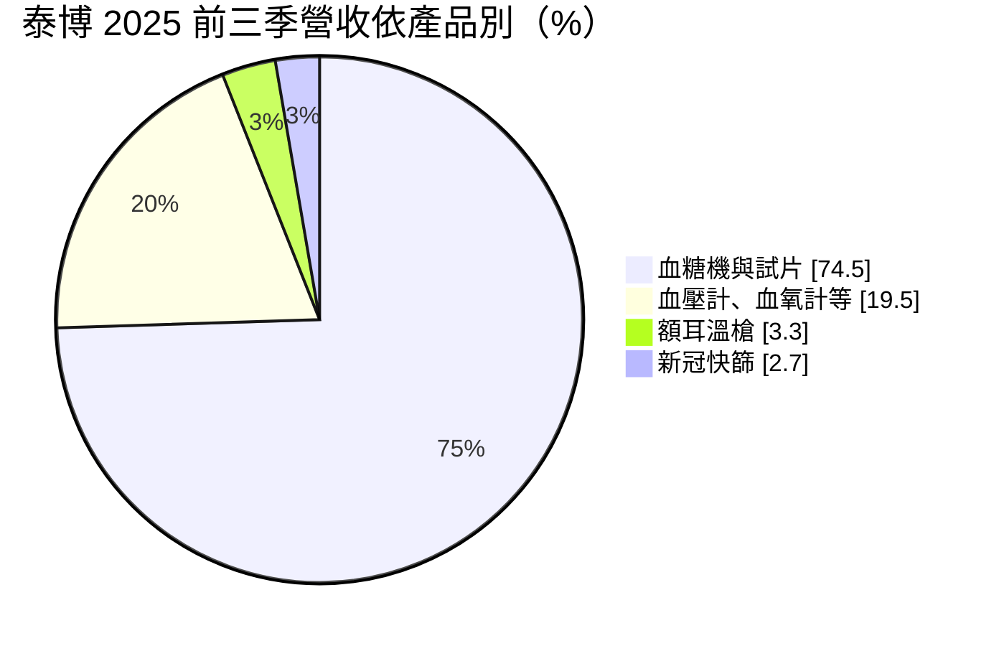
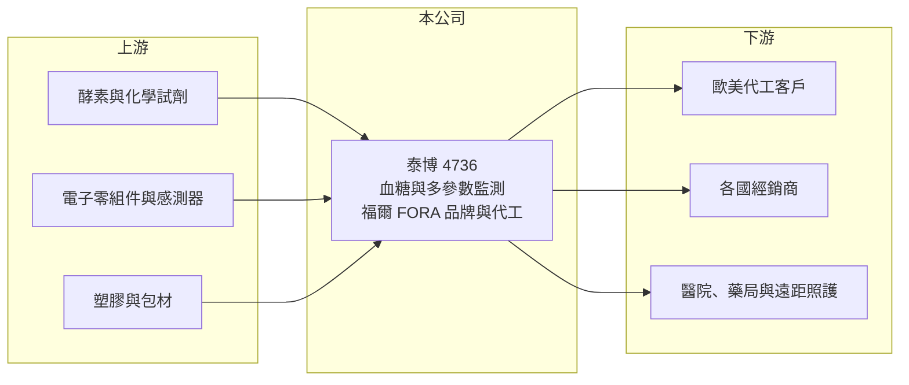

# 4736 泰博

> 上市｜[[產業索引-生技醫療業|生技醫療業]]｜上市（櫃）日期 2023/12/22

# 第一章：企業模式與商業藍圖

> [!info] 撰寫說明
> 精簡版，由 Claude 依公開資料整理，架構比照 [[2330台積電]] 的四章研究，資料截至 2026-10-08。來源：Goodinfo 年度經營績效頁（2019 至 2025 年）、證交所開放資料（基本資料、2026 年第二季資產負債、綜合損益與營益分析、股利）、富果研究 2025 年 11 月泰博法說會整理；上櫃歷史等細節憑既有知識撰寫，已標「待校對」。#待校對

泰博科技（股票代號：4736，以下簡稱泰博）是台灣規模最大的血糖量測系統製造商之一，同時經營自有品牌「福爾 FORA」與代工業務。泰博的生意以[[血糖機]]與試片為核心，靠試片的長期消耗創造穩定現金流，並逐步延伸到血壓、血氧等多參數監測與遠距照護平台。

- **核心業務：** 泰博 1998 年成立，2023 年 12 月轉上市（證交所開放資料），此前在櫃買中心掛牌（待校對）。產品分為診斷檢測儀器及試劑、家庭醫療照護設備、專業醫療監控設備與遠距醫療平台，並發展[[連續血糖監測]]（CGM）、智慧戒指與再生醫學等新事業（富果研究 2025 年 11 月）。
- **營收結構：** 2025 年前三季依產品別，血糖機（含多參數測量儀）與試片占 74.5%，血壓計、血氧計等其他產品占 19.5%，額耳溫槍占 3.3%，新冠抗原快篩占 2.7%；依地區別，歐洲 39%、美洲 22%、台灣 17%、中東 12%、亞洲 7%（富果研究整理）。

- **營運據點：** 生產據點在新北市與桃園，提供從研發、製造、取證到品牌行銷的一條龍服務（富果研究整理）。同時經營[[自有品牌]]與 [[OEM]]，讓公司既能賺品牌毛利，也能用代工訂單填滿產能。
- **長期方向：** 公司以 CGM 為下一世代核心產品，2026 年先透過合作夥伴銷售，自有 CGM 預計 2027 年上市，臨床試驗費用預估約 3 億元；並開發可重複使用的 CGM，鎖定各國健保採購標案（富果研究整理）。多參數檢測產品的目標是 2026 年營收占比超過 10%（同上）。

# 第二章：護城河深度與競爭優勢

泰博的護城河是試片的耗材模式、多國醫材認證與兼具品牌和代工的彈性，但核心產品正面臨 CGM 的世代交替。

- **競爭優勢：** 血糖機與試片綁定，使用者買了機器就必須長期購買同品牌試片，形成類似「刮鬍刀與刀片」的經常性收入。泰博產品通過多國醫材認證並銷往歐美與中東，認證與通路累積需要多年，新進者難以短期追上。
- **主要對手：** 國際品牌有 Roche、Abbott、LifeScan 等，台灣同業有 [[4737華廣]]、[[1733五鼎]]、[[4183福永生技]]。#待校對 在 CGM 領域，Abbott 與 Dexcom 已建立領先地位。
- **世代交替的挑戰：** 法說會指出，部分主要客戶受到 CGM 普及影響而營收下滑（富果研究整理）。這說明傳統血糖機市場的天花板已經出現，泰博必須在 CGM 取得一席之地，才能維持長期成長。
- **觀察重點：** 第一，自有 CGM 能否在 2027 年如期上市，公司預估可帶動整體毛利率提升 5 至 10 個百分點；第二，多參數產品的營收占比；第三，業外金融資產的規模與股利政策調整。

# 第三章：財務體質與盈利規模

資料日期：2026-10-08，表格是撰寫當時的快照；最新月營收、毛利率、累計 EPS 由自動排程寫在本筆記的屬性欄位（月營收、毛利率、累計EPS 等）。#待校對

泰博的本業獲利穩健，2022 年因新冠快篩出現一次性高峰，近年 EPS 則受業外投資收益影響很大。

| 年度 | 營收（新台幣） | [[毛利率]] | [[營業利益率]] | EPS（元） | [[ROE]] |
|---|---|---|---|---|---|
| 2021 | 64.9 億 | 49.4% | 32.3% | 21.35 | 28.7% |
| 2022 | 96.3 億 | 58.7% | 43.0% | 36.03 | 39.4% |
| 2023 | 48.1 億 | 43.1% | 20.1% | 10.67 | 10.9% |
| 2024 | 46.4 億 | 44.3% | 17.5% | 12.15 | 12.8% |
| 2025 | 42.0 億 | 46.0% | 22.7% | 15.12 | 14.9% |
| 2026 上半年 | 21.22 億 | 45.5% | 19.5% | 16.60 | 未查得 |

- **營收規模：** 2019 年營收 41.4 億元，2022 年衝到 96.3 億元後回落，2025 年為 42.0 億元（Goodinfo），2020 至 2025 年年複合成長率約 -6.6%（推算），主要反映快篩需求消失後的高基期。
- **獲利：** 毛利率在 43% 至 50% 的正常區間，營業利益率約 17% 至 23%。2021 至 2025 年平均 ROE 約 21%（推算），扣除 2022 年快篩高峰後約在 11% 至 15%。
- **業外收益：** 2025 年前三季金融資產評價利益約 4.1 億元、股利收入約 1 億元，期末持有約 30 億元的國內外上市櫃股票（富果研究整理）。2026 年上半年營業利益 4.15 億元，但稅前淨利達 17.2 億元、EPS 16.60 元（證交所資料），差額主要來自業外，推估與金融資產評價有關（推估），不能視為本業常態。
- **財務特色：** 2026 年第二季底總資產 143.8 億元、總負債 30.2 億元、權益 113.6 億元（證交所資料）。2025 年度現金股利每股 5.00 元，約為當年 EPS 的 33%（證交所股利資料，推算）；公司曾表示考慮以[[庫藏股]]取代部分現金股利（富果研究整理）。

**[[ROIC]] 與 [[WACC]]：**
- ROIC（推算）：2025 年營業利益約 42.0 億元 × 22.7% ≈ 9.5 億元，稅後約 7.6 億元。投入資本以權益 113.6 億元加推估有息負債約 15 億元（假設），再扣除約 30 億元與本業無關的金融資產，約 98.6 億元，ROIC 約 7.7%（推算）。不扣除金融資產時約 5.9%（推算）。
- WACC（推算）：無風險利率 1.75%、市場風險溢酬 6%，β 取醫材公司常見值 0.8（假設），股東權益成本約 6.6%；負債成本 2.5%、稅後 2.0%，負債約占投入資本 12%，WACC 約 6.0%（推算）。
- 結論：本業 ROIC 略高於 WACC，有創造價值但幅度不大；權益中累積了大量與本業無關的金融資產，拉低了整體資本效率。2021 至 2022 年 ROIC 遠高於 WACC，屬於疫情的特殊期間。

# 第四章：總體風險與地緣政治

泰博的風險在於產品世代交替、業外波動與匯率。

- **產業週期：** 糖尿病患者人數長期成長，血糖監測需求穩定，但需求正從指尖採血轉向 CGM。傳統試片的價格壓力與量的成長趨緩，是長期結構性風險。
- **營運風險：** CGM 開發需要大量臨床與取證投資（約 3 億元臨床費用），若上市延後或市場接受度不佳，投資效益將打折。部分主要客戶因 CGM 普及而減少採購，代工業務的穩定性下降。
- **業外風險：** 約 30 億元的股票投資使 EPS 隨股市波動，股市下跌時可能出現大額評價損失，影響獲利的可預測性。
- **其他風險：** 營收約八成來自海外，歐元與美元匯率變動直接影響獲利；各國醫材法規（如歐盟 [[CE MDR]]）與健保採購政策也會影響銷售。

# 專有名詞解析

## 金融

- **[[庫藏股]]**：公司從市場買回自家股票，可註銷以提高每股價值，是現金股利以外的股東回饋方式。

## 產業

- **[[血糖機]]**：以指尖採血搭配試片量測血糖的家用醫材，機器價格低，主要獲利來自長期消耗的試片。
- **[[連續血糖監測]]**：在皮下植入感測器、連續數天自動量測血糖的醫材（CGM），正逐步取代指尖採血。
- **[[自有品牌]]**：公司以自己的品牌直接銷售產品，承擔行銷成本，但毛利與定價權較高。
- **[[OEM]]**：代工廠依客戶提供的設計生產，產品掛客戶品牌銷售。
- **[[CE MDR]]**：歐盟醫療器材法規，2021 年起取代舊指令，對臨床證據與上市後監督的要求更嚴格。

# 核心供應鏈

- 上游：試片用酵素與化學試劑、感測器與電子零組件、塑膠與包材供應商。
- 下游／客戶：歐洲、美洲、中東等地的代工客戶與經銷商，醫院、藥局與遠距照護服務。
- 同業：[[4737華廣]]、[[1733五鼎]]、[[4183福永生技]]，以及 Roche、Abbott、Dexcom 等國際品牌。

## 最新新聞
<!-- news:start -->
<!-- news:end -->

## 相關連結
- [公開資訊觀測站](https://mopsov.twse.com.tw/mops/web/t05st03?step=1&firstin=1&co_id=4736)
- [Goodinfo](https://goodinfo.tw/tw/StockDetail.asp?STOCK_ID=4736)
- [Yahoo 股市](https://tw.stock.yahoo.com/quote/4736)
- [鉅亨網新聞](https://www.cnyes.com/twstock/4736/news)
