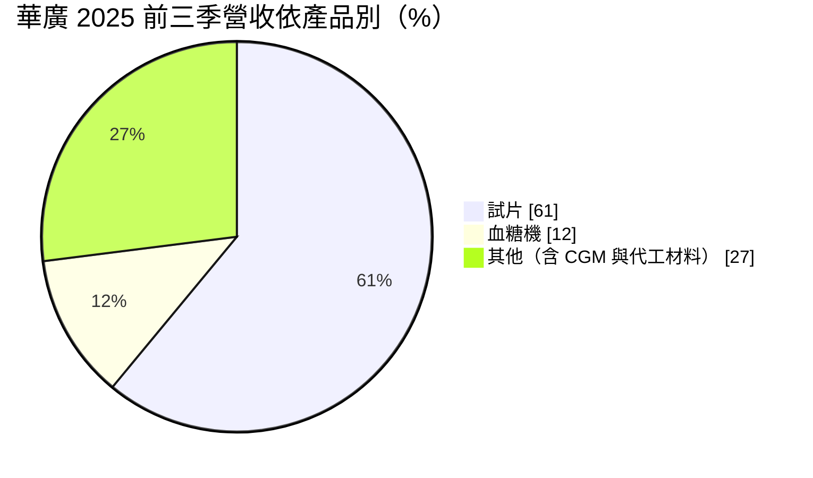
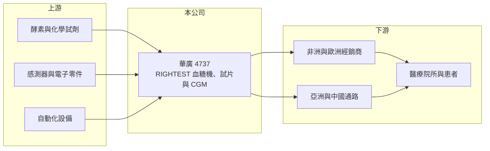

# 4737 華廣

> 上市｜[[產業索引-生技醫療業|生技醫療業]]｜上市（櫃）日期 2010/12/23

# 第一章：企業模式與商業藍圖

> [!info] 撰寫說明
> 精簡版，由 Claude 依公開資料整理，架構比照 [[2330台積電]] 的四章研究，資料截至 2026-10-08。來源：Goodinfo 年度經營績效頁（2019 至 2025 年）、證交所開放資料（基本資料、2026 年第二季資產負債、綜合損益與營益分析、股利）、富果研究 2025 年 12 月華廣法說會整理；工廠位置等細節憑既有知識撰寫，已標「待校對」。#待校對

華廣生技（股票代號：4737，以下簡稱華廣）是以「RIGHTEST」品牌行銷全球的血糖量測公司，傳統主力是血糖機與試片，現在把公司未來押在[[連續血糖監測]]（CGM）上。理解華廣，要看它如何用傳統試片的現金流，支撐 CGM 這項高投入的轉型。

- **核心業務：** 華廣 2003 年成立，2010 年 12 月上市（證交所開放資料）。產品分三類：傳統[[血糖機]]（BGM）、CGM（目前產品為 RIGHTEST iFree，升級版 iFree2 開發推廣中），以及整合兩者數據的雲端資料管理系統（富果研究 2025 年 12 月）。
- **營收結構：** 2025 年前三季依產品別，試片占 61%、血糖機占 12%、其他（含 CGM 與代工材料）占 27%，其中提供客戶在當地組裝的試片材料約占營收 24%；2025 年第三季依地區別，非洲 40%、歐洲 24%、亞洲（含台灣）19%、中國 10%、美洲 7%（富果研究整理）。

- **營運據點：** 總部與生產基地在台中（待校對）。董事會已通過建置年產能 500 萬個的 CGM 自動化產線，廠房可擴充到 1,000 萬個（富果研究整理）。
- **長期方向：** 公司的中長期目標是先取得全球 CGM 約 2% 市占，再透過代工合作擴大到 3% 至 6%，並以年營收 100 億元為長期目標（富果研究整理）。短期最重要的里程碑是取得歐盟 [[CE MDR]] 認證，公司表示取證後將加速國際布局（同上）。這是公司自己的目標，距離 2025 年約 18 億元的營收仍有很大落差。

# 第二章：護城河深度與競爭優勢

華廣的傳統事業有規模與通路，但 CGM 市場由國際大廠主導，轉型能否成功是護城河能否延續的關鍵。

- **競爭優勢：** 華廣在全球血糖機市場約占 2% 的銷量（富果研究整理），在非洲、歐洲等地建立了長期經銷網絡，這些通路可以作為 CGM 推廣的基礎。iFree2 的規格包括 15 天感測器壽命、1 小時暖機、[[MARD]] 準確度 8.4% 與出廠校正（同上），在規格上已接近國際主流產品。
- **主要對手：** CGM 市場由 Abbott（FreeStyle Libre）、Dexcom 與 Medtronic 主導，中國也有多家廠商快速崛起；傳統血糖機則有 Roche 等國際品牌，以及台灣的 [[4736泰博]]、[[1733五鼎]]、[[4183福永生技]]。#待校對
- **市場結構：** 非洲占營收四成，代表華廣的傳統事業偏重價格敏感的新興市場。這些市場量大但單價低，也容易受當地政府採購與匯率影響。
- **觀察重點：** 第一，iFree2 何時取得 CE 認證並開始在歐洲銷售；第二，CGM 自動化產線的建置與良率；第三，研發與行銷費用增加期間，傳統試片業務能否維持穩定。

# 第三章：財務體質與盈利規模

資料日期：2026-10-08，表格是撰寫當時的快照；最新月營收、毛利率、累計 EPS 由自動排程寫在本筆記的屬性欄位（月營收、毛利率、累計EPS 等）。#待校對

華廣的營收長期持平，2023 年起因 CGM 研發與推廣費用增加而轉為虧損。

| 年度 | 營收（新台幣） | [[毛利率]] | [[營業利益率]] | EPS（元） | [[ROE]] |
|---|---|---|---|---|---|
| 2021 | 18.5 億 | 42.3% | 4.07% | 1.45 | 4.31% |
| 2022 | 22.1 億 | 45.4% | 5.94% | 1.50 | 4.42% |
| 2023 | 17.6 億 | 40.8% | -0.76% | 0.10 | 0.32% |
| 2024 | 19.3 億 | 39.7% | -8.03% | -2.09 | -6.49% |
| 2025 | 18.4 億 | 34.1% | -10.7% | -2.68 | -9.84% |
| 2026 上半年 | 8.32 億 | 33.8% | -16.9% | -1.77 | 未查得 |

- **營收規模：** 2020 至 2025 年營收年複合成長率約 2.0%（推算），營收在 16.7 億至 22.1 億元之間。2026 年 1 至 8 月累計營收較去年同期減少約 11%（證交所每月營收）。
- **獲利：** 毛利率從 2022 年的 45.4% 降到 2026 年上半年的 33.8%，營業利益率也一路下滑。法說會將 2025 年前三季的虧損歸因於研發與行銷費用增加（富果研究整理）。2021 至 2025 年平均 ROE 約 -1.5%（推算）。
- **財務特色：** 2026 年第二季底總資產 56.5 億元、總負債 35.4 億元、權益 21.1 億元（證交所資料），負債比約 63%，在醫材公司中偏高。2025 年度因虧損未配發股利（證交所股利資料）。

**[[ROIC]] 與 [[WACC]]：**
- ROIC（推算）：2025 年營業利益約 18.4 億元 × -10.7% ≈ -1.97 億元，虧損不計稅。有息負債未查得，假設約 20 億元，加上權益 21.1 億元，投入資本約 41 億元，ROIC 約 -4.8%（推算）。2026 年上半年營業虧損 1.41 億元，年化後 ROIC 約 -6.9%（推算）。2019 年營業利益率 7.2% 時，ROIC 約 3% 至 4%（推算）。
- WACC（推算）：無風險利率 1.75%、市場風險溢酬 6%，β 取醫材公司 1.0（假設，考量轉型期風險較高），股東權益成本約 7.8%；負債成本 2.5%、稅後 2.0%，負債約占投入資本 49%，WACC 約 4.9%（推算）。
- 結論：即使在獲利的年度，華廣的 ROIC 也只與 WACC 相當，近年則明顯為負。CGM 是公司能否從「低報酬的試片廠」轉為「創造價值的醫材公司」的唯一關鍵。

# 第四章：總體風險與地緣政治

華廣的風險集中在 CGM 轉型、財務槓桿與新興市場。

- **產業週期：** 糖尿病市場長期成長，但需求正從傳統試片轉向 CGM。若華廣的 CGM 進度落後，傳統試片業務會在價格與量上同時受到擠壓。
- **營運風險：** CGM 需要大量研發、臨床與產線投資，取證時程不可控。營業虧損擴大，加上負債比約 63%，若虧損持續，可能需要增資或增加借款。
- **法規風險：** 歐盟 CE MDR 認證要求嚴格，取證延後就會推遲國際銷售；各國健保給付 CGM 的條件也會影響市場規模。
- **其他風險：** 非洲與中國合計占營收約五成，面臨匯率、政府採購與付款風險；國際大廠的價格競爭可能壓低 CGM 的售價。

# 專有名詞解析

## 應用

- **[[MARD]]**：平均絕對相對誤差，衡量血糖監測準確度的指標，數字越低越準確。

## 產業

- **[[血糖機]]**：以指尖採血搭配試片量測血糖的家用醫材，機器價格低，主要獲利來自長期消耗的試片。
- **[[連續血糖監測]]**：在皮下植入感測器、連續數天自動量測血糖的醫材（CGM），正逐步取代指尖採血。
- **[[CE MDR]]**：歐盟醫療器材法規，2021 年起取代舊指令，對臨床證據與上市後監督的要求更嚴格。

# 核心供應鏈

- 上游：試片用酵素與化學試劑、CGM 感測器與電子零件、自動化產線設備供應商。
- 下游／客戶：非洲、歐洲、亞洲與中國的經銷商與當地組裝客戶，最終為醫療院所與糖尿病患者。
- 同業：[[4736泰博]]、[[1733五鼎]]、[[4183福永生技]]，以及 Abbott、Dexcom、Medtronic、Roche 等國際大廠。

## 最新新聞
<!-- news:start -->
<!-- news:end -->

## 相關連結
- [公開資訊觀測站](https://mopsov.twse.com.tw/mops/web/t05st03?step=1&firstin=1&co_id=4737)
- [Goodinfo](https://goodinfo.tw/tw/StockDetail.asp?STOCK_ID=4737)
- [Yahoo 股市](https://tw.stock.yahoo.com/quote/4737)
- [鉅亨網新聞](https://www.cnyes.com/twstock/4737/news)
