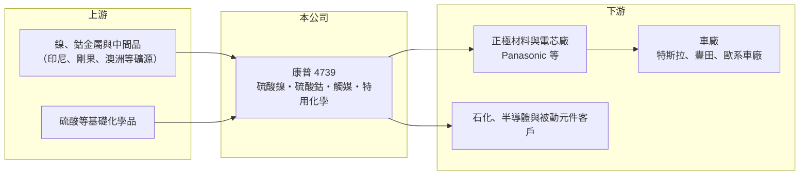

# 4739 康普

> 上市｜[[產業索引-化學工業|化學工業]]｜上市（櫃）日期 2017/09/08

# 第一章：企業模式與商業藍圖

> [!info] 撰寫說明
> 精簡版，由 Claude 依公開資料整理，架構比照 [[2330台積電]]，資料截至 2026-10-08。來源：HiStock 嗨投資季度損益表與報酬率、每股盈餘頁，nStock 公司概況，科技新報 2026 年 9 月康普專題（轉載今周刊），優分析新聞標題。年度數字由季度資料加總推算；產品比重只查到動力電池材料約占七成的概數。#待校對

康普是台灣少數能量產電池級硫酸鎳、硫酸鈷的化學材料廠，把金屬原料精煉成電動車電池正極材料的前段原料，營運高度跟著電動車需求與鎳鈷價格起伏。

- **核心業務：** 康普 1992 年成立，以鈷等金屬製成[[氧化觸媒]]起家，後來把同一套金屬精煉與化學合成能力延伸到[[硫酸鎳]]、[[硫酸鈷]]等[[正極材料]]原料，另有化學肥料與特用化學品。這種「從觸媒跨到電池」的路線，代表公司的核心能力在於金屬溶解、純化與結晶的製程控制，而不是單一產品。
- **營收結構：** 依科技新報 2026 年報導，動力電池材料約占營收七成，其餘為觸媒、肥料與特用化學品。因為電池材料占比高，康普的營收規模大致等於「出貨噸數乘上鎳、鈷報價」，金屬行情的變動會直接放大或縮小營收。
- **營運據點：** 主要廠區在苗栗頭份，占地約 2.4 萬坪；據優分析報導標題，越南新廠已進入試產，規劃年產能 2.5 萬噸。在台灣以外設廠，可分散產能集中風險，也方便供應希望避開中國原料的車廠客戶。
- **長期方向：** 康普 2013 年起經 Panasonic 進入特斯拉供應鏈，2022 年與一家德國豪華車廠合作加工鈷，2025 年下半年再取得歐系車廠與豐田的訂單。公司也鎖定半導體與被動元件用化學品作為第二條成長線，目標是降低對單一電池循環的依賴。

# 第二章：護城河深度與競爭優勢

康普的護城河來自車廠認證與「非中國」供應來源的稀缺性，而不是規模，因為全球硫酸鎳產能大多集中在中國與印尼。

- **競爭優勢：** 電池原料要經過電芯廠與車廠層層驗證，雜質含量、批次穩定度都要長期達標，一旦進入供應鏈，客戶不會輕易更換供應商。康普累積十多年的國際車廠認證紀錄，再加上[[非紅供應鏈]]的身分，在美國與歐洲推動電池在地化、限制中國原料的政策下，具有地緣上的稀缺價值。
- **主要對手：** 全球硫酸鎳與前驅物產能以中國的華友鈷業、格林美等大廠為主，規模遠大於康普；日韓也有住友金屬礦山等整合型業者。康普的定位是規模較小但具非中國產地優勢的專業供應商，無法在成本上和中國大廠正面比拚。
- **觀察重點：** 長期要看越南新廠能否順利量產並通過客戶認證、新取得的歐日車廠訂單能否轉為穩定的長約，以及半導體化學品能否在營收中占到有意義的比重。這三件事決定康普能否從「鎳鈷價格的跟隨者」變成「有穩定加工利潤的材料廠」。

# 第三章：財務體質與盈利規模

資料日期：2026-10-08，表格是撰寫當時的快照；最新月營收、毛利率、累計 EPS 由自動排程寫在本筆記的屬性欄位（月營收、毛利率、累計EPS 等）。#待校對

康普的財務呈現明顯的金屬週期：2022 年鎳鈷價格高檔時營收逾 90 億元，2023 年跌價時毛利率只剩 3% 左右並出現虧損，2025 年起隨新訂單放量再度回升。

| 年度 | 營收（新台幣） | [[毛利率]] | [[營業利益率]] | EPS（元） | [[ROE]] |
|---|---|---|---|---|---|
| 2021 | 73.4 億 | 12.9% | 8.0% | 4.67 | 約 9.6% |
| 2022 | 90.8 億 | 11.3% | 6.4% | 4.72 | 約 9.4% |
| 2023 | 52.3 億 | 3.4% | -1.8% | -0.93 | 約 -1.2% |
| 2024 | 41.0 億 | 13.2% | 4.1% | 1.44 | 約 3.5% |
| 2025 | 61.9 億 | 13.7% | 7.1% | 1.56 | 約 2.4% |
| 2026 上半年 | 55.1 億 | 16.7% | 12.6% | 3.51 | 約 7.2%（半年） |

註：營收、毛利率、營業利益率由 HiStock 季度損益表加總推算；ROE 為四季單季 ROE 相加的推算值。

- **營收規模與成長：** 2021 至 2025 年營收在 41 億至 91 億元之間大幅擺盪，主要反映鎳鈷價格與電動車庫存循環，而非公司競爭力的突然變化。2021 至 2025 年營收年複合成長率約 -4%（推算），但 2026 年上半年營收已接近 2025 全年，顯示新車廠訂單帶來的出貨量成長。
- **獲利：** 電池原料的毛利率長期落在 11% 至 14%，屬於加工利潤型的生意；2023 年金屬價格急跌時，高價買進的庫存造成存貨損失，毛利率一度只剩 3.4%。2026 年上半年毛利率 16.7%、營業利益率 12.6%，是近年最好的水準。
- **財務特色：** 2021 至 2025 年平均 ROE 約 4.7%（推算），低於一般製造業水準，主要是週期低谷拖累。2025 年度現金股利 1 元，依 nStock 資料近五年平均現金股利約 1.75 元，配息隨獲利波動，不屬於穩定配息型公司。2025 年第一季營業利益為正、稅前卻虧損，代表業外（推估為匯兌或金屬避險）影響不小。

**[[ROIC]] 與 [[WACC]]：** 有息負債本次未查得，因此以「稅後營業利益 ÷ 股東權益」估算 ROIC 的上限：2025 年營業利益約 4.37 億元，乘以（1－20%）約 3.5 億元，股東權益以淨利除以 ROE 推得約 64 億元，ROIC 上限約 5.4%（推算）；2021 年約 10%、2024 年約 2%（推算），計入有息負債後實際數字會更低。WACC 以 CAPM 推估：無風險利率 1.75%、市場風險溢酬 6%、β 取原物料化工股常見值 1.2，股權成本約 9%；負債成本假設 2.5%、稅後 2%，負債占資本 30%，WACC 約 7%（推算）。過去五年康普的 ROIC 只有景氣高峰年接近或超過 WACC，多數年份低於資金成本，代表這門生意長期而言僅勉強創造價值；2026 年上半年年化後的報酬率若能維持，才算真正跨過門檻。

# 第四章：總體風險與地緣政治

康普的風險集中在原料價格、電動車需求與客戶集中三方面。

- **產業週期：** 鎳、鈷屬於國際大宗金屬，價格受印尼鎳礦擴產、剛果鈷礦供給與中國需求影響，常在一兩年內大起大落。電池材料廠的庫存以高價買進、低價賣出時就會虧損，2023 年即是例子，這種[[存貨跌價損失]]是康普獲利最大的波動來源。
- **營運風險：** 營收高度依賴少數國際車廠與電池廠，任一主要客戶改變電池技術或調整採購，都會直接影響出貨。電池技術若持續從三元鋰電池轉向不含鎳鈷的[[磷酸鐵鋰]]電池，硫酸鎳與硫酸鈷的長期需求也會被侵蝕。
- **其他風險：** 越南新廠的量產良率與成本、美國與歐盟對電池原料產地規定的變動，以及新台幣與美元匯率，都會影響獲利。非紅供應鏈的優勢建立在政策之上，若各國政策轉向，溢價也可能消失。

# 專有名詞解析

## 金融

- **[[存貨跌價損失]]**：原料或成品市價跌破帳上成本時必須認列的損失，常見於原物料價格急跌時。

## 產業

- **[[氧化觸媒]]**：以鈷、錳等金屬氧化物製成、可加速化學反應的材料，用於石化製程與廢氣處理。
- **[[硫酸鎳]]**：鎳金屬溶於硫酸後結晶的化合物，是三元鋰電池正極材料的主要原料。
- **[[硫酸鈷]]**：鈷金屬與硫酸反應製成的化合物，用於三元鋰電池正極，可提高電池穩定性。
- **[[正極材料]]**：鋰電池中決定能量密度與成本的關鍵材料，常見有三元材料與磷酸鐵鋰。
- **[[磷酸鐵鋰]]**：不含鎳鈷的鋰電池正極材料，成本低、安全性高，但能量密度低於三元電池。
- **[[非紅供應鏈]]**：不使用中國大陸產地或廠商的供應鏈，受美國與歐盟政策推動。

# 核心供應鏈

- 上游：鎳、鈷金屬與中間品供應商，硫酸等基礎化學品（具體供應商未查到）
- 下游／客戶：Panasonic 等電芯廠，終端車廠包括特斯拉、豐田與歐系車廠；觸媒與特用化學品客戶
- 同業：中國華友鈷業、格林美，日本住友金屬礦山（台灣同類上市櫃公司本次未查證）

## 最新新聞
<!-- news:start（自動產生，請勿手動編輯此範圍） -->
- 2026-10-06 📰 媒體 18:50｜營收速報 - 康普(4739)9月營收10.96億元年增率高達59.95％｜[鉅亨網](https://news.cnyes.com/news/id/6622882)

完整紀錄：[[4739康普 新聞]]
<!-- news:end -->

## 相關連結
- [公開資訊觀測站](https://mopsov.twse.com.tw/mops/web/t05st03?step=1&firstin=1&co_id=4739)
- [Goodinfo](https://goodinfo.tw/tw/StockDetail.asp?STOCK_ID=4739)
- [Yahoo 股市](https://tw.stock.yahoo.com/quote/4739)
- [鉅亨網新聞](https://www.cnyes.com/twstock/4739/news)
