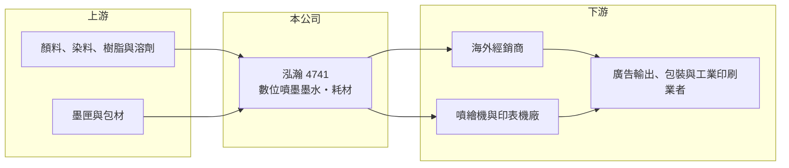

# 4741 泓瀚

> 上櫃｜[[產業索引-化學工業|化學工業]]｜上市（櫃）日期 2017/09/26

# 第一章：企業模式與商業藍圖

> [!info] 撰寫說明
> 精簡版，由 Claude 依公開資料整理，架構比照 [[2330台積電]]，資料截至 2026-10-08。來源：HiStock 嗨投資季度損益表、報酬率與每股盈餘頁，nStock 公司概況，遠見雜誌 2013 年泓瀚專訪。產品營收比重本次未查到；部分經營描述來自 2013 年報導，可能已有變化。公開資料有限。#待校對

泓瀚是以自有配方生產數位噴墨墨水的小型化學材料廠，產品大多外銷，靠墨水配方與噴頭相容性在原廠耗材之外找到市場。

- **核心業務：** 泓瀚 2000 年由化學背景的呂椬境創立（原名杰亞科技，2004 年改為現名），主要製造精密化學材料與塗料，核心產品是[[噴墨墨水]]，包括可直接噴印在塑膠等材質上的墨水，以及相容 HP、EPSON、Roland 等品牌機台的墨水與墨匣。墨水是印表機的消耗品，機台裝機量越大，墨水就有越長的回購期。
- **營收結構：** 本次未查到最新產品比重。依 2013 年遠見報導，當時營收超過八成來自外銷、銷往 86 個國家，市場分散在歐美、南美、東南亞與中國；公司也提供墨匣、瓶器與配件的整套方案。
- **營運據點：** 生產基地在台灣，詳細廠區與產能本次未查到。2012 年曾與日本 Roland 合資成立 DBE，嘗試把機台與墨水一起銷售。
- **長期方向：** 噴墨印刷正從辦公文件延伸到廣告看板、包裝、紡織與工業印刷，這類大型與工業用數位印刷是墨水廠較有成長空間的領域。泓瀚的長期成長取決於能否從相容耗材走向成為機台廠的原廠墨水供應商。

# 第二章：護城河深度與競爭優勢

泓瀚的競爭力在配方與相容性，但規模小，面對的是原廠耗材與大型化學廠的競爭。

- **競爭優勢：** 墨水要在不同噴頭中長時間穩定噴印，不能阻塞、斷墨或色偏，配方與分散技術需要長期累積；泓瀚早期即取得多項專利，並以符合歐盟 RoHS 的環保墨水作為賣點。分散在數十個國家的經銷網路，也讓公司不依賴單一市場。
- **主要對手：** 印表機原廠（HP、EPSON、Canon 等）的原廠墨水，以及歐美日大型墨水與化學廠；同屬化學工業的台灣上市櫃公司有 [[1717長興]]、[[1714和桐]] 等，但產品並不直接重疊。
- **觀察重點：** 長期要看工業與包裝噴印市場的滲透、成為機台廠原廠供應商的比重，以及毛利率能否維持三成以上。泓瀚 2025 年營業利益幾乎歸零，顯示營收縮小時費用壓力明顯，營收規模能否回到 6 億元以上是重要指標。

# 第三章：財務體質與盈利規模

資料日期：2026-10-08，表格是撰寫當時的快照；最新月營收、毛利率、累計 EPS 由自動排程寫在本筆記的屬性欄位（月營收、毛利率、累計EPS 等）。#待校對

泓瀚的毛利率在 2023 年後提升到三成以上，但營收從 2022 年高點逐年下滑，2025 年獲利明顯縮水，2026 年上半年才回溫。

| 年度 | 營收（新台幣） | [[毛利率]] | [[營業利益率]] | EPS（元） | [[ROE]] |
|---|---|---|---|---|---|
| 2021 | 6.30 億 | 25.2% | 4.0% | 0.90 | 約 2.5% |
| 2022 | 7.25 億 | 24.6% | 5.2% | 1.68 | 約 4.8% |
| 2023 | 6.49 億 | 31.0% | 9.6% | 2.02 | 約 6.1% |
| 2024 | 5.90 億 | 34.4% | 10.8% | 1.87 | 約 7.0% |
| 2025 | 4.85 億 | 30.1% | 1.1% | 0.30 | 約 1.0% |
| 2026 上半年 | 2.80 億 | 35.3% | 8.9% | 0.83 | 約 3.1%（半年） |

註：營收、毛利率、營業利益率由 HiStock 季度損益表加總推算；ROE 為四季單季 ROE 相加的推算值。

- **營收規模與成長：** 年營收在 5 億至 7 億元之間，屬於小型公司；2021 至 2025 年營收年複合成長率約 -6%（推算），2025 年營收比 2022 年高點少了三分之一。
- **獲利：** 毛利率從 2021 至 2022 年的 25% 左右提升到 2023 年後的 30% 至 35%，推估與產品組合往高附加價值墨水移動有關。但營業費用相對固定，營收下滑時[[營運槓桿]]反向作用，2025 年營業利益率只剩 1.1%。
- **財務特色：** 2021 至 2025 年平均 ROE 約 4.3%（推算）。依 nStock 資料，近五年平均現金股利約 1.1 元，2024 年度另配股票股利 0.6 元；配發率約六成，股利跟著獲利調整。由 ROE 與 ROA 推算，負債約占資產兩成以下，財務結構保守（推算）。

**[[ROIC]] 與 [[WACC]]：** 有息負債本次未查得，以「稅後營業利益 ÷ 股東權益」估算 ROIC 上限：2024 年營業利益約 0.64 億元，稅後約 0.51 億元，股東權益以淨利除以 ROE 推得約 9.3 億元，ROIC 約 5.5%（推算）；2025 年降到約 0.5%（推算）。WACC 以 CAPM 推估：無風險利率 1.75%、市場風險溢酬 6%、β 取小型化工股常見值 1.0，股權成本約 7.8%；負債比重低，假設負債占資本 10%、稅後負債成本 2%，WACC 約 7%（推算）。近五年 ROIC 都低於 WACC，代表以目前的營收規模，泓瀚尚未長期創造超過資金成本的報酬，提升營收規模是關鍵。

# 第四章：總體風險與地緣政治

泓瀚的風險在於規模小、外銷比重高，以及墨水市場受原廠與景氣雙重擠壓。

- **產業週期：** 廣告看板、商業印刷與消費需求在景氣不佳時會減少，墨水訂單跟著下滑；經銷商也會在需求轉弱時降低庫存，放大短期波動。
- **營運風險：** 相容墨水長期面對原廠以晶片認證、保固條款排擠第三方耗材的風險；營收規模小，研發與營業費用難以壓縮，獲利對營收變化很敏感。
- **其他風險：** 外銷比重高，新台幣升值會壓縮以台幣計算的營收與毛利；溶劑、樹脂與顏料等石化原料價格上漲也會影響成本。各國對 VOC 與化學品的環保法規趨嚴，則同時是成本壓力與環保墨水的機會。

# 專有名詞解析

## 金融

- **[[營運槓桿]]**：固定費用占比高時，營收小幅變動會造成營業利益大幅變動的現象。

## 產業

- **[[噴墨墨水]]**：供噴墨印表機或噴繪機使用的液態墨水，需配合噴頭特性調整黏度、粒徑與乾燥速度。
- **[[數位印刷]]**：不需製版、直接由電腦檔案輸出到材料上的印刷方式，適合少量多樣的看板、包裝與紡織印刷。

# 核心供應鏈

- 上游：顏料、染料、樹脂與溶劑等化學原料，墨匣與瓶器包材（具體供應商未查到）
- 下游／客戶：海外經銷商、噴繪機與印表機廠（曾與 Roland 合資），終端為廣告輸出、包裝與工業印刷業者
- 同業：印表機原廠墨水（HP、EPSON、Canon），台灣化學同業 [[1717長興]]、[[1714和桐]]、[[1718中纖]]（同屬化學工業類別，產品不直接重疊）

## 最新新聞
<!-- news:start -->
<!-- news:end -->

## 相關連結
- [公開資訊觀測站](https://mopsov.twse.com.tw/mops/web/t05st03?step=1&firstin=1&co_id=4741)
- [Goodinfo](https://goodinfo.tw/tw/StockDetail.asp?STOCK_ID=4741)
- [Yahoo 股市](https://tw.stock.yahoo.com/quote/4741)
- [鉅亨網新聞](https://www.cnyes.com/twstock/4741/news)
