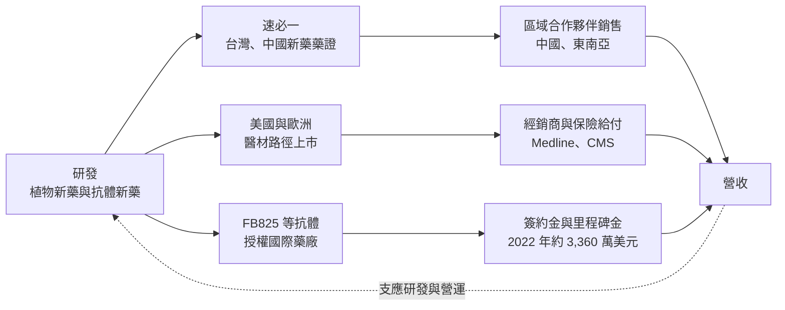
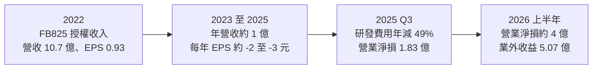
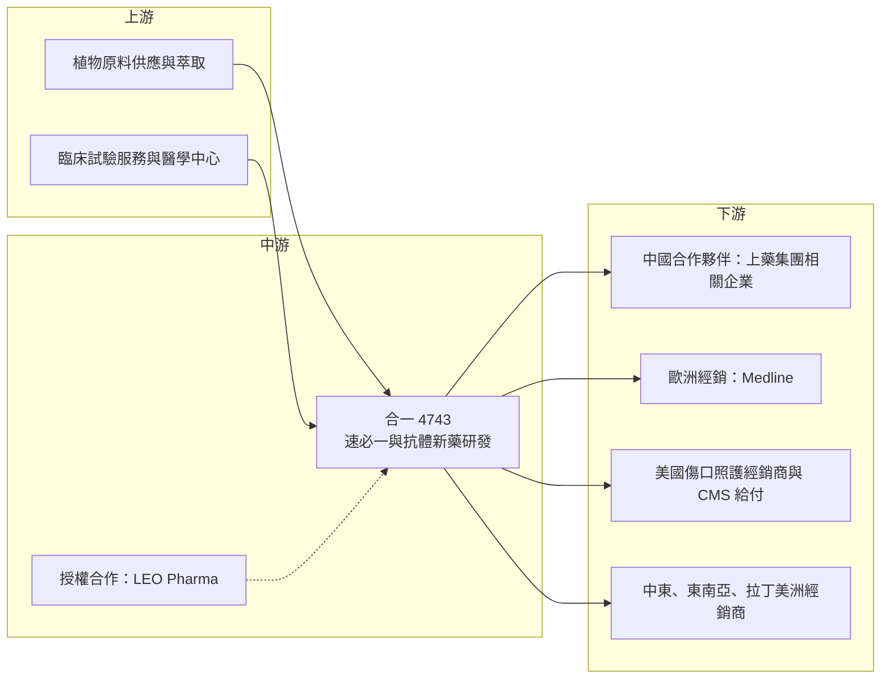

# 4743 合一

> 上櫃｜[[產業索引-生技醫療業|生技醫療業]]｜上市（櫃）日期 2011/09/23

# 第一章：企業模式與商業藍圖

> [!info] 撰寫說明
> 本文由 Claude 依公開資料整理，架構比照 [[2330台積電]] 的四章研究，資料截至 2026-10-08。財務數字來源：Goodinfo 年度經營績效頁、櫃買中心開放資料（基本資料、綜合損益、資產負債）、富果研究法說會整理（2024 年第一季、2025 年 12 月）、鉅亨號 2022 年第三季法說整理、工商時報（2022 年 8 月 510(k) 報導）、旺得富（2021 年 9 月 JAMA 刊登、2026 年 8 月中國上市後試驗報導）、CMoney 研究筆記（2023 年 11 月）；產業描述為整理性內容，尚未逐條比對原始文件。#待校對

新藥公司的價值不在於今天賺多少錢，而在於手上的藥物能不能取得藥證、賣得出去，以及在賣出去之前現金撐不撐得住。本章針對合一生技（股票代號：4743，以下簡稱合一）的商業模式進行定性分析，說明它如何以一款糖尿病足傷口新藥為核心，搭配抗體新藥的授權合作，嘗試從研發公司轉型為有穩定營收的藥廠。

## 一、核心定位：以植物新藥打入糖尿病足傷口市場的研發型公司

合一成立於 2008 年，2011 年在櫃買中心掛牌，2026 年第二季底實收資本額約 48.1 億元（櫃買中心基本資料）。公司有兩條主要產品線：

* **速必一（ON101，國際名 Fespixon）：** 治療[[糖尿病足潰瘍]]的外用乳膏，萃取自植物成分，屬於[[植物新藥]]。多國多中心三期臨床試驗結果於 2021 年刊登在美國醫學會期刊 JAMA Network Open，當時已取得台灣藥證（旺得富，2021 年 9 月）；之後取得中國上市許可（CMoney 研究筆記，2023 年 11 月），是中國國家藥監局核准的首個 1.1 類天然藥物新藥（旺得富，2026 年 8 月）。
* **抗體新藥：** 包括治療中重度異位性皮膚炎的 FB825，以及治療嚴重嗜中性球氣喘的 FB704A。FB825 與丹麥藥廠 LEO Pharma 合作開發，2022 年第二季合一依授權合約認列約 3,360 萬美元收入（鉅亨號 2022 年第三季法說整理），是公司少數單年獲利的來源。

合一的定位可以理解為「以一款已上市的傷口新藥建立營收基礎，同時用抗體新藥的授權爭取高額里程碑金」。這兩條路線的風險與時間尺度完全不同：前者是商業化的長期耕耘，後者則是臨床結果決定一切的二元事件。

## 二、終端應用／產品板塊：速必一的多國上市進度

合一目前的營收規模很小，2025 年全年營收約 1.29 億元（Goodinfo），尚未揭露可靠的產品別比重，因此本文不畫營收結構圓餅圖，改以市場進度說明：

* **台灣：** 最早取得藥證的市場，台灣完整療程藥價約 4.9 萬元（CMoney 研究筆記引用），是速必一的定價參考點。
* **中國：** 合一與上藥集團相關企業合作，2025 年申請納入醫保未成功，原因包括新藥定價管制與初期核准適應症較窄（富果研究，2025 年 12 月法說）。2026 年 8 月公布的上市後二/三期試驗結果顯示，16 週完全癒合率為 76.3%，對照組為 44.9%，獨立數據監督委員會建議提前結束試驗（旺得富，2026 年 8 月）。公司計畫以此申請把適應症從 Wagner 第一級擴大到第二級，再爭取醫保。
* **美國：** 2022 年 8 月以傷口外用乳膏 Bonvadis 的名義通過美國 [[FDA]] 的 510(k) 上市許可（工商時報，2022 年 8 月），屬於醫療器材路徑而非新藥路徑。2025 年 9 月向美國聯邦醫療保險（CMS）提出給付申請，並同時布局商業保險與退伍軍人醫療體系（富果研究）。
* **歐洲與其他地區：** 2024 年與 Medline 簽訂涵蓋歐盟、英國與瑞士的獨家經銷合約（富果研究，2024 年第一季法說），預計取得歐盟醫療器材法規下的 CE 標誌；另與中東、東南亞與拉丁美洲經銷商合作。截至 2025 年底，已取得 10 國上市核准（富果研究，2025 年 12 月法說）。

## 三、資本轉化邏輯（營運模式）：藥證與醫材雙軌、授權變現

* **藥證與醫材雙軌：** 新藥藥證審查時間長、要求高，醫療器材路徑則較快。合一在台灣與中國走新藥路徑，在美國與歐洲則先以醫材身分上市，目的是盡早進入大市場（CMoney 研究筆記）。代價是醫材身分的定價與保險給付條件可能不如新藥。
* **借重合作夥伴通路：** 合一沒有在各國自建業務團隊，而是由當地夥伴負責藥證申請與銷售，自己收取供貨收入或分潤。這種模式省下大量行銷費用，但營收成長的速度取決於夥伴的推廣力度。
* **授權變現研發成果：** 抗體新藥開發成本高，合一選擇與國際藥廠合作，以授權金回收研發投入。2022 年的授權收入讓當年營收跳升到約 10.7 億元（Goodinfo），但這類收入是一次性的，不代表經常性獲利能力。

## 四、企業長期藍圖：擴大適應症、爭取給付、縮減研發戰線

* **速必一擴大適應症與給付：** 中國上市後試驗成功後，合一將爭取擴大適應症並重新申請醫保；美國則等待 CMS 給付結果。公司 2025 年底法說提出 2026 年擴大取證國家數的目標，但同一份整理中的數字前後不一（60 或 70 國），以公司正式公告為準。
* **抗體新藥的關鍵解盲：** FB825 預計 2026 年 7 月完成 114 名受試者收案、2027 年上半年解盲；FB704A 二期試驗原預計 2026 年第三季解盲（富果研究，2025 年 12 月法說）。這兩項結果將決定合一能否取得下一筆大型授權收入。
* **研發汰弱留強：** 2025 年第三季研發費用約 1.3 億元，較前一年同期的 2.55 億元減少約 49%（富果研究），顯示公司正在縮減研發戰線，集中資源在最有機會的項目上，以延長現金可支應的時間。

# 第二章：護城河深度與競爭優勢

在長期價值投資中，「護城河」指企業抵禦競爭、維持超額利潤的保護機制。對尚未穩定獲利的新藥公司而言，護城河主要來自藥證、臨床數據與專利，本章分析合一這些資產的強度與限制。

## 一、合一護城河的核心組成要素

* **1. 稀有的新藥藥證：** 糖尿病足潰瘍的有效藥物很少，CMoney 研究筆記指出當時市場上主要只有速必一與 Regranex 兩款藥物。在中國取得 1.1 類天然藥物新藥核准，是後進者短期內難以複製的資格。
* **2. 已發表的臨床證據：** 三期試驗刊登於國際期刊，中國上市後試驗又顯示 16 週完全癒合率 76.3%（旺得富，2026 年 8 月）。在醫療市場，同儕審查過的臨床數據是說服醫師與保險給付單位的關鍵。
* **3. 植物新藥的配方與製程：** 植物新藥的有效成分複雜，要做出品質一致的產品，需要掌握原料來源、萃取與品管方法，這構成一定的技術門檻。

不過，這些優勢目前還沒有轉化為穩定的營收，因此合一的護城河應視為「潛在」而非「已驗證」的護城河。

## 二、全球主要競爭對手格局

| 對手或療法 | 定位 | 對合一的威脅 |
|---|---|---|
| Regranex（生長因子凝膠） | 美國已上市的糖尿病足潰瘍藥物 | 美國醫師較熟悉，且屬新藥身分 |
| 傳統傷口照護產品 | 敷料、清創、負壓治療等 | 價格較低、使用普遍，是速必一要取代的主流做法 |
| 中國本土傷口藥與醫材 | 中國廠商的外用藥與敷料 | 在醫保與價格上具優勢 |
| 異位性皮膚炎抗體藥（Dupixent 等） | 國際大藥廠已上市的生物藥 | FB825 必須證明有差異化的療效或給藥優勢，才能在已有強勢藥物的市場立足 |

## 三、優勢轉化：哪些市場守得住、哪些守不住

* **守得住：** 已取得新藥身分的台灣與中國市場，特別是中國若能擴大適應症並納入醫保，病人數規模可觀。CMoney 研究筆記估計中國潛在病人接近 840 萬人，但這是作者估算，不代表實際可觸及的市場。
* **守不住：** 以醫材身分上市的美國與歐洲市場。醫材的保護期與定價能力較弱，銷售高度依賴保險給付與經銷商推廣；CMS 自 2026 年起嚴格限制給付次數（富果研究），會影響美國市場的放量速度。
* **觀察重點：** 第一，中國醫保與適應症擴大的進度；第二，美國 CMS 給付結果；第三，FB825 與 FB704A 的解盲結果與後續授權。這三項事件都具有明確的時間點，是判斷合一能否跨過商業化門檻的關鍵。

# 第三章：財務體質與盈利規模

資料日期：2026-10-08。數字取自 Goodinfo 年度經營績效頁、櫃買中心開放資料（綜合損益、資產負債）與富果研究法說會整理，表格是撰寫當時的快照；最新月營收、毛利率、累計 EPS 由自動排程寫在本筆記的屬性欄位（月營收、毛利率、累計EPS 等）。#待校對

新藥公司在取得穩定營收之前，財務分析的重點不是獲利率，而是研發投入的效率、現金還能撐多久，以及產品授權與上市進度能否在現金用完之前帶來收入。本章依此調整四個面向的分析。

## 一、獲利能力的基石：營收、研發費用與虧損

| 年度 | 營收（新台幣） | [[毛利率]] | [[營業利益率]] | EPS（元） | [[ROE]] |
|---|---|---|---|---|---|
| 2019 | 0.13 億 | -26.2% | -2,313% | -1.28 | -7.57% |
| 2020 | 0.42 億 | 56.9% | -1,618% | -0.68 | -2.49% |
| 2021 | 0.66 億 | 68.5% | -1,335% | -1.06 | -2.96% |
| 2022 | 10.7 億 | 79.2% | -22.7% | 0.93 | 2.43% |
| 2023 | 0.87 億 | 37.5% | -1,264% | -2.91 | -9.0% |
| 2024 | 1.18 億 | 52.9% | -921% | -2.44 | -8.45% |
| 2025 | 1.29 億 | 27.8% | -622% | -2.18 | -9.1% |
| 2026 上半年 | 0.77 億 | 36.1% | 約 -519% | 0.21 | 未查得 |

註：2019 至 2025 年取自 Goodinfo 年度經營績效；2026 上半年取自櫃買中心綜合損益開放資料，毛利率以營業毛利 0.28 億元除以營收推算，未計已實現銷貨損益。

* **營收規模仍小：** 除了 2022 年的授權收入，合一的年營收長期在 1 億元左右，速必一的銷售尚未放量。營業利益率數字極端負值，是因為營收太小、研發與管理費用相對過大。
* **研發費用率：** 2025 年第三季研發費用約 1.3 億元，同季營收僅約 3,405 萬元（富果研究），研發費用約為營收的 3.8 倍（推算）。研發費用已較前一年明顯縮減，代表公司正在把資源從研發轉向商業化。
* **業外收益撐起帳面獲利：** 2026 年上半年營業淨損約 3.98 億元，但業外收入約 5.07 億元，使稅後淨利轉為約 0.99 億元、EPS 0.21 元（櫃買中心綜合損益）。業外收益的具體來源未查得，2025 年第三季的類似情況則主要來自匯兌利益與利息收入（富果研究）。評估合一的本業時，應以營業損益為準。

## 二、[[ROE]] 與現金燃燒：可支應年數

合一過去七年中只有 2022 年 ROE 為正，其餘年份介於 -2.5% 至 -9.1%，長期平均為負，這是研發型新藥公司的常態。對這類公司更重要的是現金燃燒速度：

* **現金水位：** 截至 2025 年 9 月底，現金及可變現金融資產約 65.1 億元，占總資產約 118.4 億元的 47%（富果研究，2025 年 12 月法說）。2026 年第二季底流動資產約 57.8 億元，總負債僅約 8.7 億元（櫃買中心資產負債資料）。
* **燃燒速度：** 2025 年營業淨損約 8 億元（營收 1.29 億元 × 營業利益率 -622%，推算），2026 年上半年營業淨損約 4 億元，換算年燃燒約 8 億元。
* **可支應年數：** 以 65 億元的現金與可變現金融資產除以每年約 8 億元的營業淨損，在不考慮新收入與新籌資的情況下，約可支應 8 年（推算）。這個數字偏樂觀，因為部分金融資產的變現價值會隨市場波動。

## 三、產品授權與上市進度

| 項目 | 進度 | 時間與來源 |
|---|---|---|
| 速必一台灣藥證 | 已取得 | 2021 年前（旺得富，2021 年 9 月） |
| 速必一中國藥證 | 已取得，Wagner 第一級 | 2023 年前（CMoney 研究筆記，2023 年 11 月） |
| 中國上市後二/三期試驗 | 主要與次要指標達標，提前結束 | 2026 年 8 月公告（旺得富） |
| 美國 510(k) 上市許可 | 以 Bonvadis 名義取得 | 2022 年 8 月（工商時報） |
| 美國 CMS 給付申請 | 審查中 | 2025 年 9 月提出（富果研究） |
| FB825 異位性皮膚炎 | 二期收案、預計 2027 上半年解盲 | 富果研究，2025 年 12 月法說 |
| FB704A 嚴重氣喘 | 二期收案完成，原預計 2026 年第三季解盲 | 富果研究，2025 年 12 月法說 |

這張進度表說明，合一未來兩年的價值變化主要由「中國醫保、美國給付、兩項抗體解盲」四個事件決定。資本支出方面，合一屬於輕資產研發公司，主要生產委外或在既有設施進行，大額資本支出的資料未查得。

## 四、[[ROIC]] 與 [[WACC]]：價值創造利差

**ROIC 推算：** 2025 年營業淨損約 8 億元，在虧損情況下不計所得稅。2026 年第二季底權益總計約 103.9 億元，非流動負債約 7.2 億元，有息負債假設約 5 億元（推估），投入資本約 109 億元，ROIC 約 -7%（推算）。

**WACC 推算：** 假設台灣 10 年期公債殖利率 1.75%、市場風險溢酬 6%、β 取生技新藥股常見值 1.3（假設值），股東權益成本約 9.55%。幾乎沒有有息負債，WACC 約 9.5%（推算）。

**結論：** 合一目前的 ROIC 為負，低於 WACC 約 16 個百分點，代表公司仍在消耗股東資本，尚未創造價值。這是研發型新藥公司在商業化之前的正常狀態，關鍵在於現金耗盡之前能否讓速必一放量或取得抗體授權收入。若中國醫保與美國給付都順利，營收規模才有機會讓 ROIC 轉正；反之，長期虧損會持續侵蝕股東權益。

# 第四章：總體風險與地緣政治

任何企業都無法脫離宏觀環境獨立存在。本章分析合一未來必須面對的地緣政治、產業週期、營運環境以及法規演進。

## 一、地緣政治

* **兩岸關係與中國政策：** 中國是速必一最大的潛在市場，兩岸關係變化、中國對台灣企業的態度，以及中國藥品集中採購與醫保談判政策，都會影響合一在中國的推廣。中國醫保談判以壓低價格著稱，即使納入醫保，售價也可能遠低於台灣。
* **美國醫療給付政策：** 美國聯邦醫療保險的給付規則由政府決定，CMS 自 2026 年起限制給付次數，就是政策直接影響銷售的例子。

## 二、產業週期與市場結構

* **生技資金環境：** 生技公司的籌資與授權交易受資本市場景氣影響很大。景氣不好時，大藥廠的授權意願與條件都會轉差，合一抗體新藥的授權價值也會受影響。
* **糖尿病盛行率上升：** 全球糖尿病人口持續增加，糖尿病足潰瘍的需求長期成長，這是速必一最基本的長期支撐。但需求存在不等於能轉化為營收，關鍵仍是給付與醫師使用習慣。

## 三、營運環境的隱性風險

* **一次性收入的誤導：** 2022 年授權收入與 2026 年上半年業外收益都讓帳面出現獲利，投資人容易誤判公司已經轉盈。分析時必須區分經常性的產品營收與一次性的授權、匯兌或處分收益。
* **合作夥伴依賴：** 各地銷售依賴合作夥伴，若夥伴推廣不力或合約條件不利，合一難以直接介入。
* **臨床試驗失敗風險：** 抗體新藥的二期試驗若未達標，不只失去授權收入的機會，前期投入的研發費用也會成為沉沒成本。

## 四、科技或法規演進

* **歐盟醫療器材法規：** 歐盟醫療器材法規（[[MDR]]）對臨床證據與上市後監測要求更嚴格，取得 CE 標誌的時間可能比預期長。
* **傷口照護新技術：** 細胞治療、生物工程皮膚與新型敷料持續發展，可能改變糖尿病足潰瘍的治療選擇。速必一需要持續累積真實世界數據，維持在治療指引中的位置。

# 專有名詞解析

## 應用

- **[[FDA]]**：美國食品藥物管理局，負責審查美國上市的藥品與醫療器材，其核准常被視為全球藥證的重要指標。
- **[[MDR]]**：歐盟醫療器材法規，2021 年起全面實施，對醫療器材的臨床證據與上市後監測要求比舊制更嚴格。
- **[[醫療器材]]**：用於診斷、治療或預防疾病的儀器、材料或產品，審查路徑與藥品不同，通常較快但定價能力較弱。

## 金融

- **[[業外收益]]**：本業以外的收入，例如利息、匯兌利益或處分投資利益，通常不具持續性。
- **[[ROE]]**：股東權益報酬率，稅後淨利除以股東權益，衡量公司運用股東資金賺錢的效率。
- **[[ROIC]]**：投入資本報酬率，稅後營業利益除以股東權益加有息負債，衡量本業運用全部資本的效率。
- **[[WACC]]**：加權平均資金成本，股東權益成本與負債成本依資本結構加權的平均值，是投資報酬的最低門檻。

## 產業

- **[[植物新藥]]**：以植物萃取物為有效成分、經完整臨床試驗取得藥證的新藥，成分複雜，對原料與製程一致性要求高。
- **[[糖尿病足潰瘍]]**：糖尿病患者因神經病變與血液循環不良，在足部形成難以癒合的傷口，嚴重時可能導致截肢。
- **[[授權金]]**：藥廠將藥物開發或銷售權利授權給其他公司時收取的簽約金與里程碑金，通常屬一次性收入。
- **[[里程碑金]]**：授權合約中，被授權方在藥物達到臨床、藥證或銷售等特定階段時支付給授權方的款項。

# 核心供應鏈

## 1. 上游：原料與臨床服務
- 植物原料與萃取：未查得具體供應商
- 臨床試驗：國內外醫學中心與委託研究機構（未逐一查證）

## 2. 中游：合一本身與合作夥伴
- 新藥研發：合一（速必一、FB825、FB704A）
- 抗體新藥合作：LEO Pharma（丹麥）
- 台灣新藥同業：[[6446藥華藥]]、[[4162智擎]]、[[4147中裕]]

## 3. 下游：銷售夥伴與市場
- 中國：上藥集團相關企業
- 歐洲：Medline
- 美國：傷口照護經銷商，給付由 CMS 與商業保險決定
- 其他：中東、東南亞、拉丁美洲經銷夥伴

## 最新新聞
<!-- news:start -->
<!-- news:end -->

## 相關連結
- [公開資訊觀測站](https://mopsov.twse.com.tw/mops/web/t05st03?step=1&firstin=1&co_id=4743)
- [Goodinfo](https://goodinfo.tw/tw/StockDetail.asp?STOCK_ID=4743)
- [Yahoo 股市](https://tw.stock.yahoo.com/quote/4743)
- [鉅亨網新聞](https://www.cnyes.com/twstock/4743/news)
