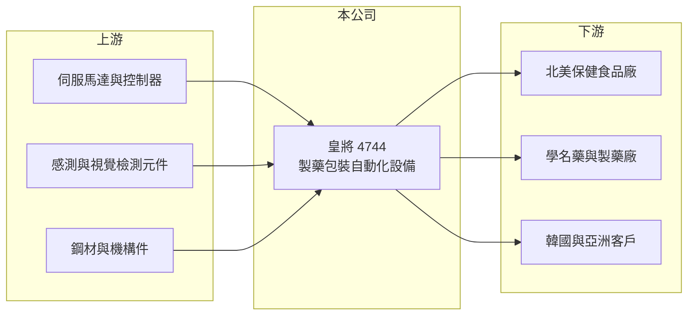

# 4744 皇將

> 上櫃｜[[產業索引-生技醫療業|生技醫療業]]｜上市（櫃）日期 2018/07/12

# 第一章：企業模式與商業藍圖

> [!info] 撰寫說明
> 精簡版，由 Claude 依公開資料整理，架構比照 [[2330台積電]] 的四章研究，資料截至 2026-10-08。來源：櫃買中心開放資料（基本資料、2026 年第二季資產負債與綜合損益、每月營收、本益比殖利率）、聯合新聞網與旺得富 2026 年 2 月營收報導標題；本次未取得多年度財務資料，產品與客戶細節多憑既有知識撰寫，已標「待校對」。公開資料有限。#待校對

皇將科技（股票代號：4744，以下簡稱皇將）是一家製藥自動化設備商，產品是藥廠與保健食品廠用來計數、裝瓶、封蓋、貼標與包裝的整廠連線設備。皇將的生意屬於「藥廠的資本設備」，營收取決於全球藥廠與保健品廠的擴產投資，而非藥品本身的銷量。

- **核心業務：** 皇將 2002 年成立，2018 年 7 月上櫃（櫃買中心開放資料），雖然歸類在生技醫療業，實際上是機械設備製造商。2026 年報導提到公司在「全球製藥自動化設備、整廠連線設備」具有競爭力（旺得富 2026 年 2 月）。產品涵蓋錠劑與膠囊的計數裝瓶線、包裝與檢測設備（待校對）。
- **營收結構：** 產品別與地區別比重本次未查得。2026 年 1 月營收報導指出北美與韓國是主要成長市場（聯合新聞網 2026 年 2 月），推估外銷占營收大部分，北美的保健食品與學名藥廠是重要客戶（推估）。#待校對
- **營運據點：** 總部與生產位於台灣中部（待校對），海外以子公司或代理商提供銷售與售後服務。設備銷售之後的零件、模具更換與維修服務，是設備商的經常性收入來源。
- **長期方向：** 藥廠生產自動化與[[整廠輸出]]是長期趨勢，人力成本上升與藥品追溯法規（如[[序號化]]）都會推動藥廠更新設備。皇將若能從單機銷售走向整線規劃，客單價與客戶黏著度都會提高。

# 第二章：護城河深度與競爭優勢

皇將的競爭力在於製藥設備的法規經驗與整線整合能力，但它面對的是歐洲與日本的老牌設備商。

- **競爭優勢：** 製藥設備必須符合 [[GMP]] 規範與客戶的驗證要求，設備一旦完成驗證並投入生產，藥廠更換設備需要重新驗證，因此既有客戶的擴線與汰換訂單有延續性。整廠連線需要把計數、裝瓶、封蓋、貼標與檢測串成一條線，整合能力比單機製造更難複製。
- **主要對手：** 國際製藥包裝設備商多來自德國、義大利與日本，品牌與規模都大於皇將；中國設備商則以價格搶市。#待校對 皇將的定位推估是以較具彈性的價格與交期，服務中型藥廠與保健品廠（推估）。
- **客戶結構：** 北美保健食品市場規模大，品牌商眾多、產線更新頻繁，是皇將的重要市場（推估）。這讓公司受惠於美國保健品產業的擴產，但也受當地景氣與關稅政策影響。
- **觀察重點：** 第一，北美與韓國訂單的延續性；第二，售後服務與零件收入的比重；第三，營收大幅波動下毛利率能否維持在 50% 上下。

# 第三章：財務體質與盈利規模

資料日期：2026-10-08，表格是撰寫當時的快照；最新月營收、毛利率、累計 EPS 由自動排程寫在本筆記的屬性欄位（月營收、毛利率、累計EPS 等）。#待校對

本次未取得皇將的多年度財務資料，以下表格只能以官方開放資料呈現最近期間，其餘年度寫「未查得」。設備商的營收依交機時點認列，單季波動大，應以多年平均觀察。

| 年度 | 營收（新台幣） | [[毛利率]] | [[營業利益率]] | EPS（元） | [[ROE]] |
|---|---|---|---|---|---|
| 2021 | 未查得 | 未查得 | 未查得 | 未查得 | 未查得 |
| 2022 | 未查得 | 未查得 | 未查得 | 未查得 | 未查得 |
| 2023 | 未查得 | 未查得 | 未查得 | 未查得 | 未查得 |
| 2024 | 未查得 | 未查得 | 未查得 | 未查得 | 未查得 |
| 2025 | 未查得（1 至 8 月 7.74 億） | 未查得 | 未查得 | 未查得 | 未查得 |
| 2026 上半年 | 4.31 億 | 52.1% | -7.6% | -0.27 | 未查得 |

- **營收規模：** 2025 年 1 至 8 月累計營收 7.74 億元，2026 年同期為 5.59 億元，衰退約 28%（櫃買中心每月營收）。2026 年 1 月單月營收 6,627 萬元、年增約 113%（聯合新聞網 2026 年 2 月），但其後月份明顯回落，顯示設備交機的時點會造成很大的月度波動。
- **獲利：** 2026 年上半年毛利率 52.1%，但營業虧損 0.33 億元、EPS -0.27 元（櫃買中心資料）。高毛利代表設備具有技術附加價值，營業虧損則反映營收下滑時研發、業務與售後團隊的固定費用壓力。
- **財務特色：** 2026 年第二季底股本 5.69 億元、總資產 22.7 億元、總負債 10.6 億元、權益 12.1 億元（櫃買中心資料）。最近一次現金股利為每股 1.00 元（櫃買中心本益比殖利率資料）。

**[[ROIC]] 與 [[WACC]]：**
- ROIC（推算）：以 2026 年上半年營業虧損 0.33 億元年化約 -0.65 億元，虧損不計稅。有息負債未查得，假設約 5 億元，加上權益 12.1 億元，投入資本約 17.1 億元，ROIC 約 -3.8%（推算）。因缺乏多年度資料，無法判斷正常年度的 ROIC 水準。
- WACC（推算）：無風險利率 1.75%、市場風險溢酬 6%，β 取設備業常見值 1.0（假設），股東權益成本約 7.8%；負債成本 2.5%、稅後 2.0%，負債約占投入資本 29%，WACC 約 6.1%（推算）。
- 結論：2026 年上半年 ROIC 低於 WACC，處於不創造價值的狀態。設備商的 ROIC 會隨訂單週期大幅波動，需要補齊 2021 至 2025 年的資料後，才能判斷長期是否高於資金成本。

# 第四章：總體風險與地緣政治

皇將的風險主要來自資本設備的訂單週期、客戶地區集中與匯率。

- **產業週期：** 藥廠與保健品廠的設備投資有明顯週期，景氣好時集中擴產，景氣差時延後採購。營收隨大型專案交機時點波動，單一年度的數字不能代表長期水準。
- **營運風險：** 整線專案的交期長、驗收條件複雜，若專案延遲或客戶驗收不通過，營收認列會延後。研發與售後團隊屬固定成本，營收下滑時容易轉為虧損，2026 年上半年就是例子。
- **其他風險：** 外銷比重高（推估），美國關稅政策與新台幣匯率直接影響競爭力與毛利；歐日大廠的品牌優勢與中國設備商的低價競爭，從兩端擠壓市場空間。

# 專有名詞解析

## 產業

- **[[GMP]]**：優良製造規範，規定藥品與食品工廠的設備、流程與品質管理標準。
- **[[整廠輸出]]**：設備商替客戶規劃並交付整條生產線，而不只是銷售單一機台。
- **[[序號化]]**：在每個藥品包裝印上唯一序號，用來追蹤流向、防止偽藥的法規要求。

# 核心供應鏈

- 上游：伺服馬達、控制器、視覺檢測與感測元件、鋼材與機構件供應商。
- 下游／客戶：北美保健食品廠、學名藥與製藥廠，以及韓國與亞洲客戶（推估）。#待校對
- 同業：歐洲、日本的製藥包裝設備商與中國設備商。

## 最新新聞
<!-- news:start -->
<!-- news:end -->

## 相關連結
- [公開資訊觀測站](https://mopsov.twse.com.tw/mops/web/t05st03?step=1&firstin=1&co_id=4744)
- [Goodinfo](https://goodinfo.tw/tw/StockDetail.asp?STOCK_ID=4744)
- [Yahoo 股市](https://tw.stock.yahoo.com/quote/4744)
- [鉅亨網新聞](https://www.cnyes.com/twstock/4744/news)
