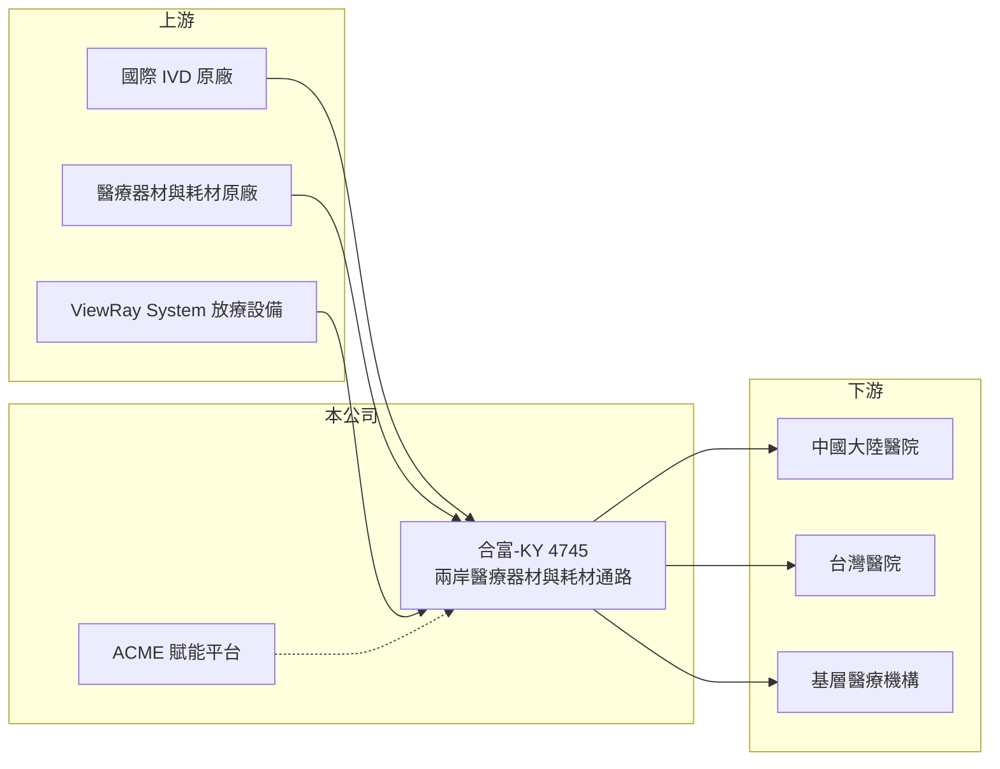

# 4745 合富-KY

> 上櫃｜[[產業索引-生技醫療業|生技醫療業]]｜上市（櫃）日期 2013/01/30

# 第一章：企業模式與商業藍圖

> [!info] 撰寫說明
> 精簡版，由 Claude 依公開資料整理，架構比照 [[2330台積電]] 的四章研究，資料截至 2026-10-08。來源：Goodinfo 年度經營績效頁（2019 至 2025 年）、櫃買中心開放資料（基本資料、2026 年第二季資產負債與綜合損益、每月營收）、富果研究 2025 年 12 月合富法說會整理；中國子公司上市地點等細節憑既有知識撰寫，已標「待校對」。#待校對

合富醫療控股（股票代號：4745，以下簡稱合富）是一家在兩岸經營醫療器材與耗材進口分銷的集團，核心是[[體外診斷]]（IVD）試劑與耗材的銷售。合富的生意本質是醫療[[代理商]]：替國際原廠把產品賣進醫院，並提供庫存、配送與技術服務，獲利取決於代理產品的價格與醫院採購量。

- **核心業務：** 合富 2005 年成立，2013 年 1 月在台灣上櫃（櫃買中心開放資料），定位為兩岸雙上市的醫療供應鏈企業，進口與分銷醫療器材、製劑及耗材（富果研究 2025 年 12 月）。中國營運主體推估在上海證券交易所上市，這也是合併報表中[[非控制權益]]比重高的原因（推估）。#待校對
- **營收結構：** 2025 年營收 100% 來自傳統的試劑與耗材銷售，主要市場為中國大陸與台灣（富果研究整理）。2025 年前三季合併營收約 23 億元，前一年同期約 31 億元（同上）。
- **營運據點：** 以中國大陸與台灣為主要市場。在台灣，合富是 ViewRay System 放射治療設備的獨家代理商，2025 年與台中榮民總醫院簽訂為期 10 年、總金額約 6.7 億元的收入分成合約，預計 2026 年 8 月啟用（富果研究整理）。
- **長期方向：** 公司推出「ACME 賦能項目」，以 AI 臨床決策支援、醫院營運管理與手術醫教研平台等服務，換取醫院把耗材採購轉給合富，目標是從單純代理商轉型為提供服務的平台型企業，並切入中國基層醫院市場（富果研究整理）。放療設備則改採收入分成模式，降低醫院的初期採購負擔（同上）。

# 第二章：護城河深度與競爭優勢

合富的優勢是長期累積的醫院關係與兩岸通路，但中國的集中採購正在重新分配醫療通路的利潤。

- **競爭優勢：** 醫院耗材採購涉及招標、資格審查與長期配送服務，合富在兩岸經營多年，累積了醫院客戶關係與物流體系。代理商替原廠承擔庫存與收款風險，這是原廠不易自己取代的功能。
- **主要對手：** 中國有大量大型醫藥流通企業與地方性醫療器材經銷商，國際 IVD 原廠也可能改為直營或更換代理商。#待校對 台灣則有其他醫療器材代理商競爭。
- **集採的衝擊：** 中國的[[集中採購]]讓產品單價下降，即使銷量沒有減少，營收與利潤仍承壓（富果研究整理）。集採使通路商的中間利潤被大幅壓縮，這是合富從 2023 年起獲利急速下滑的主因。
- **觀察重點：** 第一，ACME 平台能否真正帶來耗材採購的業務置換；第二，台中榮總放療合約啟用後的收入分成；第三，中國集採範圍擴大後，傳統代理業務的毛利率是否止穩。

# 第三章：財務體質與盈利規模

資料日期：2026-10-08，表格是撰寫當時的快照；最新月營收、毛利率、累計 EPS 由自動排程寫在本筆記的屬性欄位（月營收、毛利率、累計EPS 等）。#待校對

合富的營收與毛利率在 2023 年後同步下滑，2025 年轉為營業虧損。

| 年度 | 營收（新台幣） | [[毛利率]] | [[營業利益率]] | EPS（元） | [[ROE]] |
|---|---|---|---|---|---|
| 2021 | 51.4 億 | 20.6% | 6.63% | 1.80 | 6.21% |
| 2022 | 56.3 億 | 19.6% | 6.57% | 1.22 | 5.39% |
| 2023 | 48.1 億 | 20.5% | 5.49% | 0.63 | 2.71% |
| 2024 | 41.9 億 | 18.9% | 2.32% | 0.01 | 0.94% |
| 2025 | 29.6 億 | 13.3% | -9.32% | -3.18 | -6.46% |
| 2026 上半年 | 15.56 億 | 16.7% | -6.5% | -0.75 | 未查得 |

- **營收規模：** 2022 年營收高峰 56.3 億元，2025 年降到 29.6 億元，2020 至 2025 年年複合成長率約 -8.9%（推算）。2026 年 1 至 8 月累計營收較去年同期減少約 4%（櫃買中心每月營收），衰退幅度已經縮小。
- **獲利：** 通路業的毛利率本來就不高，2021 至 2023 年約 20%，2025 年降到 13.3%，營業利益率轉為 -9.3%。2021 至 2025 年平均 ROE 約 1.8%（推算），即使在較好的年度，ROE 也只有 5% 至 6%。
- **財務特色：** 2026 年第二季底總資產 71.9 億元、總負債 22.7 億元、權益 49.2 億元，其中母公司業主權益 27.0 億元、非控制權益約 22.2 億元（櫃買中心資料）。另有約 348.5 萬股待註銷股本（同上），代表公司曾買回[[庫藏股]]。2025 年度未配發現金股利（櫃買中心本益比殖利率資料）。

**[[ROIC]] 與 [[WACC]]：**
- ROIC（推算）：2025 年營業利益約 29.6 億元 × -9.32% ≈ -2.76 億元，虧損不計稅。有息負債未查得，假設約 10 億元，加上權益 49.2 億元，投入資本約 59 億元，ROIC 約 -4.7%（推算）。2021 至 2022 年營業利益率約 6.6% 時，ROIC 約 4% 至 5%（推算）。
- WACC（推算）：無風險利率 1.75%、市場風險溢酬 6%，β 取醫療通路業常見值 0.8（假設），股東權益成本約 6.6%；負債成本 2.5%、稅後 2.0%，負債約占投入資本 17%，WACC 約 5.8%（推算）。
- 結論：即使在集採衝擊前，合富的 ROIC 也略低於 WACC，2024 年後更明顯為負。傳統代理模式在中國集採環境下難以創造價值，轉型為服務平台能否成功，決定公司的長期資本報酬。

# 第四章：總體風險與地緣政治

合富的風險主要來自中國醫療政策、代理權與轉型執行。

- **產業週期：** 醫療耗材需求穩定，但中國醫保控費與集採是長期政策方向，會持續壓低產品價格與通路利潤。醫院預算緊縮時，大型設備採購也會延後，疫情期間 ViewRay 設備銷售受阻就是例子（富果研究整理）。
- **營運風險：** 代理商依賴原廠授權，原廠改變通路策略或終止代理，營收會直接受影響；ViewRay 原廠曾經破產，後由新財團收購並成立 ViewRay System（富果研究整理），顯示代理原廠的經營風險也會傳導到合富。
- **轉型風險：** ACME 平台以服務換取耗材採購，需要前期投入軟體與人力，若醫院未如預期轉移採購，投入將難以回收。收入分成模式也讓合富承擔設備使用量不如預期的風險。
- **其他風險：** 主要營運在中國，面臨兩岸政治、法規與人民幣匯率風險；KY 公司與海外上市子公司的雙層結構，使母公司股東實際分到的獲利低於合併數字。

# 專有名詞解析

## 金融

- **[[非控制權益]]**：子公司中不屬於母公司的股東權益，合併報表的獲利有一部分歸屬於這些外部股東。
- **[[庫藏股]]**：公司從市場買回自家股票，可註銷以提高每股價值，是現金股利以外的股東回饋方式。

## 產業

- **[[體外診斷]]**：在人體外檢測血液、尿液等檢體的試劑與儀器（IVD），用於疾病診斷與健康檢查。
- **[[代理商]]**：向原廠採購產品再轉售給下游客戶的通路業者，價值在於庫存、配送與信用服務。
- **[[集中採購]]**：中國由政府統一招標採購藥品與醫材，以量換價大幅壓低價格，簡稱集採。

# 核心供應鏈

- 上游：國際 IVD 試劑與儀器原廠、醫療器材與耗材原廠、ViewRay System（放射治療設備，合富為台灣獨家代理）。
- 下游／客戶：中國大陸與台灣的醫院，以及透過 ACME 平台切入的中國基層醫療機構。
- 同業：中國大型醫藥流通企業與地方醫療器材經銷商，以及台灣其他醫療器材代理商。

## 最新新聞
<!-- news:start -->
<!-- news:end -->

## 相關連結
- [公開資訊觀測站](https://mopsov.twse.com.tw/mops/web/t05st03?step=1&firstin=1&co_id=4745)
- [Goodinfo](https://goodinfo.tw/tw/StockDetail.asp?STOCK_ID=4745)
- [Yahoo 股市](https://tw.stock.yahoo.com/quote/4745)
- [鉅亨網新聞](https://www.cnyes.com/twstock/4745/news)
