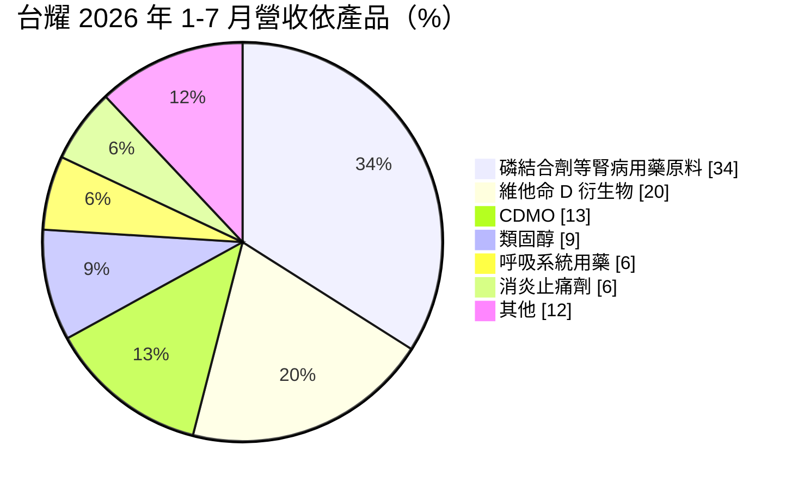
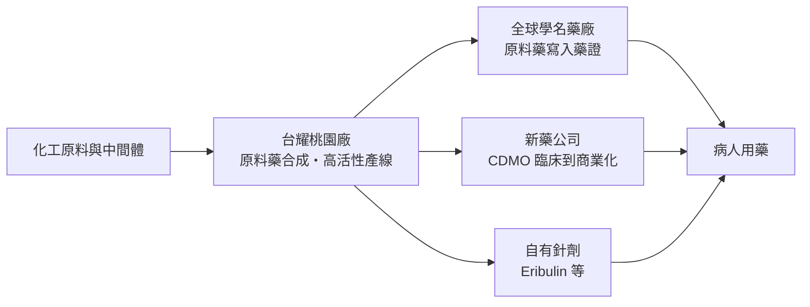
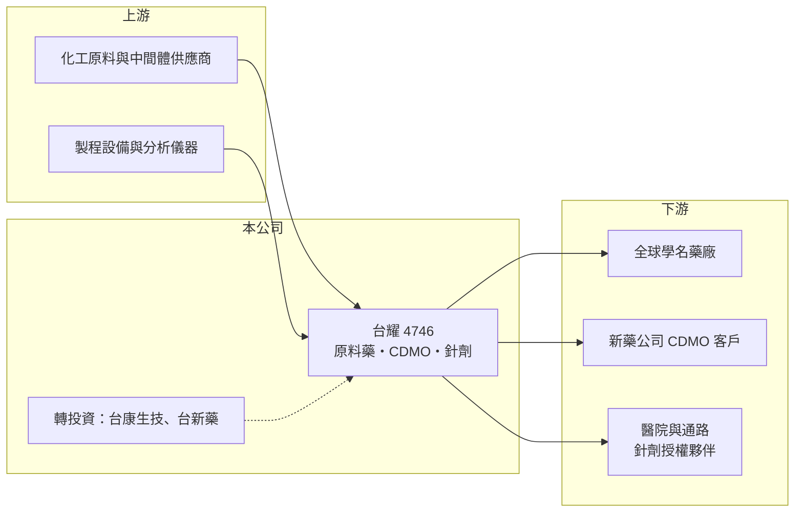

# 4746 台耀

> 上市｜[[產業索引-生技醫療業|生技醫療業]]｜上市（櫃）日期 2011/03/01

# 第一章：企業模式與商業藍圖

> [!info] 撰寫說明
> 本文由 Claude 依公開資料整理，架構比照 [[2330台積電]] 的四章研究，資料截至 2026-10-08。財務數字來源：Goodinfo 年度經營績效表、證交所開放資料（基本資料、2026 年第二季財報、營益分析、股利、每月營收）；業務與產品結構取自富果研究整理的 2026 年 8 月法說會摘要（AI 摘要，非公司原始文件）。轉投資持股關係與業外損益來源為整理性內容，已標註待校對。#待校對

台耀是一家把化學合成能力賣給全球藥廠的公司，它不直接面對病人，而是供應藥品裡最關鍵的有效成分。本章說明台耀化學（股票代號：4746，以下簡稱台耀）的商業模式與成長路徑。

## 一、核心定位：學名藥原料藥起家，往高門檻代工與針劑延伸

台耀成立於 1995 年，2011 年在證交所上市，總部與主要廠區位於桃園蘆竹，董事長兼總經理為程正禹，實收資本額約 12.0 億元。公司有三個核心方向：

* **[[學名藥]][[原料藥]]（Generic API）：** 在原廠專利到期前後，替全球學名藥廠供應有效成分。原料藥需要向各國主管機關登錄製程文件並通過查廠，一旦被藥廠寫進藥證，通常會長期使用，這是台耀營收的主體。
* **[[CDMO]]：** 替新藥公司從臨床用藥一路代工到商業化量產，近年重點放在[[抗體藥物複合體]]所需的高活性小分子與胜肽。CDMO 的毛利率和客戶黏著度都高於一般原料藥，是台耀想拉高比重的業務。
* **針劑產品：** 台耀的癌症用藥針劑產線於 2024 年 7 月通過美國 FDA、2025 年 5 月通過歐盟 EMA 的 GMP 稽核，讓公司從賣原料延伸到賣成品藥，例如 Eribulin 針劑已在美國銷售，並在歐洲取得 10 個國家藥證。

上圖依法說會摘要的產品別整理，「其他」為推算差額。最大品項為腎病相關的磷結合劑原料（品項名稱依法說會摘要，待校對），其次是維他命 D 衍生物，代表台耀在特定治療領域累積了少數幾個大單品。

## 二、資本轉化邏輯：從化學合成到藥證綁定

* **藥證綁定帶來長尾收入：** 學名藥廠更換原料藥來源要重新送審，成本與時間都高，所以一個品項只要被採用，常能穩定供貨多年。這讓台耀的營收從 2020 年的 30.8 億元成長到 2025 年的 48.5 億元。
* **多地布局：** 除桃園總部外，台耀在美國芝加哥有 SynChem-Formosa，擴建中，目標約 2028 年具備公斤級 GMP 產能服務北美客戶；在日本設 Formosa Japan 開拓 CDMO 業務。

## 三、長期方向：ADC、胜肽與 GLP-1

台耀的長期策略是把原料藥的化學能力往更高門檻的領域延伸。依 2026 年 8 月法說會摘要，ADC 的 CDMO 客戶已涵蓋歐、美、日、澳、台，歐洲客戶進度最快已進入臨床一／二期；GLP-1 類減重與糖尿病藥物被列為未來重點，劑型開發與商業化產線建置中。集團也透過轉投資延伸到生物藥（[[6589台康生技]]）與奈米化藥物（[[6838台新藥]]），持股與合併關係待校對。

# 第二章：護城河深度與競爭優勢

護城河是企業抵禦競爭、長期維持超額利潤的機制。本章說明台耀在原料藥與 CDMO 市場的優勢，以及這些優勢在價格競爭下能守住多少。

## 一、台耀護城河的核心組成要素

* **1. 法規與查廠門檻：** 原料藥與針劑要同時通過台灣、美國、歐盟等多國主管機關的查廠，台耀針劑線在 2024 至 2025 年先後通過 FDA 與 EMA 稽核。這類資格需要多年累積，新進者很難在短時間複製。
* **2. 客戶轉換成本：** 原料藥一旦寫進客戶藥證，換供應商就要補件重審，因此既有品項的訂單具有黏著度。這是台耀營收能長期緩步成長的主要原因。
* **3. 高難度化學能力：** 維他命 D 衍生物、高活性抗癌藥與 ADC 小分子的合成步驟多、純度要求高，產能也需要特殊隔離設計，競爭者比一般大宗原料藥少。

## 二、主要競爭對手格局

| 對手 | 定位 | 對台耀的影響 |
|---|---|---|
| [[1789神隆]] | 台灣高活性抗癌原料藥龍頭 | 在抗癌原料藥與 CDMO 直接競爭 |
| [[4119旭富]] | 原料藥與 CDMO | 國內同業，爭取同類代工案 |
| 印度、中國原料藥廠 | 大規模、低成本學名藥原料 | 壓低成熟品項的報價 |
| 歐美大型 CDMO（如 Lonza） | 規模大、全球據點多 | 爭取同一批新藥客戶 |

## 三、優勢轉化：守得住與守不住的地方

* **守得住：** 毛利率從 2020 年的 30.7% 提升到 2023 至 2025 年的 42% 至 44%，營業利益率也從接近零拉升到 15% 至 17%，顯示產品組合往高門檻品項移動確實有效。
* **守不住：** 單一品項占比高，呼吸系統用藥在 2026 年前七月年減 52%、類固醇年減 34%，說明個別品項的需求與價格仍會大幅波動。
* **觀察重點：** CDMO 占比能否持續提高、針劑產品在歐洲與其他市場的授權進度，以及轉投資的業外損益何時止血。

# 第三章：財務體質與盈利規模

資料日期：2026-10-08，表格是撰寫當時的快照；最新月營收、毛利率、累計 EPS 由自動排程寫在本筆記的屬性欄位（月營收、毛利率、累計EPS 等）。#待校對

財務報表是檢驗護城河是否真實存在的最終標準。本章用五年的三率、ROE 與資本報酬，檢視台耀的獲利品質，重點是本業與業外的落差。

## 一、多年度財務表現

| 年度 | 營收（新台幣） | [[毛利率]] | [[營業利益率]] | EPS（元） | [[ROE]] |
|---|---|---|---|---|---|
| 2021 | 31.4 億 | 30.9% | -5.35% | 10.92 | 16.2% |
| 2022 | 37.7 億 | 36.9% | 4.34% | 3.40 | 2.82% |
| 2023 | 43.6 億 | 44.1% | 15.5% | 1.05 | -0.65% |
| 2024 | 47.3 億 | 43.3% | 15.3% | 1.31 | 0.76% |
| 2025 | 48.5 億 | 41.9% | 16.6% | 3.67 | 4.57% |

資料來源：Goodinfo 年度經營績效（合併報表，ROE 以合併稅後淨利計算，與 EPS 所依據的母公司業主淨利口徑不同）。2026 年上半年（證交所資料）營收約 21.75 億元、毛利率 40.97%、營業利益率 10.89%，但業外損失約 2.12 億元，EPS 僅 0.04 元。

* **本業與業外的落差：** 2021 年營業虧損，卻因業外收益約 12.6 億元使 EPS 達 10.92 元；2023 至 2025 年則相反，本業營業利益每年 6.8 億至 8.0 億元，業外每年虧損 3 億至 5.3 億元。評估台耀時，應把本業的原料藥與 CDMO 獲利與轉投資損益分開看（業外來源待校對）。
* **長期指標：** 2020 至 2025 年營收年複合成長率約 9.5%（推算）；2021 至 2025 年平均 ROE 約 4.7%（推算），被業外損益明顯拉低。2025 年度配發現金股利 3.0 元，配發率約 82%（推算）。2026 年第二季底總資產約 139.1 億元，負債約 56.1 億元，權益約 83.0 億元（含非控制權益約 8.7 億元）。

## 二、[[ROIC]] 與 [[WACC]]：價值創造利差

**ROIC 推算：** 2025 年營業利益約 8.03 億元，稅率 20% 後約 6.42 億元。官方資料只揭露負債總計約 56.1 億元，假設一半為有息負債約 28.1 億元（推估），加上權益約 83.0 億元，投入資本約 111.0 億元，ROIC 約 5.8%（推算）。

**WACC 推算：** 台灣 10 年期公債殖利率取 1.75%、市場風險溢酬 6%、β 取製藥同業常見值 0.9（未查得公司實際 β），股東權益成本約 7.15%。負債成本假設 2.5%，稅後約 2.0%，權益約占投入資本 75%，WACC 約 5.8%（推算）。

**結論：** 本業 ROIC 與 WACC 大致相當，代表台耀的本業剛好賺回資金成本，尚未明顯創造超額價值；而業外虧損又讓股東實際拿到的報酬低於本業水準。若 CDMO 與針劑能把營業利益率推高、轉投資停止拖累，利差才有機會轉正。

# 第四章：總體風險與地緣政治

任何企業都無法脫離宏觀環境獨立存在。本章分析台耀長期必須面對的法規、競爭與財務風險。

## 一、法規與品質風險

* **查廠結果：** 原料藥與針劑廠都要接受各國主管機關定期查廠，一旦收到警告信或進口禁令，相關品項出貨會中斷，客戶也可能轉單。2026 年台新藥出貨就曾受代工廠接受 FDA 查廠影響，說明供應鏈任何一環的查廠都可能拖累營收。
* **藥價政策：** 美國、歐洲與日本持續壓低學名藥價格，學名藥廠會把壓力轉嫁到原料藥供應商。

## 二、產業與營運風險

* **品項集中：** 前兩大品項合計超過五成營收，若客戶的學名藥市占下滑或改用其他供應商，營收會明顯波動。
* **印度與中國競爭：** 成熟原料藥的價格由低成本大廠主導，台耀必須持續推出高難度新品項，才能維持毛利率。
* **CDMO 案源不確定：** 新藥臨床失敗率高，客戶的藥若在臨床階段失敗，代工訂單就會消失；台新藥原美國銷售夥伴的新藥開發失敗即為一例。

## 三、財務與其他風險

* **轉投資損益：** 集團延伸到生物藥與奈米藥物，研發型公司長期虧損會持續反映在台耀的業外損益。
* **匯率：** 客戶以歐美日為主，以外幣計價，新台幣升值會壓縮營收與毛利。
* **海外擴產：** 美國芝加哥擴建需要資本支出與人才，若案源不如預期，新產能的折舊會拉低獲利。

# 專有名詞解析

## 金融

- **[[ROIC]]**：投入資本報酬率，稅後營業利益除以股東權益加有息負債，衡量本業運用資本的效率。
- **[[WACC]]**：加權平均資金成本，股東與債權人要求報酬率的加權平均，是 ROIC 要超越的門檻。

## 產業

- **[[學名藥]]**：原廠專利到期後，其他藥廠依相同成分與劑量生產的藥品，價格通常明顯低於原廠藥。
- **[[原料藥]]**：藥品中具有療效的有效成分，由化學合成或發酵製成，再交給製劑廠做成錠劑或針劑。
- **[[CDMO]]**：委託開發暨製造服務，替藥廠從製程開發到量產一條龍代工，類似製藥業的晶圓代工。
- **[[抗體藥物複合體]]**：英文簡稱 ADC，把強效抗癌小分子藥物接在抗體上，讓藥物精準送到癌細胞，是近年癌症新藥熱門領域。

# 核心供應鏈

## 1. 上游：原料與設備
- 化工原料、中間體與溶劑供應商（名稱未查得）

## 2. 中游：台耀與同業
- 原料藥同業：[[1789神隆]]、[[4119旭富]]
- 集團轉投資：[[6589台康生技]]、[[6838台新藥]]

## 3. 下游：客戶
- 歐美日學名藥廠、ADC 與胜肽新藥公司、針劑產品的各國授權銷售夥伴

## 最新新聞
<!-- news:start -->
<!-- news:end -->

## 相關連結
- [公開資訊觀測站](https://mopsov.twse.com.tw/mops/web/t05st03?step=1&firstin=1&co_id=4746)
- [Goodinfo](https://goodinfo.tw/tw/StockDetail.asp?STOCK_ID=4746)
- [Yahoo 股市](https://tw.stock.yahoo.com/quote/4746)
- [鉅亨網新聞](https://www.cnyes.com/twstock/4746/news)
