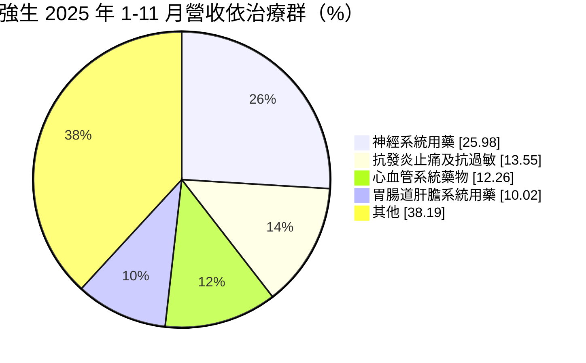
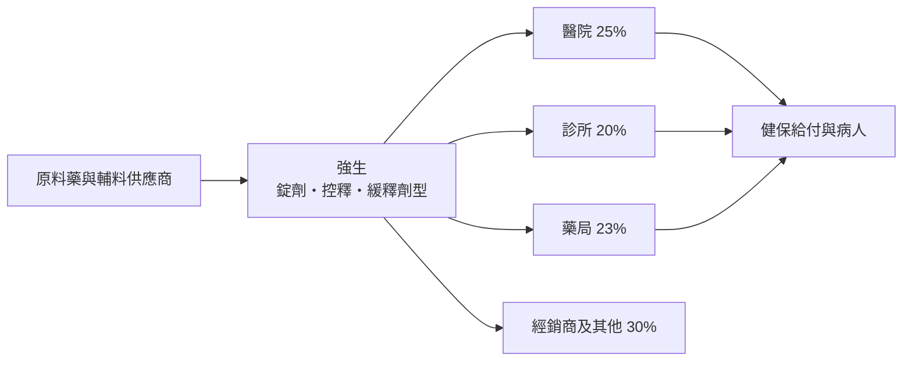
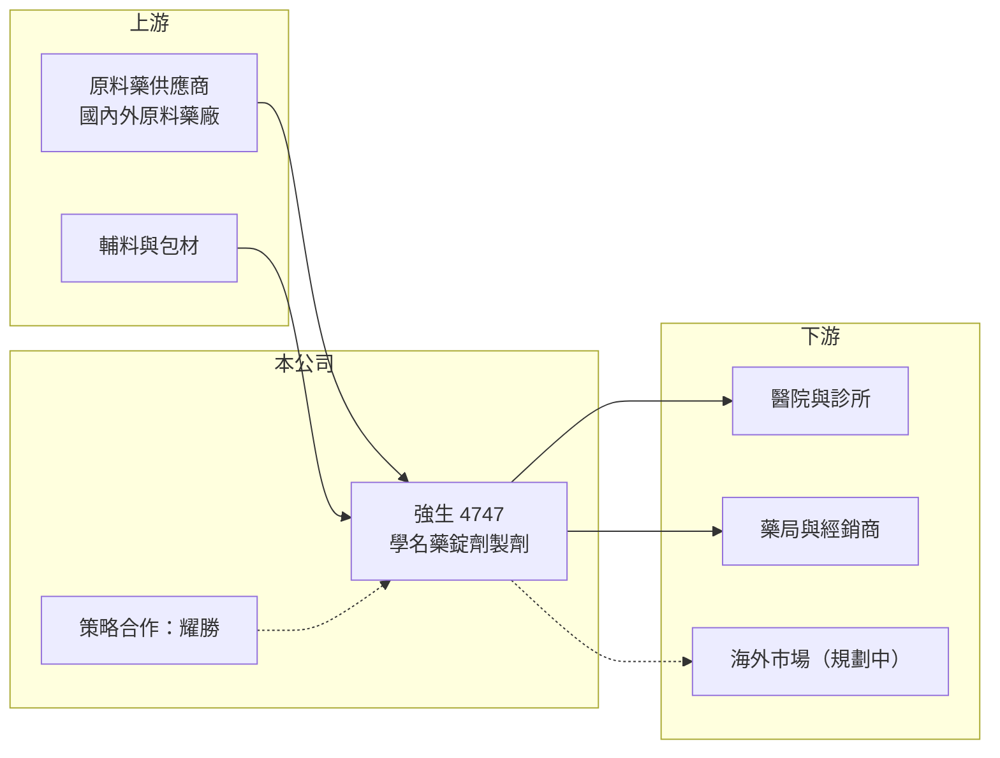

# 4747 強生

> 上櫃｜[[產業索引-生技醫療業|生技醫療業]]｜上市（櫃）日期 2013/12/25

# 第一章：企業模式與商業藍圖

> [!info] 撰寫說明
> 本文由 Claude 依公開資料整理，架構比照 [[2330台積電]] 的四章研究，資料截至 2026-10-08。財務數字來源：Goodinfo 年度經營績效表、櫃買中心開放資料（基本資料、2026 年第二季財報、每月營收、本益比殖利率）；產品與通路結構取自 poorstock 整理的 2024 至 2025 年法說會資料（網站 AI 摘要，非公司原始文件）。公開資料有限，策略合作的形式與業外收益來源待校對。#待校對

強生製藥是一家以台灣健保市場為主的學名藥廠，靠著許多張藥證與穩定的醫療通路，做的是「量小但穩定」的生意。本章說明強生化學製藥廠（股票代號：4747，以下簡稱強生）的商業模式。

## 一、核心定位：專精錠劑的學名藥製劑廠

強生的公司登記成立日期為 1966 年，法說會資料稱創立於 1959 年（待校對），2013 年在櫃買中心掛牌，總部位於新北市三重區，董事長為黃柏熊，實收資本額約 4.5 億元。依法說會資料，公司持有 183 張藥品許可證，涵蓋抗菌、止痛、抗糖尿病、降血壓、維生素等多種藥理分類。

* **[[學名藥]]製劑：** 強生把原料藥加工成病人直接服用的藥品，主力是一般錠劑與控釋、緩釋、腸溶錠等較高門檻劑型。這些劑型需要特殊配方與製程控制，同業數量比一般錠劑少。
* **治療領域分散：** 2025 年 1 至 11 月營收中，神經系統用藥約占 26%、抗發炎止痛及抗過敏約 14%、心血管約 12%、胃腸肝膽約 10%，沒有單一品項主導，營收波動相對小。

「其他」為推算差額，含法說會資料列出的其他類別與未列出的治療群。

## 二、資本轉化邏輯：藥證加上通路

* **通路平均分散：** 依 2025 年 1 至 11 月銷貨比重，經銷商約 30%、醫院 25%、藥局 23%、診所 20%，代工約 2%。全台客戶超過 4,000 家，不依賴單一大客戶。
* **健保藥價決定天花板：** 強生的產品多數在[[健保藥價]]制度下銷售，藥價每隔一段時間會調降，因此營收規模長期停留在 4 億至 6 億元，成長主要靠新品項上市。

## 三、長期方向：OTC、外銷與高門檻劑型

依 2025 年 12 月法說會資料，強生的策略分三層：短期擴大 [[OTC]] 與學名藥產品線、提升產線稼動率；中期拓展美國、東南亞等海外市場，以突破國內藥價低、量少的限制；長期朝健康產業整合平台與 CMO／CDMO 代工發展。公司導入熱熔擠出（HME）設備開發高門檻藥品，相關目標藥品專利在 2026 至 2036 年陸續到期。法說會資料也提到與 [[3207耀勝]] 進行策略合作，整合製造、通路與市場（合作形式待校對）。

# 第二章：護城河深度與競爭優勢

護城河是企業抵禦競爭、長期維持超額利潤的機制。本章說明強生在台灣學名藥市場的優勢與限制。

## 一、強生護城河的核心組成要素

* **1. 藥證數量與劑型能力：** 183 張藥證是長年累積的成果，每張藥證都要經過生體相等性試驗與查驗登記，新進者要花多年才能建立同樣的品項組合。控釋、緩釋劑型的配方技術進一步提高門檻。
* **2. 分散的醫療通路：** 超過 4,000 家客戶，醫院、診所、藥局與經銷商各占二至三成，讓強生不容易被單一通路砍價。
* **3. 財務保守：** 2026 年第二季底負債約 8.2 億元、權益約 17.4 億元，沒有非流動負債，財務體質足以支應新品開發。

## 二、主要競爭對手格局

| 對手 | 定位 | 對強生的影響 |
|---|---|---|
| [[1720生達]] | 大型學名藥廠，品項多 | 在醫院與診所通路直接競爭 |
| [[3705永信]] | 學名藥與保健品，海外布局多 | 搶相同慢性病用藥市場 |
| [[1795美時]] | 學名藥與特殊劑型，外銷強 | 在高門檻劑型與外銷領先 |
| [[4114健喬]] | 學名藥與 OTC | 在藥局與 OTC 通路競爭 |

## 三、優勢轉化：守得住與守不住的地方

* **守得住：** 毛利率長年維持在 40% 至 45%，2019 至 2025 年 EPS 都為正，代表藥證組合能穩定產生現金。
* **守不住：** 營業利益率從 2019 年的 18.5% 降到 2025 年的 12.9%，健保藥價調降與成本上升持續壓縮獲利；2023 年後股本擴大，EPS 也被稀釋。
* **觀察重點：** OTC 與自費產品的成長、海外藥證取得進度，以及 HME 高門檻產品能否如期上市。

# 第三章：財務體質與盈利規模

資料日期：2026-10-08，表格是撰寫當時的快照；最新月營收、毛利率、累計 EPS 由自動排程寫在本筆記的屬性欄位（月營收、毛利率、累計EPS 等）。#待校對

財務報表是檢驗護城河是否真實存在的最終標準。本章用五年的三率、ROE 與資本報酬，檢視強生的獲利品質。

## 一、多年度財務表現

| 年度 | 營收（新台幣） | [[毛利率]] | [[營業利益率]] | EPS（元） | [[ROE]] |
|---|---|---|---|---|---|
| 2021 | 4.11 億 | 41.8% | 15.1% | 1.64 | 5.75% |
| 2022 | 4.95 億 | 41.3% | 16.5% | 2.16 | 7.54% |
| 2023 | 6.07 億 | 40.3% | 16.3% | 2.24 | 6.27% |
| 2024 | 6.11 億 | 40.6% | 16.1% | 1.87 | 4.98% |
| 2025 | 5.70 億 | 40.1% | 12.9% | 1.19 | 3.14% |

資料來源：Goodinfo 年度經營績效（合併報表）。2026 年上半年（櫃買中心資料）營收約 2.93 億元、毛利率約 38.5%、營業利益率約 10.5%，業外收益約 0.50 億元（來源未查得），EPS 1.69 元，已超過 2025 年全年。

* **成長與稀釋：** 2020 至 2025 年營收年複合成長率約 6.1%（推算），但股本從 2022 年約 3 億元增加到 2025 年約 4.5 億元，每股淨值從約 29 元升到約 38 元，顯示期間有增資，ROE 因權益擴大而下降。
* **長期指標：** 2021 至 2025 年平均 ROE 約 5.5%（推算）。依櫃買中心資料，近一年現金股利 1.05 元，以 2025 年 EPS 1.19 元計算配發率約 88%（推算），屬高配息政策。

## 二、[[ROIC]] 與 [[WACC]]：價值創造利差

**ROIC 推算：** 2025 年營業利益約 0.73 億元，稅率 20% 後約 0.58 億元。2026 年第二季底負債約 8.2 億元且全為流動負債，假設三成為有息負債約 2.5 億元（推估），加上權益約 17.4 億元，投入資本約 19.8 億元，ROIC 約 2.9%（推算）。

**WACC 推算：** 台灣 10 年期公債殖利率取 1.75%、市場風險溢酬 6%、β 取學名藥同業常見值 0.7（未查得公司實際 β），股東權益成本約 5.95%。負債成本假設 2.5%，稅後約 2.0%，權益約占投入資本 88%，WACC 約 5.5%（推算）。

**結論：** 2025 年 ROIC 低於 WACC 約 2.6 個百分點，代表增資後擴大的資本尚未帶來對應的本業獲利。2022 年本業較好時 ROIC 推估接近 WACC，強生要長期創造價值，需要新品項與 OTC、外銷把營業利益率拉回 15% 以上。

# 第四章：總體風險與地緣政治

任何企業都無法脫離宏觀環境獨立存在。本章分析強生長期必須面對的政策、競爭與營運風險。

## 一、政策風險

* **健保藥價調降：** 台灣定期進行藥價調查並調降學名藥支付價，強生大部分營收受健保價格影響，價格壓力是長期存在的結構性因素。
* **法規標準提高：** PIC/S GMP 與生體相等性要求持續提高，老藥證的維護與新藥證的取得成本都在上升。

## 二、產業與營運風險

* **同質化競爭：** 同一成分常有十多家學名藥廠取得藥證，醫院採購以價格為主要考量，小型藥廠議價能力有限。
* **原料藥供應：** 原料藥多數仰賴進口，中國或印度供應中斷、價格上漲時，成本難以立即轉嫁。
* **規模限制：** 年營收約 6 億元，研發與海外拓展的資源有限，海外藥證申請的時程與費用都可能超出預期。

## 三、其他風險

* **策略合作執行：** 與耀勝的合作若無法順利整合製造與通路，原本預期的 OTC 與海外成長會延後。
* **業外收益波動：** 2026 年上半年獲利有相當部分來自業外，業外收益的來源與持續性需觀察。

# 專有名詞解析

## 金融

- **[[ROIC]]**：投入資本報酬率，稅後營業利益除以股東權益加有息負債，衡量本業運用資本的效率。
- **[[WACC]]**：加權平均資金成本，股東與債權人要求報酬率的加權平均，是 ROIC 要超越的門檻。

## 產業

- **[[學名藥]]**：原廠專利到期後，其他藥廠依相同成分與劑量生產的藥品，價格通常明顯低於原廠藥。
- **[[健保藥價]]**：全民健保對每種藥品訂定的支付價格，健保署定期調查並調降，直接影響藥廠營收。
- **[[OTC]]**：非處方藥，消費者不需醫師處方即可在藥局購買的藥品，可自訂售價、不受健保藥價限制。

# 核心供應鏈

## 1. 上游：原料
- 國內外原料藥廠、輔料與包材供應商（實際往來廠商未查得）

## 2. 中游：強生與學名藥同業
- 學名藥同業：[[1720生達]]、[[3705永信]]、[[1795美時]]、[[4114健喬]]
- 策略合作：[[3207耀勝]]

## 3. 下游：客戶
- 醫學中心、區域醫院、診所、連鎖藥局（具體通路名稱未查得）與經銷商

## 最新新聞
<!-- news:start（自動產生，請勿手動編輯此範圍） -->
- 2026-10-05 🏛️ 重訊 07:00｜公告本公司股票面額由「新台幣10元」變更為「新台幣5元」 公告期間：115年7月22日至115年10月21日｜[觀測站](https://mops.twse.com.tw/mops/#/web/t05st01)

完整紀錄：[[4747強生 新聞]]
<!-- news:end -->

## 相關連結
- [公開資訊觀測站](https://mopsov.twse.com.tw/mops/web/t05st03?step=1&firstin=1&co_id=4747)
- [Goodinfo](https://goodinfo.tw/tw/StockDetail.asp?STOCK_ID=4747)
- [Yahoo 股市](https://tw.stock.yahoo.com/quote/4747)
- [鉅亨網新聞](https://www.cnyes.com/twstock/4747/news)
