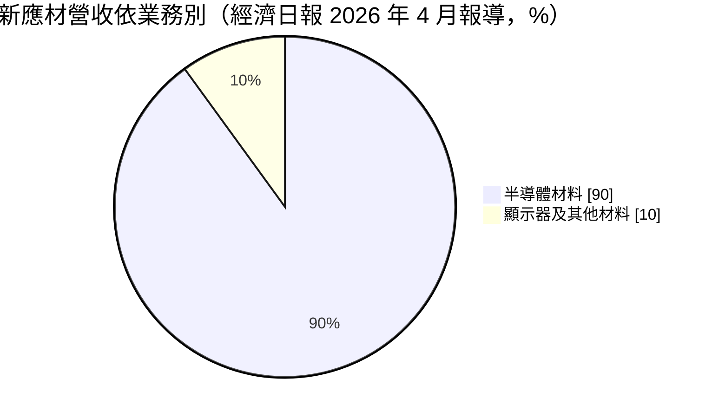
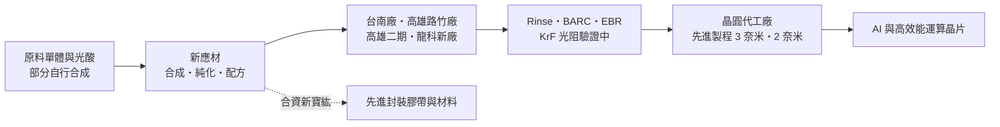
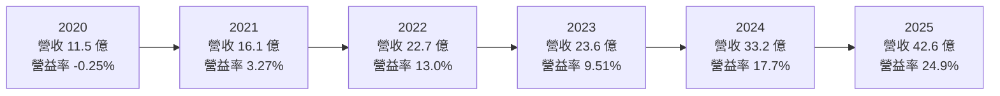
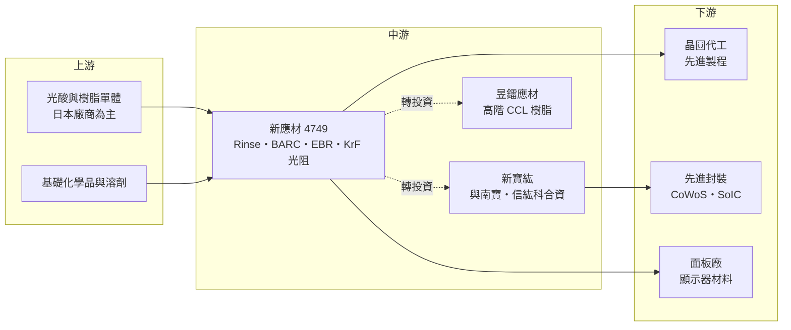

# 4749 新應材

> 上櫃｜[[產業索引-半導體業|半導體業]]｜上市（櫃）日期 2025/01/17

# 第一章：企業模式與商業藍圖

> [!info] 撰寫說明
> 本文由 Claude 依公開資料整理，架構比照 [[2330台積電]] 的四章研究，資料截至 2026-10-08。財務數字來源：Goodinfo 年度獲利指標、資產負債結構與股利政策頁、數位時代 2025 年公司專題、優分析 2026 年 9 月產業報導、經濟日報 2026 年 4 月與 8 月報導、Yahoo 股市公司基本資料；產業描述為整理性內容，尚未逐條比對原始文件。#待校對

在評估單一個股的長期投資價值時，首要步驟是拆解企業的底層獲利邏輯。本章針對新應材（股票代號：4749）的商業模式進行定性分析，說明這家曾經瀕臨下櫃的面板化學品公司，如何轉型為先進製程微影材料供應商，以及它的成長為什麼和晶圓代工龍頭的擴廠節奏緊緊相連。

## 一、核心定位：台灣少數打進先進製程的微影材料廠

新應材成立於 2003 年，生產基地位於台南與高雄路竹，董事長詹文雄。依數位時代的報導，公司 2025 年 1 月 17 日上櫃，是當年第一家掛牌的半導體股。新應材的產品是半導體[[微影]]製程使用的特用化學品，主要包括表面改質劑（Rinse）、底部抗反射層（[[BARC]]）與邊緣去除劑（EBR），這些材料圍繞在[[光阻]]周邊，影響圖形能否精準轉印到晶圓上。

新應材的歷史是一個典型的轉型故事。公司早期做面板用光阻與清洗劑，隨著中國面板產業崛起，連年虧損，2011 年一度被撤銷興櫃，股價跌破 2 元。2018 年詹文雄接手後，把方向轉向半導體，當時半導體營收只占約 2%，而轉型所需的資本支出約是股本的三倍。依數位時代整理，半導體營收從 2018 年約 2,000 萬元，成長到 2023 年約 15 億元、2024 年約 26 億元；2022 年公司獲得台積電優良供應商獎，並重新登錄興櫃。依經濟日報 2026 年 4 月的報導，半導體材料已占營收近九成。

這個定位的長期意義在於「國產化」與「客戶綁定」。先進製程的微影材料過去幾乎由日本、歐美廠商壟斷，晶圓代工龍頭基於供應鏈安全與服務速度，有強烈誘因培養本土供應商。依優分析的報導，新應材的 Rinse 產品是台積電的獨家供應商，並已切入 2 奈米製程。一旦材料被寫進製程配方，更換供應商需要重新驗證，綁定關係通常延續整個製程世代。

## 二、終端應用／產品板塊

新應材未公開細部產品比重，可查得的是業務別的大致結構：

**表面改質劑（Rinse）** 用於曝光顯影後的清洗步驟，可以減少線路圖形倒塌與缺陷。先進製程的線寬愈細，圖形愈容易在清洗時倒塌，這類材料的重要性就愈高。

**底部抗反射層（BARC）** 塗在光阻下方，吸收曝光時從晶圓表面反射的光線，避免反射光干擾圖形。每一層需要微影的步驟幾乎都需要 BARC，用量與晶圓投片量和微影層數成正比。

**邊緣去除劑（EBR）** 用來清除塗佈光阻時堆積在晶圓邊緣的多餘材料，避免後續製程污染。

**[[KrF]] 光阻**則是新應材正在開發的下一個產品。依優分析報導，KrF 光阻已進入客戶驗證，目標 2027 年通過；依經濟日報，公司對 2030 年 KrF 光阻設定的營收目標是 3,000 萬美元。光阻本身是微影材料中技術門檻最高、市場最大的產品，若能打入，代表新應材從周邊材料走向核心材料。

## 三、資本轉化邏輯（營運模式）：跟著客戶建廠

新應材的商業模式是「客戶擴廠、材料跟著成長」。材料是耗材，每一片晶圓、每一道微影步驟都要用掉，因此營收和客戶的先進製程投片量直接連動。依經濟日報 2026 年 8 月的報導，主要客戶規劃中的先進製程廠多達數十座，新應材的營收會隨客戶產能等比例放大；高雄一期預計 2027 年第一季滿載，二期產能大於一期，可支應主要客戶到 2030 年的需求，三期預計 2027 年動工，對應客戶 2031 年的 A10 製程。

公司的核心能力是「合成、純化、配方」一條龍。依數位時代的報導，上游的光酸與樹脂單體多由日本廠商掌握，且通常不賣給台灣業者，新應材因此必須自行合成。公司累積了超過 1,000 種配方的資料庫，送樣速度約每兩天一次，外商可能需要兩週。對客戶而言，快速迭代的能力在新製程開發期非常重要。

這個模式需要持續的資本投入。依 Goodinfo，2024 年固定資產占總資產約 51.9%，顯示材料廠也是相當重資產的行業。2025 年公司辦理現金增資，股本由 8.23 億元增加到 9.27 億元，每股淨值從 35.55 元跳升到 99.67 元，取得擴廠資金並大幅降低負債比。

## 四、企業長期藍圖：從周邊材料走向光阻與先進封裝

新應材的長期藍圖有三條主線。第一是跟隨 2 奈米與更先進製程擴產。依優分析報導，2 奈米相關產能預估在 2026 至 2027 年的年複合成長率超過 70%，高雄二期預計 2027 年第二至三季量產、2029 年滿載；公司也預期 2030 年半導體材料營收可較 2025 年倍增。

第二是 DUV 光阻。龍科新廠投資 45.2 億元，興建智慧化工廠與實驗室，主攻 DUV 光阻，預計 2028 年完工。光阻的市場規模遠大於周邊材料，若成功打入，可望打開新一層的成長空間。

第三是[[先進封裝]]材料。依優分析報導，新應材與南寶、信紘科合資成立新寶紘，鎖定 [[CoWoS]]、SoIC 等先進封裝使用的暫時性接合材料、研磨膠帶與切割膠帶；轉投資的昱鐳應材主攻高階銅箔基板樹脂，2026 年 8 月登錄興櫃。這些布局讓新應材的材料平台從前段微影延伸到後段封裝。

# 第二章：護城河深度與競爭優勢

「護城河」指企業抵禦競爭、維持超額利潤的保護機制。本章分析新應材的護城河組成、全球主要競爭對手，以及它在國際材料大廠環伺下能守住多少。

## 一、新應材護城河的核心組成要素

新應材的護城河正在形成中，主要由三個要素構成。

第一是製程綁定的轉換成本。先進製程的材料一旦通過驗證、寫入製程配方，晶圓廠要更換供應商，就得重新做長時間的良率驗證，風險與成本都很高。新應材的 Rinse 已是主要客戶的獨家供應來源並進入 2 奈米，這種綁定通常會延續整個製程世代。

第二是在地服務與開發速度。新應材的高雄路竹廠距離客戶高雄廠區約 30 分鐘車程，送樣頻率可達每兩天一次。先進製程開發期需要大量試誤，能快速調整配方、快速送樣的供應商，更容易在新製程開發階段就被選入。

第三是從合成到配方的垂直整合能力。日本廠商掌握上游原料，台灣多數同業只停留在 PCB 光阻；新應材能自行合成關鍵原料並設計配方，累積超過二十年的配方資料庫，這是新進者難以短期複製的知識資產。

## 二、全球主要競爭對手格局

| 對手 | 定位 | 對新應材的威脅 |
|---|---|---|
| 日本光阻與材料大廠（如東京應化、JSR、信越化學、日產化學） | 掌握光阻與上游原料 | 技術與產品線完整，在光阻核心市場領先 |
| 歐美材料廠（如 Brewer Science、杜邦） | 抗反射層與微影材料 | 在 BARC 等材料有長期客戶基礎 |
| 台灣化學與材料同業 | 多集中在 PCB 與面板材料 | 目前在先進製程直接威脅有限 |

依數位時代的報導，新應材是台灣唯一進入先進製程微影材料的業者，對手主要是歐美日大廠。上表國際廠商名稱屬產業參考，新應材各產品實際對應的競爭者未逐一查證。

## 三、優勢轉化：守得住／守不住／觀察重點

新應材守得住的，是已經在主要客戶 3 奈米、2 奈米製程寫入配方的周邊材料。這些產品的轉換成本高、在地服務優勢明顯，只要客戶持續擴產，營收就會跟著成長。2021 至 2025 年營收年年成長，毛利率從 26.6% 一路升到 43.1%，正是高階材料比重提升的結果。

守不住的，是面板材料。這是新應材的起家業務，但中國面板材料廠競爭激烈，2026 年第二季公司就因顯示器材料需求衰退而影響獲利。這個板塊的比重已降到一成左右，對整體影響逐漸變小。

長期觀察重點有三個：KrF 光阻能否在 2027 年通過驗證，跨入核心光阻市場；高雄二期與龍科新廠完工後，新增折舊能否被營收成長消化；以及主要客戶以外的第二、第三家晶圓廠客戶能否放量，降低單一客戶集中的風險。

# 第三章：財務體質與盈利規模

資料日期：2026-10-08。數字取自 Goodinfo 年度財務資料、資產負債結構與股利政策頁，表格是撰寫當時的快照；最新月營收、毛利率、累計 EPS 由自動排程寫在本筆記的屬性欄位（月營收、毛利率、累計EPS 等）。#待校對

財務報表是檢驗護城河是否真實存在的最終標準。本章用六年的三率、ROE、現金流與資本報酬，檢視新應材轉型為半導體材料廠後的獲利品質。

## 一、獲利能力的基石：三率

| 年度 | 營收（新台幣） | [[毛利率]] | [[營業利益率]] | EPS（元） | [[ROE]] |
|---|---|---|---|---|---|
| 2020 | 11.5 億 | 25.7% | -0.25% | 0.39 | 1.92% |
| 2021 | 16.1 億 | 26.6% | 3.27% | 1.62 | 7.15% |
| 2022 | 22.7 億 | 31.8% | 13.0% | 5.01 | 18.4% |
| 2023 | 23.6 億 | 29.4% | 9.51% | 3.91 | 13.2% |
| 2024 | 33.2 億 | 36.3% | 17.7% | 8.50 | 25.9% |
| 2025 | 42.6 億 | 43.1% | 24.9% | 11.33 | 17.1% |

六年數字呈現典型的「轉型成功、規模放大」軌跡。營收從 2020 年的 11.5 億元成長到 2025 年的 42.6 億元，年複合成長率約 29.9%（推算）。更重要的是獲利結構的改變：毛利率從 25.7% 升到 43.1%，營業利益率從接近零升到 24.9%。這代表新應材不只是賣得更多，而是賣出了更高附加價值的產品，並且營收規模已經大到可以攤薄研發與管理費用。

2023 年是唯一的停頓年，營收僅微幅成長、營業利益率回落到 9.51%，當時半導體產業進行庫存調整，客戶投片減少，材料用量隨之下降。這說明新應材雖然綁定先進製程，仍無法完全脫離半導體景氣循環。

2025 年 ROE 從 25.9% 降到 17.1%，不是因為獲利變差，而是現金增資讓股東權益大幅增加，分母變大。這是新應材在擴產期刻意選擇的資本結構：用股權而非負債支應大額資本支出。

## 二、[[ROE]]：資本效率

2021 至 2025 年的平均 ROE 約 16.4%（推算），而且呈現上升趨勢。依 Goodinfo，2024 年負債比約 45%，長期負債約占總資產 20.7%；2025 年增資後，負債比降到約 11.6%，長期負債歸零，股東權益占總資產約 88.4%。財務結構從適度舉債轉為幾乎無負債，代表未來 ROE 會更接近本業真實的資本報酬，而不是靠財務槓桿放大。

## 三、資本支出與自由現金流

新應材處於大幅擴產期，高雄二期、三期與龍科新廠接連投入，龍科新廠單一投資就達 45.2 億元，超過 2025 年全年營收。依優分析的報導，2026 年折舊預估增加約 1 億元、研發費用增加約 1.6 億元。在這個階段，資本支出很可能吃掉大部分營業現金流，[[自由現金流]]偏低甚至為負（推估，具體金額未查得），公司因此以現金增資取得資金。

股利方面，依 Goodinfo，2021 至 2025 年度現金股利分別為 1、3.002、2.794、5.989、8 元，對照同年度 EPS，2022 年以後配息率約在 60% 至 71% 之間（推算）。在大舉擴產的同時仍維持六至七成的配息率，顯示經營層同時重視股東回饋，但這也意味著擴產資金更依賴外部籌資。

## 四、[[ROIC]] 與 [[WACC]]：價值創造利差

**ROIC 推算：** 2025 年營業利益約 10.6 億元（42.6 億 × 24.9%），以稅率 20% 計算，稅後營業利益約 8.5 億元。2025 年底股東權益約 92.4 億元（每股淨值 99.67 元 × 約 0.927 億股），沒有長期負債。由於增資發生在年中，若以 2024 年底投入資本約 40 億元（股東權益約 29.3 億元加長期負債約 11 億元，推算）與 2025 年底約 92 億元的平均約 66 億元計算，ROIC 約 12.8%（推算）；若直接用年底投入資本，約 9.2%。2024 年稅後營業利益約 4.7 億元（33.2 億 × 17.7% × 0.8），投入資本約 40 億元，ROIC 約 11.7%（推算）。

**WACC 推算：** 股東權益成本用 CAPM 估計，假設台灣 10 年期公債殖利率 1.75%、市場風險溢酬 6%、β 取半導體材料成長股常見值 1.2，股東權益成本約 8.95%。2025 年後幾乎沒有有息負債，WACC 約 8.9%（推算）。

**結論：** 新應材的 ROIC 已穩定高於 WACC，利差約 3 至 4 個百分點，代表半導體材料業務正在創造經濟價值。不過，增資後的大量現金與興建中的工廠尚未產生營收，短期內會壓低 ROIC。長期關鍵在於新廠完工後的產能能否被客戶的先進製程擴產填滿；若高雄二期、三期與龍科新廠如期放量，且 KrF 光阻成功打入，ROIC 有機會回到 15% 以上（推估）。

# 第四章：總體風險與地緣政治

任何企業都無法脫離宏觀環境獨立存在。本章分析新應材長期必須面對的地緣政治、產業週期、營運與技術風險。

## 一、地緣政治

新應材的成長幾乎完全來自台灣的先進製程產能，這讓它承擔與台灣半導體產業相同的兩岸風險。另一方面，主要客戶在美國亞利桑那與日本熊本擴廠，若海外廠要求材料在地供應，新應材需要決定是否跟著出海設廠；若不跟，海外廠的材料可能由當地供應商取得。上游原料方面，部分光酸與單體由日本廠商掌握，雖然公司已能自行合成部分原料，但若日本限制關鍵化學品出口，仍可能影響生產。

## 二、產業週期與市場結構

材料是耗材，營收隨晶圓投片量起伏，2023 年半導體庫存調整就讓新應材的成長停頓。長期而言，先進製程的需求主要由 AI 與高效能運算驅動，若 AI 投資放緩，客戶擴廠節奏也會調整。市場結構上，新應材的營收高度集中在單一晶圓代工客戶，客戶的技術藍圖與擴廠進度，幾乎決定了新應材的成長曲線，這既是優勢也是集中風險。

## 三、營運環境的隱性風險

擴產期的折舊與研發費用是最直接的風險。高雄二期、三期與龍科新廠接連投入，若客戶的產能爬坡慢於預期，新增的固定成本會壓低毛利率與營業利益率。化學品工廠也有工安與環保風險，任何意外都可能導致停工並影響客戶信任。2026 年第二季，現金增資相關的一次性員工酬勞成本也曾壓低獲利，顯示資本運作本身也會帶來費用波動。

## 四、科技或法規演進

微影技術持續演進，從 DUV 到 [[EUV]]，再到更先進的高數值孔徑 EUV，每一代對光阻與周邊材料的要求都不同。新應材目前的周邊材料已進入 2 奈米，但若下一代製程改用新的材料體系（例如金屬氧化物光阻），現有配方的優勢可能需要重建。此外，化學品的環保法規趨嚴，例如對含氟化合物（PFAS）的管制，可能迫使材料廠重新開發配方，這對所有材料商都是長期挑戰。

# 專有名詞解析

## 半導體

- **[[微影]]**：用光把電路圖形轉印到塗有光阻的晶圓上，是晶片製程中決定線寬的關鍵步驟。
- **[[光阻]]**：塗在晶圓上的感光材料，曝光後會改變溶解特性，用來形成電路圖形。
- **[[BARC]]**：底部抗反射層，塗在光阻下方，吸收曝光時的反射光，避免圖形變形。
- **[[KrF]]**：以氟化氪雷射為光源的 DUV 微影技術，波長 248 奈米，用於成熟製程與先進製程中較不關鍵的層。
- **[[EUV]]**：極紫外光微影，波長 13.5 奈米，是 7 奈米以下先進製程的關鍵曝光技術。
- **[[先進封裝]]**：把多顆晶片以中介層、混合鍵合等方式高密度整合的封裝技術，例如 CoWoS、SoIC。
- **[[CoWoS]]**：台積電的 2.5D 先進封裝技術，把運算晶片與高頻寬記憶體並排放在矽中介層上。

## 金融

- **[[ROE]]**：股東權益報酬率，稅後淨利除以股東權益，衡量公司運用股東資金賺錢的效率。
- **[[ROIC]]**：投入資本報酬率，稅後營業利益除以股東權益加有息負債，衡量本業運用資本的效率。
- **[[WACC]]**：加權平均資金成本，股東與債權人要求報酬的加權平均，ROIC 高於它才代表創造價值。
- **[[自由現金流]]**：營業活動現金流減去資本支出，代表企業可自由用於配息、還債或併購的現金。

## 產業

- **[[PFAS]]**：全氟及多氟烷基物質，難以分解的含氟化學品，歐美正逐步管制，半導體材料需尋找替代配方。

# 核心供應鏈

## 1. 上游：原料
- 光酸、樹脂單體等關鍵原料多由日本廠商掌握，新應材部分自行合成
- 國際材料大廠同時是競爭者：[[4063信越化學]]、東京應化、JSR、日產化學、Brewer Science（產業參考）

## 2. 中游：新應材與轉投資
- 合資先進封裝材料公司新寶紘：[[4766南寶]]、[[6667信紘科]]
- 轉投資昱鐳應材（高階 CCL 樹脂）

## 3. 下游：主要客戶
- 先進製程晶圓代工：[[2330台積電]]（Rinse 獨家供應，優分析報導）
- 另有其他晶圓代工客戶進行 DUV 光阻驗證（經濟日報報導，未具名）

延伸閱讀：[[台積電供應鏈]]

## 最新新聞
<!-- news:start -->
<!-- news:end -->

## 相關連結
- [公開資訊觀測站](https://mopsov.twse.com.tw/mops/web/t05st03?step=1&firstin=1&co_id=4749)
- [Goodinfo](https://goodinfo.tw/tw/StockDetail.asp?STOCK_ID=4749)
- [Yahoo 股市](https://tw.stock.yahoo.com/quote/4749)
- [鉅亨網新聞](https://www.cnyes.com/twstock/4749/news)
