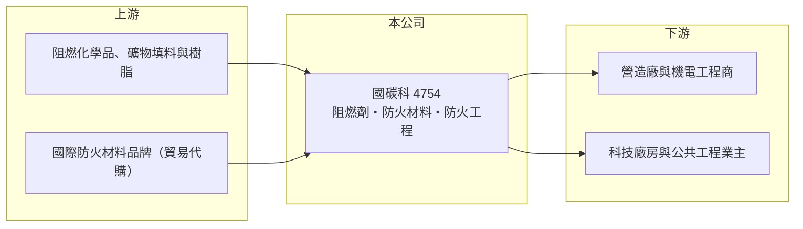

# 4754 國碳科

> 上櫃｜[[產業索引-化學工業|化學工業]]｜上市（櫃）日期 2016/09/28

# 第一章：企業模式與商業藍圖

> [!info] 撰寫說明
> 精簡版，由 Claude 依公開資料整理，架構比照 [[2330台積電]]，資料截至 2026-10-08。來源：HiStock 嗨投資季度損益表、報酬率與每股盈餘頁，nStock 公司概況，工商時報 2026 年 3 月國碳科年報新聞。產品營收比重與主要客戶本次未查到。公開資料有限。#待校對

國碳科是做建築防火材料與防火工程的小型專業公司，從阻燃劑配方、防火材料到現場施工一條龍，營收規模不大但獲利率與配息穩定。

- **核心業務：** 國碳科 1998 年成立、2016 年上櫃，主要業務是[[阻燃劑]]配方開發、防煙條與防火泥等[[耐火材料]]製造，以及防火延燒工程承包。建築物的管線貫穿牆面或樓板時會留下縫隙，火災時火與煙會沿縫隙蔓延，國碳科的產品就是用來封堵這些縫隙的[[防火填塞]]材料。
- **營收結構：** 依工商時報報導，營收分為防火工程與防火材料兩大類，防火材料包括阻燃劑、防火材料與防火塗料；公司也替客戶代購其他防火材料，形成部分貿易收入。各類比重本次未查到。
- **營運據點：** 公司登記於桃園蘆竹，以台灣市場為主，海外布局本次未查到。
- **長期方向：** 公司策略是擴大公共工程與電子產業（廠房）的銷售。消防法規只會越來越嚴，加上節能減碳帶動新建材開發，防火材料屬於長期需求穩定、跟著建築法規升級的利基市場。

# 第二章：護城河深度與競爭優勢

國碳科的護城河來自防火認證與「材料加施工」的整合能力，市場雖小，但進入門檻不低。

- **競爭優勢：** 防火材料必須通過防火時效測試與主管機關認可才能使用，每項產品、每種施工工法都需要個別認證，累積的認證組合就是門檻。國碳科同時供應材料與施工，業主與營造廠可以一次解決防火填塞的設計、材料與驗收，這種一站式服務比只賣材料的同業更有黏著度。
- **主要對手：** 國際防火材料品牌如喜利得（Hilti）、3M 的防火填塞產品，以及國內中小型防火材料商與防火工程行。同屬化學工業類別的上市櫃公司如 [[1717長興]]、[[1718中纖]]，產品並不直接重疊。
- **觀察重點：** 長期要看科技廠房、資料中心與公共工程的建設量，以及公司能否把防火工程經驗複製到海外客戶的建廠案。毛利率從 2021 年約四成提高到 2025 年近五成，顯示產品組合與議價力改善，這個趨勢能否維持是判斷護城河的重點。

# 第三章：財務體質與盈利規模

資料日期：2026-10-08，表格是撰寫當時的快照；最新月營收、毛利率、累計 EPS 由自動排程寫在本筆記的屬性欄位（月營收、毛利率、累計EPS 等）。#待校對

國碳科的營收規模約 5 億至 6.5 億元，但毛利率接近五成、ROE 長期維持在 14% 至 17%，是典型的小而穩利基型公司。

| 年度 | 營收（新台幣） | [[毛利率]] | [[營業利益率]] | EPS（元） | [[ROE]] |
|---|---|---|---|---|---|
| 2021 | 5.37 億 | 39.7% | 14.6% | 2.18 | 約 15.9% |
| 2022 | 4.77 億 | 38.9% | 13.3% | 1.89 | 約 13.8% |
| 2023 | 6.44 億 | 36.9% | 13.1% | 2.25 | 約 15.0% |
| 2024 | 6.32 億 | 44.3% | 15.1% | 2.63 | 約 16.1% |
| 2025 | 6.23 億 | 47.3% | 17.7% | 2.87 | 約 16.7% |
| 2026 上半年 | 3.51 億 | 50.7% | 22.6% | 2.21 | 約 12.1%（半年） |

註：營收、毛利率、營業利益率由 HiStock 季度損益表加總推算；ROE 為四季單季 ROE 相加的推算值。

- **營收規模與成長：** 2021 至 2025 年營收年複合成長率約 4%（推算），成長不快，但沒有出現明顯衰退，反映防火材料跟著建築與廠房工程的穩定需求。工程按進度認列，單季營收會因大案完工時點而起伏。
- **獲利：** 毛利率從 2021 年約 40% 逐步提升到 2025 年 47%，EPS 從 2022 年 1.89 元連續成長到 2025 年 2.87 元（2025 年稅後淨利約 0.87 億元）。毛利率高代表配方與認證帶來的定價力，而不只是賺施工費。
- **財務特色：** 2021 至 2025 年平均 ROE 約 15.5%（推算）。2024 年度現金股利 2 元、配發率約 76%，2025 年度配發 2.3 元，配發率約八成，屬於高配息、低資本支出的經營風格。由 ROE 與 ROA 推算，股東權益約占資產六成，財務結構穩健（推算）。

**[[ROIC]] 與 [[WACC]]：** 有息負債本次未查得，以「稅後營業利益 ÷ 股東權益」估算 ROIC 上限：2025 年營業利益約 1.10 億元，稅後約 0.88 億元，股東權益以淨利除以 ROE 推得約 5.2 億元，ROIC 約 17%（推算）；2021 至 2024 年約在 12% 至 17% 之間（推算）。WACC 以 CAPM 推估：無風險利率 1.75%、市場風險溢酬 6%、β 取小型利基股常見值 1.0，股權成本約 7.8%；假設負債占資本 10%、稅後負債成本 2%，WACC 約 7%（推算）。ROIC 長期高出 WACC 約 5 至 10 個百分點，代表國碳科的利基生意持續創造超過資金成本的價值，只是規模有限。

# 第四章：總體風險與地緣政治

國碳科的風險在於營收規模小、依賴營建與廠房工程，以及工程收入的波動。

- **產業週期：** 防火工程需求跟著新建案、公共工程與科技廠房擴建走，房市降溫或電子業資本支出縮減時，新案會減少。不過既有建物改善與法規要求的補強工程，可提供一部分較穩定的需求。
- **營運風險：** 工程案有工期、驗收與成本超支的風險，大案集中時單季獲利波動大；公司規模小，關鍵技術人員與施工團隊的流動也會影響承攬能力。
- **其他風險：** 消防與建築法規修訂可能要求新的測試認證，需投入時間與費用；化學原料價格上漲與營建缺工會壓縮工程毛利。

# 專有名詞解析

## 產業

- **[[阻燃劑]]**：加入塑膠、塗料或建材中，延緩燃燒或抑制火焰擴散的化學添加物。
- **[[耐火材料]]**：能在高溫或火災下維持結構與隔絕效果的材料，例如防火泥、防火板與防火塗料。
- **[[防火填塞]]**：用來封堵管線、電纜穿越牆面或樓板縫隙的防火材料與工法，防止火與煙沿縫隙蔓延。

# 核心供應鏈

- 上游：阻燃化學品、礦物填料與樹脂等原料（具體供應商未查到），以及代購的其他防火材料
- 下游／客戶：營造廠、機電工程商，終端為公共工程與電子產業廠房業主（客戶名稱未查到）
- 同業：喜利得（Hilti）、3M 防火填塞產品，國內防火材料與防火工程業者

## 最新新聞
<!-- news:start -->
<!-- news:end -->

## 相關連結
- [公開資訊觀測站](https://mopsov.twse.com.tw/mops/web/t05st03?step=1&firstin=1&co_id=4754)
- [Goodinfo](https://goodinfo.tw/tw/StockDetail.asp?STOCK_ID=4754)
- [Yahoo 股市](https://tw.stock.yahoo.com/quote/4754)
- [鉅亨網新聞](https://www.cnyes.com/twstock/4754/news)
