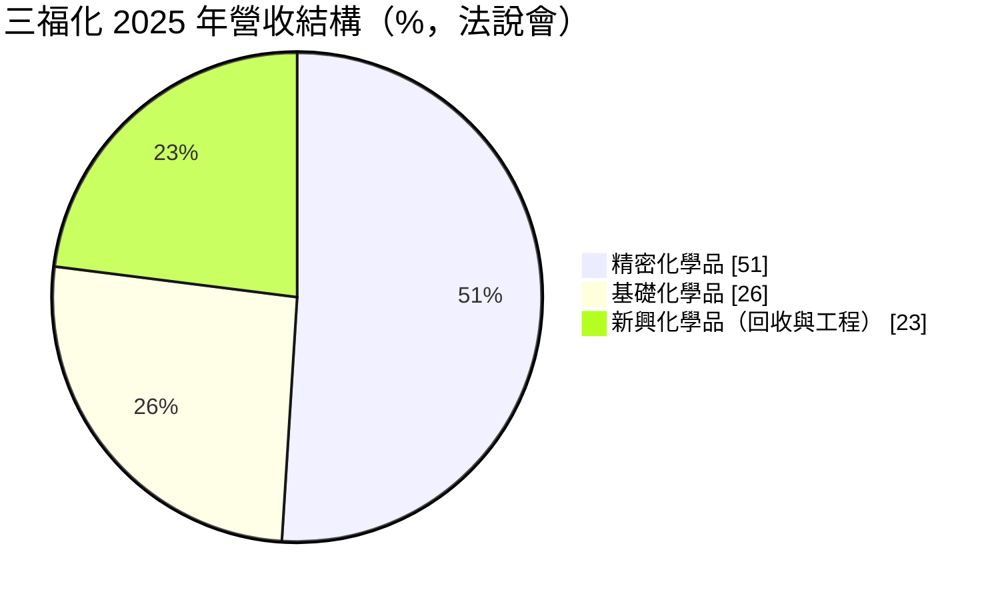
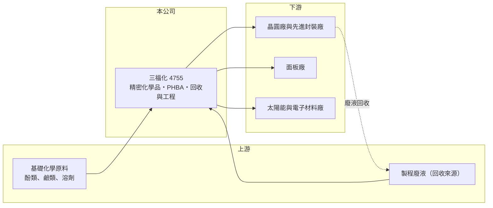

# 4755 三福化

> 上市｜[[產業索引-化學工業|化學工業]]｜上市（櫃）日期 2013/11/27

# 第一章：企業模式與商業藍圖

> [!info] 撰寫說明
> 精簡版，由 Claude 依公開資料整理，架構比照 [[2330台積電]]，資料截至 2026-10-08。來源：HiStock 嗨投資季度損益表、報酬率與每股盈餘頁，富果研究 2025 年 12 月三福化法說會整理，經濟日報 2026 年三福化年度財報新聞標題。法說會整理與損益表的單季營業利益率有出入，表格以 HiStock 為準。#待校對

三福化是供應半導體、面板與太陽能製程用化學品的材料廠，並把廢液回收再生與化學品供應工程做成第二條業務線，正從面板化學品轉向先進封裝化學品。

- **核心業務：** 三福化的產品分三大類：精密化學品，例如先進封裝用的[[剝離液]]、[[顯影液]]等[[電子級化學品]]；基礎化學品，以 [[PHBA]] 為主；以及新興化學品，包括製程廢液回收再生、回收服務與化學品供應系統建廠工程。化學品是晶圓廠與面板廠每天都要消耗的耗材，營收跟著客戶的產能利用率走，而不是跟著一次性的設備投資走。
- **營收結構：** 依富果研究整理的 2025 年法說會資料，精密化學品約占 51%、基礎化學品 26%、新興化學品 23%；面板應用的占比已從前一年約 40% 至 45% 降到 30% 至 35%，半導體比重則持續提高。

- **營運據點：** 台灣有柳科廠區，並投資南科橋頭園區新廠；海外有越南廠區，經營氣體與材料業務。另有子公司日東與從事新藥研發的三福生醫。
- **長期方向：** 公司的主軸是跟著國內半導體龍頭的[[先進封裝]]擴產，把剝離液、蝕刻液、[[TMAH]] 回收等產品導入 CoWoS、SoIC 與 WLCSP 製程，並配合客戶到美國、日本等地建廠承攬海外工程。PHBA 也從工業級轉向電子級，用於 AI 相關電子零組件的耐熱材料。

# 第二章：護城河深度與競爭優勢

三福化的護城河建立在製程化學品的認證門檻與「供應加回收」的循環服務，但面板業務面臨激烈價格競爭。

- **競爭優勢：** 電子級化學品打進晶圓廠需要長時間驗證，一旦通過認證並綁定特定製程，客戶通常不會輕易更換供應商，因為換料可能影響良率。三福化同時提供化學品、廢液回收再生與供應系統工程，能幫客戶降低化學品成本與減少廢棄物，符合半導體廠的循環經濟要求，這種組合服務比單純賣化學品更難被取代。
- **主要對手：** 國際電子化學品大廠如 BASF、Entegris、關東化學、三菱化學，以及台灣同業 [[1711永光]]、[[4770上品]]（化學品供應系統）等；在 TMAH 回收與 SoIC 蝕刻液等新產品上，公司也提到正與其他供應商競爭驗證。
- **觀察重點：** 長期要看半導體相關營收占比能否持續上升、橋頭新廠投產後的毛利率，以及越南子公司與三福生醫能否停止侵蝕獲利。這幾件事決定三福化能否從面板化學品廠轉型為先進封裝材料廠。

# 第三章：財務體質與盈利規模

資料日期：2026-10-08，表格是撰寫當時的快照；最新月營收、毛利率、累計 EPS 由自動排程寫在本筆記的屬性欄位（月營收、毛利率、累計EPS 等）。#待校對

三福化營收長期維持在 48 億至 56 億元，2022 年面板與半導體景氣高峰時 EPS 達 8.43 元，之後毛利率回落到兩成左右，獲利進入整理期。

| 年度 | 營收（新台幣） | [[毛利率]] | [[營業利益率]] | EPS（元） | [[ROE]] |
|---|---|---|---|---|---|
| 2021 | 47.8 億 | 25.0% | 15.1% | 6.69 | 約 17.2% |
| 2022 | 56.2 億 | 26.7% | 16.5% | 8.43 | 約 19.7% |
| 2023 | 49.9 億 | 20.5% | 11.2% | 4.41 | 約 10.2% |
| 2024 | 53.2 億 | 19.0% | 9.5% | 4.10 | 約 9.2% |
| 2025 | 48.4 億 | 21.7% | 10.3% | 3.70 | 約 7.2% |
| 2026 上半年 | 23.7 億 | 23.1% | 10.8% | 2.33 | 約 3.5%（半年） |

註：營收、毛利率、營業利益率由 HiStock 季度損益表加總推算；ROE 為四季單季 ROE 相加的推算值。

- **營收規模與成長：** 2021 至 2025 年營收年複合成長率約 0.3%（推算），整體持平；化學品屬於耗材，營收不會大起大落，但也受面板產業成熟、價格競爭影響而難以快速成長。
- **獲利：** 毛利率從 2022 年的 26.7% 降到 2024 年的 19.0%，主要反映面板化學品價格競爭與新廠、新產品的前期成本；2025 年回升到 21.7%，公司目標 2026 年再提高 2 至 3 個百分點，關鍵在高毛利的半導體化學品與電子級 PHBA 比重。
- **財務特色：** 2021 至 2025 年平均 ROE 約 12.7%（推算），但呈現逐年下滑。2025 年第二季營業利益約 1.45 億元、稅前卻只有 0.53 億元，業外損失明顯（原因本次未查得）。公司 2026 年資本支出預估 6 億至 8 億元，用於柳科去瓶頸與橋頭新廠，未來幾年折舊會增加。

**[[ROIC]] 與 [[WACC]]：** 有息負債本次未查得，以「稅後營業利益 ÷ 股東權益」估算 ROIC 上限：2025 年營業利益約 4.99 億元，稅後約 4.0 億元，股東權益以淨利除以 ROE 推得約 50 億元，ROIC 約 8%（推算）；2022 年約 17%、2024 年約 9%（推算），計入有息負債後實際數字會再低一些。WACC 以 CAPM 推估：無風險利率 1.75%、市場風險溢酬 6%、β 取電子化學品同業常見值 1.1，股權成本約 8.4%；假設負債占資本 25%、稅後負債成本 2%，WACC 約 6.8%（推算）。2021 至 2022 年 ROIC 明顯高於 WACC，2023 年後利差縮小到接近零，代表三福化目前處於「仍在創造價值、但幅度不大」的階段，先進封裝新產品能否放量是利差重新擴大的關鍵。

# 第四章：總體風險與地緣政治

三福化的風險在於客戶集中、面板產業成熟，以及轉型期的新廠與子公司費用。

- **產業週期：** 化學品用量跟著晶圓廠與面板廠的產能利用率變動，半導體庫存調整或面板減產時，出貨量會同步下滑，並沿供應鏈產生[[長鞭效應]]。
- **營運風險：** 半導體新產品高度依賴單一國內龍頭客戶的驗證與擴產節奏，驗證延後就會讓新廠產能閒置；面板化學品價格競爭激烈，持續壓抑毛利率。越南子公司過去每年虧損約 7,000 萬至 8,000 萬元，三福生醫也有臨床試驗費用，都會拖累合併獲利。
- **其他風險：** 化學品的生產、運輸與回收屬於高監管行業，工安與環保事件會帶來停工與商譽損失；原料價格、匯率，以及海外工程標案的執行風險也需要注意。

# 專有名詞解析

## 半導體

- **[[電子級化學品]]**：純度極高、金屬雜質以 ppb 計的化學品，用於晶圓與面板的清洗、蝕刻與顯影。
- **[[剝離液]]**：在微影或電鍍後用來去除光阻的化學品，先進封裝的重布線與凸塊製程用量大。
- **[[顯影液]]**：微影製程中把曝光後光阻圖形顯現出來的化學溶液，TMAH 是最常用的成分。
- **[[TMAH]]**：四甲基氫氧化銨，半導體與面板顯影製程的主要化學品，回收再生可降低成本與廢液量。
- **[[先進封裝]]**：把多顆晶片以中介層、混合鍵合等方式高密度整合的封裝技術，例如 CoWoS、SoIC。

## 金融

- **[[長鞭效應]]**：終端需求的小幅變動，沿供應鏈往上游傳遞時被逐級放大，造成上游庫存與訂單劇烈波動。

## 產業

- **[[PHBA]]**：對羥基苯甲酸，用於液晶高分子、防腐劑與耐熱材料的化學原料。

# 核心供應鏈

- 上游：酚類、鹼類與溶劑等基礎化學原料，以及客戶製程產生的廢液（回收再生來源）
- 下游／客戶：國內半導體龍頭與先進封裝廠（推估包括 [[2330台積電]]，法說會未點名）、面板廠如 [[2409友達]]、[[3481群創]]（推估）、太陽能與電子材料廠
- 同業：BASF、Entegris、關東化學，台灣 [[1711永光]]、[[4770上品]]

## 供應鏈關係
- 供應給 [[2330台積電]]：顯影劑與蝕刻液（台積電供應鏈 › 上游：關鍵耗材、特用化學品與氣體）

## 最新新聞
<!-- news:start（自動產生，請勿手動編輯此範圍） -->
- 2026-10-08 📰 媒體 16:00｜《化工股》三福化子公司三福生醫與Ainos簽VELDONA全球授權合約｜[富聯網](https://news.google.com/rss/articles/CBMiiAFBVV95cUxPYjZfR3ZibUFyS09UY3pvZkRETmh6ZEo1VXExZTBwVUFCVmpBY0Y4R0pQNUZ6YndzRWVkak5tWGstX0J2SXdxZmFfcWFIN19tbFZBcG5UaXlnSEQ2SVFubWZtSVh2N1dGdEY2YmNGSHJaRF82UU5IUFZzTkN2V0hFc1RaelIxOS1m?oc=5)
- 2026-10-06 📰 媒體 07:56｜個股：三福化(4755)9月營收4.8億元、年增16.22%，2027年營運重返高成長軌道｜[富聯網](https://news.google.com/rss/articles/CBMiiAFBVV95cUxNRlpsQlBIbGgwVzFlaEtaSURuU191ZmhQR24tamU4YTV4RzN4RUhqZXpfaHhiTnJkNndfQWUxT3Z1eVVWajF2WlZqek80aDFEcjBFazlxbGpVcElHakwzdWFlOVpsNXctUnEyOWQ0LWJWbzNFQWFsbnBQNGxmelBYaG91QUl0aTlX?oc=5)
- 2026-10-05 📰 媒體 16:12｜《業績-化工》三福化9月營收為4.80億元，年增16.22%｜[富聯網](https://news.google.com/rss/articles/CBMiiAFBVV95cUxOc0JwZ2lWWU9zNW43ZEFCR1k0eUFlRzRsTGh4T1BleEsyNU5Nc1pjOEdwZUJhTDM2N0VWU0hNV0ZtN3EwbnUzQTJnU1pOd1lXemVadG5TUFEwS1ZpbnE1U2s5YnNldjF1ckZHVTdHOFVnSmliQ1lGb1p3QUZMUHU1TFE5a013dllT?oc=5)
- 2026-10-05 📰 媒體 16:05｜三福化(4755) 個股概覽 ／ 個股 - 股市｜[CMoney](https://news.google.com/rss/articles/CBMiU0FVX3lxTE1SMmhlekVtRW83OUw1RTh1dUV4WkNGMDRwTW04VUJXd0tDWF94Q3ExcWtPOEczRjJNUUhMWDczQzVqNDFfa004NmFhOFdDdFFwVHNv?oc=5)
- 2026-10-05 📰 媒體 15:57｜營收：三福化(4755)9月營收4億8000萬元，月增率7.90%，年增率16.22%｜[富聯網](https://news.google.com/rss/articles/CBMiiAFBVV95cUxOMWwxQjNwTWVwU1owZnVGRTZCVXV2X2sxMWVfQmk3eUd5YWxEV0h0dFNoei0yTzdRQ3pUQUFEbVNVQTI4Q282RHM5c0JnMlVpMXJiYW4wN0NJcWppSW8yLXdkdzl1b2tUa2pTQnFubFVuRzZIckJuWmlYY25QNVV4enRFcHVtOHEt?oc=5)

完整紀錄：[[4755三福化 新聞]]
<!-- news:end -->

## 相關連結
- [公開資訊觀測站](https://mopsov.twse.com.tw/mops/web/t05st03?step=1&firstin=1&co_id=4755)
- [Goodinfo](https://goodinfo.tw/tw/StockDetail.asp?STOCK_ID=4755)
- [Yahoo 股市](https://tw.stock.yahoo.com/quote/4755)
- [鉅亨網新聞](https://www.cnyes.com/twstock/4755/news)
