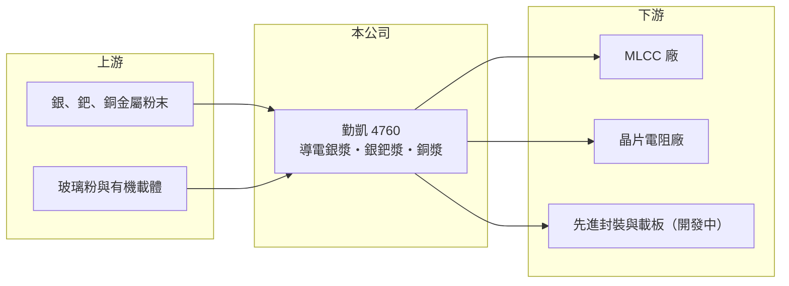

# 4760 勤凱

> 上櫃｜[[產業索引-其他電子業|其他電子業]]｜上市（櫃）日期 2019/03/21

# 第一章：企業模式與商業藍圖

> [!info] 撰寫說明
> 精簡版，由 Claude 依公開資料整理，架構比照 [[2330台積電]]，資料截至 2026-10-07。來源：旺得富／中時（2026 年 6 月勤凱營運報導）、nstock.tw 勤凱科技公司概況、winvest.tw 營收快訊。產品比重未查到。#待校對

勤凱是被動元件用導電漿料的材料廠，2026 年受惠 MLCC 景氣回溫與 AI 需求。

- **核心業務：** 勤凱科技研發製造用於[[被動元件]]內電極與端電極的[[導電漿]]，包括銀漿、銀鈀漿、銅漿，以及厚膜導體材料。
- **營收結構：** 本次未查到產品比重；主要應用在 [[MLCC]] 與晶片電阻等被動元件。
- **營運據點：** 公司位於高雄大寮。
- **長期方向：** 開發 AI 相關新材料，包括 [[CoWoS]] 封裝用散熱介面材料、CoPoS 玻璃基板填孔漿料，以及高頻伺服器用合金漿料。

# 第二章：護城河深度與競爭優勢

勤凱的優勢在配方與客戶認證，材料一旦進入被動元件廠產線就不易被替換。

- **競爭優勢：** 漿料配方影響元件的電性與可靠度，客戶導入需長時間驗證；在地供應、交期短，對台灣被動元件廠有服務優勢（推估）。
- **主要對手：** 日本昭榮化學、杜邦等國際電子漿料廠，以及中國漿料業者。
- **觀察重點：** 銅漿出貨成長能否延續（公司預期第二季季增近五成），以及 CoWoS、玻璃基板等新材料何時貢獻營收。

# 第三章：財務體質與盈利規模

資料日期：2026-10-07，以下數字是撰寫當時的快照；最新月營收、毛利率、累計 EPS 由自動排程寫在本筆記的屬性欄位（月營收、毛利率、累計EPS 等）。#待校對

勤凱 2026 年營收與獲利都創新高。

- **營收規模：** 2025 年全年營收 19.06 億元；2026 年 1 至 7 月累計 16.08 億元、年增 61.38%，8 月營收 3.05 億元、年增 91.54%。
- **獲利：** 2025 年全年 EPS 7.05 元創新高；2026 年第一季 EPS 2.55 元、第二季 2.71 元，上半年累計 5.26 元，第二季[[毛利率]] 18.23%。
- **財務特色：** 營收含大量銀、鈀等貴金屬成本，毛利率不高但營收隨金屬價格放大；2025 年第四季配發現金股利 4.5 元與股票股利 0.2 元。

# 第四章：總體風險與地緣政治

勤凱的風險在於貴金屬價格與被動元件景氣循環。

- **產業週期：** 被動元件是典型的庫存循環產業，客戶在漲價前提前備貨（2026 年 4 月起報價調漲 10% 至 15%），之後可能出現庫存調整。
- **營運風險：** 銀、鈀價格劇烈波動會影響成本與存貨評價；客戶集中在少數被動元件大廠（推估）。
- **其他風險：** 匯率、貴金屬進口價格，以及日系同業的技術競爭。

# 專有名詞解析

## 半導體

- **[[CoWoS]]**：台積電的 2.5D 先進封裝技術，把 GPU 與 HBM 並排放在矽中介層上，是 AI 晶片的主流封裝方式。

## 應用

- **[[導電漿]]**：以銀、銅等金屬粉末調製的漿料，用來印刷或塗佈形成電極與導線。

## 金融

- **[[毛利率]]**：毛利除以營收，代表產品扣除直接成本後的獲利空間。

## 產業

- **[[被動元件]]**：不需外加電源即可運作的電子元件，例如電容、電阻、電感，幾乎所有電子產品都大量使用。
- **[[MLCC]]**：積層陶瓷電容，以多層陶瓷與金屬電極堆疊而成的小型電容，AI 伺服器用量是一般伺服器的數倍。

# 核心供應鏈

- 上游：銀、鈀、銅金屬粉末，玻璃粉與有機載體供應商
- 下游／客戶：被動元件廠，推估包括 [[2327國巨]]、[[2492華新科]]、[[6173信昌電]]
- 同業：昭榮化學、杜邦、中國電子漿料業者

## 最新新聞
<!-- news:start -->
<!-- news:end -->

## 相關連結
- [公開資訊觀測站](https://mopsov.twse.com.tw/mops/web/t05st03?step=1&firstin=1&co_id=4760)
- [Goodinfo](https://goodinfo.tw/tw/StockDetail.asp?STOCK_ID=4760)
- [Yahoo 股市](https://tw.stock.yahoo.com/quote/4760)
- [鉅亨網新聞](https://www.cnyes.com/twstock/4760/news)
