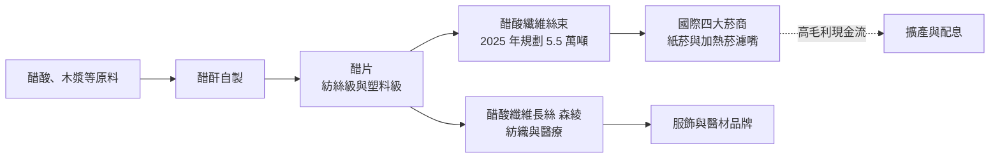
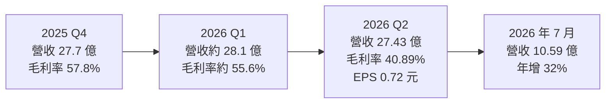
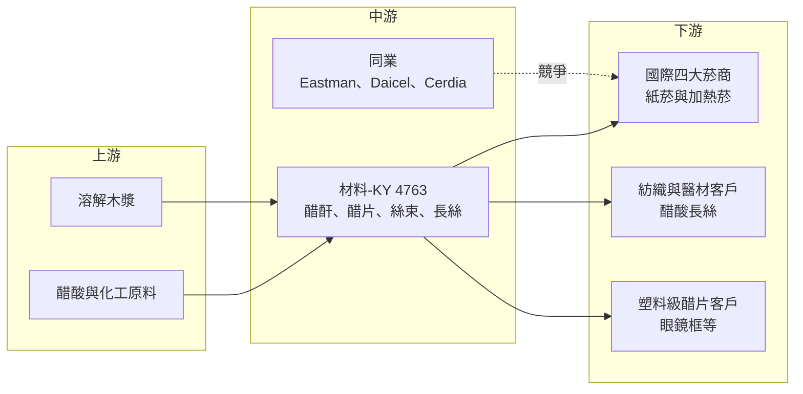

# 4763 材料-KY

> 上市｜[[產業索引-化學工業|化學工業]]｜上市（櫃）日期 2015/11/09

# 第一章：企業模式與商業藍圖

> [!info] 撰寫說明
> 本文由 Claude 依公開資料整理，架構比照 [[2330台積電]] 的四章研究，資料截至 2026-10-07。財務數字來源：優分析（2025 年報與 2026 年上半年財報報導）、今周刊、蕃新聞（yam）、中央社；產業描述為整理性內容，尚未逐條比對原始文件。#待校對

在評估單一個股的長期投資價值時，首要步驟是拆解企業的底層獲利邏輯。本章針對英屬開曼群島商濟南大自然新材料股份有限公司（股票代號：4763，以下簡稱材料-KY）的商業模式進行定性分析，說明一家香菸濾嘴材料廠，為何能長期維持五到六成的毛利率。

## 一、核心定位：全球第五大香菸濾嘴材料供應商

材料-KY 的生產基地在中國山東（濟南、棗莊），主要產品是[[醋酸纖維絲束]]，也就是香菸濾嘴裡那團白色纖維。依今周刊報導，材料-KY 是全球第五大濾嘴材料供應商，客戶是全球知名的四大菸商。

醋酸纖維絲束是一個高度寡占的市場。全球每年絲束消耗量約 82 萬噸，長期由少數國際化工大廠與中國菸草體系內的合資廠供應。材料-KY 能打進國際菸商供應鏈，靠的是三件事：

* **垂直整合：** 公司向上游掌握[[醋酐]]與[[醋片]]產能，從原料一路做到絲束，成本與品質都能自己控制。
* **認證門檻：** 國際菸商對濾嘴材料的吸阻、雜質與一致性要求嚴格，新供應商的驗證期長，一旦進入就不容易被換掉。
* **地緣替代需求：** 中國以外的菸商需要非中國菸草體系、又具成本優勢的供應來源，材料-KY 正好填補這個位置。

2023 年是公司的爆發年，營收 110.26 億元、年增 158%，[[毛利率]] 62.48%；2024 年營收再成長 43% 至 157.13 億元，創歷史新高。2025 年起受客戶庫存調整與地緣政治影響，營收回落到 132.31 億元。

## 二、終端應用／產品板塊：濾嘴絲束為主，往新菸品與紡織延伸

公司未公開產品別營收比重（未查得），以下依產品性質說明：

* **濾嘴絲束：** 傳統紙菸濾嘴的核心材料，是營收與獲利的絕大部分來源（推估）。
* **[[加熱菸]]濾嘴絲束：** 依今周刊引用的數據，約 10% 的絲束用於加熱菸，需求約 5.7 萬噸，加熱菸每單位使用量約為傳統紙菸的 1.7 倍。材料-KY 正積極拓展 HNB（加熱不燃燒）菸彈濾嘴。
* **醋片：** 分為紡絲級（用於製造絲束與長絲）與塑料級（用於眼鏡框等），除自用外也可外售。
* **醋酸纖維長絲（森綾）：** 用於女裝、服裝裡料與醫療用品，2024 年底規劃擴至年產 4,000 噸，是降低對菸草依賴的新產品線。
* **其他新產品：** 口含菸不織布材料、新型晶球濾嘴，以及生物製藥與電子薄膜顯示領域的長期布局。

## 三、資本轉化邏輯（營運模式）：從醋酐到絲束的一條龍

* **規模經濟：** 依蕃新聞報導的產能規劃，絲束產能在 2024 年 7 月擴增至 4.6 萬噸，2025 年目標 5.5 萬噸；醋片產能 2025 年目標 7 萬噸。醋片產能大於絲束需求，多出的部分可外售或供長絲使用。
* **長約與訂單能見度：** 依中央社報導，2026 年訂單約八成已在年初談定，顯示菸商習慣以年度合約鎖定供應。
* **高毛利轉現金：** 2025 年稅後純益 60.31 億元，配發現金股息 3.05 元、[[盈餘分配率]]約 50%，保留一半盈餘支應擴產。

## 四、企業長期藍圖：東南亞設廠與多元化

* **東南亞擴產：** 公司曾規劃在東南亞設立年產 1.5 萬噸的絲束廠，目的是貼近客戶並分散中國單一產地的風險（實際進度未查得）。
* **新菸品材料：** 加熱菸與口含菸是國際菸商轉型的重點，提前打入這些新產品的材料認證，可以對沖傳統紙菸量的長期下滑。
* **非菸草應用：** 長絲、塑料級醋片、生物製藥與電子薄膜，目前規模小，但代表公司嘗試把醋酸纖維技術延伸到菸草以外的市場。
* **新興市場：** 2026 年起加強開發亞洲、中東、非洲與拉丁美洲客戶，分散對既有大客戶的依賴。

# 第二章：護城河深度與競爭優勢

在長期價值投資中，「護城河」指企業抵禦競爭、維持超額利潤的保護機制。本章分析材料-KY 能維持高毛利的原因、全球主要對手，以及這道護城河在客戶庫存調整期的耐受度。

## 一、護城河的核心組成要素

* **1. 寡占市場與高進入門檻：** 醋酸纖維絲束的製程屬資本與技術密集，從醋酐、醋片到紡絲都需要專門設備與經驗，全球供應者數量有限。今周刊將公司的競爭優勢歸納為高密集度製程技術與豐富專利經驗。
* **2. 客戶驗證的轉換成本：** 濾嘴材料直接影響菸品的口感與吸阻，菸商更換供應商需要重新調整配方並通過內部測試，因此既有供應商的地位相對穩固。
* **3. 垂直整合的成本優勢：** 自製醋酐與醋片，使材料-KY 在原料價格波動時比單純買醋片紡絲的業者更有緩衝，這是毛利率長期高於 55% 的重要原因（推估）。
* **4. 非中國菸草體系的供應角色：** 中國是全球最大的絲束消費國，但其國內市場主要由菸草專賣體系內的合資廠供應；材料-KY 以外銷為主，對國際菸商而言是具成本優勢的替代來源（推估）。

## 二、全球主要競爭對手格局

| 對手 | 定位 | 對材料-KY 的威脅 |
|---|---|---|
| Eastman（美國） | 全球主要醋酸纖維與醋片供應商 | 技術與品牌歷史長，綁定歐美大客戶 |
| Celanese 與中國合資廠 | 長期供應中國菸草體系 | 中國市場主要供應者，產能規模大 |
| Daicel（日本） | 日系醋酸纖維大廠 | 在日本與亞洲菸商有穩定地位 |
| Cerdia（歐洲） | 歐洲絲束供應商 | 與國際菸商合作歷史悠久 |
| 中國國內新進者 | 擴充醋片與絲束產能 | 若產能外溢到出口市場，可能壓低價格 |

註：上表對手名單為產業常見整理，市占數字未查得。

## 三、優勢轉化：守得住、守不住與觀察重點

* **守得住：** 高毛利本身。即使 2025 年營收較前一年減少約 16%，全年毛利率仍有 58.6%，說明產品定價並未崩跌，衰退主要來自出貨量。
* **守不住：** 出貨節奏。客戶延後交貨與庫存調整時，材料-KY 沒有能力強迫客戶拉貨。2026 年第二季營收年減 26.3%，加上子公司歲修停機使單位成本上升，單季毛利率掉到 40.89%。
* **觀察重點：** 第一，2026 年 7 月營收 10.59 億元、年增 32.05%，下半年能否回到前一年水準；第二，毛利率能否回到五成以上，確認第二季只是歲修造成的一次性影響；第三，加熱菸與長絲等新產品能否成為新的成長來源。

# 第三章：財務體質與盈利規模

資料日期：2026-10-07。數字取自優分析等財經媒體整理，表格是撰寫當時的快照；最新月營收、毛利率、累計 EPS 由自動排程寫在本筆記的屬性欄位（月營收、毛利率、累計EPS 等）。#待校對

財務報表是檢驗護城河是否真實存在的最終標準。本章用三率、ROE、現金流與資本報酬，檢視材料-KY 在出貨下滑期的獲利品質。

## 一、獲利能力的基石：三率

| 項目 | 2024 全年 | 2025 全年 | 2025 Q4 | 2026 Q1 | 2026 Q2 |
|---|---|---|---|---|---|
| 營收（新台幣） | 157.13 億 | 132.31 億 | 27.7 億 | 約 28.1 億（推算） | 27.43 億 |
| [[毛利率]] | 約 63.3%（推算） | 58.6% | 57.8% | 約 55.6%（推算） | 40.89% |
| [[淨利率]] | 未查得 | 約 45.6%（推算） | 41.3% | 未查得 | 約 26.1%（推算） |
| 稅後純益 | 約 83.4 億（推算） | 60.31 億 | 11.45 億 | 約 11.1 億（推算） | 7.17 億 |
| EPS（元） | 未查得 | 6.1 | 未查得 | 約 1.13（推算） | 0.72 |

註：2026 Q1 數字以上半年合計（營收 55.54 億、EPS 1.85 元）減去第二季推算。2024 年毛利率與純益由 2025 年的年減幅度回推。公司 2023 年 EPS 為 62.52 元，與 2025 年 6.1 元的股數基礎不同，跨年比較需注意（推估為股本或面額調整所致，請校對）。[[營業利益率]]未查得。

* **[[毛利率]]：** 材料-KY 的毛利率在 2023 至 2025 年都在 58% 以上，屬於製造業中極高的水準。2026 年第二季驟降到 40.89%，公司說明原因是子公司年度歲修停機時間拉長，產量下降推高單位成本，屬[[產能利用率]]效應。
* **[[淨利率]]：** 2025 年第四季純益率 41.3%，顯示費用結構精簡，毛利大部分能轉為淨利。
* **營收趨勢：** 2025 年第四季營收年減 39%，2026 年上半年營收 55.54 億元、年減 10.28%；但 7 月營收已回到 10.59 億元的今年新高。

## 二、[[ROE]]：資本效率

依蕃新聞引用的資料，2019 至 2023 年平均 ROE 約 41%，在台股製造業中屬頂尖。2025 年獲利年減 27.67%，ROE 應已明顯下滑（推估，具體數值未查得）。高 ROE 主要來自高毛利率，而非高財務槓桿。

## 三、資本支出與自由現金流

* **[[CapEx]]：** 2024 至 2025 年的主要支出是絲束擴至 5.5 萬噸、醋片擴至 7 萬噸與長絲 4,000 噸；未來可能的東南亞新廠是下一個大項目，金額未查得。
* **[[自由現金流]]：** 在毛利率接近六成的情況下，營業現金流充沛，扣除擴產支出後仍有餘裕配發約五成盈餘（推估）。
* **股利：** 2025 年度配發現金股息 3.05 元，配發率 50%，以當時股價計算現金殖利率約 6.91%。

## 四、[[ROIC]] 與 [[WACC]]：價值創造利差

以五到六成的毛利率與四成以上的平均 ROE 推估，材料-KY 的 ROIC 長期遠高於 WACC（推估，具體數值未查得）。需要留意的是，身為在中國生產的 KY 股，投資人要求的風險溢酬較高，WACC 也會高於一般台灣製造業。只要毛利率維持在五成以上，價值創造的利差仍然寬裕；若第二季的 40% 毛利率成為常態，利差就會明顯縮小。

# 第四章：總體風險與地緣政治

任何企業都無法脫離宏觀環境獨立存在。本章分析材料-KY 未來必須面對的地緣政治、產業週期、營運與法規風險。

## 一、地緣政治

* **中國生產、外銷全球：** 所有產能在中國山東，美中貿易衝突、關稅或出口管制都可能影響出貨成本與客戶下單意願。
* **中東與新興市場波動：** 公司說明 2025 年第四季受中東局勢與東南亞市場變化影響，客戶延後交期。
* **KY 股的治理風險：** 營運主體在海外，投資人取得資訊與監督的難度較高，資訊揭露品質是長期評價的重要因素。

## 二、產業週期與市場結構

* **菸草去庫存週期：** 菸商會在原料充足時降低庫存水位，造成上游材料商的出貨出現[[長鞭效應]]式的放大波動。2025 年至 2026 年上半年的營收衰退即屬此類。
* **紙菸長期萎縮：** 已開發國家的吸菸人口持續減少，傳統濾嘴絲束的總需求缺乏長期成長性，只能靠市占提升與新興市場撐住量能。
* **產能擴張的價格壓力：** 若中國或其他地區新增絲束產能，寡占格局鬆動，高毛利可能被侵蝕。

## 三、營運環境的隱性風險

* **客戶集中：** 客戶集中在少數國際菸商，單一客戶調整採購就會明顯影響營收。
* **歲修與設備：** 2026 年第二季的毛利率驟降顯示，連續生產型化工廠一旦停機，單位成本上升的影響非常大。
* **匯率：** 以外銷為主、成本在人民幣，新台幣、美元與人民幣三者的匯率變動都會影響以新台幣計算的獲利。

## 四、科技或法規演進

* **菸害防制法規：** 世界衛生組織菸草控制框架公約與各國對菸品的稅負、包裝、添加物限制，長期壓縮紙菸市場。
* **新菸品技術：** 加熱菸、口含菸與電子菸的普及會改變濾嘴材料需求。加熱菸每單位絲束用量較高是利多；但電子菸與口含菸幾乎不需要絲束，若成為主流，對公司是結構性利空。
* **環保法規：** 醋酸纖維濾嘴屬塑膠污染議題的一部分，若各國針對菸蒂與一次性塑膠加強管制，可能推動可生物分解濾嘴材料的需求，也可能帶來新的合規成本。

# 專有名詞解析

## 金融

- **[[盈餘分配率]]**：現金股利占每股盈餘的比例，反映公司把多少獲利發給股東、多少留作再投資。
- **[[毛利率]]**：營收扣除銷貨成本後的毛利占營收比例，反映產品本身的獲利能力。
- **[[淨利率]]**：稅後淨利占營收的比例，代表每一元營收最後留給股東的獲利。
- **[[產能利用率]]**：實際產量占總產能的比例，固定成本高的產業，利用率下降會直接推高單位成本。
- **[[長鞭效應]]**：終端需求的小幅變動，沿供應鏈往上游傳遞時被逐級放大，造成上游庫存與訂單劇烈波動。

## 產業

- **[[醋酸纖維絲束]]**：以醋片紡成的連續纖維束，是香菸濾嘴的主要材料，市場由少數業者寡占。
- **[[醋片]]**：醋酸纖維素的片狀或粉狀原料，可紡成絲束、長絲，或做成眼鏡框等塑膠製品。
- **[[醋酐]]**：醋酸酐，是把纖維素轉化為醋酸纖維素的關鍵化學原料，自製可降低成本。
- **[[加熱菸]]**：以加熱而非燃燒菸草的方式產生煙霧的菸品，英文簡稱 HNB，單位絲束用量高於傳統紙菸。

# 核心供應鏈

## 1. 上游：化工原料與木漿
- 醋酸等化工原料：中國當地化工業者（名稱未查得）
- 溶解木漿：國際紙漿供應商（名稱未查得）

## 2. 中游：材料-KY 本身與同業
- 自製醋酐、醋片與絲束：濟南、棗莊生產基地
- 國際同業：Eastman、Celanese、Daicel、Cerdia

## 3. 下游：主要客戶
- 全球四大菸商（今周刊報導，公司未逐一公開名稱）
- 醋酸長絲客戶：服飾、內裡與醫療用品業者
- 塑料級醋片客戶：眼鏡框等塑膠製品業者

## 最新新聞
<!-- news:start -->
<!-- news:end -->

## 相關連結
- [公開資訊觀測站](https://mopsov.twse.com.tw/mops/web/t05st03?step=1&firstin=1&co_id=4763)
- [Goodinfo](https://goodinfo.tw/tw/StockDetail.asp?STOCK_ID=4763)
- [Yahoo 股市](https://tw.stock.yahoo.com/quote/4763)
- [鉅亨網新聞](https://www.cnyes.com/twstock/4763/news)
