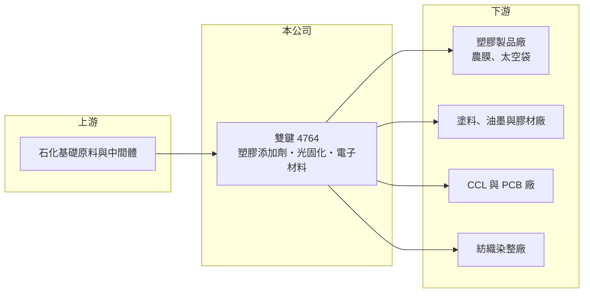

# 4764 雙鍵

> 上市｜[[產業索引-化學工業|化學工業]]｜上市（櫃）日期 2018/01/04

# 第一章：企業模式與商業藍圖

> [!info] 撰寫說明
> 精簡版，由 Claude 依公開資料整理，架構比照 [[2330台積電]]，資料截至 2026-10-08。來源：HiStock 嗨投資季度損益表、報酬率與每股盈餘頁，富果研究 2025 年 10 月雙鍵法說會整理，經濟日報「雙鍵切入高階 CCL 材料鏈」等新聞標題。HiStock 損益表本次只取得至 2026 年第一季。#待校對

雙鍵是以光穩定劑、光起始劑等特用化學品起家的材料廠，客戶超過三千家，近年把產品線延伸到 AI 伺服器電路板用的電子材料，正處於從傳統化學品轉型的階段。

- **核心業務：** 雙鍵的四大產品線是[[塑膠添加劑]]、[[光固化]]材料、數位紡織材料與電子材料。塑膠添加劑主要是讓農膜、太空袋等塑膠製品耐日照老化的[[光穩定劑]]，光固化材料則是讓塗料、油墨照紫外線後瞬間硬化的[[光起始劑]]與樹脂。這些都是用量少、但決定最終產品性能的關鍵配方原料。
- **營收結構：** 依富果研究整理的法說會資料，塑膠添加劑占比從 2023 年的 61% 降到 2025 年前三季的 46%，光固化材料由 29% 降到 25%，含電子材料在內的其他產品則從 10% 升到 29%。產品結構正明顯往電子材料移動。
- **營運據點：** 生產基地在台灣宜蘭與中國江蘇，兩岸設廠可依客戶所在地與關稅條件調整出貨。宜蘭廠規劃把電子化學品年產能提高到 2,000 噸，廠區旁仍有約三分之一土地可供擴產。
- **長期方向：** 公司鎖定 AI 伺服器與高速通訊所需的Low Dk/Df 電路板材料，也就是低介電、低損耗的[[CCL]] 用樹脂與添加劑，2025 年前三季電子材料出貨約 300 噸。若電子材料比重持續上升，雙鍵的毛利率結構可望脫離傳統化學品的價格競爭。

# 第二章：護城河深度與競爭優勢

雙鍵的護城河來自分散的客戶基礎與配方經驗，但傳統產品正受到中國同業的價格競爭。

- **競爭優勢：** 光穩定劑與光起始劑的品項多、每個客戶的配方需求不同，雙鍵累積了超過三千家客戶與多年的應用資料，能快速調整配方，這是小量多樣化學品的主要門檻。電子材料要經過 CCL 廠與終端客戶的長時間驗證，一旦打入，同樣具有轉換成本。
- **主要對手：** 光穩定劑與光起始劑的國際大廠包括 BASF（原 Ciba 產品線）、IGM Resins，中國則有大量中小型化學廠以低價競爭；電子材料方面則與日本、美國的樹脂與特用化學品廠競爭。台灣同屬特用化學類的有 [[1711永光]]、[[1717長興]]。
- **觀察重點：** 長期最重要的是電子材料能否穩定放量並維持較高毛利，以及宜蘭新產能的利用率。若傳統塑膠添加劑持續受中國內捲壓價，電子材料的成長速度就決定公司整體獲利能否穩定。

# 第三章：財務體質與盈利規模

資料日期：2026-10-08，表格是撰寫當時的快照；最新月營收、毛利率、累計 EPS 由自動排程寫在本筆記的屬性欄位（月營收、毛利率、累計EPS 等）。#待校對

雙鍵在 2023 至 2024 年因中國競爭與需求疲弱連續虧損，2025 年起隨電子材料出貨轉盈，2026 年第一季毛利率回升到 26% 以上。

| 年度 | 營收（新台幣） | [[毛利率]] | [[營業利益率]] | EPS（元） | [[ROE]] |
|---|---|---|---|---|---|
| 2021 | 30.6 億 | 17.6% | 4.8% | 1.25 | 約 4.8% |
| 2022 | 28.1 億 | 14.7% | 1.1% | 0.71 | 約 2.6% |
| 2023 | 22.3 億 | 11.5% | -5.1% | -1.00 | 約 -3.8% |
| 2024 | 27.0 億 | 13.6% | -1.0% | -0.44 | 約 -1.6% |
| 2025 | 28.5 億 | 19.8% | 5.8% | 1.22 | 約 4.8% |
| 2026 | 8.2 億（僅第一季） | 26.5%（第一季） | 14.7%（第一季） | 2.26（上半年） | 約 7.9%（上半年） |

註：營收、毛利率、營業利益率由 HiStock 季度損益表加總推算；ROE 為四季單季 ROE 相加的推算值。

- **營收規模與成長：** 年營收在 22 億至 31 億元之間，2021 至 2025 年營收年複合成長率約 -2%（推算）。營收衰退主要在 2023 年，2024 年後隨電子材料與光固化回溫恢復成長。
- **獲利：** 傳統化學品的毛利率只有 11% 至 18%，固定費用壓力下 2023 至 2024 年營業虧損。2025 年毛利率回升到 19.8%，2026 年第一季達 26.5%，反映高毛利電子材料比重提高，這是公司轉型能否成功最直接的證據。
- **財務特色：** 2021 至 2025 年平均 ROE 約 1.4%（推算），長期資本效率偏低。由 ROE 與 ROA 推算，股東權益約占資產一半（推算）。管理層曾表示未來可能以增資支應擴產，需留意股本稀釋。

**[[ROIC]] 與 [[WACC]]：** 有息負債本次未查得，以「稅後營業利益 ÷ 股東權益」估算 ROIC 上限：2025 年營業利益約 1.65 億元，稅後約 1.32 億元，股東權益以淨利除以 ROE 推得約 22 億元，ROIC 約 6%（推算）；2023 至 2024 年為負值。WACC 以 CAPM 推估：無風險利率 1.75%、市場風險溢酬 6%、β 取特用化學股常見值 1.1，股權成本約 8.4%；假設負債占資本 30%、稅後負債成本 2%，WACC 約 6.5%（推算）。過去五年雙鍵的 ROIC 都低於 WACC，代表傳統化學品業務長期沒有創造價值；2026 年第一季的營業利益率若能維持，年化 ROIC 才有機會跨過資金成本。

# 第四章：總體風險與地緣政治

雙鍵的風險集中在中國價格競爭、轉型執行與原料成本。

- **產業週期：** 塑膠添加劑與光固化材料的需求跟著農業、包裝、塗料與印刷景氣走，景氣下行時客戶會降低庫存，訂單波動被放大。電子材料則跟著 AI 伺服器與 PCB 的拉貨節奏走，同樣有庫存循環。
- **營運風險：** 中國同業產能過剩導致的「內捲」價格戰，是 2023 至 2024 年虧損的主因，未來仍可能重演。電子材料的客戶集中在少數 CCL 與 PCB 廠，驗證延後或規格改變都會影響擴產效益。
- **其他風險：** 石化原料價格與匯率會影響成本；兩岸設廠雖可分散關稅風險，但也同時暴露在兩岸政策與環保法規變動之下。

# 專有名詞解析

## 產業

- **[[塑膠添加劑]]**：加入塑膠中改善耐光、耐熱、阻燃等性能的少量化學品，例如光穩定劑與抗氧化劑。
- **[[光穩定劑]]**：吸收或阻斷紫外線對塑膠分子的破壞，延長戶外塑膠製品壽命的添加劑。
- **[[光固化]]**：以紫外線照射讓塗料、油墨或膠水在數秒內硬化的技術，省能源且揮發性有機物少。
- **[[光起始劑]]**：光固化配方中吸收紫外線後啟動聚合反應的關鍵化學品。
- **[[Low Dk Df]]**：低介電常數與低介電損耗，代表電路板材料傳輸高速訊號時的延遲與損耗較小。
- **[[CCL]]**：銅箔基板，由銅箔、玻纖布與樹脂壓合而成，是製作印刷電路板的核心材料。

# 核心供應鏈

- 上游：石化基礎原料與化學中間體（具體供應商未查到）
- 下游／客戶：全球超過三千家客戶，包括塑膠製品、塗料油墨、紡織染整與 CCL、PCB 廠，含日本、韓國客戶（因保密未具名）
- 同業：BASF、IGM Resins、中國光穩定劑與光起始劑廠，台灣 [[1711永光]]、[[1717長興]]

## 最新新聞
<!-- news:start -->
<!-- news:end -->

## 相關連結
- [公開資訊觀測站](https://mopsov.twse.com.tw/mops/web/t05st03?step=1&firstin=1&co_id=4764)
- [Goodinfo](https://goodinfo.tw/tw/StockDetail.asp?STOCK_ID=4764)
- [Yahoo 股市](https://tw.stock.yahoo.com/quote/4764)
- [鉅亨網新聞](https://www.cnyes.com/twstock/4764/news)
