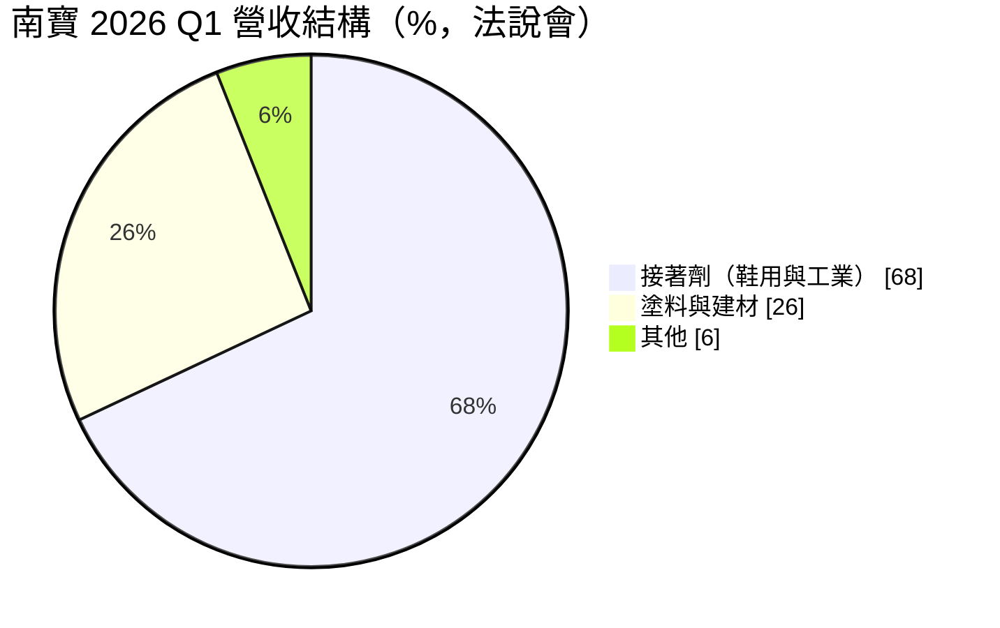

# 4766 南寶

> 上市｜[[產業索引-化學工業|化學工業]]｜上市（櫃）日期 2018/11/28

# 第一章：企業模式與商業藍圖

> [!info] 撰寫說明
> 精簡版，由 Claude 依公開資料整理，架構比照 [[2330台積電]]，資料截至 2026-10-08。來源：HiStock 嗨投資季度損益表、報酬率與每股盈餘頁，富果研究 2026 年 5 月南寶法說會整理（英文摘要，金額已換算為億元），優分析、工商時報新聞標題。地區營收比重與客戶名稱本次未查到。#待校對

南寶是全球主要的運動鞋接著劑供應商，靠著跟著品牌與鞋廠在亞洲各地設廠的服務網路，成為台灣少數毛利率超過三成、ROE 長期接近兩成的化工公司。

- **核心業務：** 南寶的主力是[[鞋用接著劑]]，也就是運動鞋鞋底與鞋面黏合用的膠水與處理劑，另有工業用接著劑、塗料與建材。鞋用膠雖然只占一雙鞋很小的成本，卻直接影響脫膠、耐久與生產良率，品牌商會指定通過認證的膠材，這讓南寶能維持穩定的價格與市占。
- **營收結構：** 依富果研究整理的 2026 年第一季法說會資料，接著劑約占營收 68%，塗料與建材約 26%，其餘約 6% 未細分；建材主要銷往澳洲。

- **營運據點：** 南寶在亞洲、澳洲、美洲與歐洲都有營運，跟著製鞋產業從中國移往東南亞與南亞。2026 年的資本支出包括中國合肥新廠，以及預算約 1,300 萬至 1,500 萬美元的印度新廠（主要服務 Nike 供應鏈，預計 2027 年第一季出貨）。
- **長期方向：** 南寶持股約 15% 參與四方合資的新寶紘科技，供應先進封裝用的研磨膠帶與切割膠帶材料，2026 年 3 月開始出貨；公司也研發低 VOC、生質與可回收材料，目標五年內綠色產品占銷售八成。接著劑配方能力延伸到[[半導體封裝材料]]，是南寶第二條長期成長曲線。

# 第二章：護城河深度與競爭優勢

南寶的護城河來自品牌指定、就近服務與配方經驗，這三者結合讓它在高度分散的化工市場中掌握定價權。

- **競爭優勢：** 運動鞋品牌對膠材有嚴格的認證流程，新供應商要通過多季的試產與耐久測試才能進入名單，南寶長期與品牌及鞋廠共同開發新黏合材料，形成高轉換成本。南寶在各製鞋聚落設廠與技術服務團隊，鞋廠移到哪裡就跟到哪裡，這種就近服務能力是小型對手難以複製的。
- **主要對手：** 國際接著劑大廠如 Henkel（漢高）、H.B. Fuller，以及日韓與中國的鞋用膠廠商；塗料方面則面對國際與在地塗料品牌的競爭。台灣同業有 [[1717長興]]、[[4770上品]] 等特用化學公司，但鞋用膠領域以南寶最具規模。
- **觀察重點：** 長期要看鞋用膠以外的工業膠、塗料與半導體材料能否提高比重，降低對運動鞋景氣的依賴；以及印度、合肥新廠能否像過去越南、印尼一樣順利擴大市占。公司表示有現金時可能提高配發率或發放額外股利，資本配置也值得追蹤。

# 第三章：財務體質與盈利規模

資料日期：2026-10-08，表格是撰寫當時的快照；最新月營收、毛利率、累計 EPS 由自動排程寫在本筆記的屬性欄位（月營收、毛利率、累計EPS 等）。#待校對

南寶在 2021 年原料高漲時毛利率一度只有 23%，之後透過漲價與產品組合調整，2023 年後毛利率穩定在三成以上，EPS 從 7.26 元提升到 20 元以上。

| 年度 | 營收（新台幣） | [[毛利率]] | [[營業利益率]] | EPS（元） | [[ROE]] |
|---|---|---|---|---|---|
| 2021 | 179.8 億 | 22.8% | 5.9% | 7.26 | 約 7.0% |
| 2022 | 220.0 億 | 24.0% | 8.3% | 14.44 | 約 11.5% |
| 2023 | 205.8 億 | 31.5% | 14.4% | 20.14 | 約 17.8% |
| 2024 | 229.8 億 | 32.7% | 15.6% | 22.26 | 約 19.0% |
| 2025 | 232.0 億 | 34.1% | 16.4% | 20.25 | 約 18.4% |
| 2026 上半年 | 124.2 億 | 33.7% | 16.7% | 13.82 | 約 11.8%（半年） |

註：營收、毛利率、營業利益率由 HiStock 季度損益表加總推算；ROE 為四季單季 ROE 相加的推算值。

- **營收規模與成長：** 2021 至 2025 年營收年複合成長率約 6.6%（推算），成長主要來自運動鞋產業的長期擴張與市占提升。2023 年營收下滑反映品牌去化庫存，之後隨鞋廠回補庫存恢復成長。
- **獲利：** 溶劑等油價連動原料約占原料成本兩成，鞋用膠價格約每半年調整一次，因此原料上漲時毛利率會短暫受壓，等到調價後再恢復。2023 年後營業利益率穩定在 14% 至 17%，代表南寶已能把成本壓力轉嫁給客戶。
- **財務特色：** 2021 至 2025 年平均 ROE 約 14.7%（推算），2023 至 2025 年則維持在 18% 至 19%。法說會資料顯示公司為淨現金部位，財務結構穩健；2022、2023 年第一季稅前利益明顯高於營業利益，推估有處分資產等一次性業外收益，評估本業應以營業利益為準。

**[[ROIC]] 與 [[WACC]]：** 公司為淨現金，以「稅後營業利益 ÷ 股東權益」估算 ROIC：2025 年營業利益約 38.2 億元，稅後約 30.5 億元，股東權益以淨利除以 ROE 推得約 144 億元，ROIC 約 21%（推算）；2023 至 2024 年約 16% 至 20%，2021 年約 6%（推算）。若扣除帳上淨現金，實際投入營運的資本更小，ROIC 會更高。WACC 以 CAPM 推估：無風險利率 1.75%、市場風險溢酬 6%、β 取消費相關化工股常見值 0.9，股權成本約 7.2%；因幾乎無淨負債，WACC 約 7%（推算）。近三年 ROIC 高出 WACC 十個百分點以上，代表南寶的品牌指定與服務網路持續創造明顯的超額價值，是台灣化工業中護城河較寬的公司。

# 第四章：總體風險與地緣政治

南寶的風險集中在運動鞋景氣、原料價格與製鞋產業的地理遷移。

- **產業週期：** 鞋用膠需求跟著全球運動鞋銷售與品牌庫存走，品牌去庫存時鞋廠減產，訂單會沿供應鏈放大下滑，形成[[長鞭效應]]，2023 年即是例子。
- **營運風險：** 客戶集中在少數國際運動品牌及其代工鞋廠，品牌更換膠材規格或代工廠移轉，都會影響出貨；新廠初期折舊與人力費用會壓低獲利。半導體材料成長則取決於合資公司新寶紘的擴產進度。
- **其他風險：** 溶劑等原料與油價連動，中東等地緣政治事件推升油價時會壓縮毛利；美國關稅、匯率，以及各國對 VOC 排放的環保法規也需注意，後者同時是推動綠色產品的機會。

# 專有名詞解析

## 半導體

- **[[半導體封裝材料]]**：晶圓研磨、切割與封裝過程使用的膠帶、膠材與保護材料。

## 金融

- **[[長鞭效應]]**：終端需求的小幅變動，沿供應鏈往上游傳遞時被逐級放大，造成上游庫存與訂單劇烈波動。

## 產業

- **[[鞋用接著劑]]**：運動鞋生產中黏合鞋底、中底與鞋面的膠水與處理劑，需通過品牌商認證。

# 核心供應鏈

```mermaid
flowchart LR
    subgraph 上游
        A1["石化原料<br/>溶劑、樹脂、橡膠"]
    end
    subgraph 本公司
        B["南寶 4766<br/>鞋用與工業接著劑・塗料建材"]
        B2["轉投資：新寶紘<br/>封裝膠帶材料"]
    end
    subgraph 下游
        C1["運動鞋代工廠"]
        C2["運動品牌（如 Nike）"]
        C3["工業、建材與電子客戶"]
        C4["先進封裝廠"]
    end
    A1 --> B
    B --> C1
    C1 --> C2
    B --> C3
    B -.-> B2
    B2 --> C4
```

- 上游：溶劑、樹脂、橡膠等石化原料（具體供應商未查到）
- 下游／客戶：運動鞋代工廠與國際運動品牌（印度新廠主要服務 Nike 供應鏈），推估包括 [[9910豐泰]]、[[9904寶成]] 等鞋廠；工業、建材與電子客戶；新寶紘供應先進封裝廠
- 同業：Henkel、H.B. Fuller，台灣 [[1717長興]]

## 最新新聞
<!-- news:start -->
<!-- news:end -->

## 相關連結
- [公開資訊觀測站](https://mopsov.twse.com.tw/mops/web/t05st03?step=1&firstin=1&co_id=4766)
- [Goodinfo](https://goodinfo.tw/tw/StockDetail.asp?STOCK_ID=4766)
- [Yahoo 股市](https://tw.stock.yahoo.com/quote/4766)
- [鉅亨網新聞](https://www.cnyes.com/twstock/4766/news)
