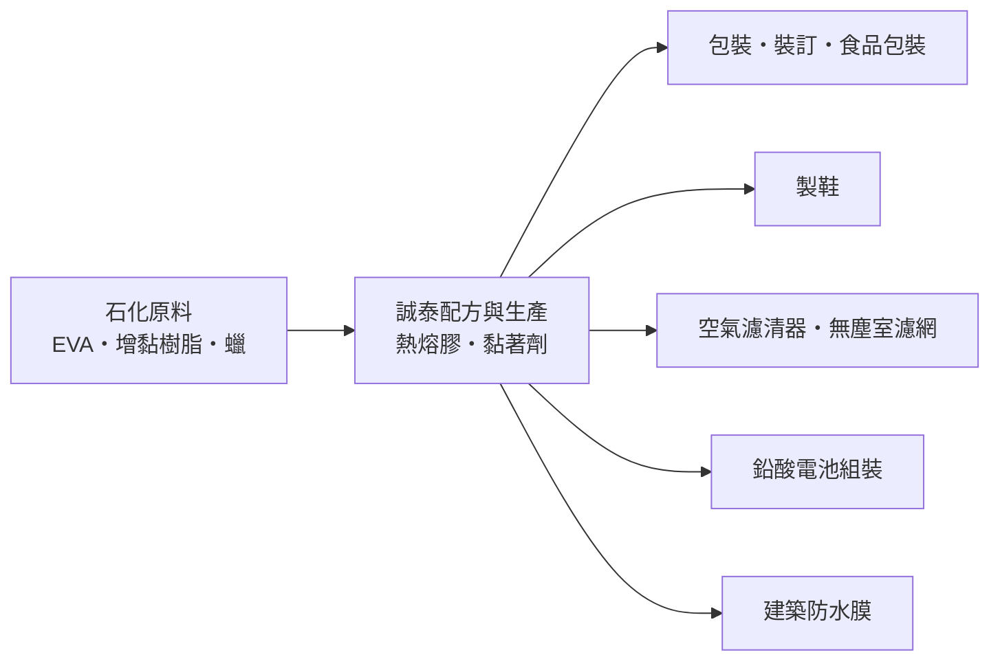
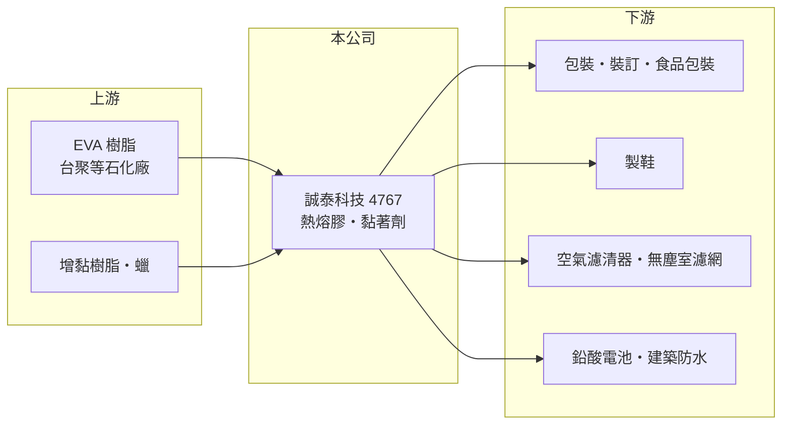

# 4767 誠泰科技

> 上櫃｜[[產業索引-化學工業|化學工業]]｜上市（櫃）日期 2018/10/29

# 第一章：企業模式與商業藍圖

> [!info] 撰寫說明
> 本文由 Claude 依公開資料整理，架構比照 [[2330台積電]] 的四章研究，資料截至 2026-10-08。財務數字來源：Goodinfo 年度經營績效頁、nstock 公司資料頁（沿革與股利）、工商時報 2023 年 6 月報導；產業描述為整理性內容，尚未逐條比對原始文件。公開資料有限，產品別營收比重、廠區與客戶名稱未查得。#待校對

在評估單一個股的長期投資價值時，首要步驟是拆解企業的底層獲利邏輯。本章說明誠泰科技（股票代號：4767，以下簡稱誠泰）這家小型黏著劑廠的商業模式，以及它如何用環保型與功能型產品爭取利基市場。

## 一、核心定位：以熱熔膠為主的黏著劑廠

誠泰成立於 1983 年，原名誠泰樹脂，2000 年更名為誠泰工業科技，主要業務是黏著劑的生產與銷售，核心產品是[[熱熔膠]]。熱熔膠平常是固體，加熱融化後塗布，冷卻幾秒就固化黏合，因為不含溶劑、黏合速度快，被廣泛用在紙箱與食品包裝封口、書籍裝訂、製鞋、濾材與電子組裝等自動化產線。

熱熔膠是典型的「小用量、高必要性」材料。它在客戶產品成本中占比很低，但黏不牢就會造成整批產品退貨，因此客戶重視穩定性與技術服務。這讓中小型的專業膠廠能在大廠之間找到生存空間，但也意味著市場規模有限，誠泰過去十年營收大致在 10 億至 14 億元之間。

## 二、產品板塊與應用市場

公司未揭露產品別營收比重，因此本文不畫比重圖。依工商時報 2023 年報導，誠泰的產品與應用可以分成三類。第一是傳統包裝與裝訂用熱熔膠，客戶開始要求導入生質熱熔膠，也就是部分原料來自植物等可再生來源的膠，誠泰的生質熱熔膠已取得台灣環保標章與德國 DIN-Geprüft 生質認證。第二是功能型工業用膠，包括鉛酸蓄電池組裝專用膠、空氣濾清器用膠，以及具無鹵阻燃（UL94-V0）規格的產品，應用於精密電子無塵室的高效率濾網。第三是新產品自黏式熱熔膠防水膜，已取得台灣與日本發明專利，目標是取代目前主流的瀝青基防水膜。

這樣的產品組合反映誠泰的策略：在通用型包裝膠之外，往有認證、有專利、規格較高的工業應用移動，以提高產品的不可替代性。

## 三、資本轉化邏輯：原料配方加上應用服務

熱熔膠的主要原料是 [[EVA]]、增黏樹脂與蠟，誠泰的價值在於把這些原料依客戶的設備溫度、黏合材質與速度需求調配成合適的配方。原料占成本比重高，因此毛利率會隨 EVA 等石化原料價格波動；2022 年營收創新高，獲利卻年減 23%，主因就是 EVA 漲價。這說明誠泰的定價能力有限，原料上漲時通常要落後一段時間才能轉嫁。

## 四、企業長期藍圖：綠色與功能型產品

誠泰的長期方向是搭上綠色經濟趨勢，用生質熱熔膠取代石化型熱熔膠、用熱熔膠防水膜取代瀝青防水膜，並擴大在空氣濾材市場的布局，包括中國的空濾市場。這些產品的共同點是需要認證或專利，一旦成功推廣，可以讓公司從價格競爭轉向規格競爭。不過公開資料未揭露這些新產品的營收貢獻，推廣進度仍需觀察。

# 第二章：護城河深度與競爭優勢

「護城河」指企業抵禦競爭、維持超額利潤的保護機制。本章分析誠泰作為小型黏著劑廠的競爭位置。

## 一、誠泰護城河的核心組成要素

誠泰的護城河屬於「窄護城河」，主要由三個要素組成。第一是配方與客戶服務。熱熔膠要配合客戶的機台與材料調整，長期合作的客戶不會輕易為了小幅價差更換供應商，因為換膠可能讓整條產線重新調機。

第二是認證與專利。生質認證、環保標章、無鹵阻燃規格與防水膜發明專利，都是客戶選擇供應商時的門檻，也讓誠泰在特定應用中避開純粹的價格競爭。

第三是長期的毛利率穩定度。過去十年誠泰的毛利率大多在 20% 至 27% 之間，即使營收起伏，毛利率也沒有大幅崩落，顯示它的產品仍有一定的配方溢價。

## 二、全球主要競爭對手格局

| 對手 | 定位 | 對誠泰的威脅 |
|---|---|---|
| 漢高（Henkel）、H.B. Fuller 等國際黏著劑大廠 | 全球規模、產品線完整 | 掌握大型品牌客戶與高階規格 |
| 中國與東南亞熱熔膠廠 | 成本低、產能大 | 在通用包裝膠以價格競爭 |
| 台灣同業黏著劑廠 | 在地服務 | 搶同一批台灣中小型客戶 |

## 三、優勢轉化：守得住／守不住／觀察重點

守得住的是需要認證與技術服務的工業用膠，例如濾材、電池組裝與生質包裝膠，這些市場規模不大，國際大廠未必專注經營。

守不住的是通用型包裝膠的價格，以及原料上漲時的利潤。2025 年營收降到 9.86 億元、營業利益率降到 4.32%，顯示需求轉弱與競爭同時壓縮獲利。

長期觀察重點是新產品（生質膠、防水膜、阻燃濾材膠）能否成為新的營收支柱，讓營收突破過去十年 10 億至 14 億元的區間。

# 第三章：財務體質與盈利規模

資料日期：2026-10-08。數字取自 Goodinfo 年度經營績效與 nstock 股利資料，表格是撰寫當時的快照；最新月營收、毛利率、累計 EPS 由自動排程寫在本筆記的屬性欄位（月營收、毛利率、累計EPS 等）。#待校對

財務報表是檢驗護城河是否真實存在的最終標準。本章用五年的三率、ROE 與資本報酬，檢視誠泰的獲利品質。

## 一、獲利能力的基石：三率

| 年度 | 營收（新台幣） | [[毛利率]] | [[營業利益率]] | EPS（元） | [[ROE]] |
|---|---|---|---|---|---|
| 2021 | 12.6 億 | 24.2% | 8.45% | 2.84 | 10.9% |
| 2022 | 14.1 億 | 20.0% | 5.58% | 2.16 | 7.89% |
| 2023 | 12.4 億 | 23.4% | 7.86% | 2.58 | 9.09% |
| 2024 | 11.9 億 | 24.3% | 7.95% | 2.82 | 9.53% |
| 2025 | 9.86 億 | 22.5% | 4.32% | 1.24 | 4.12% |

2022 年是原料成本壓縮利潤的典型例子：營收最高，毛利率卻降到 20%，EPS 反而下滑。2023 至 2024 年原料回落，毛利率回到 23% 至 24%，獲利恢復。2025 年營收下滑約 17%，營業費用相對固定，營業利益率掉到 4.32%，說明小公司在營收縮小時的營運槓桿是反向放大的。2021 至 2025 年營收年複合成長率約 -5.9%（推算）；拉長到十年，2016 年營收 11.8 億元，與 2025 年相差不大，公司規模大致停滯。

## 二、[[ROE]]：資本效率

近五年平均 ROE 約 8.3%（推算），多數年度在 8% 至 11%，2025 年降到 4.12%。每股淨值從 2016 年的 25.13 元緩步升到 2025 年的 29.79 元。依 ROE 與 ROA 的比例推算，總負債約為股東權益的四成多（推算），財務結構保守。

## 三、股利

依 nstock，近五年平均現金股利約 1.44 元，2024 年度配發 1.8 元、配發率約 64%，2025 年度配發 1.1 元。誠泰股本只有約 3.14 億元，資本支出需求不大，長期以現金股利回饋股東，股利金額隨獲利調整。

## 四、[[ROIC]] 與 [[WACC]]：價值創造利差

**ROIC 推算：** 2025 年營業利益約 0.43 億元（9.86 億 × 4.32%），稅後約 0.34 億元。股東權益約 9.4 億元（每股淨值 29.79 元 × 約 0.314 億股），依 ROE 4.12% 與 ROA 2.85% 推算總負債約 4.2 億元，假設其中一半為有息負債約 2.1 億元（推估），投入資本約 11.5 億元，ROIC 約 3.0%（推算）。2024 年稅後營業利益約 0.76 億元，ROIC 約 6.6%（推算）。

**WACC 推算：** 假設台灣 10 年期公債殖利率 1.75%、市場風險溢酬 6%、β 取小型化學品同業常見值 0.7，股東權益成本約 6.0%。負債成本假設 2.5%，稅後 2.0%，權益占資本約 82%（推估），WACC 約 5.2%（推算）。

**結論：** 誠泰在正常年度的 ROIC 約 6% 至 8%（推算），只略高於約 5% 的資金成本，2025 年則低於資金成本。這代表公司是穩健、但創造超額價值能力有限的小型化學品廠；要明顯提高利差，必須靠高規格新產品提升毛利，或讓營收規模擴大以攤薄固定費用。

# 第四章：總體風險與地緣政治

任何企業都無法脫離宏觀環境獨立存在。本章分析誠泰長期必須面對的原料、產業週期與營運風險。

## 一、原物料價格

熱熔膠的主要原料 EVA、增黏樹脂與蠟都來自石化產業，價格隨油價與 EVA 供需波動。EVA 同時是太陽能封裝膜的原料，光伏需求暴增時會排擠熱熔膠級 EVA 的供給，2022 年誠泰就因 EVA 漲價而獲利年減 23%。原料成本是誠泰最直接、最難控制的風險。

## 二、產業週期與市場結構

包裝、製鞋與裝訂需求跟著消費景氣走，景氣轉弱時客戶會降低庫存，訂單隨之減少。製鞋產業持續外移到越南、印尼等地，台灣在地的製鞋用膠需求長期萎縮，誠泰必須跟著客戶外移或轉向其他應用。

## 三、營運環境的隱性風險

公司規模小，營收下滑時固定費用難以縮減，2025 年的獲利下滑就是例子。小公司在研發資源與品牌上也較難與國際大廠競爭，新產品推廣若不如預期，長期營收可能停滯。

## 四、法規演進

環保法規趨嚴對誠泰是雙面刃：一方面生質熱熔膠與取代瀝青的防水膜受惠於減碳與環保趨勢；另一方面，化學品管理與工廠排放規範提高，也會增加營運成本。

# 專有名詞解析

## 應用

- **[[無鹵阻燃]]**：不使用含鹵素阻燃劑、燃燒時較少產生有毒氣體的耐燃材料規格，UL94-V0 為常見等級。

## 金融

- **[[ROIC]]**：投入資本報酬率，稅後營業利益除以股東權益加有息負債，衡量本業運用資本的效率。
- **[[WACC]]**：加權平均資金成本，股東與債權人要求報酬的加權平均，ROIC 高於它才代表創造價值。

## 產業

- **[[熱熔膠]]**：加熱融化後塗布、冷卻即固化的無溶劑黏著劑，用於包裝、衛生用品、製鞋與電子組裝。
- **[[EVA]]**：乙烯醋酸乙烯酯共聚物，用於太陽能模組封裝膜、鞋材與發泡材料。
- **[[生質熱熔膠]]**：部分原料來自植物等可再生來源的熱熔膠，可降低產品的碳足跡。

# 核心供應鏈

## 1. 上游：石化原料
- EVA：台灣主要生產者如 [[1304台聚]]（產業參考，誠泰實際採購對象未查得）
- 增黏樹脂、蠟等石化原料

## 2. 中游：誠泰與同業
- 國際大廠：漢高（Henkel）、H.B. Fuller
- 中國與東南亞熱熔膠廠

## 3. 下游：應用產業
- 包裝、書籍裝訂與食品包裝業者
- 製鞋業、空氣濾材業、鉛酸電池組裝、建築防水

## 最新新聞
<!-- news:start -->
<!-- news:end -->

## 相關連結
- [公開資訊觀測站](https://mopsov.twse.com.tw/mops/web/t05st03?step=1&firstin=1&co_id=4767)
- [Goodinfo](https://goodinfo.tw/tw/StockDetail.asp?STOCK_ID=4767)
- [Yahoo 股市](https://tw.stock.yahoo.com/quote/4767)
- [鉅亨網新聞](https://www.cnyes.com/twstock/4767/news)
