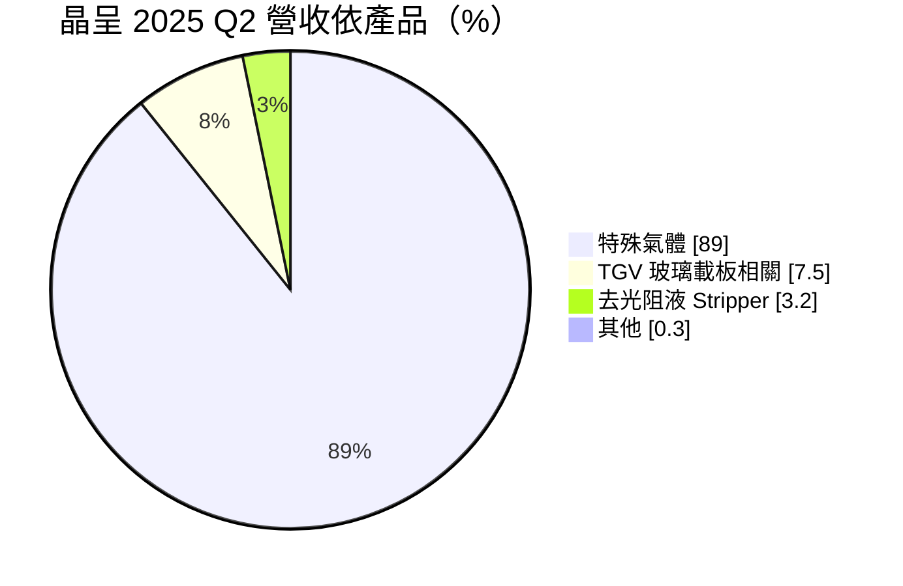
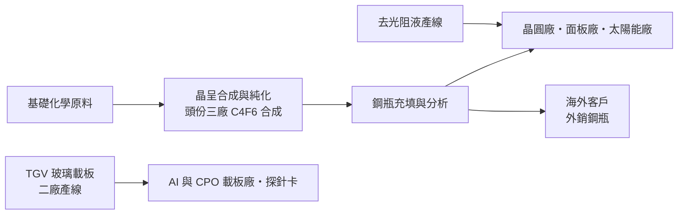
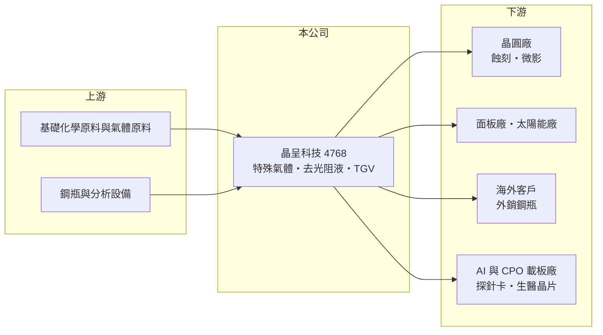

# 4768 晶呈科技

> 上櫃｜[[產業索引-化學工業|化學工業]]｜上市（櫃）日期 2022/04/13

# 第一章：企業模式與商業藍圖

> [!info] 撰寫說明
> 本文由 Claude 依公開資料整理，架構比照 [[2330台積電]] 的四章研究，資料截至 2026-10-08。財務數字來源：Goodinfo 年度經營績效頁、優分析 2025 年 9 月文章、旺得富 2026 年 3 月財報報導、財訊與經濟日報報導標題；產業描述為整理性內容，尚未逐條比對原始文件。#待校對

在評估單一個股的長期投資價值時，首要步驟是拆解企業的底層獲利邏輯。本章說明晶呈科技（股票代號：4768，以下簡稱晶呈）如何以半導體特殊氣體起家，再延伸到去光阻液與玻璃通孔載板這兩條新產品線。

## 一、核心定位：台灣本土的半導體特殊氣體廠

晶呈成立於 2010 年，主要產品是[[特殊氣體]]，也就是晶圓、面板與太陽能製程中用於蝕刻、沉積與微影的高純度氣體。依優分析整理，特殊氣體在 2025 年第二季占營收約 89%，其中[[雷射氣體]]是主要銷售項目，客戶來自半導體、太陽能與面板產業，以半導體為最大宗。2024 年外銷占營收約三分之一，產品以鋼瓶形式出貨到海外客戶。

特殊氣體是全球由林德、液化空氣、默克等跨國大廠主導的市場。晶呈的切入點是「在地化供應」：台灣是全球晶圓製造重鎮，晶圓廠為了降低斷料風險，有誘因培養本土氣體供應商。晶呈過去幾年的毛利率長期在 38% 至 45%，代表這門生意在技術與認證門檻保護下，有相當好的利潤空間。

## 二、產品板塊：氣體為主、兩條新事業為輔

依優分析整理的 2025 年第二季營收結構如下：

第一條是特殊氣體，包含雷射氣體與 C4F6、F2/N2 混合氣等蝕刻用氣體，是公司的現金來源。第二條是濕式化學品，主要是半導體製程用的[[去光阻液]]（Stripper），已建置年產能 288 噸的產線，打入台灣兩家與新加坡一家客戶，規劃擴充到四條線，公司估計滿載後年營收可達 3 億至 4 億元。第三條是 [[TGV]] 玻璃通孔載板，也就是在[[玻璃基板]]上打出微小穿孔並填入導體，應用於[[先進封裝]]、共同封裝光學（[[CPO]]）、低軌衛星、探針卡與生醫晶片。

## 三、資本轉化邏輯：從純化充填到上游合成

特殊氣體的獲利來自三個環節：合成、純化與分析。純度越高、雜質越少，價格越好；能自己合成原料的廠商，又比只做純化充填的廠商更有成本優勢。晶呈的長期投資方向，就是往上游合成延伸：依旺得富 2026 年 3 月報導，頭份三廠的 C4F6 一級製造合成廠規劃產能 250 噸，預計 2026 年第二季投產。這類蝕刻氣體用於 3D NAND 與先進邏輯製程的高深寬比蝕刻，用量隨製程層數增加而成長。

## 四、企業長期藍圖：氣體穩基本盤，TGV 搶下一代封裝

晶呈的長期藍圖由兩個方向組成。氣體方面，從充填走向合成，提高自製比例與毛利。新事業方面，TGV 是最具想像空間、但也最不確定的布局：目前二廠一條產線月產能約 5,000 片，已與 14 家客戶合作並有小量出貨，公司規劃 2026 至 2029 年逐步擴充到 120 條產線。玻璃載板被視為下一代大尺寸 AI 晶片封裝的候選材料，若產業採用時程如預期，TGV 可能讓晶呈從氣體廠轉型為先進封裝材料廠；若採用延後，大規模擴產將成為財務負擔。

# 第二章：護城河深度與競爭優勢

「護城河」指企業抵禦競爭、維持超額利潤的保護機制。本章分析晶呈在特殊氣體與新事業的競爭位置。

## 一、晶呈護城河的核心組成要素

第一是客戶認證。半導體用氣體一旦導入產線，任何雜質變化都可能影響良率，晶圓廠更換氣體供應商需要長時間驗證，因此既有供應商的地位相對穩固。

第二是本土供應與地緣分散。國際氣體大廠的產能多在日本、韓國、美國與歐洲，台灣晶圓廠為了供應鏈安全，願意培養本土第二供應來源。晶呈作為台灣少數能自行純化與合成特殊氣體的公司，受惠於這個趨勢。

第三是上游合成能力。C4F6 合成廠投產後，晶呈可減少對外購原料的依賴，成本與供應穩定度都會提高，這是從「貿易充填商」走向「材料製造商」的關鍵一步。

## 二、全球主要競爭對手格局

| 對手 | 定位 | 對晶呈的威脅 |
|---|---|---|
| 林德、液化空氣 | 全球工業與電子氣體龍頭 | 產品線完整，與晶圓廠有長期整合供氣合約 |
| 默克（Versum）、Entegris | 電子特用化學品與氣體 | 在高純度氣體與濕式化學品具技術優勢 |
| 日韓特殊氣體廠（如關東電化、SK 材料等） | 蝕刻氣體專業廠 | 在 C4F6 等蝕刻氣體市占高 |
| [[4772台特化]] | 台灣半導體特殊氣體廠 | 同為本土供應鏈，搶相同的在地化機會 |

## 三、優勢轉化：守得住／守不住／觀察重點

守得住的是已通過認證的半導體氣體訂單，毛利率在 2021 至 2024 年維持在 38% 以上，證明利基氣體的定價能力。

守不住的是外銷與太陽能等需求波動大的市場。2025 年上半年外銷出貨低迷，加上新事業費用與折舊增加，全年毛利率從 40.6% 降到 24.6%、EPS 只剩 0.39 元，顯示公司規模仍小，任一市場轉弱都會明顯衝擊獲利。

長期觀察重點有三個：C4F6 合成廠能否順利量產並提升毛利、去光阻液能否達到滿載，以及 TGV 的客戶小量訂單能否轉為規模化量產。

# 第三章：財務體質與盈利規模

資料日期：2026-10-08。數字取自 Goodinfo 年度經營績效、優分析與旺得富報導，表格是撰寫當時的快照；最新月營收、毛利率、累計 EPS 由自動排程寫在本筆記的屬性欄位（月營收、毛利率、累計EPS 等）。#待校對

財務報表是檢驗護城河是否真實存在的最終標準。本章用五年的三率、ROE 與資本報酬，檢視晶呈的成長與獲利品質。

## 一、獲利能力的基石：三率

| 年度 | 營收（新台幣） | [[毛利率]] | [[營業利益率]] | EPS（元） | [[ROE]] |
|---|---|---|---|---|---|
| 2021 | 7.00 億 | 38.2% | 19.5% | 2.15 | 16.4% |
| 2022 | 10.9 億 | 45.1% | 29.3% | 6.00 | 25.1% |
| 2023 | 8.15 億 | 43.9% | 19.9% | 2.76 | 7.37% |
| 2024 | 10.2 億 | 40.6% | 17.9% | 2.90 | 8.28% |
| 2025 | 12.3 億 | 24.6% | 3.15% | 0.39 | 0.74% |

晶呈的營收在五年內成長，2021 至 2025 年年複合成長率約 15.1%（推算）；十年看，營收從 2016 年的 4.58 億元成長到 2025 年的 12.3 億元，規模放大近三倍。但獲利並未同步成長：2022 年是高峰，營業利益率 29.3%，之後逐年下滑，2025 年只剩 3.15%。原因是新事業（去光阻液、TGV）處於投資期，費用與折舊先行，營收貢獻還沒跟上，加上 2025 年上半年外銷低迷。

## 二、[[ROE]]：資本效率與股本膨脹

近五年平均 ROE 約 11.6%（推算），但趨勢明顯向下。股本從 2021 年的 3.19 億元增加到 2025 年的 4.75 億元，增幅約 49%，推估來自現金增資與股票股利（2025 年度也配發 0.15 元股票股利）。2023 年每股淨值由 31.23 元升到 38.93 元，推估與溢價增資有關。股本膨脹代表每股獲利被稀釋，新投資必須帶來足夠報酬，才不會讓原股東吃虧。

## 三、股利與資本支出

2025 年度配發現金股利 0.85 元與股票股利 0.15 元，現金股利高於當年 EPS，代表動用了過去的保留盈餘。合成廠、去光阻液與 TGV 擴產都需要大量資本支出（金額未查得），在新事業放量前，自由現金流可能偏弱或為負（推估）。

## 四、[[ROIC]] 與 [[WACC]]：價值創造利差

**ROIC 推算：** 2025 年營業利益約 0.39 億元，稅後約 0.31 億元。股東權益約 15.0 億元（每股淨值 31.65 元 × 約 0.475 億股），依 ROE 0.74% 與 ROA 0.4% 推算總負債約 12.8 億元，假設其中一半為有息負債約 6.4 億元（推估），投入資本約 21.4 億元，ROIC 約 1.4%（推算）。以同樣方法回推 2022 年，稅後營業利益約 2.56 億元，ROIC 約 17%（推算）。

**WACC 推算：** 假設台灣 10 年期公債殖利率 1.75%、市場風險溢酬 6%、β 取半導體材料同業常見值 1.1，股東權益成本約 8.4%。負債成本假設 2.5%，稅後 2.0%，權益占資本約 70%（推估），WACC 約 6.5%（推算）。

**結論：** 晶呈在 2022 年 ROIC 明顯高於 WACC，證明特殊氣體本業能創造價值；2025 年 ROIC 遠低於資金成本，原因是大量資本投入新事業但尚未產生報酬。晶呈正處於「先投資、後回收」的階段，長期能否創造價值，取決於合成廠與 TGV 產線的利用率能否在幾年內拉高。

# 第四章：總體風險與地緣政治

任何企業都無法脫離宏觀環境獨立存在。本章分析晶呈長期必須面對的產業週期、營運、技術與法規風險。

## 一、產業週期與市場結構

特殊氣體的需求跟著晶圓廠、面板廠與太陽能廠的稼動率走。半導體庫存調整或太陽能產業供過於求時，氣體用量會減少，外銷客戶也會延後拉貨，2025 年上半年就是例子。國際氣體大廠規模遠大於晶呈，在價格競爭時有更大的承受力。

## 二、擴產與執行風險

晶呈同時推動 C4F6 合成廠、去光阻液擴線與 TGV 120 條產線計畫，資本支出與人力需求都很大。若任一新事業的客戶驗證延後，折舊與費用會持續壓低獲利，並可能需要再次增資，造成股本進一步膨脹。

## 三、科技演進

玻璃載板仍處於產業早期，主要晶片與封裝大廠的採用時程尚未確定，技術規格也可能改變。若產業最終選擇其他載板方案，或由大型載板廠自行建置 TGV 製程，晶呈的投資可能難以回收。

## 四、法規與工安

特殊氣體多具毒性、腐蝕性或易燃性，生產與運輸受嚴格法規管理，工安事故會造成停產與商譽損失。含氟氣體也面臨溫室氣體管制趨嚴的長期壓力。新台幣匯率則會影響外銷鋼瓶的獲利。

# 專有名詞解析

## 半導體

- **[[特殊氣體]]**：晶圓製程中用於蝕刻、沉積與摻雜的高純度氣體，純度要求極高，供應商少。
- **[[雷射氣體]]**：微影設備的準分子雷射光源所需的稀有氣體與鹵素混合氣，純度與配比直接影響曝光品質。
- **[[去光阻液]]**：在黃光製程後把晶圓表面殘留光阻溶解去除的濕式化學品。
- **[[TGV]]**：玻璃通孔，在玻璃基板上打出微小穿孔並填入導電材料，做為晶片上下層的垂直連接。
- **[[玻璃基板]]**：以玻璃取代有機樹脂作為載板核心材料，平整度與耐熱性較好，被視為下一代大尺寸 AI 晶片載板的候選技術。
- **[[先進封裝]]**：把多顆晶片以中介層、混合鍵合等方式高密度整合的封裝技術，例如 CoWoS、SoIC。
- **[[CPO]]**：共同封裝光學，把光收發元件與交換器或運算晶片封裝在一起，縮短電訊號路徑、降低功耗。

## 金融

- **[[ROIC]]**：投入資本報酬率，稅後營業利益除以股東權益加有息負債，衡量本業運用資本的效率。
- **[[WACC]]**：加權平均資金成本，股東與債權人要求報酬的加權平均，ROIC 高於它才代表創造價值。

# 核心供應鏈

## 1. 上游：原料
- 基礎化學原料與氣體原料供應商（未查得具體名稱）

## 2. 中游：晶呈與同業
- 國際氣體大廠：林德、液化空氣、默克、Entegris
- 台灣同業：[[4772台特化]]

## 3. 下游：半導體與光電
- 晶圓廠、面板廠與太陽能廠（公司未公開客戶名稱）
- 去光阻液：台灣兩家與新加坡一家客戶

## 4. 下游：先進封裝
- 台灣與日本的 AI／CPO 載板廠（小量訂單，未具名）

## 供應鏈關係
- 供應給 [[2330台積電]]：特殊氣體製造與純化（台積電供應鏈 › 上游：關鍵耗材、特用化學品與氣體）

## 最新新聞
<!-- news:start（自動產生，請勿手動編輯此範圍） -->
- 2026-10-08 📰 媒體 14:40｜晶呈科技營收／9月1.42億元、年增23.8% 內銷出貨增加｜[經濟日報](https://news.google.com/rss/articles/CBMieEFVX3lxTE5fQWhrSXN4OXdsY1NRZXZRRjJ2WHh2TmNDUXQ4YjVWZUtlWG85cjVSYVpCb2xDellETUpEMk82M010ZXFGMHV1S2I5aXkzVXVqU3BtXzRrWHlXcERtaWtSNVk4dm90RVdQWTBWYWJQM0dJdVhGODBJZNIBYEFVX3lxTFBDSXc5cmxjOXVDeDRmUFVFWmtPMDVrOWZLdTNMa1lBc2VmX3ZmVTZzZl9kVzRlcHFzeE5PZ3F4YVcyZFpGMDJCX182ZnY3TVlNTUcxWEV4bkw4eFotNmY3bg?oc=5)
- 2026-10-08 📰 媒體 14:04｜《業績-化工》晶呈科技9月營收為1.42億元，年增23.88%｜[富聯網](https://news.google.com/rss/articles/CBMiiAFBVV95cUxQWHExUjRYb2NkLWpIQjAtYlA3T0o3X1ZhZlJWUlVxQUdvR2pXZnI1Q0hqSk01OTBWcjI0OVREdU1qZHQ3VlhUZ1Fkb1hWajBBeU9HdV9Ld1BEVzRMQUpvN29Qc0JtWWJRMjF3bkpLd2wyQjF6b21kZmYtc25IZ3FrMFZ3NC1QNkVT?oc=5)
- 2026-10-07 🏛️ 重訊 14:41｜代子公司亞欣達特殊材料股份有限公司公告向關係人租賃取得土地使用權資產｜[觀測站](https://mops.twse.com.tw/mops/#/web/t05st01)
- 2026-10-07 📰 媒體 09:36｜晶呈科技(4768) 個股概覽 ／ 個股 - 股市｜[CMoney](https://news.google.com/rss/articles/CBMiU0FVX3lxTE8zR1pySi0zU3lwMTJCY1J2ZHJPd0QxWXY1eVRPaDlXbXkzRUhaTnBTN3VsdzBPY0Nldk1fRzQzVWg2d3Vtd3BSQ05YNFFaSEdkWFJr?oc=5)

完整紀錄：[[4768晶呈科技 新聞]]
<!-- news:end -->

## 相關連結
- [公開資訊觀測站](https://mopsov.twse.com.tw/mops/web/t05st03?step=1&firstin=1&co_id=4768)
- [Goodinfo](https://goodinfo.tw/tw/StockDetail.asp?STOCK_ID=4768)
- [Yahoo 股市](https://tw.stock.yahoo.com/quote/4768)
- [鉅亨網新聞](https://www.cnyes.com/twstock/4768/news)
