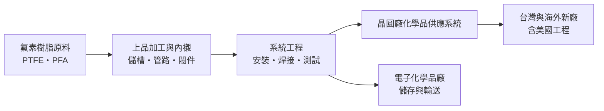
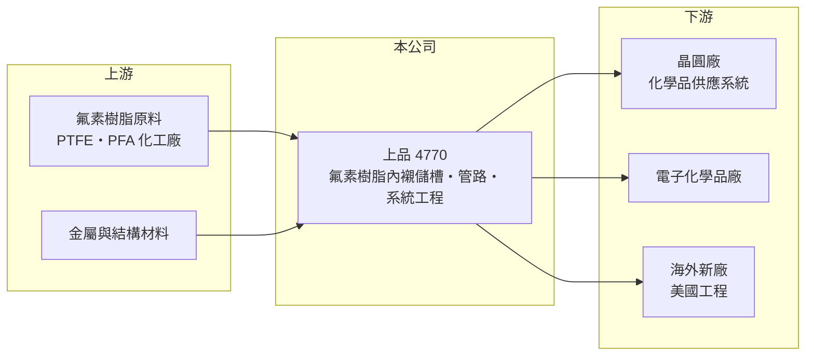

# 4770 上品

> 上市｜[[產業索引-化學工業|化學工業]]｜上市（櫃）日期 2021/12/22

# 第一章：企業模式與商業藍圖

> [!info] 撰寫說明
> 本文由 Claude 依公開資料整理，架構比照 [[2330台積電]] 的四章研究，資料截至 2026-10-08。財務數字來源：Goodinfo 年度經營績效頁、nstock 公司資料頁（業務範圍與股利）、旺得富 2026 年 3 月財報報導、工商時報與 CMoney 報導標題；產業描述為整理性內容，尚未逐條比對原始文件。公開資料有限，產品別營收比重未查得。#待校對

在評估單一個股的長期投資價值時，首要步驟是拆解企業的底層獲利邏輯。本章說明上品綜合工業（股票代號：4770，以下簡稱上品）如何把氟素樹脂加工技術，變成晶圓廠化學品供應系統中不可或缺的設備供應商。

## 一、核心定位：晶圓廠化學品系統的氟素樹脂設備商

上品成立於 1981 年，起家於金屬與非金屬的表面被覆處理，後來專精於[[氟素樹脂]]（如 PTFE、[[PFA]]）的應用。它的主要產品是氟素樹脂內襯設備，包括化學品儲存槽、運送管道與輸送設備，並承攬整套系統工程。客戶以晶圓廠與電子化學品廠為主。

為什麼晶圓廠需要這些設備？晶圓製程大量使用高純度的酸、鹼與溶劑，這些化學品具腐蝕性，而且只要從容器或管路溶出極微量的金屬離子，就可能讓整批晶圓報廢。氟素樹脂幾乎不與任何化學品反應、也不容易析出雜質，因此成為晶圓廠化學品儲存與輸送的標準材料。上品的價值在於把氟素樹脂加工成大型槽體與管路，並確保焊接、成型品質達到半導體等級的潔淨度。

## 二、產品與營收特性

公司未揭露產品別營收比重，因此本文不畫比重圖。上品的營收可以理解為兩類：一是設備與零組件（儲槽、管路、閥件、氟素樹脂圓棒與平板等），二是整合安裝的系統工程。工程型收入以專案認列，營收會跟著客戶建廠進度起伏。依 2026 年 3 月報導，2025 年獲利下滑的原因之一，就是認列了較多毛利較低的美國工程收入。

由於客戶集中在晶圓廠，上品的營收與台灣晶圓廠的資本支出高度連動。市場普遍認為主要客戶是 [[2330台積電]] 及其化學品供應商（推估，公司未具名），台積電在台灣、美國、日本建廠的節奏，就是上品營收的節奏。

## 三、資本轉化邏輯：建廠潮帶動的專案型生意

上品的獲利模式是「跟著客戶建廠」。新晶圓廠動工時，化學品供應系統是廠務工程的一部分，上品在這個階段接單、生產並安裝；工廠完工後，還有擴線、改線與耗材更換的後續需求。依 2026 年 3 月報導，公司在手訂單約 38 億元，約八成將在 2026 年認列，並看好 2026 至 2028 年半導體重要客戶的需求。

這種專案型生意的優點是建廠高峰期營收與獲利會大幅跳升，2022 年營收 61.4 億元、營業利益率 34.7%；缺點是建廠節奏一放緩，或工程地點移到成本較高的海外，獲利會明顯回落。

## 四、企業長期藍圖：擴建台灣基地、跟隨客戶全球化

公司已啟動台灣生產基地擴建，目標把台灣營收占比推升到 60%。這個策略的意義在於：台灣本地專案的毛利較高、管理較容易，海外工程雖然能跟隨客戶擴張，但人力與工程成本高，獲利率較低。上品長期要在「跟隨客戶到海外」與「守住毛利」之間取得平衡。

# 第二章：護城河深度與競爭優勢

「護城河」指企業抵禦競爭、維持超額利潤的保護機制。本章分析上品在晶圓廠化學品系統中的競爭位置。

## 一、上品護城河的核心組成要素

第一是半導體等級的加工與認證。氟素樹脂的焊接、成型與潔淨處理需要長期累積的工藝，晶圓廠對析出物與可靠度要求極高，新供應商需要長時間驗證。上品在 2021 至 2024 年維持 40% 以上的毛利率，代表客戶願意為品質付出溢價。

第二是與主要客戶的長期關係。晶圓廠在建新廠時，傾向沿用既有廠驗證過的設備與供應商，以確保製程可複製，這讓已經在客戶舊廠的供應商在新廠接單上占有優勢。

第三是跟隨客戶海外建廠的能力。能在美國等地提供安裝與維護服務的台灣供應商不多，這是上品承接海外工程的門票，雖然短期毛利較低，但能鞏固與客戶的關係。

## 二、全球主要競爭對手格局

| 對手 | 定位 | 對上品的威脅 |
|---|---|---|
| 台灣同業氟素樹脂加工與廠務廠商 | 本土加工與工程 | 削價競爭，2025 年獲利下滑的主因之一 |
| 日本氟素樹脂設備廠 | 高階氟素樹脂製品 | 在日系晶圓廠與高階規格具優勢 |
| Entegris、Saint-Gobain 等國際材料廠 | 氟素樹脂管件與流體元件 | 在標準化零組件市場競爭 |

## 三、優勢轉化：守得住／守不住／觀察重點

守得住的是高潔淨度、需要長期驗證的晶圓廠化學品系統，以及與主要客戶在台灣新廠的合作。

守不住的是價格。依 2026 年 3 月報導，2025 年同業削價競爭，加上美國工程毛利較低，毛利率從 40.7% 降到 33%、EPS 從 21.68 元降到 10.2 元，年減約五成。這說明上品的護城河在建廠高峰期很深，在競爭者擴產後則會變淺。

長期觀察重點是台灣基地擴建後毛利率能否回到 40% 左右，以及海外工程的利潤率能否改善。

# 第三章：財務體質與盈利規模

資料日期：2026-10-08。數字取自 Goodinfo 年度經營績效、旺得富財報報導與 nstock 股利資料，表格是撰寫當時的快照；最新月營收、毛利率、累計 EPS 由自動排程寫在本筆記的屬性欄位（月營收、毛利率、累計EPS 等）。#待校對

財務報表是檢驗護城河是否真實存在的最終標準。本章用五年的三率、ROE 與資本報酬，檢視上品在建廠循環中的獲利品質。

## 一、獲利能力的基石：三率

| 年度 | 營收（新台幣） | [[毛利率]] | [[營業利益率]] | EPS（元） | [[ROE]] |
|---|---|---|---|---|---|
| 2021 | 38.3 億 | 43.2% | 31.1% | 13.94 | 23.0% |
| 2022 | 61.4 億 | 45.1% | 34.7% | 22.54 | 29.0% |
| 2023 | 56.9 億 | 46.4% | 35.2% | 21.22 | 23.8% |
| 2024 | 64.6 億 | 40.7% | 31.0% | 21.68 | 22.0% |
| 2025 | 47.3 億 | 33.0% | 21.2% | 10.20 | 9.84% |

2021 至 2024 年是台灣晶圓廠的建廠高峰，上品營收從 38.3 億元跳升到 60 億元以上，營業利益率維持 31% 至 35%，對一家設備與工程公司來說是非常高的水準。2018 年營收只有 23.8 億元，到 2024 年成長到 64.6 億元，六年將近三倍。2025 年則同時遇到營收下滑與毛利率下降，營業利益率降到 21.2%。2021 至 2025 年營收年複合成長率約 5.4%（推算）。

## 二、[[ROE]]：資本效率

近五年平均 ROE 約 21.5%（推算），2025 年降到 9.84%。每股淨值從 2020 年的 41.5 元增加到 2025 年的 102.93 元，2021 年股本由 6.88 億元增至 7.85 億元，推估包含現金增資。依 ROE 與 ROA 的比例推算，總負債約為股東權益的 27%（推算），財務結構保守。

## 三、股利

依 nstock，近五年平均現金股利約 10 元，2024 年度配發 12 元、配發率約 55%，2025 年度配發 6 元。公司在高獲利年度維持約五成以上的配發率，同時保留盈餘以支應台灣基地擴建。

## 四、[[ROIC]] 與 [[WACC]]：價值創造利差

**ROIC 推算：** 2025 年營業利益約 10.03 億元，稅後約 8.02 億元。股東權益約 82.3 億元（每股淨值 102.93 元 × 約 0.8 億股），依 ROE 9.84% 與 ROA 7.75% 推算總負債約 22 億元，假設其中一半為有息負債約 11 億元（推估），投入資本約 93 億元，ROIC 約 8.6%（推算）。2024 年營業利益約 20 億元，稅後約 16 億元，以相近資本計算 ROIC 約 17%（推算）。

**WACC 推算：** 假設台灣 10 年期公債殖利率 1.75%、市場風險溢酬 6%、β 取半導體設備同業常見值 1.0，股東權益成本約 7.8%。負債成本假設 2.5%，稅後 2.0%，權益占資本約 88%（推估），WACC 約 7.1%（推算）。

**結論：** 在建廠高峰期，上品的 ROIC 約 17% 以上，遠高於約 7% 的資金成本，創造了可觀的經濟價值；2025 年 ROIC 降到 8% 至 9%，只略高於資金成本。這反映上品的價值創造高度依賴客戶建廠循環與競爭強度，長期投資人應以完整循環的平均報酬率來評估，而不是單一高峰年度。

# 第四章：總體風險與地緣政治

任何企業都無法脫離宏觀環境獨立存在。本章分析上品長期必須面對的產業週期、客戶集中與營運風險。

## 一、產業週期

上品的營收由客戶建廠與擴產帶動，是典型的資本支出循環產業。晶圓廠的資本支出會隨半導體景氣調整，建廠高峰過後往往有一段需求空窗，營收與獲利會明顯回落，2025 年的下滑就有這個成分。

## 二、客戶集中與地緣政治

客戶集中在少數晶圓廠，主要客戶的建廠地點與時程決定上品的接單。主要客戶在美國、日本等地建廠，上品必須跟隨到海外，但海外工程的人力成本高、管理難度大，2025 年美國工程就拉低了毛利率。地緣政治使晶圓廠加速海外布局，對上品而言是接單機會，也是利潤率壓力。

## 三、營運環境的隱性風險

同業削價競爭是近年最直接的風險。專案型收入也有認列時點的問題，工程延期會讓營收在不同年度之間大幅移動。台灣基地擴建帶來新的折舊與人力成本，若訂單不足，利用率下降會壓低獲利。

## 四、科技與原料

氟素樹脂原料由少數國際化工廠供應，原料價格與供給會影響成本。歐美對含氟化學品（PFAS）的管制逐漸趨嚴，若相關法規擴大到半導體用氟素樹脂，可能影響原料取得與產品設計，是需要長期追蹤的法規風險。

# 專有名詞解析

## 金融

- **[[ROIC]]**：投入資本報酬率，稅後營業利益除以股東權益加有息負債，衡量本業運用資本的效率。
- **[[WACC]]**：加權平均資金成本，股東與債權人要求報酬的加權平均，ROIC 高於它才代表創造價值。

## 產業

- **[[氟素樹脂]]**：含氟的高分子材料，如 PTFE、PFA，耐酸鹼、耐高溫且不易析出雜質，是半導體化學品系統的標準材料。
- **[[PFA]]**：可熔融加工的全氟樹脂，具 PTFE 的耐化性又能射出與焊接，常用於高純度化學品管路與容器。
- **[[廠務工程]]**：晶圓廠的無塵室、水電、氣體與化學品供應等基礎設施工程，隨建廠進度發包。
- **[[PFAS]]**：全氟與多氟烷基物質的統稱，因難以分解被稱為永久化學物質，歐美正逐步加強管制。

# 核心供應鏈

## 1. 上游：原料
- 氟素樹脂原料：國際氟化工廠（未查得具體名稱）

## 2. 中游：上品與同業
- 台灣同業氟素樹脂加工與廠務工程廠商
- 國際材料廠：Entegris、Saint-Gobain

## 3. 下游：晶圓廠與電子化學品廠
- 晶圓廠：市場普遍認為以 [[2330台積電]] 為主（推估，公司未具名）
- 電子化學品廠與海外新廠工程

## 供應鏈關係
- 供應給 [[2330台積電]]：氟素樹脂與高階化學槽車（台積電供應鏈 › 上游：關鍵耗材、特用化學品與氣體）

## 最新新聞
<!-- news:start（自動產生，請勿手動編輯此範圍） -->
- 2026-10-08 📰 媒體 14:02｜上品營收／9月5.79億元、年增69％ 前三季39.6億元、年增7.77%｜[UDN](https://news.google.com/rss/articles/CBMiVkFVX3lxTE9sTjI1WlFVYkVwUjlTdXlHTzNjU0NNVWxPb19MZkJOeVZHMzhrRlprWDlab2NhNzhVOHlVTTRWN2gzU3B0THR2cW9QcnVPUDlSSXkxUlRR0gFWQVVfeXFMT2xOMjVaUVViRXBSOVN1eUdPM2NTQ01VbE9vX0xmQk55VkczOGtGWmtYOVpvY2E3OFU4eVVNNFY3aDNTcHRMdHZxb1BydU9QOVJJeTFSVFE?oc=5)
- 2026-10-07 📰 媒體 17:11｜《業績-化工》上品9月營收為5.79億元，年增69.02%｜[富聯網](https://news.google.com/rss/articles/CBMiiAFBVV95cUxQZHBpdnNvNmNiNTFoOUhOXzdOOTRFdldwbzVBYXZLSnFacFUyVGpxZWtnY2lXLUVsT01TUDFqRmxLek5NTGNVZHY4aC1HVEVtbEp1bXhERVJ3TjdHTF9oZGF4SGwtM2J5STZRTDB0d0lJeERqeFZVQVBlY2FWMk9idldkcmpOTlpN?oc=5)
- 2026-10-07 📰 媒體 04:10｜兩大利多加持 和益、長興、上品獲利推進｜[中時新聞網](https://news.google.com/rss/articles/CBMia0FVX3lxTE1mdGhiLTkyV1RraGNQTDg2cDBFWGhIUGstZDU1MUhGYWVxSERFdjVnNWRxSGl3UWxlaldvSnJlVVNvNEM5THN5eW1vTnlBVmZLY2xxUXpNOG9pMWxYdWU3QU4wb1NoX2JPUWMw?oc=5)
- 2026-10-06 📰 媒體 08:23｜化工、半導體出貨增溫和益、中華化、長興、上品獲利推進- 產業｜[工商時報](https://news.google.com/rss/articles/CBMiX0FVX3lxTE13ajB5VXl5RVJmamE3d0NlYVZmWVBXYm5WWWVuNDNacjdPSTlld3ZON3VaeF9QcFlEcEg4YnVPdy1SY2dodDdfcTAyeXN4SGdhekwzc2h2aUdjSjI4MThR?oc=5)
- 2026-10-05 📰 媒體 19:52｜上品產能滿載再擴產 法人看好目標價245元｜[自由時報](https://news.google.com/rss/articles/CBMiWEFVX3lxTFB6QUN1eU5TSnRfdzNJSGtMM2JYaXA0Sk9oVG9fMWpCZi1OYUh6WDN6eko2Tk5EczZUY3EyclNabTJNU3hxbmlzWF9QS2lJR3NhZXQxQndlQ1I?oc=5)

完整紀錄：[[4770上品 新聞]]
<!-- news:end -->

## 相關連結
- [公開資訊觀測站](https://mopsov.twse.com.tw/mops/web/t05st03?step=1&firstin=1&co_id=4770)
- [Goodinfo](https://goodinfo.tw/tw/StockDetail.asp?STOCK_ID=4770)
- [Yahoo 股市](https://tw.stock.yahoo.com/quote/4770)
- [鉅亨網新聞](https://www.cnyes.com/twstock/4770/news)
