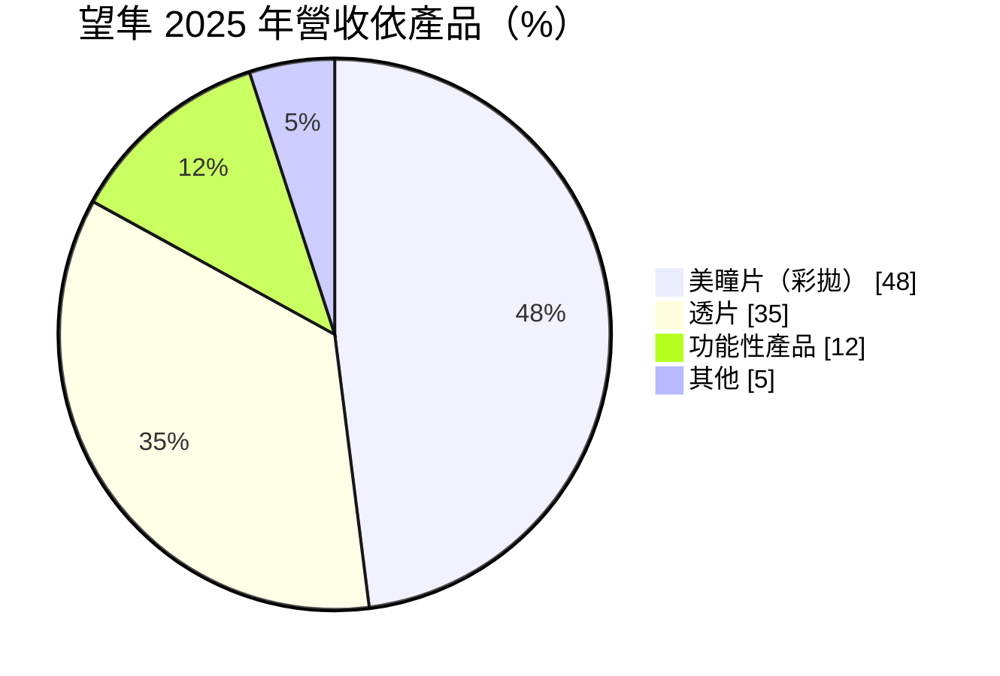
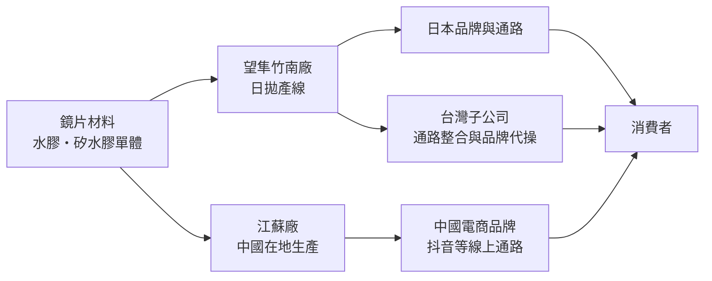
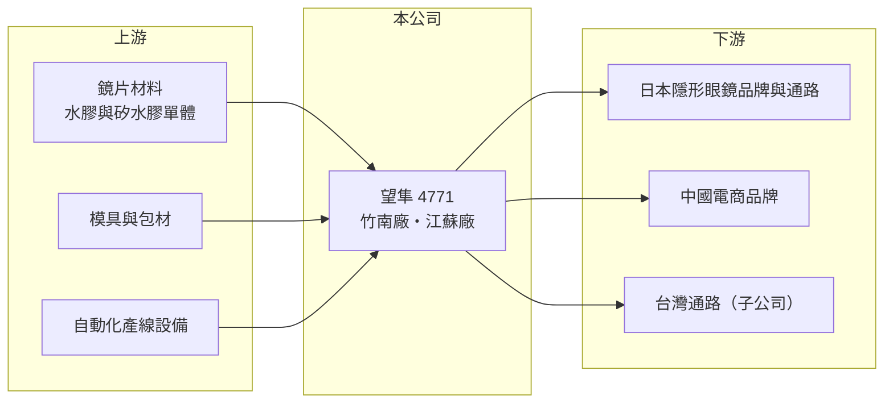

# 4771 望隼

> 上市｜[[產業索引-生技醫療業|生技醫療業]]｜上市（櫃）日期 2024/03/18

# 第一章：企業模式與商業藍圖

> [!info] 撰寫說明
> 本文由 Claude 依公開資料整理，架構比照 [[2330台積電]] 的四章研究，資料截至 2026-10-08。財務數字來源：Goodinfo 年度經營績效表、證交所開放資料（基本資料、2026 年第二季財報、營益分析、股利、每月營收）；產品、地區結構與產能取自富果研究整理的 2026 年 3 月法說會摘要（AI 摘要，非公司原始文件）。客戶名稱未揭露。#待校對

望隼是一家快速崛起的隱形眼鏡製造商，靠彩色日拋鏡片打進中國與日本兩大市場，十年內從小廠成長為台灣主要的鏡片廠之一。本章說明望隼科技（股票代號：4771，以下簡稱望隼）的商業模式。

## 一、核心定位：以美瞳彩片為主力的隱形眼鏡製造商

望隼成立於 2012 年，2024 年在證交所上市，總部與主要產線位於苗栗竹南，董事長為黃修權，實收資本額約 5.87 億元。公司從事[[隱形眼鏡]]的研發與製造，產品分為三類：

* **[[美瞳片]]（彩色日拋）：** 2025 年占營收 48%，比前一年增加 10 個百分點。彩片兼具醫療器材與時尚商品的特性，花色設計變化快，需要能小量多樣、快速換線的生產能力，這是望隼的強項。
* **透片（透明片）：** 2025 年占 35%，以矯正視力為主，價格競爭較激烈。
* **功能性產品：** 2025 年占 12%，包括[[矽水膠]]、散光、多焦與濾藍光鏡片，是公司往高單價產品升級的方向。

「其他」為推算差額。依地區看，2025 年中國約占 50%、日本約 43%（年增 34%）、台灣約 6%，歐美與東南亞仍在起步階段。

## 二、資本轉化邏輯：產能就是營收

* **產能擴充帶動成長：** 2025 年兩岸月產能接近 6,000 萬片，2026 年目標提高到 6,900 萬片。日拋鏡片單價低、用量大，產能利用率高時固定成本被攤薄，營業利益率可以維持在 30% 上下。
* **兩岸分工：** 江蘇廠就近供應中國客戶，能快速回應當地對圖紋設計與行銷活動的需求；竹南廠主攻日本與其他外銷市場。竹南新總部廠區預計 2026 年完工，整合原本租賃的產線。

## 三、長期方向：矽水膠與歐美市場

望隼的矽水膠產品於 2026 年 2 月取得日本藥證，歐洲藥證預計 2026 年上半年取得（取得與否待校對）。矽水膠透氧量高、單價高，是日本市場消費升級的主流，也是打進歐美市場的門票。依法說會引用的產業資料，全球隱形眼鏡市場預計從 2025 年的 115 億美元成長到 2035 年的 189 億美元，亞洲是主要成長來源。

# 第二章：護城河深度與競爭優勢

護城河是企業抵禦競爭、長期維持超額利潤的機制。本章說明望隼在隱形眼鏡代工市場的優勢，以及這些優勢面對同業擴產時能守住多少。

## 一、望隼護城河的核心組成要素

* **1. 彩片的設計與換線能力：** 彩片需要大量花色與快速上市，望隼能同時處理多個品牌客戶的小批量訂單，這種彈性是大型國際鏡片廠不擅長的領域。
* **2. 醫療器材藥證：** 隱形眼鏡在各國都屬醫療器材，進入日本、中國、歐洲都要取得當地許可。每一張藥證都需要臨床或相容性資料，累積的藥證是進入門檻。
* **3. 兩岸產能布局：** 江蘇廠讓望隼能以在地生產身分服務中國品牌，降低關稅與物流時間，這是純台灣產能的同業較難做到的。

## 二、主要競爭對手格局

| 對手 | 定位 | 對望隼的影響 |
|---|---|---|
| [[6491晶碩]] | 台灣最大隱形眼鏡廠，代工為主 | 在日本與中國代工訂單直接競爭 |
| [[1565精華]] | 老牌鏡片廠，代工與自有品牌 | 爭取同一批日本客戶 |
| [[6782視陽]] | 隱形眼鏡代工與品牌 | 彩片與日拋同質競爭 |
| 中國本土鏡片廠 | 價格低、貼近中國電商 | 壓縮中國市場的報價 |

## 三、優勢轉化：守得住與守不住的地方

* **守得住：** 營收從 2019 年的 5.85 億元成長到 2025 年的 34.9 億元，毛利率從 31.8% 升到約 41%，營業利益率維持在 29% 至 32%，代表規模經濟與產品組合同時改善。
* **守不住：** 中國市場 2025 年只成長 0.2%，當地競爭與價格壓力明顯；營收高度集中在中國與日本，任何一方需求轉弱都會直接反映。
* **觀察重點：** 2026 年產能擴充後的利用率、矽水膠在日本與歐洲的放量速度，以及日本營收占比能否持續提高。

# 第三章：財務體質與盈利規模

資料日期：2026-10-08，表格是撰寫當時的快照；最新月營收、毛利率、累計 EPS 由自動排程寫在本筆記的屬性欄位（月營收、毛利率、累計EPS 等）。#待校對

財務報表是檢驗護城河是否真實存在的最終標準。本章用五年的三率、ROE 與資本報酬，檢視望隼高成長的獲利品質。

## 一、多年度財務表現

| 年度 | 營收（新台幣） | [[毛利率]] | [[營業利益率]] | EPS（元） | [[ROE]] |
|---|---|---|---|---|---|
| 2021 | 14.2 億 | 34.6% | 22.3% | 4.64 | 17.9% |
| 2022 | 18.3 億 | 38.0% | 20.0% | 6.02 | 16.5% |
| 2023 | 25.7 億 | 39.9% | 32.3% | 10.77 | 32.3% |
| 2024 | 30.0 億 | 39.3% | 29.6% | 11.81 | 24.8% |
| 2025 | 34.9 億 | 40.9% | 28.8% | 12.71 | 19.6% |

資料來源：Goodinfo 年度經營績效（合併報表）。2026 年上半年（證交所資料）營收約 22.27 億元、毛利率 42.32%、營業利益率 30.01%、EPS 8.40 元；2026 年 1 至 8 月累計營收年增約 34%。

* **高成長：** 2020 至 2025 年營收年複合成長率約 32.5%（推算），是台灣隱形眼鏡廠中成長最快的之一。2024 年上市前後辦理增資，每股淨值從 2023 年約 34 元升到 2025 年約 68 元，ROE 因權益擴大而從 32% 降到約 20%。
* **長期指標：** 2021 至 2025 年平均 ROE 約 22.2%（推算）。2025 年度配發現金股利 7.0 元，配發率約 55%（推算），保留一半盈餘支應擴產。2026 年第二季底總資產約 81.6 億元，負債約 35.5 億元（其中非流動負債約 19.3 億元，推估與新廠建設融資有關），權益約 46.1 億元（含非控制權益約 4.7 億元）。

## 二、[[ROIC]] 與 [[WACC]]：價值創造利差

**ROIC 推算：** 2025 年營業利益約 10.1 億元，稅率 20% 後約 8.08 億元。官方資料只揭露負債總計約 35.5 億元，假設一半為有息負債約 17.7 億元（推估），加上權益約 46.1 億元，投入資本約 63.9 億元，ROIC 約 12.6%（推算）。

**WACC 推算：** 台灣 10 年期公債殖利率取 1.75%、市場風險溢酬 6%、β 取 1.0（未查得公司實際 β，以成長型醫材股常見值估計），股東權益成本約 7.75%。負債成本假設 2.5%，稅後約 2.0%，權益約占投入資本 72%，WACC 約 6.2%（推算）。

**結論：** ROIC 高於 WACC 約 6 個百分點，代表望隼的擴產投資確實在創造價值。後續要觀察的是新廠完工、折舊增加後，ROIC 能否維持在 10% 以上。

# 第四章：總體風險與地緣政治

任何企業都無法脫離宏觀環境獨立存在。本章分析望隼長期必須面對的市場、競爭與營運風險。

## 一、市場集中與地緣風險

* **中國市場：** 中國占營收約一半，當地法規、平台流量規則或消費景氣改變，都會快速影響訂單；兩岸關係與貿易政策也是潛在變數。
* **日本市場：** 日本客戶要求嚴格，品質事件可能導致整個品牌客戶流失；日圓貶值也會壓縮以台幣計算的營收。

## 二、產業與競爭風險

* **同業擴產：** 晶碩、精華與中國鏡片廠都在擴產，日拋與彩片可能出現供給過剩，價格下滑會壓低毛利率。
* **流行趨勢變化：** 彩片需求受時尚與社群行銷影響，流行退燒時，庫存與產能利用率都會受衝擊。

## 三、營運與法規風險

* **新廠執行：** 竹南新廠與產能擴充需要大量資本支出，若訂單成長不如預期，折舊將拉低毛利率。
* **醫療器材法規：** 各國對隱形眼鏡的上市許可、標示與上市後監督要求持續提高，新市場的藥證取得時程可能延後。
* **匯率：** 營收以人民幣與日圓為主，匯率波動會影響帳面營收與毛利。

# 專有名詞解析

## 應用

- **[[隱形眼鏡]]**：直接配戴在眼球表面的矯正或美容鏡片，屬醫療器材，需取得衛生主管機關許可。

## 金融

- **[[ROIC]]**：投入資本報酬率，稅後營業利益除以股東權益加有息負債，衡量本業運用資本的效率。
- **[[WACC]]**：加權平均資金成本，股東與債權人要求報酬率的加權平均，是 ROIC 要超越的門檻。

## 產業

- **[[矽水膠]]**：在水膠鏡片材料中加入矽，讓氧氣更容易穿透，適合長時間配戴，單價高於一般水膠鏡片。
- **[[美瞳片]]**：有顏色或花紋、可放大或改變瞳孔外觀的隱形眼鏡，兼具矯正與美妝功能，在亞洲年輕族群需求大。

# 核心供應鏈

## 1. 上游：材料與設備
- 鏡片單體材料、模具、包材與自動化設備供應商（名稱未查得）

## 2. 中游：望隼與同業
- 隱形眼鏡製造同業：[[6491晶碩]]、[[1565精華]]、[[6782視陽]]

## 3. 下游：客戶
- 日本與中國的隱形眼鏡品牌、電商通路，台灣以子公司經營通路（客戶名稱未揭露）

## 最新新聞
<!-- news:start（自動產生，請勿手動編輯此範圍） -->
- 2026-10-08 🏛️ 重訊 18:09｜公告本公司初次申請股票上市時所出具之承諾事項暨其後續 執行情形｜[觀測站](https://mops.twse.com.tw/mops/#/web/t05st01)
- 2026-10-06 📰 媒體 19:46｜望隼受船期遞延影響9月營收3.95億元月減 續看好下半年營運｜[鉅亨網](https://news.cnyes.com/news/id/6622899)

完整紀錄：[[4771望隼 新聞]]
<!-- news:end -->

## 相關連結
- [公開資訊觀測站](https://mopsov.twse.com.tw/mops/web/t05st03?step=1&firstin=1&co_id=4771)
- [Goodinfo](https://goodinfo.tw/tw/StockDetail.asp?STOCK_ID=4771)
- [Yahoo 股市](https://tw.stock.yahoo.com/quote/4771)
- [鉅亨網新聞](https://www.cnyes.com/twstock/4771/news)
