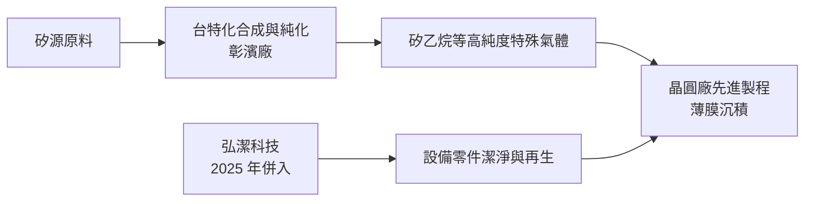
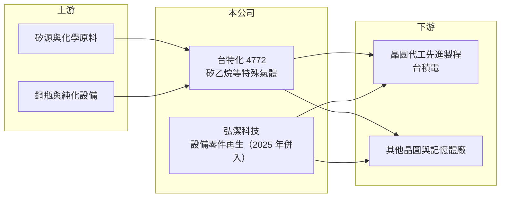

# 4772 台特化

> 上櫃｜[[產業索引-化學工業|化學工業]]｜上市（櫃）日期 2024/09/20

# 第一章：企業模式與商業藍圖

> [!info] 撰寫說明
> 本文由 Claude 依公開資料整理，架構比照 [[2330台積電]] 的四章研究，資料截至 2026-10-08。財務數字來源：Goodinfo 年度經營績效頁、nstock 公司資料頁（業務、併購與股利）、優分析關於矽乙烷產能的文章、財訊報導標題；產業描述為整理性內容，尚未逐條比對原始文件。公開資料有限，產品別營收比重未查得。#待校對

在評估單一個股的長期投資價值時，首要步驟是拆解企業的底層獲利邏輯。本章說明台灣特品化學（股票代號：4772，以下簡稱台特化）如何以單一關鍵材料「矽乙烷」切入先進製程，以及它在 2025 年併購設備零件再生業者後的業務結構。

## 一、核心定位：台灣唯一量產半導體級矽乙烷的業者

台特化成立於 2013 年，註冊地址在彰化縣線西鄉的彰濱工業區，主要業務是精密化學材料的製造與買賣，核心產品是半導體用高純度[[特殊氣體]]，其中最重要的是[[矽乙烷]]。矽乙烷是一種含矽的氣體，在先進製程的[[薄膜沉積]]中作為矽的來源，能在較低溫度下形成均勻的薄膜，製程越先進、電晶體結構越立體，用量越高。

依優分析整理，全球只有少數廠商具備半導體級矽乙烷的量產能力，台特化是台灣唯一的量產業者，並早在 7 奈米以下世代就進入 [[2330台積電]] 供應鏈，在 3 奈米的市占進一步提高。該文引用的調查推估，進入 2 奈米後每片晶圓的矽乙烷用量可能比 3 奈米再增加 50% 至 100%。這個定位的長期意義是：台特化的成長不靠晶圓總產量，而靠先進製程占比與每片晶圓的材料用量，兩者都隨製程演進而增加。

## 二、產品板塊：特殊氣體本業加上設備零件再生

公司未揭露產品別營收比重，因此本文不畫比重圖。台特化目前有兩塊業務。第一是特殊氣體本業，以矽乙烷為核心，毛利率很高，是公司價值的主要來源。第二是 2025 年 8 月取得弘潔科技 65.22% 股權後納入的半導體設備及零件潔淨、維修與再生業務。晶圓廠的蝕刻與沉積設備零件使用一段時間後會沾附沉積物，需要定期清洗與再生才能重複使用，這是隨晶圓廠稼動率穩定發生的經常性需求。

併購的目的，依公司說法是擴大營業規模、完整半導體供應鏈。從商業模式看，它讓台特化從單一材料供應商，擴大成同時提供材料與製程服務的廠商，可以分散對矽乙烷單一產品的依賴。

## 三、資本轉化邏輯：高純度合成與產能擴充

高純度特殊氣體的獲利來自合成與純化技術。純度每提升一個等級，製程難度大幅提高，能穩定量產的廠商就更少，因此售價與毛利率都高。台特化 2024 與 2025 年毛利率都約 52.9%、營業利益率超過 40%，在材料業中屬於極高水準。

依優分析整理，台特化 2025 年矽乙烷名目年產能約 26.4 噸，稼動率約 50% 至 60%；規劃 2026 年底擴充到 33 噸、2027 年底達 40 噸，2027 年的供給能力推估可達 2025 年實際產出的 2.5 至 3 倍。這是典型的「跟著關鍵客戶的先進製程藍圖擴產」。

## 四、企業長期藍圖：跟隨先進製程，延伸海外

台特化長期成長的關鍵變數，是能否跟隨主要客戶在海外的先進製程布局，把台灣的供應優勢延伸到美國、日本等新據點。另一個方向是產品多元化：在矽乙烷之外開發更多先進製程用的前驅物與特殊氣體，並透過弘潔擴大製程服務收入，降低單一產品與單一客戶的集中度。

# 第二章：護城河深度與競爭優勢

「護城河」指企業抵禦競爭、維持超額利潤的保護機制。本章分析台特化在先進製程材料中的護城河與競爭者。

## 一、台特化護城河的核心組成要素

第一是技術與量產門檻。半導體級矽乙烷需要極高的純度與穩定性，全球能量產的廠商很少，新進者要從實驗室走到量產並通過客戶驗證，需要多年時間。

第二是客戶認證與在地供應。先進製程材料一旦導入，更換供應商必須重新驗證整個製程，風險極高。台特化在 7 奈米以下世代就已導入，並隨 3 奈米提高市占，代表它已經深度綁定主要客戶的製程藍圖；地理上靠近客戶的晶圓廠，也能縮短運送時間、降低斷料風險。

第三是規模擴張的先行優勢。2026 至 2027 年的擴產計畫若如期完成，台特化會在主要客戶的 2 奈米量產期擁有足夠產能，進一步拉開與潛在新進者的距離。

## 二、全球主要競爭對手格局

| 對手 | 定位 | 對台特化的威脅 |
|---|---|---|
| 日韓矽系特殊氣體廠（推估包括日系化工廠與韓國特氣廠） | 既有的矽乙烷與矽烷供應商 | 技術成熟，可能在新世代製程爭取第二供應商位置 |
| 林德、液化空氣等國際氣體大廠 | 全球電子氣體龍頭 | 與晶圓廠有整體供氣合約，產品線完整 |
| [[4768晶呈科技]] | 台灣特殊氣體廠 | 同為本土供應鏈，但產品重心在雷射與蝕刻氣體 |

## 三、優勢轉化：守得住／守不住／觀察重點

守得住的是已驗證的先進製程矽乙烷訂單。只要主要客戶的先進製程持續擴產，台特化的需求就有結構性成長。

守不住的是客戶集中度。台特化的成長高度依賴單一大客戶，客戶為了供應鏈安全通常會培養第二、第三供應商，長期可能分走部分市占或壓低價格。

長期觀察重點有三個：擴產能否如期完成並維持高毛利、弘潔的設備零件再生業務能否穩定貢獻，以及能否跟隨客戶到海外供貨。

# 第三章：財務體質與盈利規模

資料日期：2026-10-08。數字取自 Goodinfo 年度經營績效與 nstock 股利資料，表格是撰寫當時的快照；最新月營收、毛利率、累計 EPS 由自動排程寫在本筆記的屬性欄位（月營收、毛利率、累計EPS 等）。#待校對

財務報表是檢驗護城河是否真實存在的最終標準。本章用五年的三率、ROE 與資本報酬，檢視台特化從虧損到高獲利的轉變。

## 一、獲利能力的基石：三率

| 年度 | 營收（新台幣） | [[毛利率]] | [[營業利益率]] | EPS（元） | [[ROE]] |
|---|---|---|---|---|---|
| 2021 | 5.16 億 | 50.6% | 37.9% | 1.41 | 13.1% |
| 2022 | 5.32 億 | 49.6% | 33.9% | 1.50 | 12.7% |
| 2023 | 5.54 億 | 38.0% | 24.9% | 1.13 | 9.02% |
| 2024 | 8.74 億 | 52.9% | 41.7% | 2.74 | 15.5% |
| 2025 | 19.9 億 | 52.9% | 42.5% | 4.20 | 19.0% |

台特化在 2020 年仍處於虧損（營收 4.17 億元、EPS -0.67 元），2021 年起轉為穩定獲利，2024 年後隨先進製程放量大幅成長。2021 至 2025 年營收年複合成長率約 40%（推算），但 2025 年營收從 8.74 億元跳到 19.9 億元，一部分來自 2025 年 8 月併入弘潔科技，不完全是本業有機成長。毛利率在 2023 年短暫降到 38%，推估與當年半導體庫存調整有關（原因未查得），其餘年度都在 50% 左右，顯示產品定價能力強。

## 二、[[ROE]]：資本效率與股本變化

近五年平均 ROE 約 13.9%（推算），呈上升趨勢，2025 年達 19%。股本在 2021 年由 29.1 億元降到 13.8 億元，推估是以減資彌補過去虧損；2024 年股本增為 14.8 億元、每股淨值由 12.71 元升到 21.89 元，推估與上市櫃時的溢價增資有關。由於 2024 年剛增資、帳上資金充裕，ROE 被較大的權益基數稀釋，實際的本業資本報酬率比 ROE 顯示的更高。

## 三、股利與資本支出

依 nstock，2024 年度配發現金股利 2 元、配發率約 73%，2025 年度配發 3 元。2026 至 2027 年矽乙烷擴產與弘潔整合需要資本支出（金額未查得），公司在擴產期仍維持配息，顯示現金流尚能支應。

## 四、[[ROIC]] 與 [[WACC]]：價值創造利差

**ROIC 推算：** 2025 年營業利益約 8.46 億元（19.9 億 × 42.5%），稅後約 6.77 億元。股東權益約 37.3 億元（每股淨值 25.19 元 × 約 1.48 億股），依 ROE 19% 與 ROA 13.8% 推算總負債約 14 億元，假設其中一半為有息負債約 7 億元（推估），投入資本約 44 億元，ROIC 約 15%（推算）。若扣除帳上現金，以營運資本計算會更高。

**WACC 推算：** 假設台灣 10 年期公債殖利率 1.75%、市場風險溢酬 6%、β 取半導體材料同業常見值 1.2，股東權益成本約 9.0%。負債成本假設 2.5%，稅後 2.0%，權益占資本約 84%（推估），WACC 約 7.8%（推算）。

**結論：** 台特化 2025 年的 ROIC 約為 WACC 的兩倍，明顯在創造經濟價值，來源是先進製程材料的高毛利與低資本密度。只要擴產後的毛利率能維持在 50% 左右，利差就能隨產能擴大而放大；風險在於新產能若遇到客戶需求放緩或第二供應商分食，報酬率會被新增的折舊拉低。

# 第四章：總體風險與地緣政治

任何企業都無法脫離宏觀環境獨立存在。本章分析台特化長期必須面對的客戶集中、技術與營運風險。

## 一、客戶集中與產業週期

台特化的營收高度依賴主要晶圓代工客戶的先進製程。雖然先進製程需求在 AI 帶動下長期成長，但晶圓廠仍會有庫存調整期，2023 年毛利率下滑就顯示需求波動會直接反映在獲利上。客戶若引進第二供應商，台特化的價格與市占都可能受壓。

## 二、地緣政治

產能集中在台灣彰濱，與主要客戶同樣面臨兩岸風險。主要客戶在美國、日本設廠後，若要求材料在當地供應，台特化必須評估海外設廠或與當地氣體廠合作，否則可能失去海外新廠的訂單。

## 三、營運環境的隱性風險

特殊氣體多具易燃、自燃或毒性，生產與運送受嚴格的工安法規管理，一次工安事故就可能造成長期停產與客戶流失。擴產工程的時程與良率、弘潔併購後的整合，也是執行層面的風險。

## 四、科技演進

先進製程的材料配方會隨世代改變，若未來製程改用其他矽源或新型前驅物，矽乙烷的用量成長可能不如預期。台特化必須持續投入研發，在每一個新世代爭取材料認證，才能延續目前的優勢。

# 專有名詞解析

## 半導體

- **[[特殊氣體]]**：晶圓製程中用於蝕刻、沉積與摻雜的高純度氣體，純度要求極高，供應商少。
- **[[矽乙烷]]**：化學式 Si2H6 的含矽氣體，可在較低溫度沉積均勻的矽薄膜，先進製程用量隨世代增加。
- **[[薄膜沉積]]**：在晶圓表面沉積一層極薄的材料，包括 CVD、PVD、ALD 等方法。
- **[[零件再生]]**：把晶圓設備中沾附沉積物的零件清洗、修復後重複使用的服務，需求隨晶圓廠稼動率穩定發生。

## 金融

- **[[ROIC]]**：投入資本報酬率，稅後營業利益除以股東權益加有息負債，衡量本業運用資本的效率。
- **[[WACC]]**：加權平均資金成本，股東與債權人要求報酬的加權平均，ROIC 高於它才代表創造價值。

# 核心供應鏈

## 1. 上游：原料
- 矽源與化學原料供應商（未查得具體名稱）

## 2. 中游：台特化與同業
- 子公司：弘潔科技（持股 65.22%，2025 年 8 月取得）
- 國際氣體大廠：林德、液化空氣；台灣同業：[[4768晶呈科技]]

## 3. 下游：晶圓廠
- 主要客戶：[[2330台積電]]（7 奈米以下先進製程）
- 其他晶圓與記憶體廠（未查得具體名稱）

## 供應鏈關係
- 供應給 [[2330台積電]]：矽乙烷與特用化學氣體（台積電供應鏈 › 上游：關鍵耗材、特用化學品與氣體）

## 最新新聞
<!-- news:start（自動產生，請勿手動編輯此範圍） -->
- 2026-10-07 📰 媒體 21:31｜台特化(4772) 個股概覽 ／ 個股 - 股市｜[CMoney](https://news.google.com/rss/articles/CBMiU0FVX3lxTE9lMWduQmhBc3ZWUGk5dUt2YU5uMzZYbUJ6eFVwQ21WaUd5X3gxSlZZYjZfMDlmcVBsTWJVS3NPMVN3YUh1NUJEM1RSbllEMFBjQzBZ?oc=5)
- 2026-10-07 📰 媒體 19:50｜營收速報 - 台特化(4772)9月營收3.64億元年增率高達30.32％｜[鉅亨網](https://news.cnyes.com/news/id/6623955)
- 2026-10-07 📰 媒體 17:05｜營收：台特化(4772)9月營收3億6398萬元創新高，月增率12.38%，年增率30.32%｜[富聯網](https://news.google.com/rss/articles/CBMiiAFBVV95cUxPQWk0dUZpZHdmWkhEa2lWdWpNX09ZLXVIdnJmcW1vM0pnR18wN0NTaDJkOEZPRFpFSkIxal9uYnRJNjFOSE5pLXJfX1BZNzhhYnBZbEJnb1hla3VsWDRYejljV0NrUkZzRVRnbzBkTkJydnI1YkdncW1IN0dsWHd2c01McmFiVmVQ?oc=5)
- 2026-10-06 📰 媒體 19:00｜先進製程需求強勁 中華化飆漲停、台特化一度亮燈｜[經濟日報](https://news.google.com/rss/articles/CBMiWkFVX3lxTE4xQ3FLNThCSUJEWkt3blhxSFlsckhJdjBuR3RqU04tSndxOEhSYVVrR1FLY0xJNndFZGd6UGVjWUxfSmMzSW1fMFJUX2prNXNQODBQaFdMU1NSUdIBX0FVX3lxTFBfZTNqWUpYYmVVNWZfakxrNXd1MlVGbVVKTzR6cS04eU84Rzh0TWt2N3RoaFcxc3Y2SHI1Tm9qWmVIX3FZVWhBdllrZE9uNmxpR1RzcU9IeHpLeTFua0pj?oc=5)

完整紀錄：[[4772台特化 新聞]]
<!-- news:end -->

## 相關連結
- [公開資訊觀測站](https://mopsov.twse.com.tw/mops/web/t05st03?step=1&firstin=1&co_id=4772)
- [Goodinfo](https://goodinfo.tw/tw/StockDetail.asp?STOCK_ID=4772)
- [Yahoo 股市](https://tw.stock.yahoo.com/quote/4772)
- [鉅亨網新聞](https://www.cnyes.com/twstock/4772/news)
