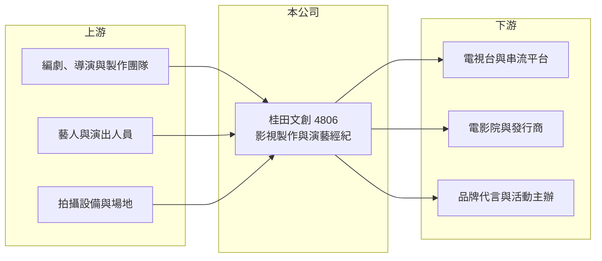

# 4806 桂田文創

> 上櫃｜[[產業索引-文化創意業|文化創意業]]｜上市（櫃）日期 2016/03/09

# 第一章：企業模式與商業藍圖

> [!info] 撰寫說明
> 精簡版，由 Claude 依公開資料整理，架構比照 [[2330台積電]] 的四章研究，資料截至 2026-10-08。來源：Goodinfo 年度經營績效頁、nStock 公司簡介、櫃買中心開放資料（基本資料、2026 年第二季資產負債與綜合損益、每月營收、本益比殖利率）。公開資料有限，作品與子公司未查得。#待校對

本章拆解桂田文創娛樂（股票代號：4806，以下簡稱桂田文創）的商業模式。桂田文創原名昇華娛樂傳播，是以電視節目與影視製作起家的內容公司，近年營收極小、長期虧損，2024 年更名後正嘗試整合成「娛樂產業一條龍」的服務架構。

- **核心業務：** 公司 2000 年設立，2016 年上櫃，2024 年 1 月由昇華娛樂傳播更名為桂田文創娛樂，董事長兼總經理為謝汶芳。依公司介紹，主要業務包括電視節目製作與編劇、電影製作發行與投資，以及演藝活動經紀。
- **營收結構：** 公司未揭露各業務營收比重。影視製作的收入來自電視台或串流平台的委製費與版權銷售，經紀業務則依藝人演出、代言收入抽成，兩者都是專案型收入，年度間差異很大。
- **營運據點：** 總部位於台北內湖，以台灣市場為主。
- **長期方向：** 依月營收公告的說明，公司各業務團隊的整合已開始發揮綜效，目標是形成從內容製作、藝人經紀到活動執行的一條龍服務。2026 年 1 至 9 月累計營收約 1.5 億元，年增約 162%（nStock），規模已超過 2025 年全年的 0.81 億元。但這個成長是從極低的基期出發，能否轉為穩定獲利仍待觀察。
- **股本：** 櫃買中心基本資料登記的實收資本額約 6.99 億元，2026 年第二季資產負債表的股本則約 9.99 億元，兩者差異可能與增資或減資的生效時點有關（待校對）。

# 第二章：護城河深度與競爭優勢

桂田文創目前沒有明顯的護城河，所處的影視製作與經紀產業進入門檻低、競爭者眾多。

- **競爭優勢：** 影視內容公司的優勢來自成功作品累積的口碑、編劇與製作團隊，以及藝人資源。若能把製作、經紀與活動串在一起，就能把同一位藝人或同一個作品的價值在多個環節變現，這是公司一條龍策略的邏輯。不過目前公開資料看不出具代表性的作品或藝人資產。
- **主要對手：** 台灣影視與娛樂相關的上市櫃公司包括 [[8446華研]]（音樂與經紀）、[[8450霹靂]]（自有 IP 影視）、[[6596寬宏藝術]]（演唱會與展演），以及三立、八大等電視台自製部門與大量未上市製作公司；國際串流平台則同時是客戶與競爭者。
- **觀察重點：** 2016 年以後本業幾乎年年虧損，2021 至 2023 年營收一度只有約 100 萬元。觀察重點在於營收能否連續數年維持在億元以上，並讓毛利足以支付營業費用。

# 第三章：財務體質與盈利規模

資料日期：2026-10-08，表格是撰寫當時的快照；最新月營收、毛利率、累計 EPS 由自動排程寫在本筆記的屬性欄位（月營收、毛利率、累計EPS 等）。#待校對

本章用多年度數據檢視桂田文創長期虧損與近年的營收回升。營收極小的年份，比率數字會嚴重失真。

| 年度 | 營收（新台幣） | [[毛利率]] | [[營業利益率]] | EPS（元） | [[ROE]] |
|---|---|---|---|---|---|
| 2016 | 5.43 億 | 14.9% | 6.45% | 1.08 | 2.89% |
| 2017 | 3.87 億 | 32.9% | -58.3% | -11.9 | -38.2% |
| 2019 | 0.21 億 | -55.6% | -718% | -5.65 | -45.3% |
| 2020 | 1.19 億 | -25.8% | -73.8% | -2.77 | -32.9% |
| 2021 | 0.01 億 | 失真 | 失真 | -4.13 | -80.9% |
| 2022 | 0.01 億 | 失真 | 失真 | -3.92 | -210% |
| 2023 | 0.01 億 | 12.1% | 失真 | -0.54 | -11.4% |
| 2024 | 0.67 億 | 17.9% | -78.9% | -0.20 | -5.63% |
| 2025 | 0.81 億 | 32.6% | -74.5% | -0.34 | -5.09% |
| 2026 上半年 | 1.03 億 | 23.1% | -20.9% | -0.14 | 不適用（半年） |

- **營收規模：** 2016 年營收 5.43 億元為近十年高點，之後一路萎縮，2021 至 2023 年幾乎沒有營收。2024 年起回升，2026 年上半年已有 1.03 億元。
- **獲利：** 近十年只有 2016 年本業獲利。2026 年上半年營業虧損約 0.22 億元，業外收入約 0.12 億元，淨損約 0.10 億元，虧損幅度較過去縮小（櫃買中心資料）。2021 至 2025 年 ROE 全為負值。
- **財務特色：** 2026 年第二季底總資產約 8.59 億元、負債約 2.21 億元、股東權益約 6.37 億元，保留盈餘約 -3.10 億元，代表過去的累積虧損已侵蝕相當比例的股本。Goodinfo 統計歷年一般平均現金股利約 0.28 元，近年未配息。

**[[ROIC]] 與 [[WACC]]：** 2025 年營業利益約 -0.60 億元（0.81 億元 × -74.5%），2026 年上半年仍為營業虧損，ROIC 為負（推算）。WACC 假設公債 1.75%、市場風險溢酬 6%、β 取 1.2（小型娛樂股，假設偏高以反映波動），負債多為經營性負債，WACC 約 9%（推算）。ROIC 長期為負、遠低於資金成本，代表公司目前仍在消耗股東資本；只有一條龍整合真正帶來獲利，才有機會扭轉。

# 第四章：總體風險與地緣政治

桂田文創的風險集中在營收不穩與持續虧損。

- **產業週期：** 影視製作收入取決於電視台、串流平台的採購預算與廣告景氣；串流平台削減內容支出時，中小型製作公司最先受影響。
- **營運風險：** 作品成敗難以預測，單一作品延誤或票房失利就會造成大額虧損；經紀業務依賴藝人個人，合約糾紛或藝人形象事件都可能影響收入。持續虧損下，若需要再次募資，股東權益可能被稀釋。
- **其他風險：** 影視作品進入海外市場（特別是中國大陸）受內容審查與兩岸政策影響；文化部補助與輔導金政策變化，也會影響國內製作的成本結構。

# 專有名詞解析

## 金融

- **[[ROIC]]**：投入資本報酬率，稅後營業利益除以股東權益加有息負債，衡量本業運用資本的效率。
- **[[WACC]]**：加權平均資金成本，股東與債權人要求報酬的加權平均，ROIC 高於它才代表創造價值。

## 產業

- **[[一條龍服務]]**：由同一家公司提供產業鏈多個環節的服務，例如從內容製作、藝人經紀到活動執行，以提高綜效。
- **[[演藝經紀]]**：代理藝人洽談演出、代言與活動的業務，經紀公司依藝人收入抽取一定比例。
- **[[專案型收入]]**：依單一大型合約完成進度或驗收認列的收入，金額大但時點集中，容易造成年度營收波動。

# 核心供應鏈

- 上游：編劇、導演與製作人員，簽約藝人，拍攝器材與場地租賃。
- 下游／客戶：電視台與串流平台、電影院與發行商、委託代言與活動的品牌及主辦單位。
- 同業：[[8446華研]]、[[8450霹靂]]、[[6596寬宏藝術]]。

## 最新新聞
<!-- news:start（自動產生，請勿手動編輯此範圍） -->
- 2026-10-08 📰 媒體 19:51｜營收速報 - 桂田文創(4806)9月營收2,470萬元年增率高達114.35％｜[鉅亨網](https://news.cnyes.com/news/id/6625886)

完整紀錄：[[4806桂田文創 新聞]]
<!-- news:end -->

## 相關連結
- [公開資訊觀測站](https://mopsov.twse.com.tw/mops/web/t05st03?step=1&firstin=1&co_id=4806)
- [Goodinfo](https://goodinfo.tw/tw/StockDetail.asp?STOCK_ID=4806)
- [Yahoo 股市](https://tw.stock.yahoo.com/quote/4806)
- [鉅亨網新聞](https://www.cnyes.com/twstock/4806/news)
