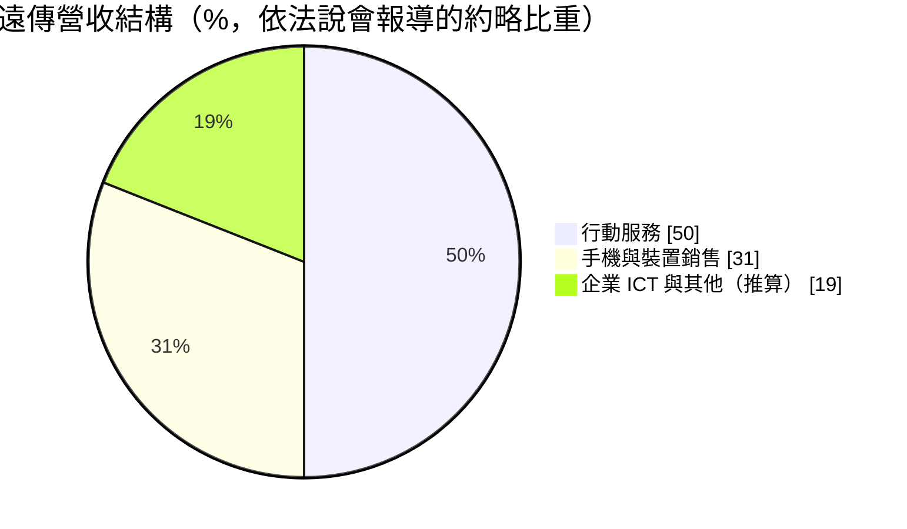
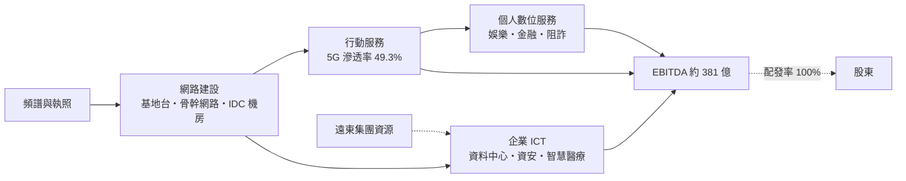
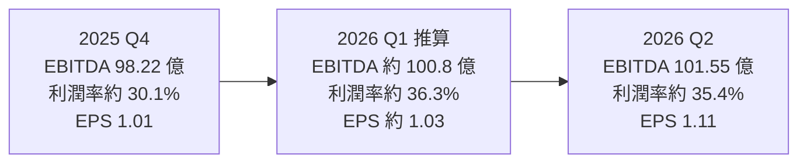
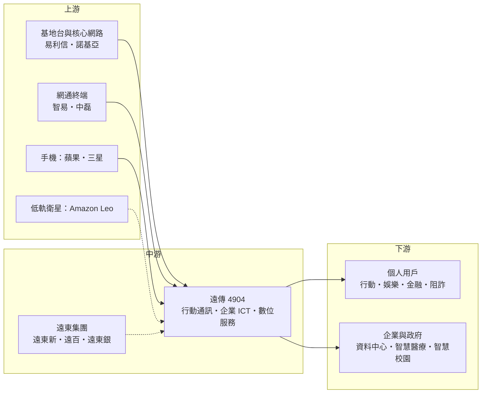

# 4904 遠傳

> 上市｜[[產業索引-通信網路業|通信網路業]]｜上市（櫃）日期 2005/08/24

# 第一章：企業模式與商業藍圖

> [!info] 撰寫說明
> 本文由 Claude 依公開資料整理，架構比照 [[2330台積電]] 的四章研究，資料截至 2026-10-07。財務數字來源：遠傳 2025 年第四季與 2026 年第二季法說會報導（優分析）、科技新報 2026 年股東會報導、優分析電信三雄月報、Yahoo 股市公司資料、理財周刊遠東新報導；產業描述為整理性內容，尚未逐條比對原始文件。#待校對

在評估單一個股的長期投資價值時，首要步驟是拆解企業的底層獲利邏輯。本章針對遠傳電信（股票代號：4904，以下簡稱遠傳）的商業模式進行定性分析，說明它在合併亞太電信後如何以 5G 升級、企業 ICT 與數位服務，從傳統電信商轉型為「價值創造者」。

## 一、核心定位：遠東集團旗下的電信與數位服務公司

遠傳成立於 1997 年 4 月 11 日，2005 年上市，為遠東集團成員，董事長為徐旭東，總經理為井琪。母公司 [[1402遠東新]] 持股約 33%。遠傳是台灣三大電信業者之一，在 2023 年底合併亞太電信後，用戶規模與台灣大接近。

2025 年合併營收 1,103.46 億元，年增 5.47%；[[EBITDA]] 380.8 億元，年增 4.87%；稅後純益 137.32 億元，年增 6.89%，為近 20 年新高；EPS 3.81 元，創歷史新高。2026 年上半年營收 564.68 億元，年增 10.1%，稅後純益 77.18 億元，年增 16.7%，EPS 2.14 元，同樣創同期新高，稅後純益與 EPS 已達全年財測的 113%（依時間進度計算）。

## 二、終端應用與產品板塊：行動服務占一半

依法說會報導，遠傳營收結構如下（其他為 100% 減去前兩項推算，主要為企業 ICT 與新經濟業務）：

* **行動服務：** 約占整體營收 50%，2025 年行動服務營收約 620 億元，創近 9 年新高。2025 年底 [[5G]] 月租型用戶滲透率 48.7%，公司稱居業界第一；2026 年第二季進一步升至 49.3%。2026 年第二季行動服務營收 158 億元，年增 3%。
* **手機與裝置銷售：** 約占 31%，營收貢獻大但毛利低。
* **企業 ICT：** 2026 年第二季智慧資通訊營收年增 23%，其中數位轉型業務年增 50%。垂直應用包括遠距醫療合約年增 76%、智慧醫院方案年增 114%、智慧校園方案年增 46%。
* **個人數位服務：** 數位娛樂營收年增 29%，阻詐服務年增 56%，行動金融服務年增 8%；新服務「去哪吃」吸引超過 20 萬個帳戶。新經濟業務營收占比由 2016 年約 5% 提升到 2025 年超過兩成。

## 三、資本轉化邏輯：網路固定成本，以 ARPU 與新服務放大

電信業前期投入頻譜與網路，後期以月租與服務費回收。遠傳的策略是在既有網路上疊加更多服務，提高每位用戶的貢獻（[[ARPU]]），同時把企業 ICT 做成第二個成長引擎。

* **AI 平台：** 自研 AI 平台「遠傳智靈」已導入內部客服、人資、財務流程，並向製造、醫療、教育領域輸出。
* **亞太電信整併：** 合併後的網路、頻譜與通路整併效益，是 2025 至 2026 年獲利創新高的重要原因。

## 四、企業長期藍圖：「放大三策略」

總經理井琪在 2026 年股東會提出「放大綜效、放大服務、放大 AI」：

* **放大綜效：** 延續合併亞太電信後的網路、頻譜與通路整併效益。
* **放大服務：** 以數位娛樂、金融、阻詐、生活服務提高每位用戶的貢獻。
* **放大 AI：** 以企業 AI 方案與資料中心承接 AI 需求。
* **[[低軌衛星]]：** 宣布與 Amazon 的低軌衛星服務 Amazon Leo 合作，成為台灣授權經銷商，切入衛星通訊與網路韌性需求。

2026 年財測為營收 1,174.8 億元（年增 6.5%）、EBITDA 398.3 億元（年增 4.6%）、稅後純益 141.7 億元、EPS 3.93 元。

# 第二章：護城河深度與競爭優勢

在長期價值投資中，「護城河」指企業抵禦競爭、維持超額利潤的保護機制。本章分析遠傳的護城河構成、主要競爭對手，以及這些優勢在三雄寡占的市場中能守住多少。

## 一、遠傳護城河的核心組成要素

遠傳的護城河屬於電信業典型的「寬護城河」：

* **1. 頻譜與特許執照：** 電信執照與頻譜由政府標售，新業者幾乎無法進入。台灣之星與亞太電信先後被併購，市場收斂為三雄[[寡占]]。
* **2. 網路與機房：** 基地台、骨幹網路與 [[IDC]] 機房是長期累積的沉沒成本。
* **3. 用戶轉換成本：** 綁約、家庭方案與加值服務提高用戶轉網的麻煩程度。
* **4. 集團資源：** 遠東集團旗下有百貨（[[2903遠百]]）、銀行（[[2845遠東銀]]）、紡織石化（遠東新）等事業，可提供企業客戶、場域與會員交叉合作。

## 二、全球主要競爭對手格局

| 對手 | 定位 | 對遠傳的威脅 |
|---|---|---|
| [[2412中華電]] | 規模最大，固網與光纖寬頻優勢明顯 | 企業 ICT 與資料中心實力強，2026 年前 7 月營收 1,412.4 億元、EPS 3.11 元 |
| [[3045台灣大]] | 合併台灣之星後規模相近，擁有 momo 與有線電視 | 2026 年前 7 月 EPS 3.32 元為三雄最高；公開收購精誠後企業 ICT 競爭加劇 |
| 系統整合商與國際雲端業者 | 企業 ICT 市場 | 在企業專案上競爭或合作 |

## 三、優勢轉化：哪些市場守得住、哪些守不住

* **守得住：** 寡占市場結構讓價格戰趨緩，5G 滲透率領先帶動 ARPU 提升；合併亞太電信後的綜效持續反映在獲利。2026 年前 7 月營收 657.21 億元、年增 10.8%，營收成長率為三雄最高。
* **守不住：** 遠傳沒有自己的大型固網與家用寬頻網路，在家庭市場較依賴行動網路與合作夥伴；EPS 絕對值仍低於中華電與台灣大。
* **觀察重點：** 5G 滲透率能否突破五成並持續推升 ARPU、企業 ICT 雙位數成長能否延續、Amazon Leo 衛星合作的商業化進度，以及財測達成率。

# 第三章：財務體質與盈利規模

資料日期：2026-10-07。數字取自公司法說會報導與財經媒體整理，最新月營收與三率請見[[#相關連結]]的公開資訊觀測站。#待校對

財務報表是檢驗護城河是否真實存在的最終標準。電信業折舊與攤銷龐大，習慣以 EBITDA 衡量本業現金獲利能力，因此本章改用 EBITDA、ROE、資本支出對 EBITDA 比與用戶價值指標，檢視遠傳的獲利品質。

## 一、獲利能力的基石：EBITDA 與 EBITDA 利潤率

| 項目 | 2025 全年 | 2025 Q4 | 2026 Q1 | 2026 Q2 | 2026 H1 |
|---|---|---|---|---|---|
| 營收（新台幣） | 1,103.46 億 | 326.85 億 | 約 278.0 億 | 286.64 億 | 564.68 億 |
| [[EBITDA]] | 380.8 億 | 98.22 億 | 約 100.8 億 | 101.55 億 | 未查得 |
| [[EBITDA 利潤率]]（依表內數字計算） | 約 34.5% | 約 30.1% | 約 36.3% | 約 35.4% | 未查得 |
| 稅後純益 | 137.32 億 | 36.68 億 | 約 37.1 億 | 40.09 億 | 77.18 億 |
| EPS（元） | 3.81 | 1.01 | 約 1.03 | 1.11 | 2.14 |

* 2026 Q1 營收、純益與 EPS 為上半年減第二季推算；Q1 EBITDA 依第二季季增 0.78% 反推。本次未查得各季[[毛利率]]與[[營業利益率]]的可靠數字。
* **季節性：** 第四季營收較高，主要因手機銷售旺季，裝置銷售毛利低，所以營收季增 23.85% 但 EBITDA 只季增 4.59%，EBITDA 利潤率因此降到約三成。
* **近期動能：** 2026 年前 7 月營收 657.21 億元（年增 10.8%），稅後純益 88.68 億元（年增 14.3%），EPS 2.46 元。

## 二、[[ROE]]：資本效率

本次未查得遠傳近期 ROE 的確切數字。遠傳採取接近 100% 的盈餘配發率，保留盈餘少，股東權益規模相對穩定；在獲利成長的情況下，ROE 可望隨之提升（推估）。

## 三、資本支出與自由現金流

* **[[CapEx]]：** 2026 年預估約 96 億元，主要用於 5G 網路、資料中心與 IT 系統。
* **[[資本密集度]]：** 以 2026 年財測 EBITDA 398.3 億元計算，資本支出約為 EBITDA 的 24%。
* **[[自由現金流]]：** 電信業 EBITDA 高、資本支出相對穩定，自由現金流足以支應全額配息；合併亞太電信後的網路整併有助於降低長期維運成本（推估）。
* **股利：** 2025 年度配發現金股利每股 3.81 元，配發率 100%，以宣布時股價計算殖利率逾 4%。

## 四、用戶價值指標：5G 滲透率與 ARPU

電信業的 [[ROIC]] 與 [[WACC]] 利差取決於既有網路能從每位用戶收回多少現金，因此用戶價值指標比單看資本報酬更直接（ROIC 具體數值未查得）：

* **5G 滲透率：** 2026 年第二季 49.3%，為三雄中公司自稱最高；升級用戶的月租較高，是 ARPU 成長的主要來源。
* **ARPU 與加值服務：** 本次未查得遠傳最新 ARPU 數字，但數位娛樂、阻詐、行動金融等服務都在雙位數成長，代表每位用戶的貢獻持續提高。
* **企業 ICT：** 第二季智慧資通訊營收年增 23%，以既有網路與機房承接企業專案，不需同比例增加資本支出，有助於提高投入資本報酬（推估）。

# 第四章：總體風險與地緣政治

任何企業都無法脫離宏觀環境獨立存在。本章分析遠傳未來必須面對的地緣政治、產業結構與法規風險。

## 一、地緣政治風險

* **關鍵基礎設施風險：** 電信網路與海纜是兩岸衝突時最可能被攻擊的目標之一，網路韌性與備援（包括低軌衛星）成為政策與企業客戶的重點。
* **設備供應：** 核心網路設備需避開中國供應商，供應商選擇較少，價格議價空間有限。

## 二、產業週期與市場結構風險

* **市場飽和：** 台灣行動門號普及率已高，成長主要來自 ARPU 與新業務，用戶數成長有限。
* **價格競爭：** 若競爭對手為搶 5G 用戶推出低價方案，可能壓抑 ARPU。
* **企業 ICT 競爭：** 台灣大收購精誠後，企業資訊服務市場的競爭將更激烈。

## 三、營運環境的隱性風險

* **財測與綜效：** 合併亞太電信的綜效逐年遞減後，獲利成長需要新業務接棒。
* **新業務不確定性：** 低軌衛星、數位娛樂與 AI 服務仍在早期階段，營收規模與獲利能力尚待驗證。
* **集團關係：** 遠東集團交叉持股與關係人交易，需留意公司治理與利益輸送疑慮。

## 四、科技與法規演進風險

* **頻譜與 6G：** 未來頻譜競標與 6G 建設將帶來新的大額資本支出。
* **監理法規：** NCC 對資費、併購與數位服務的監理，以及打詐相關法規對電信業者的責任要求日益加重。
* **替代技術：** [[OTT]] 通訊軟體與 Wi-Fi 持續替代傳統語音與部分數據流量。

# 專有名詞解析

## 金融

- **[[EBITDA]]**：稅前息前折舊攤銷前利潤，電信業折舊攤銷龐大，常用它衡量本業現金獲利能力。
- **[[EBITDA 利潤率]]**：EBITDA 除以營收，電信業用來比較本業獲利能力，手機銷售比重高時會被拉低。
- **[[ARPU]]**：每用戶平均月營收，電信業衡量用戶價值的核心指標，5G 升級與加值服務可推升 ARPU。
- **[[資本密集度]]**：資本支出相對營收或 EBITDA 的比例，電信業在新世代網路建設期會明顯升高。
- **[[ROE]]**：股東權益報酬率，稅後淨利除以股東權益，衡量公司運用股東資金的效率。
- **[[CapEx]]**：資本支出，電信業主要用於基地台、光纖與機房建設。
- **[[自由現金流]]**：營業活動現金流減去資本支出，電信業以此支應高配息與併購。

## 產業

- **[[5G]]**：第五代行動通訊，速度與容量高於 4G，電信商以升級資費提高 ARPU。
- **[[寡占]]**：市場由少數業者主導的結構，台灣行動通訊在併購後收斂為中華電、台灣大、遠傳三雄。
- **[[低軌衛星]]**：在數百至兩千公里高度運行的通訊衛星群，可提供偏遠地區與災難備援的網路連線。
- **[[OTT]]**：透過網際網路直接提供影音或通訊服務的業者，例如串流平台與通訊軟體，會替代傳統電視與語音。
- **[[IDC]]**：網路資料中心，提供企業主機代管、機櫃租用與雲端服務的機房設施。

# 核心供應鏈

## 1. 上游：網路設備與終端
- 基地台與核心網路：Ericsson（易利信）、Nokia（諾基亞）
- 網通終端設備：[[3596智易]]、[[5388中磊]]
- 手機與終端：[[AAPL蘋果]]、[[005930三星電子]]
- 低軌衛星合作：[[AMZN亞馬遜]]（Amazon Leo）

## 2. 中游：遠傳本身與集團資源
- 母公司：[[1402遠東新]]
- 集團關係企業：[[2903遠百]]、[[2845遠東銀]]、[[1102亞泥]]
- 合併的亞太電信與子公司新世紀資通

## 3. 下游：客戶
- 個人用戶：行動通訊、數位娛樂、行動金融與阻詐服務
- 企業與政府：智慧資通訊、資料中心、智慧醫療與智慧校園方案

## 4. 同業與競爭者
- 電信：[[2412中華電]]、[[3045台灣大]]
- 資訊服務：[[6214精誠]]（台灣大公開收購中）

## 最新新聞
<!-- news:start -->
<!-- news:end -->

## 相關連結
- [公開資訊觀測站](https://mopsov.twse.com.tw/mops/web/t05st03?step=1&firstin=1&co_id=4904)
- [Goodinfo](https://goodinfo.tw/tw/StockDetail.asp?STOCK_ID=4904)
- [Yahoo 股市](https://tw.stock.yahoo.com/quote/4904)
- [鉅亨網新聞](https://www.cnyes.com/twstock/4904/news)
