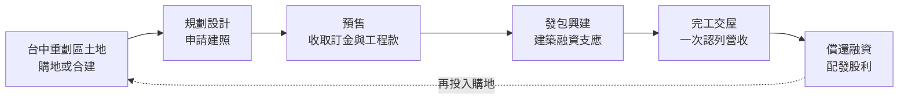
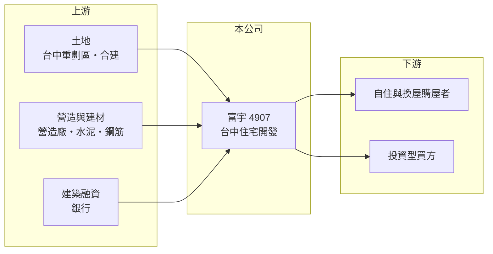

# 4907 富宇

> 上櫃｜[[產業索引-建材營造業|建材營造業]]｜上市（櫃）日期 2002/03/04

# 第一章：企業模式與商業藍圖

> [!info] 撰寫說明
> 本文由 Claude 依公開資料整理，架構比照 [[2330台積電]] 的四章研究，資料截至 2026-10-08。財務數字來源：MoneyDJ 理財網年度財務比率與損益表、櫃買中心開放資料（基本資料、2026 年第二季財報、本益比殖利率）；業務描述參考富果研究法說會頁面、工商時報與旺得富（中時）的新聞標題。公開資料有限，個別建案內容未逐案查證。#待校對

在評估一家建商的長期價值時，第一步是看懂它在哪個城市經營、推案節奏如何，以及獲利如何隨交屋起伏。本章針對富宇地產（股票代號：4907，以下簡稱富宇）的商業模式進行定性分析，說明一家以台中為基地的中型建商如何經營。

## 一、核心定位：以台中為基地的住宅建商

富宇成立於 1988 年，2002 年在櫃買中心掛牌，總部位於台中市西屯區市政北二路，也就是台中七期重劃區一帶，董事長為張世欣，總經理為鍾堯明，實收資本額約 11.8 億元。公司以台中地區的住宅大樓開發為主，自行購地或合建、規劃、發包興建，完工後銷售交屋。

* **台中市場的特性：** 台中是近十年全台人口與房價成長最快的都會區之一，重劃區不斷開發，提供建商大量可開發土地。這讓台中在地建商有較多推案機會，但也意味著同業競爭激烈。
* **營收隨交屋起伏：** 富宇採[[建案交屋]]認列營收，2022 年營收只有約 3.3 億元，2024 年則達約 62.7 億元，2025 年又降到約 17.4 億元，2026 年上半年約 24.5 億元。

## 二、資本轉化邏輯：重劃區土地到住宅交屋

* **[[預售屋]]模式：** 台中建商普遍採預售，動工前就開始銷售，降低完工後餘屋的風險，也讓建商可以用買方的分期款支應部分工程費用。
* **財務槓桿：** 富宇的負債比率在 2022 至 2023 年約 80%，之後隨交屋回收資金降到 2025 年約 71%，2026 年第二季底約 63%（官方資料推算）。

## 三、長期方向：在台中持續累積土地與推案

台中的長期住宅需求來自人口移入、產業園區與交通建設，例如捷運與高鐵站周邊開發。富宇的長期方向是在台中持續累積土地，維持每年穩定的推案節奏，讓交屋年度不要過度集中。2026 年上半年的高毛利交屋，代表前幾年取得的土地成本具有優勢。

# 第二章：護城河深度與競爭優勢

護城河是企業抵禦競爭、長期維持超額利潤的機制。對區域型建商而言，護城河主要來自在地土地與口碑，本章說明富宇的優勢與競爭環境。

## 一、富宇護城河的核心組成要素

* **1. 在地經營與土地取得：** 公司在台中經營超過三十年，熟悉重劃區的發展節奏，能在土地價格尚未全面反映前取得土地。
* **2. 產品毛利：** 2018 至 2025 年[[毛利率]]多在 18% 至 33% 之間，2026 年上半年更達約 44%。毛利率高低主要取決於交屋建案的土地取得成本。
* **3. 相對穩健的財務：** 負債比率由八成降到六成多，在房市轉冷時有較大的緩衝空間。

## 二、主要競爭對手格局

| 對手 | 定位 | 對富宇的威脅 |
|---|---|---|
| [[5206坤悅]] | 台中住宅建商 | 同區域搶地與搶客 |
| [[5213亞昕]] | 近年重押台中的大型建商 | 推案規模大，提高土地競標價格 |
| [[2545皇翔]] | 台北與台中高價住宅 | 在台中七期與豪宅市場競爭 |
| 台中在地建商（如櫻花建設、豐邑等） | 地方型建商 | 熟悉台中市場，產品與價格帶相近 |

## 三、優勢轉化：哪些守得住、哪些守不住

* **守得住：** 已取得的低成本土地，可以在未來交屋時維持較高毛利率。
* **守不住：** 台中近年外地大型建商大量進入，土地價格被推高，新取得土地的毛利空間可能下降。營收高度集中在交屋年度，2022 年 EPS 只有 0.10 元。
* **觀察重點：** 第一，[[已售未入帳]]金額與未來推案量；第二，新購土地的成本與區位；第三，[[信用管制]]對台中房市成交量的影響。

# 第三章：財務體質與盈利規模

資料日期：2026-10-08。數字取自 MoneyDJ 理財網年度財務資料與櫃買中心開放資料，表格是撰寫當時的快照；最新月營收、毛利率、累計 EPS 由自動排程寫在本筆記的屬性欄位（月營收、毛利率、累計EPS 等）。#待校對

財務報表是檢驗護城河是否真實存在的最終標準。本章用五年的三率、ROE、營建業指標與資本報酬，檢視富宇的獲利品質。

## 一、獲利能力的基石：三率

| 年度 | 營收（新台幣） | [[毛利率]] | [[營業利益率]] | EPS（元） | [[ROE]] |
|---|---|---|---|---|---|
| 2021 | 14.9 億 | 26.7% | 17.7% | 1.75 | 10.5% |
| 2022 | 3.29 億 | 28.0% | 5.38% | 0.10 | 0.59% |
| 2023 | 34.0 億 | 17.9% | 9.55% | 2.24 | 13.8% |
| 2024 | 62.7 億 | 19.4% | 14.2% | 6.00 | 31.4% |
| 2025 | 17.4 億 | 21.4% | 11.6% | 1.23 | 5.78% |

資料來源：MoneyDJ 理財網年度損益表與財務比率。2026 年上半年（櫃買中心資料）營收約 24.5 億元、毛利率約 44.1%、營業利益率約 39.3%、EPS 6.50 元。

富宇過去八年每年都有獲利，即使營收最低的 2022 年也維持小幅盈餘，這在區域型建商中相對少見，代表費用控制與建案安排較有紀律。2021 至 2025 年營收年複合成長率約 4%（推算），但交屋年度集中，單年成長率參考價值有限。2026 年上半年毛利率大幅提高，可能來自低成本土地建案的交屋（推估）。

## 二、營建業指標：推案量、已售未入帳與存貨

公司未公開完整的推案量與[[已售未入帳]]金額（未查得）。2026 年第二季底總資產約 83.4 億元，其中流動資產約 81.4 億元，主要是土地與在建、待售房地；流動負債約 51.9 億元，非流動負債很少。存貨約為 2025 年營收的四至五倍，代表仍有數年的開發量。

## 三、[[ROE]] 與股利

2021 至 2025 年平均 ROE 約 12.4%（推算），2024 年交屋高峰時達 31%。依櫃買中心資料，最近一次現金股利為每股 1.5 元，高於 2025 年 EPS 1.23 元，顯示公司在獲利較低的年度仍動用保留盈餘維持股利。2026 年第二季底保留盈餘約 17.9 億元，股利來源相對充足。

## 四、[[ROIC]] 與 [[WACC]]：價值創造利差

**ROIC 推算：** 2025 年營業利益約 2.03 億元，稅後約 1.62 億元。官方資料只揭露負債總計約 52.7 億元，假設其中六成為有息負債約 31.6 億元（推估），加上股東權益約 30.7 億元，投入資本約 62.3 億元，ROIC 約 2.6%（推算）；以 2021 至 2025 年平均營業利益約 3.39 億元計算，ROIC 約 4.4%（推算）。

**WACC 推算：** 台灣 10 年期公債殖利率取 1.75%、市場風險溢酬 6%、β 取營建同業常見值 0.9（未查得公司實際 β），股東權益成本約 7.2%。負債成本假設 3%，稅率 20%，稅後約 2.4%。權益約占投入資本 49%，WACC 約 4.7%（推算）。

**結論：** 富宇五年平均的 ROIC 與 WACC 大致相當，屬於勉強賺回資金成本的水準。2026 年上半年營業利益約 9.6 億元，若高毛利建案的交屋能延續，ROIC 有機會明顯高於 WACC；長期能否創造價值，取決於新土地的取得成本能否維持優勢。

# 第四章：總體風險與地緣政治

任何企業都無法脫離宏觀環境獨立存在。本章分析富宇長期必須面對的房市週期、政策與營運風險。

## 一、產業週期與政策風險

* **台中房市週期：** 台中過去十年房價漲幅大，若人口移入與產業投資放緩，房價修正的幅度可能大於其他城市。
* **[[信用管制]]：** 2024 年第七波選擇性信用管制後，買方貸款與建商融資都受限，預售去化速度變慢。
* **稅制：** 房地合一稅、囤房稅與預售屋轉售限制，會壓抑投資型買盤。

## 二、營運環境的隱性風險

* **土地成本上升：** 外地大型建商進入台中，推高重劃區土地價格，壓縮未來建案的利潤空間。
* **營造成本：** 缺工與建材價格上漲，會讓預售時已鎖定售價的建案毛利下降。
* **區域集中：** 業務集中在台中，若當地供給過剩，價格競爭會加劇。

## 三、財務與其他風險

* **交屋集中：** 營收與獲利集中在少數年度，工程延誤或交屋延後會使年度獲利大幅波動。
* **利率：** 建築融資利率上升，會增加持有土地與在建工程的成本。
* **股利穩定度：** 近年在低獲利年度仍配發高於 EPS 的股利，若交屋空窗期拉長，股利可能需要調降。

# 專有名詞解析

## 金融

- **[[信用管制]]**：央行限制購屋與建商貸款成數的政策，會影響房市成交與建商資金。
- **[[ROIC]]**：投入資本報酬率，稅後營業利益除以股東權益加有息負債，衡量本業運用資本的效率。
- **[[WACC]]**：加權平均資金成本，股東與債權人要求報酬率的加權平均，是 ROIC 要超越的門檻。

## 產業

- **[[建案交屋]]**：建商在房屋完工並交付買方時才認列營收，因此營建公司的營收常集中在交屋年度。
- **[[已售未入帳]]**：已經賣出、但尚未完工交屋而未認列營收的建案金額，是建商未來營收的主要能見度指標。
- **[[預售屋]]**：房屋在興建完成前就先銷售，買方分期繳款，建商可藉此降低資金與銷售風險。

# 核心供應鏈

## 1. 上游：土地、營造與資金
- 土地來源：台中重劃區購地與合建
- 營造：外部發包營造廠（合作對象未查得），台中營造廠如 [[5511德昌]]；建材如 [[1101台泥]]、[[2002中鋼]]
- 資金：銀行建築融資

## 2. 中游：富宇與同業
- 台中住宅同業：[[5206坤悅]]、[[5213亞昕]]、[[2545皇翔]]

## 3. 下游：客戶
- 台中自住、換屋與投資型購屋者

## 最新新聞
<!-- news:start -->
<!-- news:end -->

## 相關連結
- [公開資訊觀測站](https://mopsov.twse.com.tw/mops/web/t05st03?step=1&firstin=1&co_id=4907)
- [Goodinfo](https://goodinfo.tw/tw/StockDetail.asp?STOCK_ID=4907)
- [Yahoo 股市](https://tw.stock.yahoo.com/quote/4907)
- [鉅亨網新聞](https://www.cnyes.com/twstock/4907/news)
