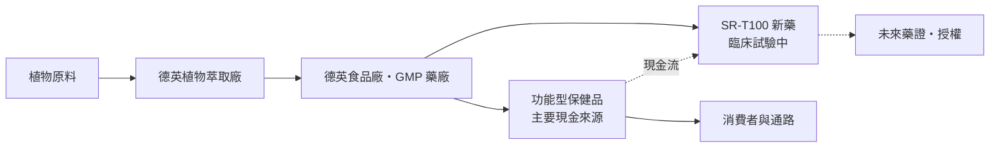
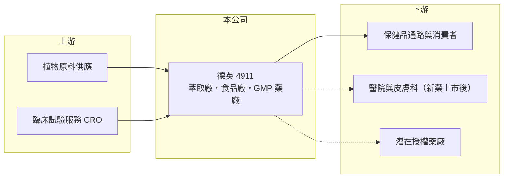

# 4911 德英

> 上櫃｜[[產業索引-生技醫療業|生技醫療業]]｜上市（櫃）日期 2011/03/21

# 第一章：企業模式與商業藍圖

> [!info] 撰寫說明
> 本文由 Claude 依公開資料整理，架構比照 [[2330台積電]] 的四章研究，資料截至 2026-10-08。財務數字來源：Goodinfo 年度經營績效表、櫃買中心開放資料（基本資料、2026 年第二季財報、每月營收、本益比殖利率）；業務與新藥進度取自工商時報 2025 年 11 月櫃買中心業績發表會報導。公開資料有限，各業務營收比重未查得，2023 年後營收大幅成長的產品來源待校對。#待校對

德英是一家「用保健品賺的錢養新藥」的小型生技公司，新藥研發完全靠本業現金流支應，沒有增資或舉債。本章說明德英生物科技（股票代號：4911，以下簡稱德英）的商業模式。

## 一、核心定位：植物新藥起家，保健食品是現金來源

德英成立於 2002 年，2011 年在櫃買中心掛牌，總部位於台南市安南區科技工業區，董事長兼總經理為郭國華，實收資本額約 6.88 億元。公司的業務包括新藥開發、藥品、[[保健食品]]與保養品，擁有 PIC/S GMP 藥廠、原料藥廠、食品廠與植物萃取廠。

* **保健食品是現金牛：** 依 2025 年 11 月報導，德英的功能型保健品涵蓋肝臟保健、護眼、關節、靜脈循環、止癢與皮膚抗老，這些產品強調差異化效果，是支撐研發的主要現金流。2023 至 2025 年毛利率約 80% 至 85%，代表產品具有相當的訂價能力。
* **新藥是長期選擇權：** 核心新藥 SR-T100 屬於[[植物新藥]]，以外用劑型為主，適應症涵蓋皮膚癌、日光角化症、人類乳突病毒（HPV）引起的尖形濕疣與尋常疣、皮膚老化，另有治療癌症惡性腹水的注射劑在開發中。

## 二、資本轉化邏輯：自有藥廠與萃取廠一條龍

* **垂直整合：** 從植物萃取到藥廠與食品廠都自己掌握，同一套萃取技術可以同時用在保健品與新藥，降低研發與生產成本。
* **自籌研發：** 2025 年 11 月董事長在業績發表會表示，新藥開發完全依靠本業現金流，沒有增資、沒有舉債。2026 年第二季底負債僅約 1.0 億元，權益約 8.8 億元。

## 三、長期方向：SR-T100 臨床里程碑

依 2025 年報導，SR-T100 在 2025 年推進多項臨床，包括皮膚癌與日光角化症三期試驗、HPV 與疣類二至三期試驗，並擴大到惡性腹水注射劑，公司規劃若進展順利，2026 年啟動惡性腹水注射劑一期試驗（是否啟動待校對）。新藥能否取得藥證或對外[[授權]]，決定德英能否從保健品公司轉型為新藥公司。

# 第二章：護城河深度與競爭優勢

護城河是企業抵禦競爭、長期維持超額利潤的機制。本章說明德英在保健品與植物新藥領域的優勢與限制。

## 一、德英護城河的核心組成要素

* **1. 植物萃取與製藥設施：** 擁有植物萃取廠與 PIC/S GMP 藥廠，能以藥品等級的品質生產保健品，這是一般保健品品牌委外代工難以做到的差異。
* **2. 高毛利產品組合：** 2025 年毛利率約 85%，營業利益率約 49%，代表產品不是靠價格競爭，而是靠功效訴求與客戶信任。
* **3. 零負債的財務紀律：** 研發完全自籌，不必在臨床關鍵時刻被迫增資稀釋股東。

## 二、主要競爭對手格局

| 對手 | 定位 | 對德英的影響 |
|---|---|---|
| [[4108懷特]] | 植物新藥開發 | 同樣走植物新藥路線，比較臨床進度與授權條件 |
| [[4128中天]] | 植物新藥與保健品通路 | 同樣以保健品支撐新藥研發 |
| [[1707葡萄王]] | 大型保健品製造與直銷 | 在保健品市場規模與通路遠大於德英 |
| 國際皮膚科藥廠 | 日光角化症與疣類已上市藥物 | SR-T100 上市後需與既有療法競爭 |

## 三、優勢轉化：守得住與守不住的地方

* **守得住：** 2023 至 2025 年營收從 1.81 億元成長到 3.09 億元，EPS 從 1.30 元成長到 2.18 元，連續三年創新高，顯示保健品事業確實能產生穩定獲利。
* **守不住：** 2026 年 1 至 8 月累計營收約 0.90 億元，較前一年同期的 2.14 億元減少約 58%，顯示營收高度依賴少數產品或客戶，波動很大（衰退原因未查得）。
* **觀察重點：** 營收衰退是否為短期調整、SR-T100 三期試驗結果，以及惡性腹水注射劑的臨床進度。

# 第三章：財務體質與盈利規模

資料日期：2026-10-08，表格是撰寫當時的快照；最新月營收、毛利率、累計 EPS 由自動排程寫在本筆記的屬性欄位（月營收、毛利率、累計EPS 等）。#待校對

財務報表是檢驗護城河是否真實存在的最終標準。本章用五年的三率、ROE 與資本報酬，檢視德英從虧損轉為高獲利的過程。

## 一、多年度財務表現

| 年度 | 營收（新台幣） | [[毛利率]] | [[營業利益率]] | EPS（元） | [[ROE]] |
|---|---|---|---|---|---|
| 2021 | 0.25 億 | 39.2% | -79.6% | -0.36 | -2.87% |
| 2022 | 0.65 億 | 60.9% | 8.49% | 0.13 | 1.07% |
| 2023 | 1.81 億 | 79.7% | 44.5% | 1.30 | 9.96% |
| 2024 | 2.49 億 | 82.5% | 48.0% | 1.73 | 12.8% |
| 2025 | 3.09 億 | 85.1% | 49.3% | 2.18 | 15.8% |

資料來源：Goodinfo 年度經營績效（合併報表）。2026 年上半年（櫃買中心資料）營收約 0.67 億元、毛利率約 70.4%、營業利益率約 19.9%、EPS 0.33 元。

* **轉折點：** 2022 年以前營收不到 1 億元且多為虧損，2023 年起營收與毛利率同步大幅提升，營業利益率從負值轉為 45% 至 49%，屬於少見的高獲利生技公司。2022 至 2025 年營收年複合成長率約 68%（推算），但 2026 年上半年明顯回落。
* **長期指標：** 2021 至 2025 年平均 ROE 約 7.4%（推算），但近三年 ROE 逐年提高到約 16%。依櫃買中心資料，近一年每股股利約 1.97 元，以 2025 年 EPS 計算配發率約 90%（推算）；股本從 2023 年約 5.57 億元增加到目前約 6.88 億元，推估有盈餘轉增資（待校對）。

## 二、[[ROIC]] 與 [[WACC]]：價值創造利差

**ROIC 推算：** 2025 年營業利益約 1.52 億元，稅率 20% 後約 1.22 億元。2026 年第二季底負債約 1.0 億元，幾乎全為流動負債，假設沒有有息負債（推估），投入資本以權益約 8.77 億元計算，ROIC 約 13.9%（推算）。

**WACC 推算：** 台灣 10 年期公債殖利率取 1.75%、市場風險溢酬 6%、β 取生技同業常見值 0.9（未查得公司實際 β），股東權益成本約 7.15%。由於幾乎沒有有息負債，WACC 約等於權益成本 7.2%（推算）。

**結論：** 2025 年 ROIC 高於 WACC 約 7 個百分點，代表保健品事業正在創造價值。但若 2026 年營收衰退延續，以上半年營業利益約 0.13 億元年化計算，ROIC 會降到約 2% 至 3%（推算），低於資金成本，因此德英的價值創造能力取決於營收能否恢復。

# 第四章：總體風險與地緣政治

任何企業都無法脫離宏觀環境獨立存在。本章分析德英長期必須面對的研發、市場與營運風險。

## 一、研發與法規風險

* **臨床試驗失敗：** SR-T100 的三期試驗若未達主要指標，多年投入可能無法回收；植物新藥成分複雜，審查標準也比單一化合物嚴格。
* **商業化能力：** 德英規模小，即使取得藥證，海外上市多半需要找國際藥廠授權，授權條件與時程不確定。

## 二、市場與營運風險

* **營收集中：** 2026 年營收大幅下滑，顯示保健品營收可能集中在少數產品或通路，一旦客戶調整庫存或需求轉弱，獲利會快速縮水。
* **保健品競爭：** 保健食品進入門檻低，廣告與通路費用高，功效訴求也受食品廣告法規限制。
* **法規變動：** 健康食品認證、標示與廣告規範趨嚴，可能限制產品的行銷方式。

## 三、財務與其他風險

* **研發資金依賴本業：** 不增資、不舉債的策略在本業好時是優點，但本業衰退時，研發進度可能被迫放慢。
* **規模小：** 年營收約 3 億元等級，股價與財務數字對單一事件的敏感度高。

# 專有名詞解析

## 金融

- **[[ROIC]]**：投入資本報酬率，稅後營業利益除以股東權益加有息負債，衡量本業運用資本的效率。
- **[[WACC]]**：加權平均資金成本，股東與債權人要求報酬率的加權平均，是 ROIC 要超越的門檻。

## 產業

- **[[植物新藥]]**：以植物萃取物為有效成分的新藥，成分複雜，需完整臨床試驗才能取得藥證。
- **[[保健食品]]**：以補充營養或維持健康為訴求的食品，不屬藥品，進入門檻低、品牌競爭激烈。
- **[[授權]]**：藥廠把產品或技術的開發、銷售權利授予其他公司，以換取簽約金、里程碑金與銷售權利金。

# 核心供應鏈

## 1. 上游：原料與研發服務
- 植物原料供應商、臨床試驗受託研究機構（名稱未查得）

## 2. 中游：德英與同業
- 植物新藥同業：[[4108懷特]]、[[4128中天]]
- 保健品同業：[[1707葡萄王]]

## 3. 下游：客戶
- 保健品通路與消費者；SR-T100 未來的醫院端與授權合作對象

## 最新新聞
<!-- news:start -->
<!-- news:end -->

## 相關連結
- [公開資訊觀測站](https://mopsov.twse.com.tw/mops/web/t05st03?step=1&firstin=1&co_id=4911)
- [Goodinfo](https://goodinfo.tw/tw/StockDetail.asp?STOCK_ID=4911)
- [Yahoo 股市](https://tw.stock.yahoo.com/quote/4911)
- [鉅亨網新聞](https://www.cnyes.com/twstock/4911/news)
