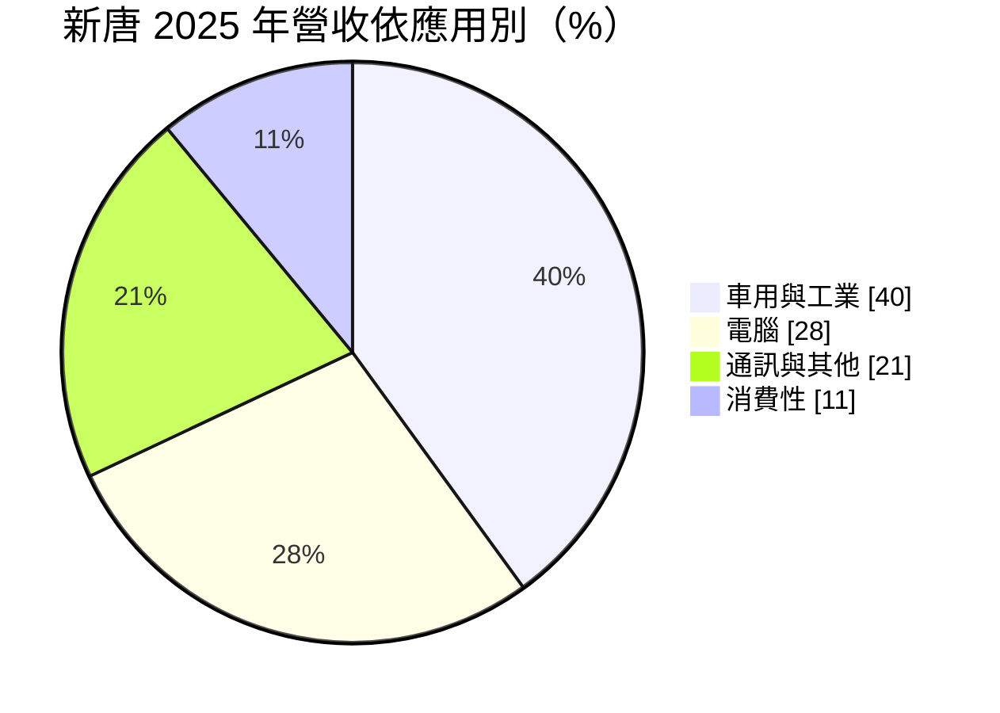
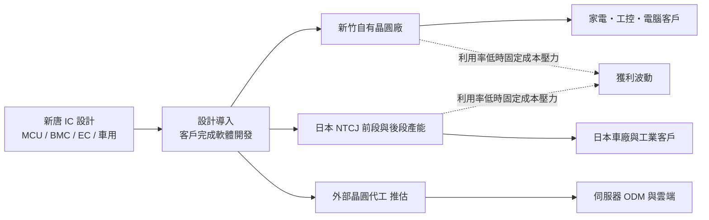
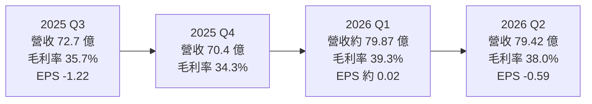
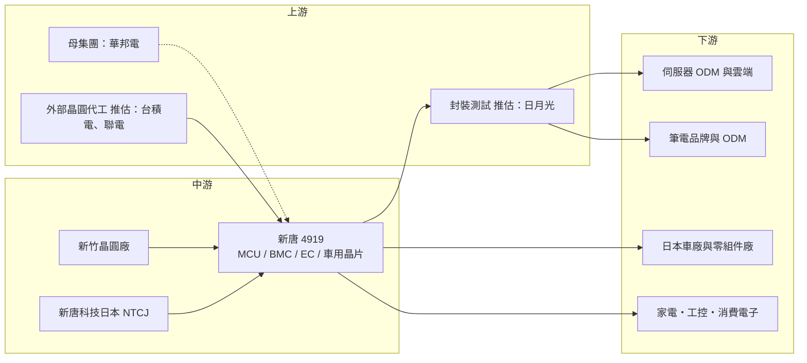

# 4919 新唐

> 上市｜[[產業索引-半導體業|半導體業]]｜上市（櫃）日期 2010/09/27

# 第一章：企業模式與商業藍圖

> [!info] 撰寫說明
> 本文由 Claude 依公開資料整理，架構比照 [[2330台積電]] 的四章研究，資料截至 2026-10-07。財務數字來源：旺得富／中時（2026 年 8 月第二季法說報導）、工商時報（2026 年 8 月）、股感（2025 年第四季法說重點）、科技新報（2025 年 11 月法說報導）；產業描述為整理性內容，尚未逐條比對原始文件。#待校對

在評估單一個股的長期投資價值時，首要步驟是拆解企業的底層獲利邏輯。本章針對新唐科技（股票代號：4919，以下簡稱新唐）的商業模式進行定性分析，說明這家以微控制器起家的公司，為何同時擁有晶圓廠與日本事業，以及這個「小型 IDM」架構如何同時成為它的優勢與包袱。

## 一、核心定位：台灣主要的 MCU 公司，兼具晶圓廠與日本事業

新唐是華邦電子集團旗下的半導體公司，由華邦電的邏輯 IC 事業分割成立，董事長為蘇源茂。新唐的主力產品是微控制器（[[MCU]]），也就是放在家電、工控設備、汽車與電腦裡負責控制各種功能的小型處理器，是台灣規模最大的 MCU 供應商之一。

新唐的經營模式與一般台灣 IC 設計公司不同：

* **設計加自有晶圓廠：** 在新竹擁有自己的晶圓廠，可生產部分產品並提供晶圓代工服務。
* **日本事業：** 2020 年收購日本 Panasonic 的半導體事業，成立新唐科技日本（NTCJ），取得日本的前段與後段產能、車用客戶與影像感測、功率元件等產品線。

因此新唐比較像是一家「小型 [[IDM]]」，同時具有設計、製造與海外營運。這個架構在缺貨時期是優勢，在需求下滑時則因固定成本高而成為獲利拖累。

## 二、終端應用／產品板塊：車用與工業最大，電腦次之

依股感整理的 2025 年第四季法說內容，2025 年應用別營收比重如下：

* **車用與工業：** 車用 MCU、電池監控、馬達驅動、智慧座艙等，日本子公司的車用業務占比高。
* **電腦：** 最重要的是伺服器基板管理控制器（[[BMC]]）晶片，以及筆電中的嵌入式控制器（[[EC]]）、安全晶片等。
* **通訊與其他、消費性：** 手機周邊、家電與各類消費電子控制晶片。

2026 年第二季，AI 與運算比重由第一季的 35% 降到 31%，原因是記憶體價格上漲壓抑 PC 需求；通訊比重則由 15% 提升到 20%，受惠大客戶旗艦手機推出。

近年的重點新產品包括：

* **BMC 晶片（NPCM8mnx 系列）：** 公司表示 AI 伺服器 BMC 需求「明確且可觀」，並從傳統 CPU 伺服器延伸到 [[ASIC]] 架構的 AI 基礎設施。
* **數位電源 MCU：** 應用在電動自行車充電樁等。
* **[[NFC]] 標籤晶片：** 導入日本駕照等應用。
* **其他：** 智慧座艙與車用通訊方案、48 伏馬達驅動晶片、智慧眼鏡 Bridge IC 等。

## 三、資本轉化邏輯：設計導入換長尾營收，產能利用率決定獲利

* **設計導入的長尾：** MCU 一旦被設計進客戶產品並完成軟體開發，在產品生命週期內很少更換，營收可延續數年。
* **自有產能的兩面性：** 台灣新竹晶圓廠負責研發與部分生產，並提供晶圓代工服務，管理層提到 8 吋晶圓需求成長，是 2027 年營運動能之一。日本子公司擁有前段與後段產能，以車用與工業客戶為主。這些產能在[[產能利用率]]高時帶來成本優勢，利用率低時則讓折舊與人力成本壓過毛利。
* **其他據點：** 在中國、美國、以色列等地設有研發與業務據點（推估）。

## 四、企業長期藍圖：日本轉盈、搭上 AI 伺服器、技術差異化

* **讓日本事業轉虧為盈：** 2022 年晶片短缺時，日本子公司為滿足需求投資前段與後段產能，但之後車用需求下滑、產能利用率不如預期，導致成本上升、連續虧損。董事長蘇源茂表示，目標是透過製造成本合理化與產品線擴展，在最短時間內讓日本營運回到 2023 年的水準。
* **搭上 AI 伺服器：** BMC 是新唐最直接的 AI 受惠產品，公司加大 AI 相關研發投入，為 2027 年 AI 需求成長做準備。
* **技術差異化奪回 MCU 市占：** 以[[後量子密碼]]、先進電源管理等技術，與中國低價 MCU 業者做出區隔。公司認為中國競爭對手面臨價格壓力與產能被 AI 排擠，有利新唐在 2026 年收復市占。

# 第二章：護城河深度與競爭優勢

在長期價值投資中，「護城河」指企業抵禦競爭、維持超額利潤的保護機制。本章分析新唐的護城河構成、MCU 與 BMC 兩個市場的競爭格局，以及新唐的優勢在國際大廠與中國低價業者夾擊下能守住多少。

## 一、護城河的核心組成要素

新唐的護城河屬於「窄」，在個別產品上較具優勢：

* **1. BMC 的寡占市場：** 伺服器 BMC 市場由少數業者主導，需要和伺服器平台、韌體與資料中心客戶長期驗證，新進者難以切入。新唐是少數具有量產實績的供應商之一。
* **2. MCU 的設計導入黏著度：** 新唐擁有大量家電、工控與車用客戶的設計導入，客戶更換 MCU 需要重寫軟體與重新驗證。
* **3. 自有晶圓廠與日本產能：** 自有產能讓新唐在缺貨時期能優先供應客戶，日本產能則讓它能服務重視本地供應的日本車廠與工業客戶，車用產品還需通過[[車規驗證]]。
* **4. 華邦集團資源：** 與 [[2344華邦電]] 在記憶體、製造與資金上的集團綜效。

## 二、全球主要競爭對手格局

| 市場 | 對手 | 對新唐的威脅 |
|---|---|---|
| 伺服器 BMC | [[5274信驊]] | 全球 BMC 龍頭，市占率遠高於新唐，是 AI 伺服器 BMC 的主要對手 |
| 通用與車用 MCU | 意法半導體、恩智浦、瑞薩電子、微芯科技、英飛凌 | 規模與產品線遠大於新唐，車用客戶基礎深 |
| 中低價 MCU | 兆易創新等中國業者 | 以低價搶占中國與新興市場 |
| 台灣 MCU | [[6202盛群]] | 在家電與消費性 MCU 重疊 |
| 筆電 EC 與安全晶片 | [[2379瑞昱]]、[[3014聯陽]] | 在筆電周邊控制晶片競爭 |

## 三、優勢轉化：哪些市場守得住、哪些守不住

* **守得住：** BMC 與筆電 EC 等已有量產實績的產品，客戶黏著度高；日本車用客戶重視長期供應，新唐日本有一定地位。
* **守不住：** 通用 MCU 市場面臨中國業者的低價競爭，國際大廠規模與產品線也遠大於新唐；日本子公司的成本問題短期內難以完全解決。2025 年全年每股虧損 3.97 元，2026 年上半年仍小幅虧損，顯示獲利結構尚未恢復。
* **觀察重點：** 日本子公司虧損縮減的速度；BMC 在 AI 伺服器的市占能否擴大；毛利率能否穩定在 38% 以上並讓營業利益轉正。

# 第三章：財務體質與盈利規模

資料日期：2026-10-07。數字取自旺得富／中時、工商時報、股感與科技新報等財經媒體整理，表格是撰寫當時的快照；最新月營收、毛利率、累計 EPS 由自動排程寫在本筆記的屬性欄位（月營收、毛利率、累計EPS 等）。#待校對

財務報表是檢驗護城河是否真實存在的最終標準。本章用三率、ROE、現金流與資本報酬，檢視新唐在日本事業拖累下的獲利品質與轉機。

## 一、獲利能力的基石：三率

| 項目 | 2025 全年 | 2025 Q4 | 2026 Q1 | 2026 Q2 |
|---|---|---|---|---|
| 營收（新台幣） | 304.92 億 | 70.4 億 | 約 79.87 億（推算） | 79.42 億 |
| [[毛利率]] | 未查得 | 34.3% | 39.3% | 38.0% |
| [[營業利益率]] | 未查得（虧損） | 約 -10% | 約 -1.4%（推算） | -4.2% |
| EPS（元） | -3.97 | 未查得 | 約 0.02（推算） | -0.59 |

* **[[毛利率]]：** 2026 年第二季毛利率 38%，比前一年同期提升 3.1 個百分點，顯示產品組合與成本合理化已見成效。
* **[[營業利益率]]：** 第二季仍有營業虧損 3.33 億元，原因包括供應鏈限制、PC 需求轉弱與研發費用增加。毛利率回升但營業費用同步增加，是新唐尚未轉正的關鍵。
* **2025 年：** 營收年減 4.4%，全年每股虧損 3.97 元，主因日本子公司產能利用率不佳與車用需求下滑。
* **2026 年上半年：** 營收 159.29 億元，年減 1.6%，稅後淨損 2.42 億元，每股虧損 0.57 元。第一季數字為上半年減去第二季推算，第一季小幅獲利、第二季再轉為虧損。
* **展望：** 公司預期 2026 年第三季營運與第二季大致持平，訂單量仍大於產能。

## 二、[[ROE]]：資本效率

新唐連續虧損，ROE 為負值。收購日本事業後，資產規模與固定成本大增，但日本產能利用率偏低，拖累整體資本效率。依股感整理，2025 年底現金約 72 億元、存貨約 62 億元，存貨水位偏高也占用了營運資金。

## 三、資本支出與自由現金流

* **[[CapEx]]：** 確切金額本次未查得。新唐需要維持台灣與日本晶圓廠的設備投資，但在虧損期間，資本支出推估以維持性投資為主。
* **[[自由現金流]]：** 存貨去化是改善現金流的關鍵，若需求回溫、存貨下降，營業現金流可望改善（推估）。
* **股利政策：** 新唐 2025 年處於虧損，2025 年度股利本次未查得。在恢復獲利之前，股利發放能力有限。

## 四、[[ROIC]] 與 [[WACC]]：價值創造利差

在營業虧損期間，新唐的 ROIC 低於資金成本，代表投入的資本（特別是日本產能）目前並未創造價值（推估，具體數值未查得）。利差能否轉正，取決於日本產能利用率回升與 BMC 等高毛利產品的放量。

# 第四章：總體風險與地緣政治

任何企業都無法脫離宏觀環境獨立存在。本章分析新唐未來必須面對的地緣政治、產業週期、營運與技術風險。

## 一、地緣政治風險

* **中國 MCU 競爭：** 中國在政策扶植下發展本土 MCU，以低價搶占中國與新興市場，新唐的消費性與工業 MCU 首當其衝。
* **日本營運：** 日本子公司受當地車用與工業景氣影響，也面臨日圓匯率波動與當地高人力成本。
* **美國關稅與出口管制：** 伺服器 BMC 與 AI 相關產品最終銷往美國資料中心，美國關稅政策與 AI 晶片管制可能間接影響需求。
* **台灣集中：** 新竹晶圓廠與研發中心位於台灣，面臨兩岸風險。

## 二、產業週期與市場結構風險

* **車用與工業景氣：** 車用與工業占營收四成，2024 至 2025 年車用庫存調整拖累新唐表現，若復甦不如預期，日本事業虧損難以收斂。
* **PC 需求：** 記憶體價格上漲壓抑 PC 需求，影響筆電 EC 與相關晶片出貨。
* **MCU 價格戰：** MCU 屬於競爭激烈的市場，價格壓力會壓縮毛利率。

## 三、營運環境的隱性風險

* **日本子公司虧損：** 產能利用率偏低、固定成本高，是新唐最主要的獲利拖累，短期內壓力仍會持續。
* **供應鏈限制：** 2026 年第二季因供應鏈問題無法滿足全部訂單，若持續，將影響營收成長。
* **研發費用增加：** 為 AI 需求預做準備而擴大研發，短期會壓低營業利益。

## 四、科技演進風險

AI 伺服器架構快速演變，BMC 的規格與功能要求不斷提高；若新唐在新世代 BMC 的開發進度落後信驊，市占可能難以擴大。MCU 方面，客戶對[[邊緣運算]]、資安（如後量子密碼）的需求提高，新唐需要持續投資新技術才能維持競爭力。

# 專有名詞解析

## 半導體

- **[[MCU]]**：微控制器，把處理器、記憶體與輸入輸出介面整合在一顆晶片上的小型控制晶片，廣泛用於家電、工控與汽車。
- **[[IDM]]**：整合元件製造廠，從晶片設計、製造到封測都自己完成的半導體公司，例如英特爾、德州儀器。
- **[[BMC]]**：基板管理控制器，伺服器主機板上獨立於主系統的管理晶片，負責監控溫度、電源並讓管理員遠端操作。
- **[[EC]]**：嵌入式控制器，筆電主機板上負責鍵盤、電池、風扇與電源開關等基本功能的控制晶片。
- **[[ASIC]]**：特定應用積體電路，為單一客戶或單一用途量身設計的晶片，例如雲端業者自用的 AI 加速器。
- **[[NFC]]**：近場通訊，十公分內的短距離無線通訊技術，用於感應支付、門禁與電子證件。

## 應用

- **[[車規驗證]]**：車用晶片須通過 AEC-Q100 等可靠度測試與車廠認證，流程常需 2 至 3 年，因此轉換成本高。
- **[[邊緣運算]]**：在終端裝置或靠近資料來源的地方直接處理資料，而不全部送到雲端，可降低延遲與頻寬需求。

## 金融

- **[[產能利用率]]**：實際投片量占總產能的比例，自有晶圓廠的毛利率高度取決於此數字。
- **[[自由現金流]]**：營業活動現金流減去資本支出，代表企業可自由用於配息、還債或併購的現金。

## 產業

- **[[後量子密碼]]**：能抵抗未來量子電腦破解的新一代加密演算法，各國正逐步把它納入資安標準。

# 核心供應鏈

## 1. 上游：晶圓代工、封測與集團資源
- 母集團：[[2344華邦電]]
- 外部晶圓代工（推估）：[[2330台積電]]、[[2303聯電]]
- 封裝測試（推估）：[[3711日月光投控]]

## 2. 中游：新唐本身
- 台灣：新竹總部與晶圓廠
- 日本：新唐科技日本（原 Panasonic 半導體事業）

## 3. 下游：客戶類型
- 伺服器與 AI 基礎設施：伺服器 ODM 與雲端業者，如 [[2382廣達]]、[[6669緯穎]]（推估）
- 筆電品牌與 ODM
- 日本車廠與車用零組件業者
- 家電、工控與消費性電子廠

## 4. 同業
- BMC：[[5274信驊]]
- MCU：意法半導體、恩智浦、瑞薩電子、微芯科技、[[6202盛群]]
- 筆電 EC：[[2379瑞昱]]、[[3014聯陽]]

## 最新新聞
<!-- news:start -->
<!-- news:end -->

## 相關連結
- [公開資訊觀測站](https://mopsov.twse.com.tw/mops/web/t05st03?step=1&firstin=1&co_id=4919)
- [Goodinfo](https://goodinfo.tw/tw/StockDetail.asp?STOCK_ID=4919)
- [Yahoo 股市](https://tw.stock.yahoo.com/quote/4919)
- [鉅亨網新聞](https://www.cnyes.com/twstock/4919/news)
