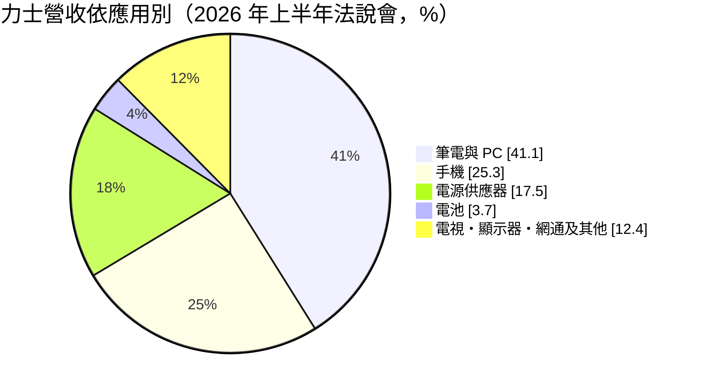
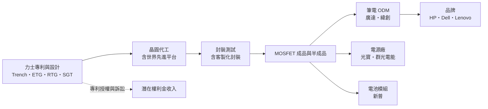
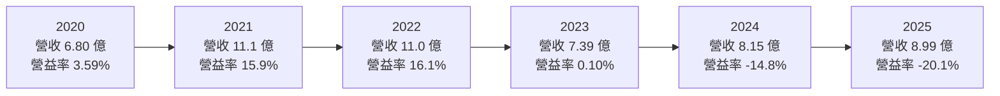
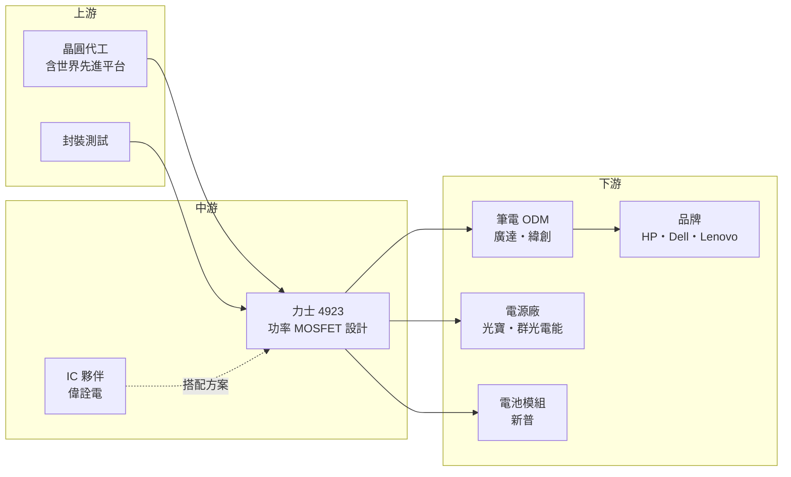

# 4923 力士

> 上櫃｜[[產業索引-半導體業|半導體業]]｜上市（櫃）日期 2022/03/14

# 第一章：企業模式與商業藍圖

> [!info] 撰寫說明
> 本文由 Claude 依公開資料整理，架構比照 [[2330台積電]] 的四章研究，資料截至 2026-10-08。財務數字來源：Goodinfo 年度獲利指標、資產負債結構與股利政策頁、富果研究 2026 年 8 月法說會整理、科技新報 2025 年 2 月專利訴訟報導、Yahoo 股市公司基本資料；產業描述為整理性內容，尚未逐條比對原始文件。#待校對

在評估單一個股的長期投資價值時，首要步驟是拆解企業的底層獲利邏輯。本章針對力士科技（股票代號：4923，以下簡稱力士）的商業模式進行定性分析，說明這家小型功率元件設計公司如何以溝槽式 MOSFET 專利立足筆電供應鏈，以及為什麼它近年的財報波動，很大一部分來自專利訴訟而非本業。

## 一、核心定位：以專利為核心的功率 MOSFET 設計公司

力士成立於 2007 年，董事長兼總經理為鍾明道，是專注於功率[[MOSFET]]的設計公司。MOSFET 是電子產品中最常見的功率開關元件，負責電源轉換、電池保護與負載切換。一台筆電的主機板上通常有數十顆 MOSFET，用來把電池或變壓器的電壓轉換成處理器、記憶體與周邊需要的各種電壓。

力士的定位可以用兩個關鍵字描述：溝槽式結構與專利。依富果研究整理的 2026 年 8 月法說會，力士主要產品是溝槽式（Trench）MOSFET 晶片與半成品，另有二極體與電晶體，MOSFET 占 2026 年上半年營收九成以上。公司累積了 116 項專利，其中 85 項是美國專利，技術包括 Normal Trench、ETG、RTG 與 [[SGT]] 等結構。對一家年營收不到 10 億元的公司而言，這個專利組合相當龐大，也是力士最重要的資產。

這個定位的長期意義在於，功率 MOSFET 是一個國際大廠與大量中小廠並存的市場，產品規格高度標準化，價格競爭激烈。力士選擇以專利結構與客製化設計建立差異，避免完全陷入規格品的價格戰；同時也把專利當成一種可以主張權利的資產，這在 2022 年後演變成對華碩等公司的美國專利訴訟。

## 二、終端應用／產品板塊

依 2026 年上半年法說會，力士的營收結構以筆電與手機相關應用為主：

**筆電與 PC** 是力士最大的市場，終端品牌包括 HP、Dell、Lenovo，透過廣達、緯創等代工廠採購。筆電主機板需要多種規格的 MOSFET，力士的策略是擴充產品線，提供主機板全套 MOSFET，從國際大廠手中搶占市占。

**手機與電池**應用主要是電池保護與充電路徑上的 MOSFET，客戶包括電池模組廠新普。這類應用重視低導通電阻與小封裝，也需要強化靜電防護。

**電源供應器**客戶包括光寶、群光電能等，應用於變壓器與伺服器電源。力士以 ETG 專利技術與客製化封裝，爭取高效率電源的設計案。

依法說會，新產品占 2026 年上半年營收約 31%，帶動毛利率改善。公司也指出，低軌衛星設備、伺服器、鋰電池與遊戲機等新應用預計 2026 年下半年放量，無人機、人形機器人與 AI 散熱風扇則在送樣階段。

## 三、資本轉化邏輯（營運模式）：專利設計加外包製造

力士採用輕資產的設計公司模式，依 Goodinfo，2025 年固定資產只占總資產約 1.35%。晶圓委由代工廠生產，法說會提到公司結合自身專利與 [[5347世界先進]] 的製程平台，開發小型化、高效能的客製晶圓。此外，力士也與中國夥伴合作，把半成品帶入車用、電動車與 AI 運算市場。

這個模式的獲利來源有兩個層次。第一層是賣晶片的毛利，力士的毛利率在 2021 至 2023 年約 27% 至 33%，2024 至 2025 年降到 22% 至 24%。第二層是專利本身，若訴訟勝訴或達成授權，可能產生賠償金或權利金收入；但訴訟期間需要支付龐大的律師與訴訟費用，這在 2024 至 2025 年直接造成營業虧損。

## 四、企業長期藍圖：擴大筆電市占並延伸到高功率應用

力士的長期藍圖有三個方向。第一是筆電全產品線，從部分料號擴展到主機板全套 MOSFET，提高每台筆電的出貨價值。第二是高功率與電池應用，依法說會，公司未來的專利重點是電池與高功率應用的新晶片結構，以及把晶片設計與先進封裝結合。第三是新應用領域，包括低軌衛星、伺服器電源、無人機與機器人，這些市場對可靠度與效率的要求較高，價格敏感度也比消費性產品低。

訴訟方面，依科技新報 2025 年 2 月的報導，美國德州東區聯邦法院陪審團裁決華碩侵害力士兩項美國專利，須賠償 1,050 萬美元；依 2026 年 8 月法說會，法院已計算賠償金、利息與權利金，後續視法院駁回華碩重新審理的請求而定，另一件在北加州的訴訟預計 2026 年 12 月有陪審團裁決。公司表示訴訟已接近尾聲，未來對財務不會有重大影響。訴訟的最終結果，將決定專利資產能否轉化為實際收入。

# 第二章：護城河深度與競爭優勢

「護城河」指企業抵禦競爭、維持超額利潤的保護機制。本章分析力士的護城河組成、全球主要競爭對手，以及它在高度競爭的 MOSFET 市場中能守住多少。

## 一、力士護城河的核心組成要素

力士的護城河很窄，主要由兩個要素構成。

第一是專利組合。85 項美國專利涵蓋多種溝槽式 MOSFET 結構，讓力士在美國市場擁有主張權利的籌碼。專利一方面讓競爭者在設計相似結構時必須迴避，另一方面也能透過訴訟或授權轉化為收入。不過專利有年限，法說會提到力士也在相關專利到期後採用 SGT 結構，代表專利保護是會隨時間消失的，必須持續申請新專利才能維持。

第二是筆電供應鏈的客戶關係。力士的 MOSFET 已打入 HP、Dell、Lenovo 等品牌與廣達、緯創等代工廠的料號清單。筆電主機板的料號一旦通過驗證，在該機種生命週期內通常不會更換，這提供一定程度的訂單延續性。

但要注意，這兩個要素都不足以抵擋價格競爭。MOSFET 規格高度標準化，同一個料號往往有多家供應商可以替代，力士的毛利率長期只在二至三成之間，就說明它缺乏強勢的定價能力。

## 二、全球主要競爭對手格局

| 對手 | 定位 | 對力士的威脅 |
|---|---|---|
| 英飛凌、安森美、威世等國際大廠 | 產品線完整、規模大 | 在筆電與電源的高階料號占主導 |
| [[5425台半]]、[[2481強茂]]、[[5299杰力]] 等台灣功率元件廠 | 分離式元件與 MOSFET | 在筆電與消費性市場直接競爭 |
| [[6719力智]]、[[3588通嘉]] 等電源 IC 公司 | 電源管理方案搭配 MOSFET | 以整合方案搶占設計位置 |
| 中國 MOSFET 業者 | 低價、政策扶植 | 壓低中低階 MOSFET 價格 |

依科技新報報導，力士對華碩的訴訟中被指控的零件，來自強茂、杰力、樂山無線電與力智等供應商，顯示這些公司與力士在同一批筆電料號上直接競爭。

## 三、優勢轉化：守得住／守不住／觀察重點

力士守得住的，是以專利結構與客製化封裝取得的特定設計案，例如高效率電源與電池保護。這類產品需要配合客戶的電路設計，單純比價的空間較小。

守不住的，是一般規格的筆電與消費性 MOSFET。這些產品同質性高，中國與台灣同業眾多，力士 2020 年營收只有 6.8 億元，2021 年在晶片短缺時跳升到 11.1 億元，2023 年又回落到 7.39 億元，顯示一般料號的需求與價格都隨景氣大幅波動。

長期觀察重點有三個：專利訴訟的最終判決與賠償能否實際入帳；新產品與高功率應用的比重能否持續提高，使毛利率穩定在 25% 以上；以及訴訟費用結束後，營業費用能否回到與營收規模相稱的水準。

# 第三章：財務體質與盈利規模

資料日期：2026-10-08。數字取自 Goodinfo 年度財務資料、資產負債結構與股利政策頁、富果研究法說會整理，表格是撰寫當時的快照；最新月營收、毛利率、累計 EPS 由自動排程寫在本筆記的屬性欄位（月營收、毛利率、累計EPS 等）。#待校對

財務報表是檢驗護城河是否真實存在的最終標準。本章用六年的三率、ROE、現金流與資本報酬，檢視力士的獲利品質，並區分本業與訴訟費用的影響。

## 一、獲利能力的基石：三率

| 年度 | 營收（新台幣） | [[毛利率]] | [[營業利益率]] | EPS（元） | [[ROE]] |
|---|---|---|---|---|---|
| 2020 | 6.80 億 | 18.5% | 3.59% | 0.59 | 3.38% |
| 2021 | 11.1 億 | 28.0% | 15.9% | 5.73 | 28.5% |
| 2022 | 11.0 億 | 32.5% | 16.1% | 6.47 | 25.8% |
| 2023 | 7.39 億 | 27.2% | 0.10% | 0.20 | 0.83% |
| 2024 | 8.15 億 | 23.8% | -14.8% | -2.33 | -11.7% |
| 2025 | 8.99 億 | 22.6% | -20.1% | -5.26 | -35.3% |

六年數字可以分成兩段來看。2020 至 2023 年是一般的景氣循環：2021 至 2022 年晶片短缺時，MOSFET 供不應求，力士營收衝上 11 億元，營業利益率約 16%；2023 年需求反轉，營收掉回 7.39 億元，營業利益率接近零。2020 至 2025 年營收年複合成長率約 5.7%（推算）。

2024 至 2025 年則是訴訟費用主導的虧損。這兩年營收其實比 2023 年回升，毛利率也維持在 22% 至 24%，但營業利益率分別跌到 -14.8% 與 -20.1%。依法說會，虧損主因是美國專利訴訟的大額費用；2026 年上半年訴訟費用減少，營業費用較前一年同期下降約 32%，公司就轉為小幅獲利。因此，評估力士的本業獲利能力時，應把訴訟費用分開看待。

毛利率從 2022 年的 32.5% 降到 2025 年的 22.6%，則是本業的真實變化，反映 MOSFET 價格回落與競爭加劇。依法說會，2026 年上半年毛利率回升到約 27.9%，主要靠新產品比重提高。

## 二、[[ROE]]：資本效率

2021 至 2025 年的平均 ROE 約 1.6%（推算），但這個平均掩蓋了兩極的表現：2021 至 2022 年 ROE 超過 25%，2025 年則是 -35.3%。每股淨值從 2022 年的 29.47 元降到 2025 年的 12.28 元，一方面是連續虧損，一方面是過去幾年的配息。依 Goodinfo，2025 年負債占總資產比重升到約 51.5%，其中流動負債約 47%（具體內容未查得），股東權益占比降到 48.5%，財務體質明顯轉弱。

## 三、資本支出與自由現金流

力士是輕資產設計公司，固定資產占總資產不到 2%，資本支出很小（具體金額未查得）。現金流的主要變數是營運資金與訴訟費用。2025 年存貨約占總資產 25%，比重偏高，代表營運資金需求不小。

股利方面，依 Goodinfo，2020 至 2023 年度分別配發現金股利約 1.107、4.507、3、2 元，2022 年度另配股票股利 2 元，2023 年度的 2 元中有 1.21 元來自資本公積；2024 與 2025 年度因虧損未配發。公司在獲利年度配息相當積極，但虧損後就停止配息，股利穩定度低。

## 四、[[ROIC]] 與 [[WACC]]：價值創造利差

**ROIC 推算：** 2025 年營業利益約 -1.81 億元（8.99 億 × -20.1%），營業虧損不計稅。股東權益約 4.16 億元（每股淨值 12.28 元 × 約 0.339 億股），Goodinfo 未列長期負債，以股東權益作為投入資本，ROIC 約 -43%（推算）。以同樣方法回推 2022 年，稅後營業利益約 1.42 億元（11.0 億 × 16.1% × 0.8），股東權益約 8.0 億元（29.47 元 × 約 0.272 億股），ROIC 約 18%（推算）。

**WACC 推算：** 股東權益成本用 CAPM 估計，假設台灣 10 年期公債殖利率 1.75%、市場風險溢酬 6%、β 取小型功率元件股常見值 1.2，股東權益成本約 8.95%。有息負債金額未查得，假設影響有限，WACC 約 8.5% 至 9%（推算）。

**結論：** 力士在景氣高峰的 2021 至 2022 年，ROIC 明顯高於 WACC；2023 年本業回到損益兩平，2024 至 2025 年在訴訟費用拖累下大幅為負。若排除訴訟費用，本業在正常年度的 ROIC 大約落在 WACC 附近（推估），屬於難以穩定創造超額報酬的狀態。力士的長期價值，取決於訴訟結束後費用能否回落、專利能否轉為賠償金或權利金，以及高功率新產品能否拉高毛利率。

# 第四章：總體風險與地緣政治

任何企業都無法脫離宏觀環境獨立存在。本章分析力士長期必須面對的地緣政治、產業週期、營運與技術風險。

## 一、地緣政治

力士的終端市場以美系筆電品牌為主，而筆電組裝多在中國與東南亞。美國對中國的關稅與出口管制，會影響筆電代工廠的生產地點與採購決策；若代工廠把產線移往東南亞，供應商需要配合調整物流與認證。力士也與中國夥伴合作半成品業務，若兩岸或中美關係惡化，這部分合作可能受限。另一方面，中國政府扶植本土功率元件業者，長期會壓縮台灣中小型 MOSFET 公司在中國市場的空間。

## 二、產業週期與市場結構

MOSFET 是典型的循環性產品，晶片短缺時供不應求、價格上漲，庫存調整時價格與出貨同步下滑。力士的營收在 2021 年跳升約六成、2023 年又下滑約三成，就是這種循環的寫照。筆電與手機是力士最大的兩個市場，合計約占營收三分之二，這兩個市場都已成熟，年度出貨量成長有限，力士的成長只能靠搶市占與擴大每台用量。

## 三、營運環境的隱性風險

訴訟是力士最大的特殊風險。訴訟費用在 2024 至 2025 年造成大幅虧損，而判決結果與賠償能否實際收取仍有不確定性；被告上訴或重新審理都可能拖長時程。此外，對客戶提起專利訴訟，也可能影響與部分系統廠的商業關係。財務面上，連續虧損後淨值下降、負債比升高，若再遇到景氣下滑，公司的財務彈性有限。存貨占總資產約四分之一，若產品價格下跌，也有存貨跌價風險。

## 四、科技或法規演進

功率元件技術持續演進，SGT、超接面等新結構提高效率，而 [[GaN]] 等化合物半導體也開始進入快充與伺服器電源，可能在部分高效率應用中取代矽基 MOSFET。力士的專利集中在矽基溝槽式結構，若市場逐步轉向化合物半導體，專利組合的價值可能下降。專利本身也有年限，早期專利到期後，競爭者可以自由使用相關結構，力士必須持續研發新結構，才能維持專利優勢。

# 專有名詞解析

## 半導體

- **[[MOSFET]]**：金氧半場效電晶體，最常見的功率開關元件，用於電源轉換與馬達控制。
- **[[Trench MOSFET]]**：溝槽式 MOSFET，把閘極做在蝕刻出的溝槽中，可降低導通電阻並縮小晶片面積。
- **[[SGT]]**：遮蔽閘極溝槽結構，在溝槽中加入遮蔽電極以降低切換損耗，常用於中壓 MOSFET。
- **[[GaN]]**：氮化鎵，切換速度快的化合物半導體材料，用於快充、資料中心電源與射頻元件。
- **[[功率半導體]]**：負責電力轉換、開關與保護的半導體元件，例如 MOSFET、IGBT、二極體，廣泛用於電源、車用與工業。
- **[[Fabless]]**：只做晶片設計、把製造外包給晶圓代工廠的商業模式。

## 應用

- **[[低軌衛星]]**：在距地表約 500 至 2,000 公里軌道運行的通訊衛星，延遲較低，需要大量地面終端設備。

## 金融

- **[[ROE]]**：股東權益報酬率，稅後淨利除以股東權益，衡量公司運用股東資金賺錢的效率。
- **[[ROIC]]**：投入資本報酬率，稅後營業利益除以股東權益加有息負債，衡量本業運用資本的效率。
- **[[WACC]]**：加權平均資金成本，股東與債權人要求報酬的加權平均，ROIC 高於它才代表創造價值。

## 產業

- **[[專利訴訟]]**：專利權人控告他人產品侵害其專利，可請求賠償金、權利金或禁止銷售，美國是主要訴訟地。

# 核心供應鏈

## 1. 上游：晶圓代工與封測
- 客製晶圓平台合作：[[5347世界先進]]
- 其他代工與封測廠未查得

## 2. 中游：合作夥伴與同業
- IC 合作夥伴：[[2436偉詮電]]
- 功率元件同業：[[2481強茂]]、[[5299杰力]]、[[5425台半]]、[[6719力智]]；國際大廠英飛凌、安森美、威世

## 3. 下游：系統廠與品牌
- 筆電代工：[[2382廣達]]、[[3231緯創]]
- 電源供應器：[[2301光寶科]]、[[6412群電]]
- 電池模組：[[6121新普]]
- 筆電品牌：HP、Dell、Lenovo

## 最新新聞
<!-- news:start -->
<!-- news:end -->

## 相關連結
- [公開資訊觀測站](https://mopsov.twse.com.tw/mops/web/t05st03?step=1&firstin=1&co_id=4923)
- [Goodinfo](https://goodinfo.tw/tw/StockDetail.asp?STOCK_ID=4923)
- [Yahoo 股市](https://tw.stock.yahoo.com/quote/4923)
- [鉅亨網新聞](https://www.cnyes.com/twstock/4923/news)
