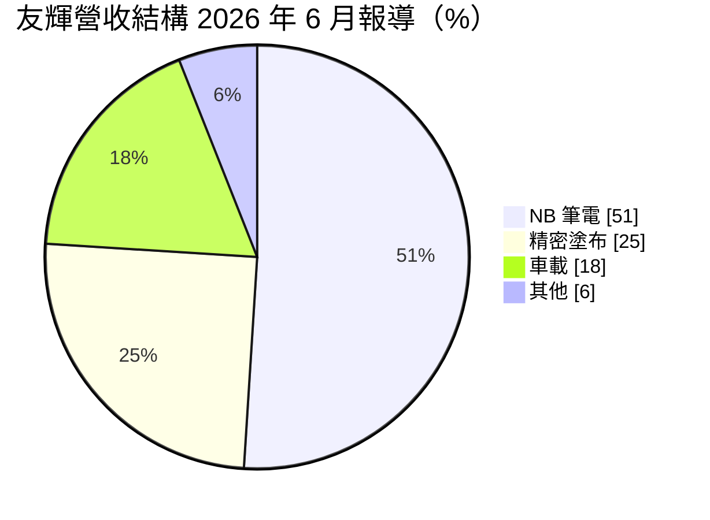
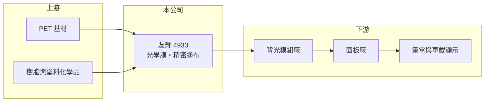

# 4933 友輝

> 上櫃｜[[產業索引-光電業|光電業]]｜上市（櫃）日期 2010/05/04

# 第一章：企業模式與商業藍圖

> [!info] 撰寫說明
> 精簡版，由 Claude 依公開資料整理，架構比照 [[2330台積電]]，資料截至 2026-10-07。來源：旺得富理財網（2026-06-15）、經濟日報、nstock.tw 友輝公司概況。#待校對

友輝是以[[光學膜]]起家的材料廠，產品從筆電面板延伸到車載與精密塗布。

- **核心業務：** 友輝生產 LCD 用高階光學膜、車載光學膜與精密塗布產品，並開發被動元件材料與智慧聲學等新產品，登記業務為精密化學材料及模具製造。
- **營收結構：** 依旺得富 2026 年 6 月報導，NB（筆記型電腦）占 51%、精密塗布占 25%、車載占 18%，筆電[[背光模組]]仍是最大支柱。
- **營運據點：** 生產據點本次未查到明細；經濟日報指出產品約八成以美元報價，屬出口導向。
- **長期方向：** 公司聚焦多功能車載光學膜、整合貼合型（All-in-One）光學膜、使用回收 PET 的環保光學膜，以及已通過部分中國客戶認證的被動元件材料，2026 年資本支出預估 2 億元以上。

# 第二章：護城河深度與競爭優勢

友輝的優勢在於塗布配方與面板客戶認證，但終端集中在筆電，議價空間受面板景氣牽動。

- **競爭優勢：** 光學膜需通過面板廠與品牌認證，長期合作形成轉換成本；毛利率長期在三成以上，顯示產品具一定差異化。
- **主要對手：** 台灣同業如 [[8215明基材]]，以及日韓與中國的光學膜廠。
- **觀察重點：** 車載與精密塗布占比能否持續提高，以及被動元件、智慧聲學等新產品何時貢獻營收。

# 第三章：財務體質與盈利規模

資料日期：2026-10-07，以下數字是撰寫當時的快照；最新月營收、毛利率、累計 EPS 由自動排程寫在本筆記的屬性欄位（月營收、毛利率、累計EPS 等）。#待校對

友輝毛利率維持三成以上，但 2026 年營收轉為年減，獲利也受匯率影響。

- **營收規模：** 2025 年全年營收 30.19 億元；2026 年 1 至 7 月累計 16.07 億元，年減 10.51%，7 月單月 1.91 億元，年減 29.49%。
- **獲利：** 2025 年 EPS 5.77 元；2026 年第一季 EPS 1.90 元、第二季 1.01 元，上半年累計 2.91 元。第二季[[毛利率]] 31.18%、[[營業利益率]] 14.61%。
- **財務特色：** 近五年平均現金股利 3.62 元，2025 年度配發 2.89 元；約八成美元報價，新台幣升值時容易產生匯損（2025 年第二季曾因此單季虧損）。

# 第四章：總體風險與地緣政治

友輝的風險集中在筆電需求、面板價格與匯率三個面向。

- **產業週期：** 營收過半來自筆電，PC 換機潮與面板廠稼動率起伏會直接影響出貨。
- **營運風險：** 新產品（被動元件、聲學）認證時程長，短期難以抵銷主力產品的衰退。
- **其他風險：** 約八成美元報價，新台幣匯率波動對獲利影響大；PET 等石化原料價格也會影響成本。

# 專有名詞解析

## 金融

- **[[毛利率]]**：營業毛利占營收的比例，反映產品的定價能力與成本控制。

## 產業

- **[[光學膜]]**：貼在液晶面板背光模組中的功能性薄膜，用來擴散、增亮或反射光線，提高亮度與均勻度。
- **[[背光模組]]**：液晶面板後方提供光源的組件，由光源、導光板與多層光學膜組成。
- **[[精密塗布]]**：在薄膜基材上均勻塗上功能性塗層的製程，應用於光學、電子與工業膠帶等產品。

# 核心供應鏈

- 上游：PET 基材、樹脂與塗料化學品供應商
- 下游／客戶：背光模組與面板廠，例如 [[6176瑞儀]]、[[3481群創]]、[[2409友達]]（推估，公司未揭露客戶名單）
- 同業：[[8215明基材]]

## 最新新聞
<!-- news:start -->
<!-- news:end -->

## 相關連結
- [公開資訊觀測站](https://mopsov.twse.com.tw/mops/web/t05st03?step=1&firstin=1&co_id=4933)
- [Goodinfo](https://goodinfo.tw/tw/StockDetail.asp?STOCK_ID=4933)
- [Yahoo 股市](https://tw.stock.yahoo.com/quote/4933)
- [鉅亨網新聞](https://www.cnyes.com/twstock/4933/news)
