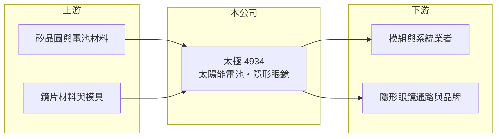

# 4934 太極

> 上市｜[[產業索引-光電業|光電業]]｜上市（櫃）日期 2010/03/10

# 第一章：企業模式與商業藍圖

> [!info] 撰寫說明
> 精簡版，由 Claude 依公開資料整理，架構比照 [[2330台積電]]，資料截至 2026-10-07。來源：nstock.tw 太極公司概況、winvest.tw 營收快訊。公開資料有限。#待校對

太極原為太陽能電池廠，目前營收規模很小，正嘗試以[[隱形眼鏡]]等新事業重建營運。

- **核心業務：** 登記業務涵蓋太陽能電池、模組及系統的研發製造銷售、電子零組件製造，以及隱形眼鏡製造、批發與零售。
- **營收結構：** 本次未查到各事業營收比重；2026 年營收大幅年增，推估主要來自隱形眼鏡等新事業。
- **營運據點：** 生產據點本次未查到，本文不推測。
- **長期方向：** 從[[太陽能電池]]轉向隱形眼鏡等新事業，能否擴大到具經濟規模，是公司能否轉虧的關鍵。

# 第二章：護城河深度與競爭優勢

太極目前處於轉型初期，看不出明確護城河。

- **競爭優勢：** 公開資料有限，新事業規模小，尚看不出技術或規模優勢。
- **主要對手：** 隱形眼鏡領域有 [[6491晶碩]]、[[1565精華]]、[[6782視陽]] 等已具規模的台廠；太陽能電池則面臨中國大廠的價格競爭。
- **觀察重點：** 月營收能否持續放大，以及毛利率何時由負轉正。

# 第三章：財務體質與盈利規模

資料日期：2026-10-07，以下數字是撰寫當時的快照；最新月營收、毛利率、累計 EPS 由自動排程寫在本筆記的屬性欄位（月營收、毛利率、累計EPS 等）。#待校對

太極營收成長快但基期極低，仍處於虧損。

- **營收規模：** 2025 年全年營收 0.89 億元；2026 年 8 月營收 2,396.6 萬元，年增 192.98%，1 至 8 月累計 1.32 億元，年增 163.63%。
- **獲利：** 2025 年 EPS -0.95 元；2026 年第二季 EPS -0.17 元，上半年累計 -0.37 元。第二季[[毛利率]] -35.73%，營收仍不足以吸收固定成本。
- **財務特色：** 資本額約 22.5 億元，相對營收規模偏大；近五年沒有配息紀錄。

# 第四章：總體風險與地緣政治

太極的風險在於轉型能否成功，以及持續虧損對資本的消耗。

- **產業週期：** 太陽能電池受中國產能過剩影響，價格長期承壓；隱形眼鏡市場則由大廠主導。
- **營運風險：** 毛利率為負，若營收無法快速放大，虧損將持續侵蝕淨值。
- **其他風險：** 醫療器材類產品需取得各國法規許可，影響新市場開拓速度；資訊揭露有限。

# 專有名詞解析

## 應用

- **[[隱形眼鏡]]**：直接配戴在眼球表面的矯正或美容鏡片，屬醫療器材，需取得衛生主管機關許可。

## 金融

- **[[毛利率]]**：營業毛利占營收的比例，反映產品的定價能力與成本控制。

## 產業

- **[[太陽能電池]]**：把光能轉為電能的半導體元件，多片串接封裝後成為太陽能模組。

# 核心供應鏈

- 上游：矽晶圓與電池材料、鏡片材料與模具供應商
- 下游／客戶：太陽能模組與系統業者、隱形眼鏡通路與品牌（推估）
- 同業：[[6491晶碩]]、[[1565精華]]、[[6782視陽]]、[[6443元晶]]

## 最新新聞
<!-- news:start（自動產生，請勿手動編輯此範圍） -->
- 2026-10-08 📰 媒體 19:51｜營收速報 - 太極(4934)9月營收1,825萬元年增率高達34.53％｜[鉅亨網](https://news.cnyes.com/news/id/6625887)

完整紀錄：[[4934太極 新聞]]
<!-- news:end -->

## 相關連結
- [公開資訊觀測站](https://mopsov.twse.com.tw/mops/web/t05st03?step=1&firstin=1&co_id=4934)
- [Goodinfo](https://goodinfo.tw/tw/StockDetail.asp?STOCK_ID=4934)
- [Yahoo 股市](https://tw.stock.yahoo.com/quote/4934)
- [鉅亨網新聞](https://www.cnyes.com/twstock/4934/news)
