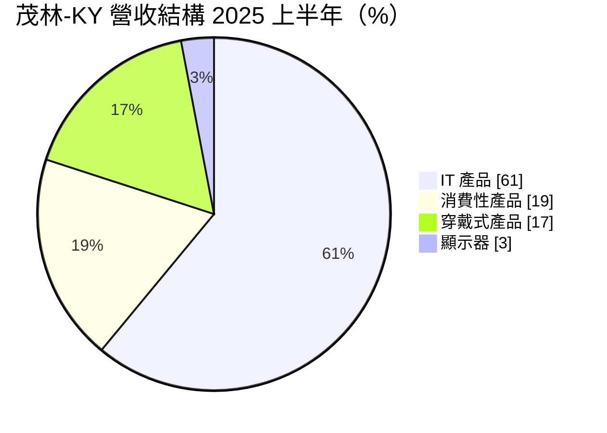
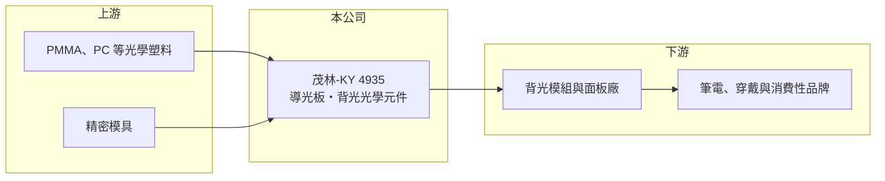

# 4935 茂林-KY

> 上市｜[[產業索引-光電業|光電業]]｜上市（櫃）日期 2011/07/28

# 第一章：企業模式與商業藍圖

> [!info] 撰寫說明
> 精簡版，由 Claude 依公開資料整理，架構比照 [[2330台積電]]，資料截至 2026-10-07。來源：富果研究 茂林-KY 2025 年 10 月法說會整理、科技新報 2026 年月營收報導。#待校對

茂林-KY 以光學設計與微結構技術生產[[導光板]]等背光元件，主力應用是筆電等 IT 產品。

- **核心業務：** 核心技術為光學設計、精密加工及微結構轉寫，產品供應筆電、消費性電子、穿戴裝置與顯示器的[[背光模組]]。
- **營收結構：** 2025 年上半年 IT 產品占 61%、消費性產品 19%、穿戴式產品 17%、顯示器 3%。
- **營運據點：** 據點包括台灣、中國上海與蘇州、美國、日本；中山廠已於 2025 年 8 月清算註銷，越南新廠預計 2025 年底至 2026 年第一季量產，泰國已購地。
- **長期方向：** 強化自動化生產、拓展穿戴式與生物醫療檢測應用，並考慮策略性投資與併購。

# 第二章：護城河深度與競爭優勢

茂林-KY 的優勢在於微結構光學設計能力，但產品與少數 IT 客戶的出貨高度連動。

- **競爭優勢：** 導光板的微結構設計直接影響亮度與省電，需與客戶共同開發，具一定技術門檻與轉換成本。
- **主要對手：** 台灣背光相關廠商如 [[6176瑞儀]]、[[5371中光電]]，以及中國導光板廠。
- **觀察重點：** 越南新廠量產後的稼動率，以及穿戴與醫療檢測等新應用能否彌補 IT 產品的衰退。

# 第三章：財務體質與盈利規模

資料日期：2026-10-07，以下數字是撰寫當時的快照；最新月營收、毛利率、累計 EPS 由自動排程寫在本筆記的屬性欄位（月營收、毛利率、累計EPS 等）。#待校對

茂林-KY 營收連續兩年下滑，獲利明顯縮水。

- **營收規模：** 2025 年全年營收 53.51 億元，年減 23.0%；2026 年 1 至 8 月累計 28.57 億元，年減 24.8%，8 月單月 4.00 億元。
- **獲利：** 2025 年上半年 EPS 0.41 元、毛利率 15%，稅後純益年減 82%；第二季毛利率 17%。2026 年 EPS 本次未查到。
- **財務特色：** 正處於產能從中國轉往越南的移轉期，關廠與新廠投資會影響短期費用與[[產能利用率]]。

# 第四章：總體風險與地緣政治

茂林-KY 面對的是客戶集中、產能移轉與營收持續衰退的三重壓力。

- **產業週期：** IT 產品占比六成，筆電與平板需求起伏直接影響出貨。
- **營運風險：** 越南新廠量產初期良率與成本控制，以及主要客戶的訂單分配變化。
- **其他風險：** 美中關稅與供應鏈「中國以外」要求加速產能移轉；匯率與塑膠原料價格波動。

# 專有名詞解析

## 金融

- **[[產能利用率]]**：實際產出占總產能的比例，製造業的毛利率高度取決於此數字。

## 產業

- **[[導光板]]**：背光模組中把側邊光源均勻導向整個面板的透明板材，表面微結構決定出光效率。
- **[[背光模組]]**：液晶面板後方提供光源的組件，由光源、導光板與多層光學膜組成。

# 核心供應鏈

- 上游：PMMA、PC 等光學塑料與精密模具供應商
- 下游／客戶：背光模組與面板廠、筆電與穿戴裝置品牌（推估，公司未揭露客戶名單）
- 同業：[[6176瑞儀]]、[[5371中光電]]

## 最新新聞
<!-- news:start -->
<!-- news:end -->

## 相關連結
- [公開資訊觀測站](https://mopsov.twse.com.tw/mops/web/t05st03?step=1&firstin=1&co_id=4935)
- [Goodinfo](https://goodinfo.tw/tw/StockDetail.asp?STOCK_ID=4935)
- [Yahoo 股市](https://tw.stock.yahoo.com/quote/4935)
- [鉅亨網新聞](https://www.cnyes.com/twstock/4935/news)
