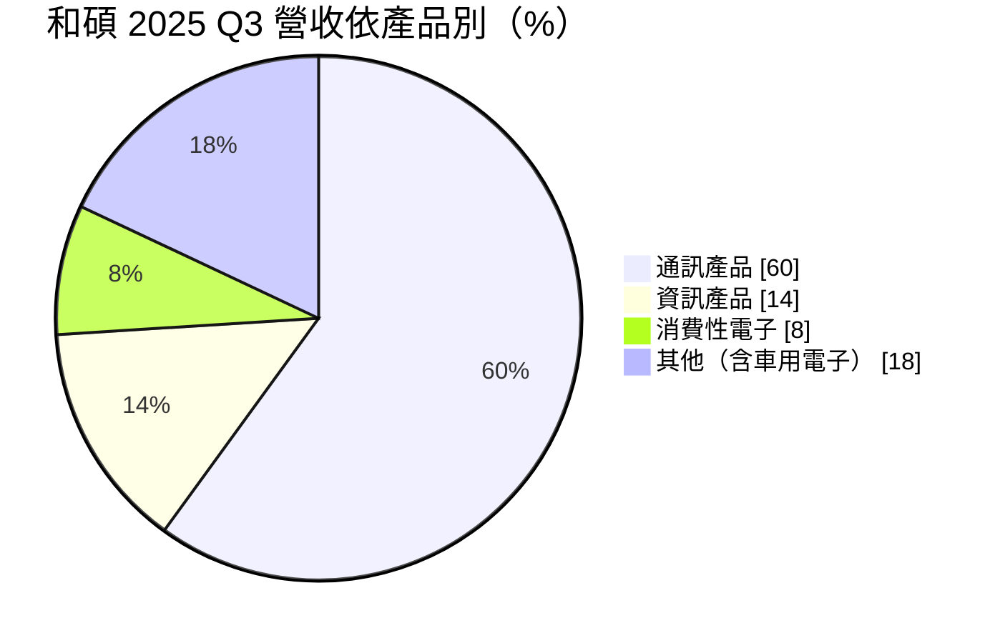
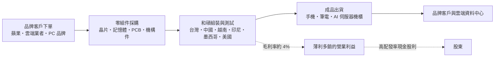
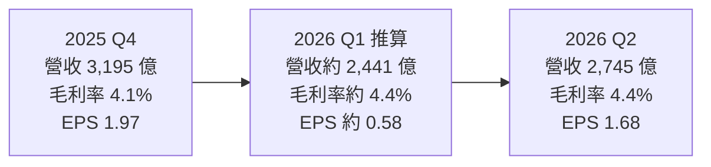
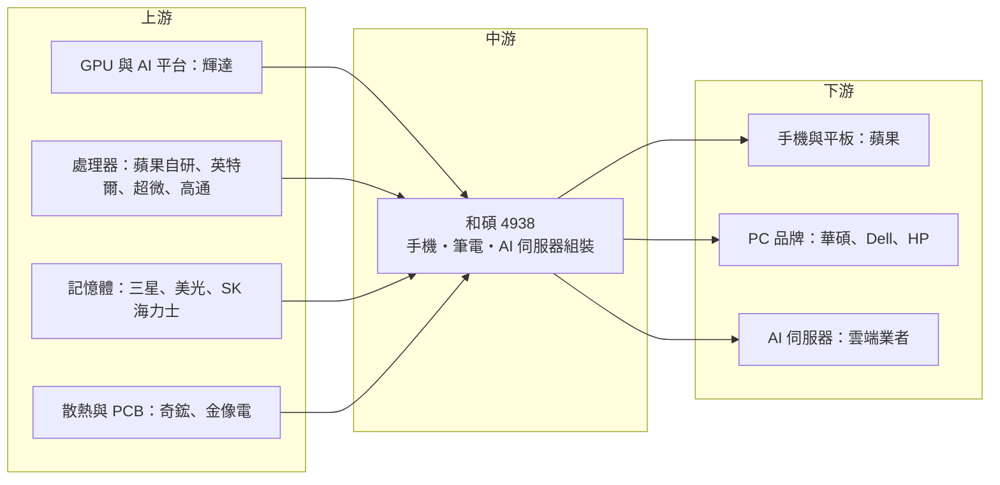

# 4938 和碩

> 上市｜[[產業索引-電腦及週邊設備業|電腦及週邊設備業]]｜上市（櫃）日期 2010/06/24

# 第一章：企業模式與商業藍圖

> [!info] 撰寫說明
> 本文由 Claude 依公開資料整理，架構比照 [[2330台積電]] 的四章研究，資料截至 2026-10-07。財務數字來源：和碩 2025 年第四季與 2026 年第二季法說會報導（優分析、富果研究、winvest、民報）；產業描述為整理性內容，尚未逐條比對原始文件。#待校對

在評估單一個股的長期投資價值時，首要步驟是拆解企業的底層獲利邏輯。本章針對和碩聯合科技（股票代號：4938，以下簡稱和碩）的商業模式進行定性分析，說明它為何長期被視為「蘋果代工廠」，以及近兩年如何試圖以 AI 伺服器改寫營收結構。

## 一、核心定位：以蘋果產品為主的大型電子代工廠

和碩成立於 2007 年，由 [[2357華碩]] 分拆代工業務而來，2010 年掛牌上市，是台灣「電子五哥」之一，年營收規模約 1.1 兆元。和碩的業務屬於 [[EMS]]（電子製造服務），也就是替品牌客戶組裝手機、平板、筆電、遊戲機、網通設備與車用電子，本身不經營消費品牌。最大客戶是 [[AAPL蘋果]]，多年擔任 iPhone 的第二大組裝廠。

這種商業模式有兩個特徵：

* **規模大、利潤薄：** 代工廠賺的是組裝與供應鏈管理的服務費，零組件成本大多直接轉嫁給客戶，因此營收數字龐大，[[毛利率]]卻只有 3% 至 4%。
* **客戶集中：** 和碩長期面臨「蘋果依賴過深」的問題，管理層也承認通訊業務「一枝獨秀」是結構性問題，因此近兩年積極轉向 AI 伺服器。

## 二、終端應用板塊：手機為主，伺服器快速放量

依民報報導，2025 年第三季的營收結構如下：

* **通訊產品：** 以 iPhone 組裝為主，另有網通設備。受蘋果新機週期影響大，第三、四季為旺季。
* **資訊產品：** 筆電、桌機與伺服器。2026 年第二季資訊產品營收季增 82%、年增 84%，主要來自伺服器出貨放量。
* **消費性電子：** 遊戲機、智慧家庭裝置等，2026 年第二季季增 57%。
* **車用電子與其他：** 包含車用電子模組與零組件子公司。

伺服器是和碩的轉型核心。和碩於 2025 年下半年開始出貨 [[NVDA輝達]] GB200、GB300 等 AI 伺服器產品，公司在 2026 年 8 月法說會表示，全年伺服器營收成長將優於原先「年增十倍」的目標，有機會成為集團前三大業務。AI 伺服器以整個機櫃為單位出貨，也就是[[機櫃級整合]]，單價遠高於一般伺服器，對營收規模的拉抬很明顯。

## 三、資本轉化邏輯：以周轉率換取報酬

* **薄利、高周轉：** 代工廠的獲利不靠單位利潤，而靠龐大出貨量與快速的存貨、應收帳款周轉。2025 年以約 1.12 兆元營收換取約 144 億元淨利，[[淨利率]]約 1.3%。
* **全球產能布局：** 和碩在台灣、中國、越南、印尼、墨西哥與美國設有生產據點。為了發展伺服器，在桃園新購 2 座廠房（多規劃為伺服器產線），並在美國德州興建新廠，規劃 2026 年第一季完工、3 月底試產。過去和碩在中國有大量 iPhone 產能，近年配合蘋果供應鏈分散，逐步往越南、印尼與墨西哥移動。

## 四、企業長期藍圖：降低對單一客戶與手機的依賴

* **擴大 AI 伺服器：** 承接輝達平台與雲端客戶的整櫃訂單，目標讓伺服器成為前三大業務。
* **車用電子與網通：** 作為通訊以外的第二條成長線。
* **北美在地產能：** 美國德州與墨西哥據點，對應關稅與客戶在地化需求。
* **籌資擴產：** 規劃發行 200 億元國內公司債與 5 億美元海外可轉債，支應擴產與營運資金；2026 年 [[CapEx]] 原訂 3 至 3.5 億美元，預期將再上修。

# 第二章：護城河深度與競爭優勢

在長期價值投資中，「護城河」指企業抵禦競爭、維持超額利潤的保護機制。本章分析和碩的護城河構成、全球主要競爭對手，以及這些優勢在代工價格戰中能守住多少。

## 一、和碩護城河的核心組成要素

和碩的護城河屬於「窄護城河」，甚至接近「無護城河」，由三個要素組成：

* **1. 大規模組裝與製程管理能力：** 長期承接 iPhone 等高量產品，具備大規模、高[[良率]]的組裝與供應鏈管理經驗，能在新機上市前短時間內把產線拉到極高產量。
* **2. 與蘋果的長期關係：** 多年擔任 iPhone 第二大組裝廠，熟悉蘋果的品質、保密與交期要求，這是新進者短期難以取得的信任。
* **3. 多地生產據點：** 中國、東南亞、北美均有產能，能配合客戶「中國加一」的供應鏈分散需求。

然而，電子代工高度依賴客戶分配訂單，議價力低，毛利率長期僅 3% 至 4%，[[營業利益率]]約 1%，代表這些競爭優勢難以轉化為定價能力。

## 二、全球主要競爭對手格局

| 對手 | 定位 | 對和碩的威脅 |
|---|---|---|
| [[2317鴻海]] | iPhone 最大組裝廠，輝達 AI 整櫃最大供應商 | 在手機與伺服器兩大領域同時壓制和碩 |
| 立訊精密 | 中國業者，快速擴大 iPhone 組裝與蘋果零組件份額 | 以成本與中國政策支持搶 iPhone 訂單 |
| 塔塔電子（Tata Electronics） | 印度業者，接手部分印度 iPhone 產能 | 蘋果擴大印度生產時的在地替代者 |
| [[2382廣達]]、[[3231緯創]]、[[6669緯穎]]、[[2356英業達]] | AI 伺服器起步早、規模大 | 和碩伺服器業務的主要對手 |
| [[2324仁寶]]、[[2382廣達]]、[[2356英業達]] | 筆電代工 | 筆電訂單價格競爭 |

## 三、優勢轉化：哪些市場守得住、哪些守不住

* **守得住：** 和碩仍保有一定比例的 iPhone 組裝訂單，蘋果傾向維持多家供應商以分散風險，因此和碩短期不會失去這塊基本盤。
* **守不住：** iPhone 組裝份額受鴻海與立訊夾擊；伺服器業務起步晚，規模遠小於鴻海、廣達、緯創，初期以 GPU 整櫃組裝切入，議價力有限。
* **觀察重點：** 伺服器營收占比能否持續提升、德州新廠爬坡進度、通訊產品占比是否下降，以及毛利率能否突破 4% 至 5% 區間。這幾項決定和碩能否從「蘋果代工廠」轉型為多元化的電子製造平台。

# 第三章：財務體質與盈利規模

資料日期：2026-10-07。數字取自公司法說會與財報的財經媒體整理（優分析、富果研究），最新月營收與三率請見[[#相關連結]]的公開資訊觀測站。#待校對

財務報表是檢驗護城河是否真實存在的最終標準。本章用三率、ROE、現金流與資本報酬，檢視和碩在轉型期的獲利品質。

## 一、獲利能力的基石：三率

| 項目 | 2025 全年 | 2025 Q4 | 2026 Q1（推算） | 2026 Q2 |
|---|---|---|---|---|
| 營收（新台幣） | 約 1.12 兆 | 3,195.3 億 | 約 2,441 億 | 2,744.5 億 |
| [[毛利率]] | 3.8% | 4.1% | 約 4.4% | 4.4% |
| [[營業利益率]] | 1.0% | 1.4% | 未查得 | 1.5% |
| 稅後純益（歸屬母公司） | 144.0 億 | 52.7 億 | 約 15.6 億 | 44.9 億 |
| EPS（元） | 5.39 | 1.97 | 約 0.58 | 1.68 |

* 2026 年第一季為上半年累計（營收 5,185.5 億元、毛利率 4.4%、歸屬母公司淨利 60.5 億元、EPS 2.26 元）減去第二季後推算。
* **[[毛利率]]：** 2025 年營收年減 0.7%、稅後純益年減 14.7%，反映手機業務成長停滯與轉型期費用。2026 年毛利率回到 4.4%，伺服器放量與產品組合調整是主因。
* **[[營業利益率]]：** 第二季 1.5%，代工廠的營業費用率低，但毛利率本身太薄，任何一次性費用都可能吃掉大半利潤。
* **獲利動能：** 2026 年上半年獲利年增約 31.8%，伺服器帶動資訊產品大幅成長。

## 二、[[ROE]]：資本效率

和碩股本約 267.6 億元，2025 年 EPS 5.39 元，淨利率約 1.3%。ROE 長期落在個位數中段到低雙位數（確切數值未查得），資本效率在五哥中偏低。代工廠要提高 ROE，主要靠提升資產周轉率與產品組合，而非提高財務槓桿。

## 三、資本支出與自由現金流

* **[[CapEx]]：** 2026 年原訂 3 至 3.5 億美元，因伺服器擴產預期上修，主要用於桃園伺服器廠、美國德州新廠與東南亞產能。
* **籌資：** 規劃發行 200 億元國內公司債與 5 億美元海外可轉債，可轉債轉換後有股本稀釋效果。
* **[[自由現金流]]：** AI 伺服器機櫃單價高、備料多，營運資金需求明顯高於手機組裝，擴產期自由現金流可能轉弱（推估）。
* **股利：** 2025 年度擬配發現金股利每股 4 元，配發率約七成四，報導當時殖利率約 5.7%，屬殖利率型電子股。

## 四、[[ROIC]] 與 [[WACC]]：價值創造利差

代工廠投入資本報酬率的關鍵在於周轉率。和碩的營業利益率約 1% 至 1.5%，ROIC 與 WACC 的利差偏窄（推估，具體數值未查得）。伺服器業務若能把毛利率推高到 5% 以上，同時控制備料與應收帳款天數，利差才有機會擴大；反之，若擴產與備料先行、獲利後到，短期 ROIC 可能下滑。

# 第四章：總體風險與地緣政治

任何企業都無法脫離宏觀環境獨立存在。本章分析和碩未來必須面對的地緣政治、產業週期與營運風險。

## 一、地緣政治風險

* **美中貿易與關稅：** 和碩在中國仍有大量產能，美國對中國製電子產品的關稅與去中化要求，迫使和碩持續把產能移往越南、印尼、墨西哥與美國，搬遷成本與初期效率損失會壓縮利潤。
* **美國在地製造：** 德州新廠可對沖關稅，但美國的人力、建廠與營運成本高。
* **印度產能政策：** 蘋果擴大印度生產，印度本土業者塔塔電子崛起，壓縮台灣代工廠在印度的角色。

## 二、產業週期與市場結構風險

* **客戶集中：** 營收高度依賴蘋果，iPhone 銷量或蘋果分配給和碩的份額下降，會直接衝擊營收。
* **手機市場成熟：** 智慧型手機換機週期拉長，成長空間有限。
* **AI 資本支出循環：** 伺服器成長取決於雲端業者的 AI 投資，若投資放緩，新產能可能閒置。

## 三、營運環境的隱性風險

* **零組件短缺：** 2026 年記憶體等零組件短缺，公司表示筆電業務面臨缺料挑戰。
* **低毛利與匯率：** 毛利率僅約 4%，新台幣匯率波動或一次性費用就可能讓單季獲利大幅變動。
* **股本稀釋：** 可轉債轉換可能稀釋 EPS。
* **轉型執行：** 伺服器業務若良率、交期或新平台認證落後，可能無法達成成長目標。

## 四、科技演進風險

AI 伺服器的[[液冷散熱]]、高功率供電與[[機櫃級整合]]門檻高，和碩在這些技術的累積少於對手。若無法跟上輝達新平台（Vera Rubin）或雲端業者 [[ASIC]] 平台的設計要求，伺服器業務可能停留在低附加價值的組裝段。

# 專有名詞解析

## 半導體

- **[[ASIC]]**：特殊應用積體電路，雲端業者為自家 AI 運算自行設計的晶片，與輝達 GPU 互為替代。
- **[[良率]]**：合格產品占總產出的比例，組裝廠的良率直接影響成本與交期。

## 金融

- **[[毛利率]]**：毛利除以營收，代工廠因零組件成本轉嫁，毛利率通常只有個位數。
- **[[營業利益率]]**：營業利益除以營收，反映扣除研發、管銷費用後的本業獲利能力。
- **[[淨利率]]**：稅後淨利除以營收，代表每一元營收最終留下的利潤。
- **[[ROE]]**：股東權益報酬率，稅後淨利除以股東權益，衡量公司運用股東資金的效率。
- **[[CapEx]]**：資本支出，用於購置廠房、設備等長期資產的支出。
- **[[自由現金流]]**：營業活動現金流減去資本支出，代表企業可自由用於配息、還債或併購的現金。
- **[[ROIC]]**：投入資本報酬率，衡量公司運用股東與債權人資金創造本業報酬的效率。
- **[[WACC]]**：加權平均資金成本，股東與債權人要求報酬率的加權平均，ROIC 高於它才算創造價值。

## 產業

- **[[EMS]]**：電子製造服務，替品牌客戶組裝電子產品並管理供應鏈的代工模式，鴻海、和碩為代表。
- **[[機櫃級整合]]**：把 GPU 伺服器、交換器、電源與散熱整合成一整個機櫃出貨，是 AI 伺服器的主流交付方式，技術門檻與單價高於單機。
- **[[液冷散熱]]**：以冷卻液取代空氣帶走晶片熱量，AI 伺服器功耗攀升後逐漸成為標準配置。

# 核心供應鏈

## 1. 上游：零組件與晶片
- GPU 與 AI 平台：[[NVDA輝達]]
- 手機與筆電晶片：[[AAPL蘋果]]（自研晶片）、[[INTC英特爾]]、[[AMD超微]]、[[QCOM高通]]
- 記憶體：[[005930三星電子]]、美光、SK 海力士
- 機構件與散熱：[[3017奇鋐]]
- PCB：[[2368金像電]]

## 2. 中游：和碩與集團
- 和碩本身（組裝代工）
- 分拆來源：[[2357華碩]]

## 3. 下游：主要客戶
- 手機、平板、筆電：[[AAPL蘋果]]
- 筆電與 PC 品牌：[[2357華碩]]、Dell、HP
- AI 伺服器：[[NVDA輝達]] 平台客戶與雲端業者

## 4. 同業
- [[2317鴻海]]、[[2382廣達]]、[[3231緯創]]、[[2324仁寶]]、[[2356英業達]]
- 中國：立訊精密

## 最新新聞
<!-- news:start（自動產生，請勿手動編輯此範圍） -->
- 2026-10-08 📰 媒體 17:23｜營收速報 - 和碩(4938)9月營收2,147.53億元年增率高達86.88％｜[鉅亨網](https://news.cnyes.com/news/id/6625023)

完整紀錄：[[4938和碩 新聞]]
<!-- news:end -->

## 相關連結
- [公開資訊觀測站](https://mopsov.twse.com.tw/mops/web/t05st03?step=1&firstin=1&co_id=4938)
- [Goodinfo](https://goodinfo.tw/tw/StockDetail.asp?STOCK_ID=4938)
- [Yahoo 股市](https://tw.stock.yahoo.com/quote/4938)
- [鉅亨網新聞](https://www.cnyes.com/twstock/4938/news)
