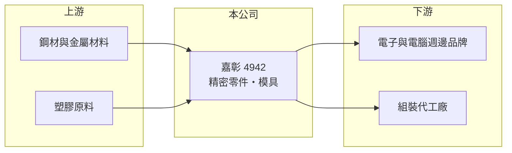

# 4942 嘉彰

> 上市｜[[產業索引-光電業|光電業]]｜上市（櫃）日期 2011/06/27

# 第一章：企業模式與商業藍圖

> [!info] 撰寫說明
> 精簡版，由 Claude 依公開資料整理，架構比照 [[2330台積電]]，資料截至 2026-10-07。來源：nstock.tw 嘉彰公司概況、winvest.tw 營收快訊。公開資料有限。#待校對

嘉彰是營收約 60 億元的精密零件與模具廠，屬於電子與光電產品的零組件供應鏈。

- **核心業務：** 登記業務為各種精密機械、機械零件模具、鋼模配件及電腦週邊設備的製造、加工與買賣。
- **營收結構：** 本次未查到產品或應用別的營收比重。
- **營運據點：** 生產據點本次未查到，本文不推測。
- **長期方向：** 公開資料有限，需追蹤公司法說與年報說明的新產品與擴產計畫。

# 第二章：護城河深度與競爭優勢

嘉彰的競爭力主要來自[[精密模具]]與量產經驗，屬於代工型的窄護城河。

- **競爭優勢：** 模具開發與量產良率需長期累積，客戶導入後不易更換供應商。
- **主要對手：** 精密零件與模具同業眾多，包含台灣與中國的機構件廠，本次未查到公司自述的對手名單。
- **觀察重點：** 營收連續年減下，毛利率與營業利益率能否守住，以及高殖利率是否可持續。

# 第三章：財務體質與盈利規模

資料日期：2026-10-07，以下數字是撰寫當時的快照；最新月營收、毛利率、累計 EPS 由自動排程寫在本筆記的屬性欄位（月營收、毛利率、累計EPS 等）。#待校對

嘉彰營收規模穩定但呈下滑，本業利潤率偏薄。

- **營收規模：** 2025 年全年營收 60.81 億元；2026 年 1 至 8 月累計 35.65 億元，年減 7.99%，8 月單月 4.10 億元，年減 13.5%。
- **獲利：** 2026 年第二季 EPS 0.26 元，上半年累計 0.77 元；第二季[[毛利率]] 18.07%、[[營業利益率]] 3.58%。
- **財務特色：** 近五年平均現金股利 2.36 元，2025 年度配發 2 元，股利政策穩定。

# 第四章：總體風險與地緣政治

嘉彰的風險在於終端需求疲弱與薄利結構。

- **產業週期：** 電腦週邊與電子產品需求放緩，會直接反映在零件訂單。
- **營運風險：** 營業利益率僅個位數，營收下滑時容易侵蝕獲利，也可能壓縮配息能力。
- **其他風險：** 金屬與塑膠原料價格、匯率波動，以及客戶要求產能移出中國帶來的移轉成本。

# 專有名詞解析

## 金融

- **[[毛利率]]**：營業毛利占營收的比例，反映產品的定價能力與成本控制。
- **[[營業利益率]]**：營業利益占營收的比例，反映扣除營業費用後本業的獲利能力。

## 產業

- **[[精密模具]]**：用於射出成型或沖壓的高精度模具，決定零件尺寸精度與量產良率。

# 核心供應鏈

- 上游：鋼材、金屬與塑膠原料供應商
- 下游／客戶：電子產品、電腦週邊品牌與組裝代工廠（推估）
- 同業：精密機構件與模具廠（本次未查到明確對手名單）

## 最新新聞
<!-- news:start -->
<!-- news:end -->

## 相關連結
- [公開資訊觀測站](https://mopsov.twse.com.tw/mops/web/t05st03?step=1&firstin=1&co_id=4942)
- [Goodinfo](https://goodinfo.tw/tw/StockDetail.asp?STOCK_ID=4942)
- [Yahoo 股市](https://tw.stock.yahoo.com/quote/4942)
- [鉅亨網新聞](https://www.cnyes.com/twstock/4942/news)
