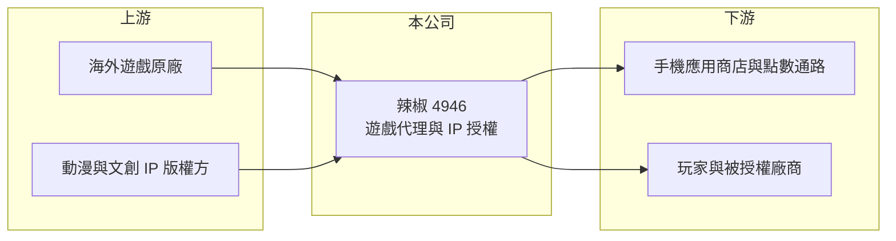

# 4946 辣椒

> 上櫃｜[[產業索引-文化創意業|文化創意業]]｜上市（櫃）日期 2011/06/10

# 第一章：企業模式與商業藍圖

> [!info] 撰寫說明
> 精簡版，由 Claude 依公開資料整理，架構比照 [[2330台積電]] 的四章研究，資料截至 2026-10-08。來源：Goodinfo 年度經營績效頁、nStock 公司簡介、櫃買中心開放資料（基本資料、2026 年第二季資產負債與綜合損益、每月營收、本益比殖利率）。公開資料有限，產品與代理作品未查得。#待校對

本章拆解紅心辣椒娛樂科技（股票代號：4946，以下簡稱辣椒）的商業模式。辣椒是規模很小的遊戲與文創 IP 公司，營收在過去十年間大起大落，經營重點是代理營運遊戲與 IP 授權。

- **核心業務：** 辣椒 2006 年設立，2011 年上櫃，目前實收資本額約 0.89 億元，董事長為鄧潤澤。依公司介紹，主要業務為資訊軟體服務及文創 [[IP授權]] 代理業務，也就是取得遊戲或動漫等內容的授權後，在台灣及華語市場營運、發行或轉授權，從玩家儲值與授權金中獲利。
- **營收結構：** 公司未揭露各業務營收比重，代理的主要作品本文未查得。[[毛利率]]多在 20% 至 40% 之間，明顯低於自研遊戲公司，符合代理商必須把大部分收入分潤給原廠的特性。
- **營運據點：** 總部位於台北內湖，以台灣市場為主。
- **長期方向：** 辣椒的營收高度取決於當年代理的作品，2025 年營收由前一年的 0.40 億元跳升到 3.55 億元，2026 年上半年又回落到 1.53 億元，年減約 25%（nStock）。公司在 2022 年與 2023 年辦理私募現金增資（nStock），代表過去曾依賴外部資金度過虧損期。長期而言，能否從「靠單一代理作品」轉為擁有穩定的作品組合或自有 IP，是公司能否建立持續性的關鍵。

# 第二章：護城河深度與競爭優勢

辣椒目前沒有明顯的護城河，競爭力主要來自取得代理權的人脈與營運經驗。

- **競爭優勢：** 代理商的價值在於本地化營運能力，包括翻譯在地化、行銷、客服與金流串接。辣椒長期在台灣代理營運遊戲與 IP 內容，累積了與海外原廠的合作關係。不過代理權有期限，原廠也可能直接來台營運，這類優勢很難長期鎖定。
- **主要對手：** 遊戲代理發行市場的對手包括 [[6180橘子]]、[[5478智冠]]、[[3086華義]]，以及大量直接在台發行的中國與韓國遊戲公司；規模都遠大於辣椒。
- **觀察重點：** 2025 年營業利益率 6.83%，是十年來少數本業獲利的年份；2026 年上半年本業又轉為虧損，淨利主要來自業外收入。觀察重點在於新代理作品的接續，以及業外收益的來源是否可持續。

# 第三章：財務體質與盈利規模

資料日期：2026-10-08，表格是撰寫當時的快照；最新月營收、毛利率、累計 EPS 由自動排程寫在本筆記的屬性欄位（月營收、毛利率、累計EPS 等）。#待校對

本章用多年度數據檢視辣椒營收與獲利的劇烈波動。由於股本多次變動，各年 EPS 不宜直接比較。

| 年度 | 營收（新台幣） | [[毛利率]] | [[營業利益率]] | EPS（元） | [[ROE]] |
|---|---|---|---|---|---|
| 2018 | 4.10 億 | 34.2% | 1.73% | 0.09 | 2.91% |
| 2019 | 1.93 億 | 18.6% | -37.2% | -7.11 | -89.8% |
| 2020 | 0.84 億 | 22.6% | -67.0% | -4.90 | -66.6% |
| 2021 | 0.42 億 | 18.9% | -146% | 1.79 | 22.3% |
| 2022 | 1.14 億 | 30.3% | -73.8% | -8.10 | -142% |
| 2023 | 0.30 億 | -85.5% | -312% | -10.66 | -186% |
| 2024 | 0.40 億 | -5.49% | -175% | -11.40 | -172% |
| 2025 | 3.55 億 | 38.8% | 6.83% | 3.14 | 41.9% |
| 2026 上半年 | 1.53 億 | 34.4% | -7.3% | 2.60 | 不適用（半年） |

- **營收規模：** 營收在 0.3 億至 4.1 億元之間劇烈擺盪，沒有穩定的成長趨勢；2025 年的 3.55 億元是近七年高點。
- **獲利：** 2019 至 2024 年本業連年虧損，ROE 多次低於 -60%；2021 年本業虧損但 EPS 為正，2026 年上半年也是本業虧損約 0.11 億元、業外收入約 0.34 億元，最後淨利約 0.23 億元（櫃買中心資料）。這代表淨利常受業外項目左右，評估本業應以營業利益為準。
- **財務特色：** 2026 年第二季底總資產約 2.99 億元、負債約 1.27 億元（幾乎都是流動負債）、股東權益約 1.73 億元。近五年無配息紀錄（nStock）。股本小、獲利波動大，使每股數字的變化幅度很大。

**[[ROIC]] 與 [[WACC]]：** 以 2025 年計算，營業利益約 0.24 億元（3.55 億元 × 6.83%），稅後約 0.19 億元；投入資本以股東權益約 1.73 億元計（有息負債未查得，假設為零），ROIC 約 11%（推算）。但 2019 至 2024 年本業持續虧損，長期平均 ROIC 為負。WACC 假設公債 1.75%、市場風險溢酬 6%、β 取 1.2（小型遊戲代理股，假設偏高以反映波動），WACC 約 9%（推算）。單一好年份的 ROIC 略高於 WACC，但多年平均遠低於資金成本，代表公司尚未證明能長期創造價值。

# 第四章：總體風險與地緣政治

辣椒的風險集中在營收來源單一與規模過小。

- **產業週期：** 代理遊戲的營收高峰通常只維持一到兩年，之後快速衰退。若沒有新作品接續，營收可能再次大幅下滑，2019 至 2024 年的低谷就是前例。
- **營運風險：** 代理權到期、原廠收回或改由其他代理商經營，都會讓營收瞬間消失。公司規模小，難以支付熱門作品的高額授權金，在搶代理權時處於劣勢。
- **其他風險：** 過去曾多次私募增資，股權結構與經營權可能變動；業外收益占淨利比重高，其來源與持續性需要追蹤。手機平台抽成與海外原廠所在地的政策變化，也會影響代理分潤。

# 專有名詞解析

## 金融

- **[[私募增資]]**：公司向特定投資人發行新股籌資，不需公開募集，但新股通常有三年轉讓限制。
- **[[ROIC]]**：投入資本報酬率，稅後營業利益除以股東權益加有息負債，衡量本業運用資本的效率。
- **[[WACC]]**：加權平均資金成本，股東與債權人要求報酬的加權平均，ROIC 高於它才代表創造價值。

## 產業

- **[[IP授權]]**：把角色、作品或品牌等智慧財產授權給他人使用，收取授權金或依營收分潤。
- **[[代理商]]**：取得原廠授權，在特定地區銷售或營運產品的公司，收入取決於代理合約條件與期限。

# 核心供應鏈

- 上游：海外遊戲原廠、動漫與文創 IP 版權方。
- 下游／客戶：手機應用商店、點數與金流通路，最終為玩家；IP 轉授權的被授權廠商。
- 同業：[[6180橘子]]、[[5478智冠]]、[[3086華義]]。

## 最新新聞
<!-- news:start -->
<!-- news:end -->

## 相關連結
- [公開資訊觀測站](https://mopsov.twse.com.tw/mops/web/t05st03?step=1&firstin=1&co_id=4946)
- [Goodinfo](https://goodinfo.tw/tw/StockDetail.asp?STOCK_ID=4946)
- [Yahoo 股市](https://tw.stock.yahoo.com/quote/4946)
- [鉅亨網新聞](https://www.cnyes.com/twstock/4946/news)
