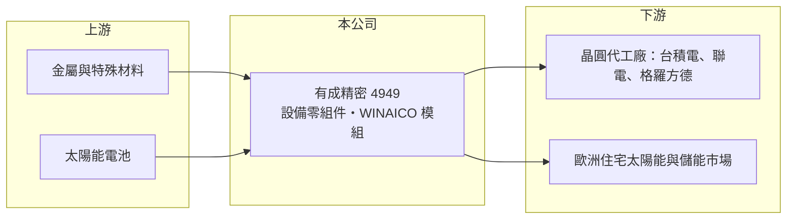

# 4949 有成精密

> 上市｜[[產業索引-光電業|光電業]]｜上市（櫃）日期 2024/05/09

# 第一章：企業模式與商業藍圖

> [!info] 撰寫說明
> 精簡版，由 Claude 依公開資料整理，架構比照 [[2330台積電]]，資料截至 2026-10-07。來源：富果研究 有成精密 2026 年 5 月法說會整理、winvest.tw 營收快訊。#待校對

有成精密以晶圓製造設備關鍵零組件為主軸，另經營太陽能模組品牌，近期受惠晶圓廠擴產。

- **核心業務：** 半導體事業群為晶圓廠提供客製化改良設計的設備關鍵零組件，涵蓋 28 奈米到 2 奈米製程；新能源事業群經營 WINAICO 品牌[[太陽能模組]]與[[儲能]]應用。
- **營收結構：** 本次未查到兩大事業群的營收比重；出貨地區約台灣與海外各半。
- **營運據點：** 以台灣為主，配合客戶在美國、日本、德國等地擴廠，強化當地供應能力。
- **長期方向：** 半導體端跟隨 AI 帶動的[[晶圓代工]]擴產；新能源端主攻歐洲住宅太陽能結合儲能，推出效率 24.5%、500W 的 WBC 2.0 Ultra Black 模組。

# 第二章：護城河深度與競爭優勢

有成精密的護城河來自晶圓廠零組件的認證與客製化能力。

- **競爭優勢：** 設備零組件需通過晶圓廠驗證，打入 [[2330台積電]]、[[2303聯電]]、格羅方德等客戶供應鏈後，轉換成本高。
- **主要對手：** 半導體零組件同業如 [[3413京鼎]]、[[3178公準]]、[[6829千附精密]]、[[8091翔名]]；太陽能模組則有 [[3576聯合再生]]、[[6443元晶]] 與中國大廠。
- **觀察重點：** 海外擴廠客戶的在地化訂單，以及歐洲太陽能儲能需求的延續性。

# 第三章：財務體質與盈利規模

資料日期：2026-10-07，以下數字是撰寫當時的快照；最新月營收、毛利率、累計 EPS 由自動排程寫在本筆記的屬性欄位（月營收、毛利率、累計EPS 等）。#待校對

有成精密 2026 年營收大幅年增，毛利率維持高檔。

- **營收規模：** 2026 年第一季營收 7.88 億元；7 月單月 3.64 億元、年增 98.64%，8 月 3.10 億元、年增 107.59%。
- **獲利：** 2026 年第一季 EPS 1.19 元（2025 年第四季為 0.43 元），稅後純益 8,031 萬元，[[毛利率]] 39.0%。
- **財務特色：** 2026 年第一季流動比率 291%，財務結構穩健；銷貨日數約 144 天，[[營運資金]]需求偏高。

# 第四章：總體風險與地緣政治

有成精密的風險在於客戶集中與兩大事業的景氣不同步。

- **產業週期：** 半導體零組件需求跟著晶圓廠資本支出起伏；太陽能模組受歐洲補貼政策與中國低價競爭影響。
- **營運風險：** 主要客戶為少數晶圓代工廠，訂單集中；海外據點擴張增加管理成本。
- **其他風險：** 歐元與美元匯率波動、地緣政治對半導體擴產節奏的影響。

# 專有名詞解析

## 半導體

- **[[晶圓代工]]**：替其他公司製造晶片、本身不賣自有品牌晶片的商業模式，代表廠商為台積電、聯電。

## 金融

- **[[營運資金]]**：流動資產減流動負債，代表日常營運所需的周轉資金。

## 產業

- **[[太陽能模組]]**：把多片太陽能電池串接並封裝成板狀的發電單元，是太陽能系統的核心組件。
- **[[儲能]]**：以電池等設備儲存電力、在需要時釋放，常與太陽能搭配提高自用率。

# 核心供應鏈

- 上游：金屬與特殊材料、太陽能電池供應商
- 下游／客戶：[[2330台積電]]、[[2303聯電]]、格羅方德；歐洲住宅太陽能通路
- 同業：[[3413京鼎]]、[[3178公準]]、[[6829千附精密]]、[[8091翔名]]、[[3576聯合再生]]、[[6443元晶]]

## 最新新聞
<!-- news:start -->
<!-- news:end -->

## 相關連結
- [公開資訊觀測站](https://mopsov.twse.com.tw/mops/web/t05st03?step=1&firstin=1&co_id=4949)
- [Goodinfo](https://goodinfo.tw/tw/StockDetail.asp?STOCK_ID=4949)
- [Yahoo 股市](https://tw.stock.yahoo.com/quote/4949)
- [鉅亨網新聞](https://www.cnyes.com/twstock/4949/news)
