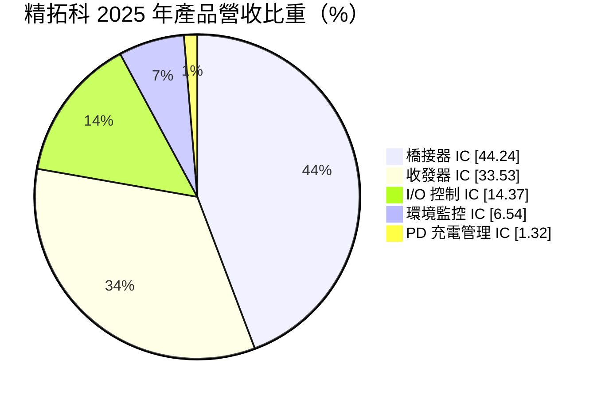
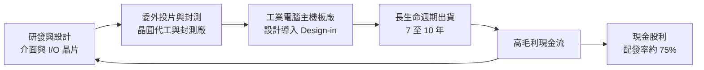
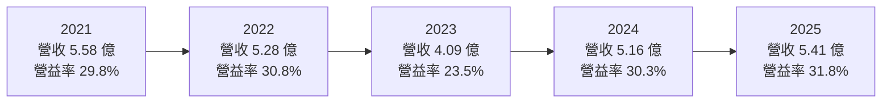
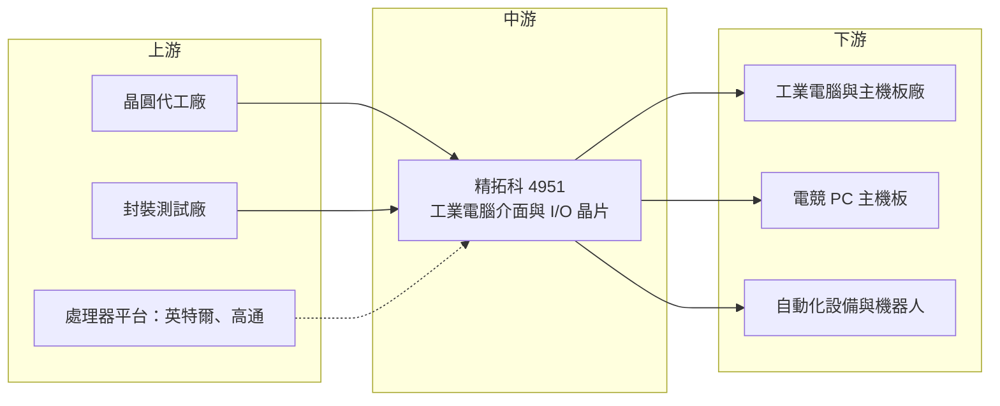

# 4951 精拓科

> 上櫃｜[[產業索引-半導體業|半導體業]]｜上市（櫃）日期 2022/11/03

# 第一章：企業模式與商業藍圖

> [!info] 撰寫說明
> 本文由 Claude 依公開資料整理，架構比照 [[2330台積電]] 的四章研究，資料截至 2026-10-08。財務數字來源：Goodinfo 年度經營績效、股利政策與基本資料頁，富果研究整理之 2025 年度（2026 年 3 月）與 2026 年上半年（2026 年 8 月）法說會重點；產業描述為整理性內容，尚未逐條比對原始文件。#待校對

在評估單一個股的長期投資價值時，首要步驟是拆解企業的底層獲利邏輯。本章針對精拓科技（股票代號：4951，以下簡稱精拓科）的商業模式進行定性分析，說明一家營收只有新台幣 5 億元上下的小型 IC 設計公司，為什麼能長期維持七成以上的[[毛利率]]，以及它的成長天花板在哪裡。

## 一、核心定位：工業電腦裡「看不見的介面晶片」

精拓科成立於 2002 年，總部位於新竹縣竹北，英文名稱為 Fintek，2022 年 11 月在櫃買中心掛牌。公司是一家 [[Fabless]] IC 設計公司，自己不擁有晶圓廠，晶片設計完成後委託晶圓代工與封測廠生產。董事長與總經理由黃德燻一人兼任，屬於創辦團隊長期經營的型態。

精拓科的產品不是處理器或記憶體這類主角，而是電腦主機板上負責「接線與翻譯」的配角晶片：把處理器的訊號轉成工業設備需要的序列埠、平行埠或其他舊式介面，或是負責監控溫度、電壓與風扇。依法說會資料，約八成營收來自[[工業電腦]]（IPC），約兩成來自一般 PC。這個定位有兩個商業意義：

* **利基市場的定價權：** 工業電腦用在工廠自動化、交通、醫療與零售終端，產品生命週期長達 7 至 10 年，客戶最在乎的是長期供貨與穩定性，而不是單顆晶片便宜幾毛錢。這讓精拓科能維持遠高於一般消費性 IC 的毛利率。
* **刻意避開紅海：** 公司在法說會上明確表示，不追逐低毛利的筆電市場，也沒有計畫與聯陽在筆電、PC 的監控晶片正面競爭。這是一種用「放棄營收規模」換取「獲利品質」的取捨。

## 二、終端應用與產品板塊

依 2025 全年產品營收比重，精拓科的營收結構如下：

* **橋接器 IC（Bridge IC）：** 負責在處理器與周邊之間轉換匯流排訊號，應用於工業電腦，也用在電競 PC 的 BIOS 更新功能。2025 年占比 44%，是最大產品線；2026 年上半年占比降至約 35%，主要是 PC 端需求轉弱。
* **收發器 IC（[[Transceiver]] IC）：** 讓工業設備之間以 RS-232、RS-485 等序列介面通訊，幾乎 100% 用於工業電腦。公司聚焦單價較高的多模產品，2026 年上半年占比升至約 40%，成為第一大產品線。
* **I/O 控制 IC：** 管理主機板上的各種輸入輸出埠，同樣全部用於工業電腦，占比約 14% 至 18%。
* **環境監控 IC：** 偵測溫度、電壓與控制風扇，主要用於筆電。由於毛利低、競爭激烈，公司已不把它列為重點。
* **PD 充電管理 IC：** 原本用在消費性產品，正轉向工業電腦的充電控制，占比僅約 1%，但仍在成長。

這樣的組合代表精拓科的營收主要由工業電腦的長期需求支撐，PC 相關的波動只影響約兩成營收。

## 三、資本轉化邏輯：小團隊、高毛利、高配息

精拓科的獲利模式可以拆成三個環節。第一，研發團隊設計晶片，交給晶圓代工與封測廠生產，公司本身幾乎沒有重資產。第二，晶片要先被工業電腦主機板廠「設計導入」（[[Design-in]]），也就是寫進板子的料號清單，這個過程耗時，但一旦導入，同一塊板子會連續生產很多年。第三，由於費用規模小、毛利高，大部分盈餘可以用現金股利發給股東，公司設定的配發率目標是七成以上，2024 與 2025 年度都約 75%。

值得注意的是，精拓科 2025 年與 2026 年上半年的盈餘中，有一部分來自出售廠辦的[[一次性收益]]。2025 年 EPS 5.98 元中，約 1.5 元來自處分廠辦，本業約 4.5 元；2026 年上半年 EPS 3.00 元中，業外處分利益約貢獻 0.5 元以上。評估長期獲利能力時，應以本業為準。

## 四、企業長期藍圖

精拓科的長期策略可以歸納成「守住工業電腦、往外延伸三個方向」：

* **深化 x86 工業電腦：** 持續在橋接器與收發器產品維持領先地位，這是公司現金流的根本。法說會引述的研究預估，全球工業電腦市場將由 2026 年約 65.7 億美元成長到 2030 年約 89.1 億美元，年複合成長率約 7.9%，公司預期自身營收會大致跟隨這個趨勢。
* **自動化與機器人：** 開發 [[CAN Bus]] 通訊產品，已有工業電腦客戶導入量產，應用在自動化設備與機械手臂。由於工業驗證週期長，公司預期營收貢獻要到 2027 至 2028 年才會明顯。
* **ARM 生態系與[[Edge AI]]：** 公司已加入 [[QCOM高通]] 的 IoT 解決方案生態系，也參與 [[INTC英特爾]] 平台的參考設計，未來希望再延伸到 [[NVDA輝達]] 與 [[2454聯發科]] 的平台。邊緣運算設備通常只用一到兩顆精拓科晶片，因此這類需求帶來的是穩定跟隨市場的成長，而不是爆發式成長。

伺服器與 AI 伺服器是另一個潛在方向，伺服器廠已開始接觸，但營收占比仍非常低。車用市場則因認證可能需要五年以上，公司尚未投入資源。

# 第二章：護城河深度與競爭優勢

護城河決定企業能否長期守住獲利。本章分析精拓科在工業電腦介面晶片這個小市場裡，靠什麼維持高毛利，以及哪些對手可能侵蝕它的地位。

## 一、護城河的核心組成要素

* **設計導入帶來的轉換成本：** 工業電腦主機板一旦完成驗證，更換任何一顆晶片都要重新測試相容性與穩定性，客戶多半不願意為了小幅降價冒風險。這種轉換成本讓精拓科的既有料號可以穩定出貨多年，也是毛利率能從 2016 年約 67% 一路走到 2025 年約 76% 的主因。
* **長期供貨承諾與產品穩定性：** 法說會提到，精拓科在工業電腦領域的能見度高，並以產品穩定著稱。對工業客戶來說，晶片停產比晶片貴更可怕，供應商能否承諾十年供貨，本身就是競爭門檻。
* **平台生態系的參與資格：** 加入高通 IoT 生態系、參與英特爾平台參考設計，代表精拓科的晶片會出現在處理器廠提供給主機板廠的參考線路圖中。被寫進參考設計的晶片，被採用的機率會大幅提高。
* **利基市場規模太小，大廠不願投入：** 整個工業電腦介面晶片市場對國際類比大廠而言規模有限，讓精拓科這種小公司得以生存並維持定價權。這是一把雙面刃，因為同樣的原因也限制了精拓科的成長空間。

## 二、全球主要競爭對手格局

| 對手 | 定位 | 對精拓科的威脅 |
|---|---|---|
| [[4919新唐]] | 台灣 MCU 與 PC 周邊晶片大廠，有 Super I/O 等產品 | 法說會點名的競爭者，特別是在伺服器相關元件 |
| [[3014聯陽]] | PC 與筆電的嵌入式控制器、I/O 晶片 | 在筆電與 PC 端競爭，精拓科選擇不正面交鋒 |
| 國際類比與介面 IC 大廠 | 提供 RS-232／RS-485 收發器等標準品 | 規模與通路優勢，可在標準品價格上施壓（推估） |
| 中國介面晶片廠 | 在國產替代政策下發展 | 長期可能在中國工業電腦市場搶單（推估） |

## 三、優勢轉化：哪些市場守得住、哪些守不住

* **守得住：** x86 工業電腦的橋接器、收發器與 I/O 控制晶片。這些產品已有長期設計導入的基礎，客戶轉換意願低，加上公司刻意聚焦高單價多模產品，毛利率得以持續上升。
* **守不住：** 筆電與一般 PC 的環境監控晶片。這個市場對價格敏感，對手規模更大，公司已主動降低重視程度。PC 端的橋接器需求也會隨 DIY 主機板出貨起伏，法說會即提到 2026 年全球 DIY 主機板出貨預估會雙位數衰退。
* **觀察重點：** 第一是 CAN Bus 與機器人應用能否在 2027 至 2028 年如期貢獻營收；第二是 ARM 平台能否複製 x86 的設計導入模式；第三是晶圓與封測成本上漲時，公司能否像 2026 年 9 月起部分產品調價那樣，順利把成本轉嫁給客戶。

# 第三章：財務體質與盈利規模

資料日期：2026-10-08。數字取自 Goodinfo 年度經營績效與股利政策頁、富果研究法說會整理，表格是撰寫當時的快照；最新月營收、毛利率、累計 EPS 由自動排程寫在本筆記的屬性欄位（月營收、毛利率、累計EPS 等）。#待校對

財務報表是檢驗護城河是否真實存在的最終標準。本章用五年的三率、[[ROE]]、股利與資本報酬，檢視精拓科在工業電腦利基市場中的獲利品質。

## 一、獲利能力的基石：三率

| 年度 | 營收（新台幣） | [[毛利率]] | [[營業利益率]] | EPS（元） | [[ROE]] |
|---|---|---|---|---|---|
| 2021 | 5.58 億 | 68.6% | 29.8% | 3.95 | 17.4% |
| 2022 | 5.28 億 | 71.6% | 30.8% | 4.77 | 19.3% |
| 2023 | 4.09 億 | 69.8% | 23.5% | 3.31 | 13.3% |
| 2024 | 5.16 億 | 73.8% | 30.3% | 4.25 | 16.4% |
| 2025 | 5.41 億 | 76.1% | 31.8% | 5.98 | 21.6% |

這張表最重要的訊息是毛利率的長期上升。依 Goodinfo 長期數字，2016 至 2020 年精拓科營收在 2.84 億至 3.79 億元之間，毛利率約 66% 至 69%，營業利益率只有 8% 至 20%。2021 年起營收站上 5 億元，營業利益率跳升到 30% 左右，說明這家公司有很明顯的[[營運槓桿]]：研發與管理費用大致固定，營收每多一塊錢，大部分都會變成營業利益。

2023 年是唯一的低點，營收降到 4.09 億元、營業利益率降到 23.5%，反映的是疫情後 PC 與工業電腦的庫存調整。但即使在低點，毛利率仍有約 70%，代表產品定價沒有崩跌，問題只在出貨量。2016 至 2025 年營收年複合成長率約 6.2%（推算），2020 至 2025 年約 7.4%（推算），和公司引述的工業電腦市場成長率相近。

需要提醒的是，2025 年 EPS 5.98 元中約 1.5 元來自出售廠辦，本業 EPS 約 4.5 元；2025 年的 ROE 21.6% 也因此被墊高。

## 二、[[ROE]]：資本效率

2021 至 2025 年平均 ROE 約 17.6%（推算）。精拓科幾乎沒有財務槓桿，2025 年 ROA 18.9% 與 ROE 21.6% 相當接近，表示資產幾乎都由股東權益支應，ROE 完全由本業獲利能力撐起。2025 年底每股淨值約 28.96 元，總資產約 11.15 億元。

與疫情前相比，2016 至 2020 年的 ROE 只有 2% 至 9%，近五年的資本效率明顯提升。主要原因不是加槓桿，而是營收規模突破後營業利益率翻倍，以及公司把大部分盈餘發掉、沒有讓權益無限膨脹。

## 三、資本支出與[[自由現金流]]

Fabless 模式不需要蓋晶圓廠，資本支出很低（具體金額未查得），長期[[自由現金流]]應為正（推估）。公司近年出售多處廠辦，取得的現金並沒有用來大舉擴張，而是隨盈餘回饋股東。2025 年營業現金流較前一年減少，法說會說明是子公司清算前繳納稅款所致，屬一次性因素。

股利方面，依 Goodinfo，2021 至 2025 年度現金股利分別為 3.503、3.5、2.5、3.2、4.5 元；對照 EPS，[[配息率]]約為 89%、73%、76%、75%、75%（推算）。公司每年都配發現金股利，2016 至 2018 年度每年 1 元，之後隨獲利提高到 3 至 4.5 元，配發政策相當穩定，這也是小型 IC 設計公司中少見的特質。

## 四、[[ROIC]] 與 [[WACC]]：價值創造利差

**ROIC 推算：** 2025 年營業利益約 1.72 億元（5.41 億 × 31.8%），以 20% 稅率計算，稅後營業利益約 1.38 億元。投入資本以股東權益約 9.9 億元計算（每股淨值 28.96 元 × 約 3,410 萬股，有息負債不重大），ROIC 約 14%（推算）。2021 年稅後營業利益約 1.33 億元（5.58 億 × 29.8% × 0.8），以淨利 1.17 億元與 ROE 17.4% 回推權益約 6.7 億元，ROIC 約 20%（推算）。若扣除帳上現金，實際營運資本的報酬率會更高。

**WACC 推算：** 權益成本用 CAPM 估計，假設台灣 10 年期公債殖利率 1.75%、市場風險溢酬 6%、β 取 IC 設計同業常見值 1.0，權益成本約 7.75%。公司幾乎沒有有息負債，WACC 約 7.75%（推算）。

**結論：** 精拓科近五年的 ROIC 約 14% 至 20%，持續高於約 7.75% 的資金成本，代表本業長期創造經濟價值。真正的限制不在報酬率，而在規模：營收只有 5 億元上下，即使 ROIC 很高，每年能再投資的金額也有限，因此公司選擇以高配息的方式把多餘資本還給股東，這是符合資本效率的做法。

# 第四章：總體風險與地緣政治

任何企業都無法脫離宏觀環境獨立存在。本章分析精拓科未來必須面對的地緣政治、產業週期、營運與技術風險。

## 一、地緣政治

* **供應鏈集中在台灣：** 精拓科的晶圓代工與封測多在台灣完成（推估），和其他台灣 IC 設計公司一樣，面臨兩岸情勢升溫時的供應中斷風險。工業客戶重視長期供貨，一旦出現地緣政治疑慮，國際客戶可能要求第二供應來源。
* **美中科技分流：** 工業電腦市場中，中國客戶可能在國產替代政策下逐步改用本土介面晶片；相反地，歐美日客戶的「非中國供應鏈」需求，對台灣供應商相對有利。這兩股力量的淨效果，需要持續觀察。

## 二、產業週期與市場結構

* **PC 週期仍占兩成：** 約兩成營收與 PC、電競主機板相關，會隨 PC 換機週期與 DIY 主機板出貨波動。2023 年營收下滑兩成多，就是 PC 與工業電腦庫存調整同時發生的結果。
* **工業電腦的長尾特性：** 工業電腦需求通常落後消費電子景氣，波動較小，但一旦進入庫存調整，恢復也較慢。這讓精拓科的營收比消費性 IC 公司穩定，但很難出現爆發式成長。
* **市場天花板：** 工業電腦介面晶片的市場規模有限，公司營收長期跟隨約 6% 至 8% 的產業成長率。若沒有新的產品類別，營收很難突破現有量級。

## 三、營運環境的隱性風險

* **晶圓與封測成本上升：** 法說會提到，AI 晶片需求正在排擠非 AI 產品的晶圓與封裝產能，供應商可能在 2027 年再度漲價。精拓科雖已從 2026 年 9 月起對部分產品調價，但若成本漲幅持續擴大，高毛利率可能受到壓縮。
* **一次性收益墊高獲利：** 近兩年處分廠辦帶來的業外利益，讓 EPS 看起來高於本業實力。這類收益不會每年重複，投資人需要以本業 EPS 評估。
* **規模小、人才集中：** 營收約 5 億元的公司，研發團隊規模有限，關鍵人才流失或經營層交接都會對產品開發造成明顯影響。

## 四、科技或法規演進

* **x86 到 ARM 的平台轉移：** 工業電腦長期以 x86 為主，精拓科的產品也是圍繞 x86 平台設計。若邊緣 AI 設備大量改用 ARM 架構處理器，介面晶片的需求型態可能改變。公司已開始參與 ARM 生態系，這是長期最關鍵的技術轉型。
* **舊式介面的淘汰速度：** 序列埠等傳統介面在工業現場仍大量使用，但新設備逐漸改用乙太網路與工業匯流排。CAN Bus 等新產品能否接棒，決定精拓科十年後的產品組合。

# 專有名詞解析

## 半導體

- **[[Fabless]]**：無晶圓廠 IC 設計公司，只負責設計晶片，生產委託晶圓代工與封測廠完成。
- **[[Super I O]]**：主機板上整合序列埠、平行埠、溫度與風扇監控等功能的周邊控制晶片。
- **[[Transceiver]]**：收發器晶片，負責把數位訊號轉成 RS-232、RS-485 等介面規格，讓設備之間可以互相傳輸資料。
- **[[Design-in]]**：設計導入，指晶片被客戶寫進產品設計與料號清單，導入後通常會跟著該產品長期出貨。

## 應用

- **[[Edge AI]]**：在終端設備或現場閘道器上直接執行 AI 運算，而不把資料全部送到雲端，可降低延遲與頻寬成本。
- **[[CAN Bus]]**：控制器區域網路，最早用於汽車，現在廣泛用於工業設備與機器人，讓多個控制器以兩條線互相通訊。

## 金融

- **[[營運槓桿]]**：固定費用占比高的公司，營收增加時利潤增幅會大於營收增幅，營收減少時利潤也會放大下滑。
- **[[一次性收益]]**：出售資產、訴訟和解等不會每年重複發生的收益，評估長期獲利時應排除。
- **[[配息率]]**：現金股利占每股盈餘的比例，反映公司把多少盈餘發給股東。
- **[[ROE]]**：股東權益報酬率，稅後淨利除以股東權益，衡量股東投入的資金每年賺回多少。
- **[[ROIC]]**：投入資本報酬率，稅後營業利益除以股東權益加有息負債，衡量本業運用資本的效率。
- **[[WACC]]**：加權平均資金成本，股東與債權人要求報酬率的加權平均，是 ROIC 需要超越的門檻。
- **[[自由現金流]]**：營業活動現金流減去資本支出，代表企業可自由用於配息、還債或併購的現金。

## 產業

- **[[工業電腦]]**：用於工廠、交通、醫療、零售等場域的電腦，強調穩定、耐用與長期供貨，產品生命週期常達 7 至 10 年。

# 核心供應鏈

## 1. 上游：晶圓代工、封測與處理器平台
- 晶圓代工與封裝測試：公開資料未揭露合作廠商名稱，屬委外生產的 Fabless 模式
- 處理器平台與參考設計：[[INTC英特爾]]、[[QCOM高通]]
- 未來希望延伸的 ARM 平台：[[NVDA輝達]]、[[2454聯發科]]

## 2. 中游：精拓科本身
- 產品線：橋接器 IC、收發器 IC、I/O 控制 IC、環境監控 IC、PD 充電管理 IC

## 3. 下游：主要應用客戶
- 工業電腦與主機板廠：公開資料未列出具名客戶，台灣代表性工業電腦廠包括 [[2395研華]]、[[6166凌華]]、[[3594磐儀]]（產業參考，非公司揭露之客戶）
- 電競 PC 主機板：BIOS 更新等功能使用橋接器 IC
- 伺服器廠：已開始接觸，營收占比仍很低

## 4. 同業與競爭者
- [[4919新唐]]、[[3014聯陽]]

## 最新新聞
<!-- news:start -->
<!-- news:end -->

## 相關連結
- [公開資訊觀測站](https://mopsov.twse.com.tw/mops/web/t05st03?step=1&firstin=1&co_id=4951)
- [Goodinfo](https://goodinfo.tw/tw/StockDetail.asp?STOCK_ID=4951)
- [Yahoo 股市](https://tw.stock.yahoo.com/quote/4951)
- [鉅亨網新聞](https://www.cnyes.com/twstock/4951/news)
