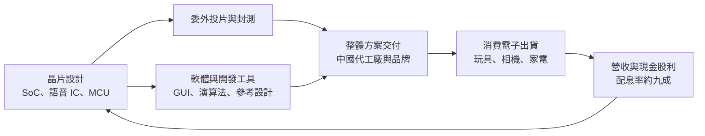
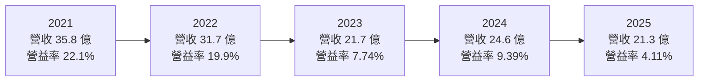
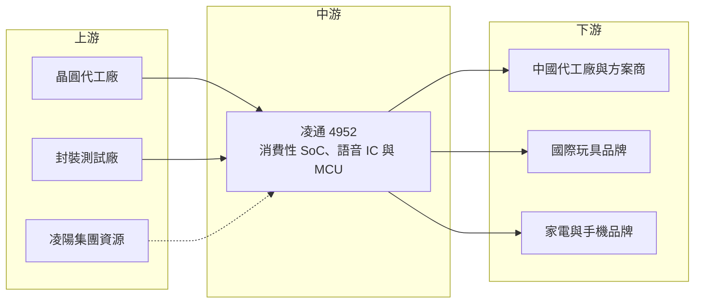

# 4952 凌通

> 上市｜[[產業索引-半導體業|半導體業]]｜上市（櫃）日期 2011/11/01

# 第一章：企業模式與商業藍圖

> [!info] 撰寫說明
> 本文由 Claude 依公開資料整理，架構比照 [[2330台積電]] 的四章研究，資料截至 2026-10-08。財務數字來源：Goodinfo 年度經營績效、股利政策與基本資料頁，富果研究整理之凌通 2025 年上半年法說會與凌陽 2025 年上半年法說會重點，Yahoo 股市公司基本資料；產業描述為整理性內容，尚未逐條比對原始文件。#待校對

在評估單一個股的長期投資價值時，首要步驟是拆解企業的底層獲利邏輯。本章針對凌通科技（股票代號：4952，以下簡稱凌通）的商業模式進行定性分析，說明它如何從玩具與消費性語音晶片起家，以及為什麼它正努力把重心移往 [[MCU]]、[[HMI]] 與 [[Edge AI]]。

## 一、核心定位：消費性電子裡的平價「大腦」供應商

凌通成立於 2004 年，總部位於新竹科學園區，英文名稱為 Generalplus，2011 年在證交所上市。凌通是凌陽集團的成員，源自凌陽科技的消費性 IC 事業；依 Yahoo 股市資料，凌通屬於凌陽集團，董監持股比例約 34%。在凌陽的集團報告中，凌通是集團營收最大的子公司，2025 年上半年約占集團營收 37%。

凌通是一家 [[Fabless]] IC 設計公司，產品是各種小型消費電子的控制核心：會說話的玩具、兒童相機、行車紀錄器、電動牙刷、吹風機、觸控家電面板等。這些產品單價不高、出貨量大、型號更替快，客戶多數在中國生產。凌通的商業定位有兩個特色：

* **整體解決方案而非單顆晶片：** 凌通除了賣晶片，也提供軟體、參考設計與開發工具，讓中小型品牌與代工廠可以很快做出產品。這種「交鑰匙」模式讓缺乏研發能力的客戶高度依賴凌通。
* **高度暴露於消費景氣：** 玩具、家電與消費電子的需求會隨經濟與關稅政策大幅波動，因此凌通的營收長期在 21 億至 36 億元之間起伏，缺乏穩定成長。

## 二、終端應用與產品板塊

依 2025 年上半年法說會，凌通的營收可分成三大板塊（公司只提供概略比重，因此不畫圓餅圖）：

* **多媒體（約 50%）：** 包括平台方案與 [[Turnkey]] 完整方案。平台方案涵蓋 Edge AI（例如坐姿偵測、智慧空調）、智慧互動玩具（兒童智慧手錶、電視互動遊戲機）、HMI 人機介面（電競周邊、家電控制面板）與 AIoT（嬰兒監視器），毛利率較高，是公司未來的發展重點。Turnkey 方案包括行車紀錄器、兒童相機、直播雲台等，競爭激烈、毛利率較低。
* **消費性（約 30% 至 35%）：** 語音、音樂與液晶控制 IC，應用於互動玩具、寵物機、天氣儀等。這是受景氣與關稅影響最直接的板塊，公司正嘗試拓展到智慧門鎖、電動機車語音提示等新用途。
* **MCU（約 15% 至 20%）：** 應用於無線充電、電動自行車、[[BLDC]] 直流無刷馬達控制（吹風機、吊扇）、觸控家電與量測儀器。

地區方面，中國（含海外客戶在中國加工的訂單）約占營收一半，最終銷售地難以精確區分。客戶包括國際玩具大廠（長期合作）、中國家電大廠（HMI 已打入）與韓國品牌手機大廠（無線充電 IC 已量產出貨），公司未揭露具體名稱。

## 三、資本轉化邏輯：方案化設計換取客戶黏著

凌通的商業模式是把晶片與軟體打包成方案。客戶拿到的不只是一顆晶片，還有可以直接修改的韌體、演算法與開發工具，因此開案時間短、研發成本低。對凌通來說，這種方案化模式能提高客戶黏著度，因為客戶一旦熟悉凌通的開發環境，下一代產品通常也會沿用。公司近年推出自有的 HMI 圖形化介面工具，就是為了進一步縮短客戶開案時間。

獲利分配上，凌通幾乎把每年的盈餘全數發給股東。依 Goodinfo 數字推算，2021 至 2025 年度的配息率都在八成五至接近百分之百之間。這反映公司本身不需要大量資本支出，但也代表帳上可用於新事業的累積資本有限。

## 四、企業長期藍圖

凌通在 2025 年法說會中提出的長期方向，重點是降低對低階消費性產品的依賴：

* **提高附加價值，不打價格戰：** 面對中國市場的價格內捲，公司選擇以 Edge AI 演算法、HMI 介面等提升產品價值，而不是跟著降價。
* **擴大非消費性應用：** 首顆車用級 MCU 已通過 [[AEC-Q100]] 認證，並開始推廣；新一代直流無刷馬達 IC 整合 CAN Bus；無線充電產品支援 Qi 2.2（25W）規範。這些產品的驗證期長、生命週期也長，若能放量，有助於平滑營收波動。
* **分散地區風險：** 拓展非中國市場營收，以降低關稅與單一市場的風險。
* **提高接單彈性：** 推出交期較短的 Flash 與 [[OTP]] 版本產品，讓客戶在需求不確定時仍願意下單。

這些策略方向合理，但凌通過去五年營收從 35.8 億元降到 21.3 億元，說明轉型的成果尚未反映在財務數字上，是長期最需要追蹤的地方。

# 第二章：護城河深度與競爭優勢

護城河決定企業能否長期守住獲利。本章分析凌通在消費性 IC 市場的競爭優勢，以及中國同業崛起後哪些優勢正在流失。

## 一、護城河的核心組成要素

* **方案與開發生態系：** 凌通長期服務玩具與小家電客戶，累積大量參考設計、語音與影像演算法與開發工具。客戶換用其他供應商，需要重寫軟體與重新驗證，這是凌通主要的轉換成本來源。
* **與國際玩具大廠的長期合作：** 國際玩具品牌對安全、品質與供貨穩定性要求高，凌通與這類客戶的長期關係，讓它在高階玩具晶片保有一定地位。
* **凌陽集團的技術與資源：** 作為凌陽集團成員，凌通在多媒體影像處理、晶片設計流程與供應鏈議價上可以借重集團資源（推估）。
* **低資本密集、高現金：** 2025 年第二季末現金約 11.83 億元、流動比率 257%，財務體質穩健，即使景氣低迷也有能力持續研發與配息。

不過要誠實地說，這些護城河的深度有限。消費性 IC 的技術門檻不高，客戶對價格高度敏感，凌通毛利率由 2021 至 2022 年約 45% 降到 2025 年的 33.4%，正是護城河受到侵蝕的證據。

## 二、全球主要競爭對手格局

| 對手 | 定位 | 對凌通的威脅 |
|---|---|---|
| [[6202盛群]] | 台灣 MCU 大廠，家電與工控 MCU 為主 | 在家電 MCU、觸控與馬達控制直接競爭 |
| [[5471松翰]] | 消費性語音、影像與 MCU 晶片 | 產品線與凌通高度重疊，尤其是語音與影像 |
| [[6494九齊]] | 低價語音 IC 與 MCU | 在玩具與小家電的低價語音晶片競爭 |
| [[4919新唐]] | 台灣 MCU 大廠，產品線廣 | 在家電與工業 MCU 市場具規模優勢 |
| 中國 MCU 與消費 IC 廠 | 本土替代與價格競爭 | 以低價搶中國代工廠訂單，壓低全產業毛利 |

## 三、優勢轉化：哪些市場守得住、哪些守不住

* **守得住：** 國際玩具大廠的互動玩具、需要演算法與 HMI 整合的平台型產品。這些產品看重方案完整度與品質，客戶轉換成本較高，毛利率也較好。
* **守不住：** 行車紀錄器、兒童相機等 Turnkey 方案，以及單純的語音、液晶控制 IC。這些市場已是中國同業的主戰場，價格戰會持續壓縮毛利率。
* **觀察重點：** 第一是車用 MCU 與無線充電產品能否帶來穩定的非消費性營收；第二是 Edge AI 與 HMI 平台能否成為毛利率回升的動力；第三是非中國市場營收比重能否提升，降低關稅與地緣政治的衝擊。

# 第三章：財務體質與盈利規模

資料日期：2026-10-08。數字取自 Goodinfo 年度經營績效與股利政策頁、富果研究法說會整理，表格是撰寫當時的快照；最新月營收、毛利率、累計 EPS 由自動排程寫在本筆記的屬性欄位（月營收、毛利率、累計EPS 等）。#待校對

財務報表是檢驗護城河是否真實存在的最終標準。本章用五年的三率、[[ROE]]、股利與資本報酬，檢視凌通在消費性景氣循環中的獲利品質。

## 一、獲利能力的基石：三率

| 年度 | 營收（新台幣） | [[毛利率]] | [[營業利益率]] | EPS（元） | [[ROE]] |
|---|---|---|---|---|---|
| 2021 | 35.8 億 | 45.4% | 22.1% | 6.05 | 28.6% |
| 2022 | 31.7 億 | 45.6% | 19.9% | 5.32 | 23.2% |
| 2023 | 21.7 億 | 37.9% | 7.74% | 1.54 | 7.28% |
| 2024 | 24.6 億 | 36.6% | 9.39% | 2.27 | 11.3% |
| 2025 | 21.3 億 | 33.4% | 4.11% | 1.03 | 5.16% |

把時間拉長看，凌通的獲利呈現明顯的「疫情高峰、之後回落」型態。依 Goodinfo 長期數字，2016 至 2020 年營收約 26 億至 33 億元，毛利率約 33% 至 37%，營業利益率約 8% 至 14%，EPS 約 2 至 3.8 元。2021 至 2022 年疫情帶動居家娛樂與消費電子需求，毛利率一度衝上 45%，營業利益率達 20% 以上。

2023 年後需求回落，2025 年毛利率回到 33.4%，營業利益率只剩 4.11%，比疫情前的低點還低。原因有兩個：一是中國同業的價格競爭使毛利率回不到過去水準；二是研發與管理費用在高峰期擴大後沒有同步縮減，營收下降時[[營運槓桿]]反向放大了獲利衰退。2016 至 2025 年營收年複合成長率約 -4.7%（推算），說明公司在這十年並沒有找到新的大型成長引擎。

## 二、[[ROE]]：資本效率

2021 至 2025 年平均 ROE 約 15.1%（推算），但主要由 2021 至 2022 年的 28.6% 與 23.2% 撐起；2023 至 2025 年只有約 5% 至 11%。疫情前 2016 至 2020 年的 ROE 約 11% 至 19%，近年的資本效率明顯低於過去。凌通的負債主要是營運性應付款項，ROA 與 ROE 差距不大，ROE 的高低主要由本業獲利決定。

## 三、資本支出與[[自由現金流]]

凌通屬於 Fabless 模式，資本支出很低（具體金額未查得），在多數年度[[自由現金流]]應為正（推估）。2025 年第二季末總資產約 30.67 億元，其中現金約 11.83 億元、存貨約 5.37 億元，現金占總資產近四成。

股利方面，依 Goodinfo，2021 至 2025 年度現金股利分別為 5.4、5、1.3、2.25、1 元；對照 EPS，[[配息率]]約為 89%、94%、84%、99%、97%（推算）。凌通每年都配發現金股利，2016 年度起從未中斷，但金額完全隨獲利起伏。高配息率代表公司把再投資的需求放得很低，也意味著若要投入新事業，主要依靠既有的現金部位。

## 四、[[ROIC]] 與 [[WACC]]：價值創造利差

**ROIC 推算：** 2025 年營業利益約 0.88 億元（21.3 億 × 4.11%），以 20% 稅率計算，稅後營業利益約 0.70 億元。投入資本以股東權益計算，用淨利 1.12 億元與 ROE 5.16% 回推權益約 21.7 億元（有息負債不重大），ROIC 約 3.2%（推算）。若扣除約 11.8 億元的現金，實際營運資本約 10 億元，ROIC 約 7%（推算）。對照 2021 年，稅後營業利益約 6.3 億元（35.8 億 × 22.1% × 0.8），權益約 23 億元，ROIC 約 27%（推算）。

**WACC 推算：** 權益成本用 CAPM 估計，假設台灣 10 年期公債殖利率 1.75%、市場風險溢酬 6%、β 取 IC 設計同業常見值 1.0，權益成本約 7.75%。公司沒有重大有息負債，WACC 約 7.75%（推算）。

**結論：** 凌通在 2021 至 2022 年的 ROIC 遠高於 WACC，但 2023 至 2025 年的 ROIC 約 3% 至 9%（推算），多數年份低於或接近約 7.75% 的資金成本，代表本業在這段期間大致沒有創造經濟價值。要回到創造價值的軌道，營業利益率至少需要回到疫情前約 10% 以上的水準；關鍵在於高毛利的平台型產品與非消費性 MCU 能否提高比重。

# 第四章：總體風險與地緣政治

任何企業都無法脫離宏觀環境獨立存在。本章分析凌通未來必須面對的地緣政治、產業週期、營運與技術風險。

## 一、地緣政治

* **美國關稅直接衝擊客戶：** 凌通的晶片多數裝進在中國組裝、銷往美國的玩具與消費電子。美國對中國商品加徵關稅時，終端品牌會減少下單或轉移生產地，凌通的出貨量會直接受影響。公司在 2025 年法說會中將美國關稅政策列為首要觀察指標。
* **中國市場占比高：** 約一半營收來自中國，面臨中國本土化政策與價格競爭的雙重壓力。拓展非中國市場是公司明確的策略，但短期內難以改變結構。

## 二、產業週期與市場結構

* **消費性需求的高波動：** 玩具與小家電屬於可選消費，景氣好時需求暴增，景氣差時迅速萎縮。2021 至 2025 年營收從 35.8 億元降到 21.3 億元，就是這種高波動的寫照。
* **[[長鞭效應]]：** 凌通位在供應鏈上游，終端品牌與代工廠的庫存調整會被放大成晶片訂單的大幅波動。
* **中國同業的結構性價格壓力：** 中國消費性 IC 設計公司數量多、成本低，長期壓低產業毛利率，是凌通毛利率難以回到疫情高峰的根本原因。

## 三、營運環境的隱性風險

* **匯率：** 營收以美元計價為主，新台幣升值會造成匯兌損失。2025 年上半年營業外即因新台幣升值出現匯損。
* **費用結構僵固：** 營收下滑時研發與管理費用難以等比例縮減，造成營業利益率的放大衰退。
* **客戶集中於特定產業：** 玩具與小家電客戶的訂單常集中在特定檔期，單一大客戶的產品成敗，可能顯著影響當年營收。

## 四、科技或法規演進

* **Edge AI 改變產品規格：** 消費電子正從單純的語音、影像功能，走向需要本地 AI 推論的智慧產品。凌通能否在低成本晶片上提供足夠的 AI 能力，決定它能否留在下一代產品的供應名單中。
* **車規與無線充電標準：** 車用 MCU 需要長期通過車廠驗證；無線充電需要跟上 Qi 等規範更新。這些領域的門檻較高，但也是凌通擺脫低價消費市場的機會。

# 專有名詞解析

## 半導體

- **[[Fabless]]**：無晶圓廠 IC 設計公司，只負責設計晶片，生產委託晶圓代工與封測廠完成。
- **[[MCU]]**：微控制器，把處理器、記憶體與輸入輸出整合在一顆晶片上，用來控制家電、玩具、工業設備等。
- **[[BLDC]]**：直流無刷馬達，用電子方式換向，效率高、壽命長、噪音低，廣泛用於吹風機、風扇與家電。
- **[[OTP]]**：一次性可程式化記憶體，晶片出廠後只能寫入一次程式，成本低，適合大量生產的消費性產品。
- **[[Turnkey]]**：完整方案，供應商提供晶片、軟體與參考設計，讓客戶可以直接量產，降低客戶開發門檻。

## 應用

- **[[HMI]]**：人機介面，指觸控面板、按鍵與螢幕等讓使用者操作設備的介面，家電與工業設備都大量使用。
- **[[Edge AI]]**：在終端設備上直接執行 AI 運算，而不把資料全部送到雲端，可降低延遲與頻寬成本。
- **[[AEC-Q100]]**：國際汽車電子協會制定的車用積體電路可靠度測試標準，是晶片進入車用市場的基本門檻。

## 金融

- **[[營運槓桿]]**：固定費用占比高的公司，營收增加時利潤增幅會大於營收增幅，營收減少時利潤也會放大下滑。
- **[[配息率]]**：現金股利占每股盈餘的比例，反映公司把多少盈餘發給股東。
- **[[長鞭效應]]**：終端需求的小幅變動，沿供應鏈往上游傳遞時被逐級放大，造成上游庫存與訂單劇烈波動。
- **[[ROE]]**：股東權益報酬率，稅後淨利除以股東權益，衡量股東投入的資金每年賺回多少。
- **[[ROIC]]**：投入資本報酬率，稅後營業利益除以股東權益加有息負債，衡量本業運用資本的效率。
- **[[WACC]]**：加權平均資金成本，股東與債權人要求報酬率的加權平均，是 ROIC 需要超越的門檻。
- **[[自由現金流]]**：營業活動現金流減去資本支出，代表企業可自由用於配息、還債或併購的現金。

# 核心供應鏈

## 1. 上游：晶圓代工與封測
- 晶圓代工與封裝測試：公開資料未揭露合作廠商名稱，屬委外生產的 Fabless 模式

## 2. 中游：凌通本身與集團
- 集團母公司：[[2401凌陽]]
- 產品線：多媒體平台與 Turnkey 方案、語音與液晶控制 IC、MCU

## 3. 下游：主要應用客戶
- 國際玩具大廠（長期合作，公司未具名）
- 中國家電大廠（HMI 已打入，公司未具名）
- 韓國品牌手機大廠（無線充電 IC 已量產，公司未具名）

## 4. 同業與競爭者
- [[6202盛群]]、[[5471松翰]]、[[6494九齊]]、[[4919新唐]]

## 最新新聞
<!-- news:start -->
<!-- news:end -->

## 相關連結
- [公開資訊觀測站](https://mopsov.twse.com.tw/mops/web/t05st03?step=1&firstin=1&co_id=4952)
- [Goodinfo](https://goodinfo.tw/tw/StockDetail.asp?STOCK_ID=4952)
- [Yahoo 股市](https://tw.stock.yahoo.com/quote/4952)
- [鉅亨網新聞](https://www.cnyes.com/twstock/4952/news)
