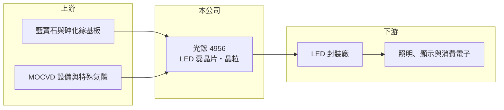

# 4956 光鋐

> 上市｜[[產業索引-光電業|光電業]]｜上市（櫃）日期 2011/10/24

# 第一章：企業模式與商業藍圖

> [!info] 撰寫說明
> 精簡版，由 Claude 依公開資料整理，架構比照 [[2330台積電]]，資料截至 2026-10-07。來源：nstock.tw 光鋐公司概況、winvest.tw 營收快訊。公開資料有限。#待校對

光鋐是 LED 產業最上游的[[磊晶]]與晶粒廠，營收規模約十多億元。

- **核心業務：** 研發、設計、製造與銷售 LED 磊晶片及[[LED晶粒]]，產品供應下游封裝廠。
- **營收結構：** 本次未查到產品或應用別的營收比重。
- **營運據點：** 生產據點本次未查到明細，本文不推測。
- **長期方向：** 公開資料有限，需追蹤公司在利基型 LED（如紅外線、車用或顯示）上的產品布局。

# 第二章：護城河深度與競爭優勢

LED 晶粒產業高度競爭，光鋐規模小，護城河有限。

- **競爭優勢：** 公開資料有限，看不出明確規模優勢；小廠通常靠利基規格與客製化維持訂單。
- **主要對手：** [[3714富采]]、[[2340台亞]]、[[3339泰谷]]，以及中國大型 LED 晶粒廠。
- **觀察重點：** 毛利率能否穩定在一成以上，以及 2026 年獲利能否延續轉正。

# 第三章：財務體質與盈利規模

資料日期：2026-10-07，以下數字是撰寫當時的快照；最新月營收、毛利率、累計 EPS 由自動排程寫在本筆記的屬性欄位（月營收、毛利率、累計EPS 等）。#待校對

光鋐營收小幅成長，獲利在損益兩平附近。

- **營收規模：** 2025 年全年營收 13.49 億元；2026 年 1 至 8 月累計 9.5 億元，年增 4.87%，8 月單月 1.06 億元，年減 15.94%。
- **獲利：** 2025 年 EPS -0.8 元；2026 年第二季 EPS 0.04 元，[[毛利率]] 14.68%、營業利益率 0.46%。
- **財務特色：** 資本額約 10.04 億元；近五年平均現金股利僅 0.08 元，配息能力有限。

# 第四章：總體風險與地緣政治

光鋐的風險在於 LED 晶粒價格競爭與獲利不穩。

- **產業週期：** LED 晶粒需求跟著照明、背光與消費電子景氣起伏，價格長期下滑。
- **營運風險：** 營業利益率接近零，稼動率或價格小幅變動就可能轉虧。
- **其他風險：** 中國同業產能龐大且有補貼，價格壓力大；匯率與原料（藍寶石基板、金屬有機源）價格波動。

# 專有名詞解析

## 半導體

- **[[磊晶]]**：在基板上一層層長出晶體薄膜的製程，LED 的發光層就是以磊晶方式製作。
- **[[LED晶粒]]**：由磊晶片切割而成的單顆發光元件，再經封裝做成可使用的 LED。
- **[[LED封裝]]**：把 LED 晶粒固定在支架或基板上，接線並以膠體保護，做成可焊接使用的元件。

## 金融

- **[[毛利率]]**：營業毛利占營收的比例，反映產品的定價能力與成本控制。

# 核心供應鏈

- 上游：藍寶石與砷化鎵基板、MOCVD 設備與特殊氣體供應商
- 下游／客戶：[[LED封裝]]廠，例如 [[2393億光]]、[[6168宏齊]]、[[3031佰鴻]]（推估）
- 同業：[[3714富采]]、[[2340台亞]]、[[3339泰谷]]

## 最新新聞
<!-- news:start -->
<!-- news:end -->

## 相關連結
- [公開資訊觀測站](https://mopsov.twse.com.tw/mops/web/t05st03?step=1&firstin=1&co_id=4956)
- [Goodinfo](https://goodinfo.tw/tw/StockDetail.asp?STOCK_ID=4956)
- [Yahoo 股市](https://tw.stock.yahoo.com/quote/4956)
- [鉅亨網新聞](https://www.cnyes.com/twstock/4956/news)
