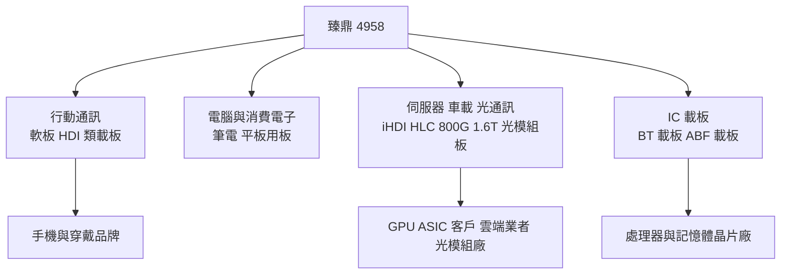
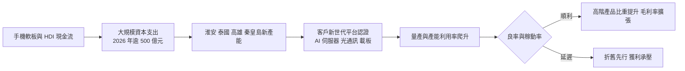
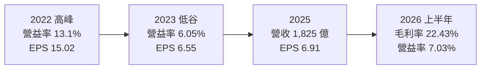
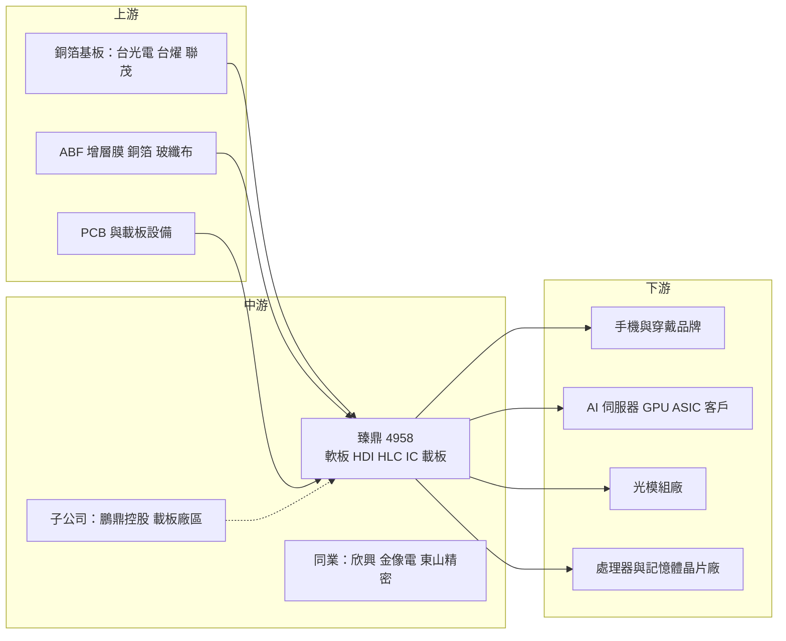

# 4958 臻鼎-KY

> 上市｜[[產業索引-電子零組件業|電子零組件業]]｜上市（櫃）日期 2011/12/26

# 第一章：企業模式與商業藍圖

> [!info] 撰寫說明
> 本文由 Claude 依公開資料整理，架構比照 [[2330台積電]] 的四章研究，資料截至 2026-10-08。財務數字來源：Goodinfo 經營績效頁（2020 至 2025 年度）、證交所開放資料快照（2026 年上半年損益、資產負債、股利）、經濟日報 2026 年 3 月法說會前報導、工商時報 2026 年 4 月報導、科技新報 2025 年 8 月法說會報導、優分析；產業描述為整理性內容，尚未逐條比對原始文件。#待校對

在評估單一個股的長期投資價值時，首要步驟是拆解企業的底層獲利邏輯。本章針對臻鼎科技控股（股票代號：4958，以下簡稱臻鼎）的商業模式進行定性分析，說明全球最大的 [[PCB]] 廠如何從手機軟板起家，轉型為涵蓋 AI 伺服器、光通訊與 [[IC載板]] 的全方位電路板平台，以及這場轉型需要付出的資本代價。

## 一、核心定位

臻鼎是在開曼群島註冊、在台灣上市的 [[KY股]]，依證交所資料成立於 2006 年，董事長沈慶芳。市場普遍將臻鼎歸為鴻海集團的關係企業（持股關係待校對）。經濟日報報導，臻鼎 2025 年營收 1,825.22 億元，創歷年新高，連續第九年為全球第一大 PCB 製造廠。

臻鼎的核心競爭力源自手機。它長期是蘋果手機與穿戴裝置[[軟板]]的主要供應商（客戶依產業常識整理，待校對），在軟板與高階 [[HDI]] 累積了大規模量產與細線路製程的能力。近年公司把這些能力延伸到 AI 伺服器、光通訊模組與 IC 載板，目標從「消費電子 PCB 龍頭」轉型為「AI 時代的全方位電路板平台」。依法說會資料，2025 年 AI 相關產品營收占比已提高到近 70%。

臻鼎的集團結構也值得注意。旗下的鵬鼎控股在深圳上市（待校對），負責大部分中國的軟板與硬板生產；IC 載板則由秦皇島等廠區負責。這種多層控股結構讓合併報表中有大量非控制權益：2025 年稅後淨利 106.05 億元，但歸屬母公司只有 67.91 億元（經濟日報），約三分之一的獲利屬於子公司的其他股東。

## 二、終端應用／產品板塊

臻鼎的營收分為四大應用領域，各領域的精確營收比重未查得，因此本文不畫營收圓餅圖。

* **行動通訊：** 手機與穿戴裝置的軟板、HDI 與類載板，是臻鼎最傳統、規模最大的業務。折疊手機與 AI 眼鏡的 PCB 規格明顯升級，是這個領域的新動能。
* **電腦與消費電子：** 筆電、平板等產品的軟板與硬板。
* **伺服器、車載與光通訊：** 成長最快的領域。AI 伺服器方面，GPU 與 ASIC 客戶的 iHDI（智慧型高密度互連板）與 [[HLC]] 產品陸續量產，並同步開發未來 2 至 3 個世代平台；光通訊以 800G 與 1.6T 高速板為主，採用 [[mSAP]] 製程，公司預估 2026 年光通訊營收年增數倍，客戶已開始預訂 2027 年產能。
* **IC 載板：** 包括 BT 載板與 [[ABF載板]]。2024 年營收年增逾 75%，2025 年年增 31.3%，2026 年成長幅度預期高於 2025 年。ABF 載板最大尺寸 158×158 毫米、最高 28 層，截至 2025 年 12 月，ABF 營收逾六成來自 AI 算力產品；BT 載板稼動率維持高檔，2026 年上半年在秦皇島廠區去瓶頸擴產。

## 三、資本轉化邏輯（營運模式）

PCB 產業是典型的資本密集型製造業：先投入大筆資本支出建廠買設備，再靠高產能利用率與良率回收。臻鼎的模式是「以規模換技術領先」：利用全球第一的營收規模與現金流，同時在多個高階領域擴產，搶先取得客戶的新世代產品認證。

這套模式的優點是能抓住技術轉換的時間窗口，缺點是折舊與新廠虧損會先發生。2023 至 2025 年臻鼎營收創新高，但營業利益率只有 6% 至 8%，低於 2022 年的 13.1%，一部分原因就是載板與新廠的前期成本。

產能布局上，淮安與泰國合計 10 座廠房同時興建，兩地都導入 AI 伺服器與光通訊產能；泰國一廠在 2025 年 5 月試產；高雄 AI 園區布局高階 ABF 載板與 HLC、HDI 產能（科技新報、經濟日報）。

## 四、企業長期藍圖

臻鼎的長期藍圖由「第五個五年計畫」定義，未來兩年資本支出從原訂 600 億元上修到逾千億元，2026 年資本支出超過 500 億元，擴產地點為台灣、泰國與淮安（經濟日報）。董事長沈慶芳表示 2026 年將開啟新一輪高速成長，驅動力來自 AI 伺服器、光通訊、IC 載板與 AI 終端應用。

從資本配置習慣看，臻鼎的經營層傾向在產業轉折點大規模投資，以規模鞏固龍頭地位。這種策略在需求如預期成長時能擴大領先，若 AI 需求放緩或產能同時開出，則可能面臨折舊壓力與產能過剩。投資人評估臻鼎時，需要同時看「AI 相關營收的成長速度」與「資本支出能否轉化為更高的營業利益率」。

# 第二章：護城河深度與競爭優勢

本章分析臻鼎的護城河構成、全球主要競爭對手，以及這些優勢在 PCB 與載板產業競爭中能守住多少。

## 一、臻鼎護城河的核心組成要素

臻鼎的護城河屬於「窄到中等」，主要由以下三個要素組成：

* **1. 全球第一的規模與多產品平台：** 營收規模全球第一，產品從軟板、HDI、HLC 到 IC 載板一應俱全，可以替客戶提供一站式的電路板方案。規模也帶來原料議價能力與分攤研發、設備投資的優勢。
* **2. 頂級客戶的認證與共同開發：** 長期服務全球頂級手機品牌，累積了極嚴格的品質與良率管理經驗。這種經驗正被移植到 AI 伺服器與光通訊客戶，外資報告指出臻鼎已取得 AI GPU 客戶認證，並在 800G 與 1.6T 光模組板有領先份額（工商時報引述外資）。
* **3. 細線路製程技術：** mSAP、類載板等細線路製程原本用於手機，現在成為光模組與 AI 伺服器高階板的關鍵能力，是臻鼎跨入新市場的技術基礎。

不過，PCB 產業整體技術擴散快，中國同業積極擴產，臻鼎的優勢主要來自規模與執行速度，而不是不可複製的技術。

## 二、全球主要競爭對手格局

| 對手 | 定位 | 對臻鼎的威脅 |
|---|---|---|
| [[3037欣興]] | 台灣最大 ABF 載板與 HDI 廠 | 在 ABF 載板與高階 HDI 直接競爭 |
| Ibiden、新光電氣 | 日系 ABF 載板龍頭 | 掌握最高階 AI 處理器載板 |
| [[2368金像電]] | AI 伺服器 HLC 專業廠 | 在 AI 伺服器高階板領先 |
| 東山精密、深南電路、勝宏科技 | 中國 PCB 大廠 | 在軟板、伺服器板與光模組板以價格與規模競爭 |
| [[3044健鼎]]、[[2313華通]]、[[6269台郡]] | 台灣 PCB 與軟板廠 | 在 HDI、軟板與伺服器板競爭 |

## 三、優勢轉化：哪些市場守得住、哪些守不住

* **守得住：** 頂級手機品牌的軟板與類載板，以及需要細線路製程的光模組板。這些產品對良率與交期要求極高，臻鼎的規模與經驗不易被取代。
* **守不住：** 一般消費電子硬板與中階產品的價格。中國同業產能龐大，價格競爭激烈；IC 載板的最高階 AI 處理器領域，則由日系與欣興等先行者占優。
* **觀察重點：** 其一，AI 伺服器與光通訊的營收能否如公司預期大幅成長，並帶動營業利益率回到 10% 以上。其二，逾千億元資本支出建成的新廠，能否順利提高稼動率與良率。其三，ABF 載板能否取得更多 AI 算力客戶，擺脫過去幾年的虧損期（載板損益未查得）。

# 第三章：財務體質與盈利規模

資料日期：2026-10-08。數字取自 Goodinfo 經營績效頁、證交所開放資料快照與經濟日報，表格是撰寫當時的快照；最新月營收、毛利率、累計 EPS 由自動排程寫在本筆記的屬性欄位（月營收、毛利率、累計EPS 等）。#待校對

財務報表是檢驗護城河是否真實存在的最終標準。本章用多年度的三率、ROE、現金流與資本報酬，檢視臻鼎在大規模轉型期間的獲利品質。

## 一、獲利能力的基石：三率

| 年度 | 營收（新台幣） | [[毛利率]] | [[營業利益率]] | EPS（元） | [[ROE]] |
|---|---|---|---|---|---|
| 2020 | 1,313 億 | 20.3% | 10.8% | 8.90 | 11.8% |
| 2021 | 1,550 億 | 19.7% | 10.2% | 10.21 | 12.6% |
| 2022 | 1,714 億 | 23.3% | 13.1% | 15.02 | 16.7% |
| 2023 | 1,514 億 | 18.1% | 6.05% | 6.55 | 7.06% |
| 2024 | 1,717 億 | 18.9% | 6.75% | 9.67 | 9.15% |
| 2025 | 1,825 億 | 19.8% | 7.63% | 6.91 | 6.57% |
| 2026 上半年 | 891.6 億 | 22.43% | 7.03% | 3.55 | 未查得 |

* **營收持續成長：** 2020 至 2025 年營收年複合成長率約 6.8%（推算），從 1,313 億元成長到 1,825 億元，規模穩居全球第一。
* **利潤率未同步成長：** 毛利率在 18% 至 23% 之間，營業利益率從 2022 年的 13.1% 降到 2023 年的 6.05%，之後只緩步回升到 7% 左右。營收創新高而利潤率偏低，反映新廠折舊、載板前期成本與消費電子價格壓力。
* **2026 年上半年：** 毛利率 22.43% 是 2022 年以來的高點，但營業利益率只有 7.03%（證交所資料），顯示研發與新廠費用仍高。2025 年上半年還有約 6.39 億元的匯兌損失（科技新報），匯率也是獲利波動的來源。
* **非控制權益：** 2025 年合併稅後淨利 106.05 億元，歸屬母公司 67.91 億元，EPS 是以母公司獲利計算，因此 EPS 的成長幅度會比合併獲利小。

## 二、[[ROE]]：資本效率

2021 至 2025 年平均 ROE 約 10.4%（推算），2023 年以後降到 6% 至 9%。對一家全球第一的 PCB 廠來說，這個水準偏低。原因有三：營業利益率偏低、大規模資本支出讓資產快速膨脹、部分獲利屬於非控制權益。2026 年第二季底歸屬母公司權益約 1,542 億元、權益總計約 2,108 億元（證交所資料），資本基礎龐大，需要更高的利潤率才能拉升 ROE。

## 三、資本支出與[[自由現金流]]

臻鼎正處於歷史上最大的擴產期。2025 至 2026 年原規劃資本支出合計 300 億元以上（2025 年 8 月法說），2026 年 3 月上修為未來兩年逾千億元，2026 年單年超過 500 億元。以 2025 年合併稅後淨利約 106 億元的規模，這樣的資本支出將遠超過營業現金流，自由現金流在擴產期間很可能轉為負數（推估），需要靠借款或現金部位支應。股利方面，2025 年度配發現金股利 3.45 元（證交所股利資料），以 EPS 6.91 元計算，配息率約 50%（推算）。

## 四、[[ROIC]] 與 [[WACC]]：價值創造利差

* **ROIC（推算）：** 2025 年營業利益約 139.3 億元（1,825 億 × 7.63%），稅後營業利益約 111.4 億元。投入資本以 2026 年第二季底權益總計約 2,108 億元，加上有息負債估計約 600 億元（有息負債未查得，假設約占總負債 1,389 億元的四成），合計約 2,708 億元，ROIC 約 4.1%（推算）。2022 年營業利益約 224.5 億元，當年 ROIC 推估約 8% 至 10%。
* **WACC（推算）：** 以 CAPM 推估，無風險利率 1.75%，市場風險溢酬 6%，β 未查得來源，採 PCB 同業常見值 1.1，股東權益成本約 8.35%。負債成本假設 2.5%，稅後約 2%；資本結構以權益 78%、負債 22% 計算，WACC 約 7.0%（推算）。
* **結論：** 2023 至 2025 年臻鼎的 ROIC 約 4%，低於約 7% 的資金成本（推算），代表在這段大規模投資期，新增資本尚未創造足夠報酬。只有在 2022 年的景氣高峰，ROIC 才接近或高於 WACC。逾千億元資本支出能否讓營業利益率回到 10% 以上，是臻鼎能否重新創造價值的關鍵；若利潤率停留在 7% 左右，資本擴張反而會拉低整體資本報酬。

# 第四章：總體風險與地緣政治

任何企業都無法脫離宏觀環境獨立存在。本章分析臻鼎未來必須面對的地緣政治、產業週期與營運風險。

## 一、地緣政治風險

* **中國產能比重高：** 臻鼎的主要產能長期在深圳、淮安、秦皇島等中國廠區，美國對中國製電子產品的關稅與 AI 相關的出口管制，會影響 AI 伺服器與光通訊客戶的採購決策。這是臻鼎同時在泰國與高雄擴產的主因。
* **多地擴產的管理挑戰：** 淮安、泰國、高雄同時擴產，各地的人才、供應鏈與法規條件不同，執行難度高。
* **鵬鼎控股的雙重市場：** 子公司在中國上市，受中國資本市場與監管政策影響，集團的資金調度與治理需要同時符合兩地規範（待校對）。

## 二、產業週期與市場結構風險

* **消費電子週期：** 手機與穿戴裝置仍是臻鼎的重要收入來源，智慧型手機市場成熟，新機銷售不如預期時會影響軟板出貨。
* **AI 投資週期：** AI 伺服器與光通訊需求目前強勁，但雲端業者資本支出若放緩，大規模新產能可能面臨稼動率不足。
* **[[長鞭效應]]與產能過剩：** 台灣、中國與日本 PCB 與載板廠同時擴產 AI 相關產能，未來可能出現供過於求與價格競爭，2023 年載板產業的修正就是前例。

## 三、營運環境的隱性風險

* **折舊壓力：** 逾千億元的資本支出將在未來數年轉成折舊費用，若營收成長不如預期，營業利益率會被折舊拖累。
* **客戶集中：** 頂級手機品牌客戶占比高（比重未查得），客戶的產品策略、訂單分配與價格要求直接影響臻鼎。
* **匯率：** 收入以美元為主、成本以人民幣與新台幣為主，匯率波動造成的匯兌損益可能相當大。

## 四、科技或法規演進風險

AI 伺服器與光通訊的技術世代更替快速，從 800G 走向 1.6T、3.2T，PCB 層數、材料與線路精度都需要跟著升級。IC 載板方面，玻璃基板等新材料可能改變載板的技術路線，若臻鼎投資的技術被新材料取代，資本支出的回收將受影響。此外，PCB 製程用水、用電與化學品量大，中國、泰國與台灣的環保與碳排法規趨嚴，會提高營運成本。

# 專有名詞解析

## 半導體

- **[[IC載板]]**：承載晶片並連接晶片與電路板的基板，線路比一般 PCB 更細，分為 BT 與 ABF 兩大類。
- **[[ABF載板]]**：使用味之素增層膜的高階 IC 載板，用於 CPU、GPU 與 AI 加速器等高效能晶片。

## 應用

- **[[AI伺服器]]**：搭載 GPU 或 ASIC 加速器、專門執行 AI 訓練與推論的伺服器，對電路板層數與材料要求更高。
- **[[光模組]]**：把電訊號轉成光訊號傳輸的模組，用於資料中心交換器之間的高速連線，例如 800G、1.6T。

## 金融

- **[[KY股]]**：在海外註冊、在台灣上市的公司，股票名稱後面加註 KY，適用的法規與資訊揭露略有不同。
- **[[非控制權益]]**：合併子公司中不屬於母公司股東的權益與獲利，例如子公司其他股東應分得的部分。
- **[[自由現金流]]**：營業活動現金流減去資本支出，代表企業可自由用於配息、還債或併購的現金。
- **[[ROIC]]**：投入資本報酬率，衡量公司每投入一元營運資本能賺多少稅後營業利益。
- **[[WACC]]**：加權平均資金成本，股東與債權人要求報酬率的加權平均，是企業投資的最低報酬門檻。

## 產業

- **[[PCB]]**：印刷電路板，用銅線路連接晶片與電子零件的基板，是所有電子產品的骨架。
- **[[軟板]]**：可彎曲的印刷電路板，用於手機、穿戴裝置等空間狹小、需要摺疊的產品。
- **[[HDI]]**：高密度互連板，以微小雷射孔與細線路提高線路密度，用於手機、記憶體模組與 AI 伺服器。
- **[[HLC]]**：高層數板，層數通常在 20 層以上，用於伺服器與網通設備，製程難度高。
- **[[mSAP]]**：改良型半加成法，一種能做出極細線路的 PCB 製程，用於類載板與光模組板。

# 核心供應鏈

## 1. 上游：基板材料與設備
- 銅箔基板：[[2383台光電]]、[[6274台燿]]、[[6213聯茂]]（供應關係依產業常識整理，待校對）
- 銅箔與玻纖布：[[8358金居]]、[[1802台玻]]、[[1815富喬]]
- ABF 增層膜：日本味之素（Ajinomoto）

## 2. 中游：臻鼎本身與同業
- 集團相關：[[2317鴻海]]（集團關係待校對）
- 同業：[[3037欣興]]、[[2368金像電]]、[[3044健鼎]]、[[2313華通]]、[[6269台郡]]、[[8046南電]]、[[3189景碩]]

## 3. 下游：主要客戶群
- 手機與穿戴：[[AAPL蘋果]]（主要客戶依產業常識整理，待校對）
- AI 伺服器 GPU 與 ASIC：[[NVDA輝達]]、[[AVGO博通]]（外資報告稱已取得 AI GPU 客戶認證，具體客戶未經公司證實，待校對）
- 光模組：800G 與 1.6T 光模組廠（客戶名稱未公開）

延伸閱讀：[[台積電供應鏈]]

## 最新新聞
<!-- news:start（自動產生，請勿手動編輯此範圍） -->
- 2026-10-08 🏛️ 重訊 22:14｜代子公司慶鼎精密電子(淮安)有限公司公告取得機器設備｜[觀測站](https://mops.twse.com.tw/mops/#/web/t05st01)
- 2026-10-08 📰 媒體 17:57｜臻鼎-KY 9月營收改寫歷史新高年增36.1% 估Q4營運續增｜[鉅亨網](https://news.cnyes.com/news/id/6624927)
- 2026-10-08 📰 媒體 17:23｜營收速報 - 臻鼎-KY(4958)9月營收263.58億元年增率高達36.13％｜[鉅亨網](https://news.cnyes.com/news/id/6625025)
- 2026-10-08 📰 媒體 14:30｜臻鼎-KY(4958) 法人上修目標價！獲利跳升的時間點？｜[鉅亨網](https://news.cnyes.com/news/id/6624778)
- 2026-10-07 📰 媒體 12:10｜鉅亨速報 - Factset 最新調查：臻鼎-KY(4958-TW)EPS預估下修至13.79元，預估目標價為644元｜[鉅亨網](https://news.cnyes.com/news/id/6623551)

完整紀錄：[[4958臻鼎-KY 新聞]]
<!-- news:end -->

## 相關連結
- [公開資訊觀測站](https://mopsov.twse.com.tw/mops/web/t05st03?step=1&firstin=1&co_id=4958)
- [Goodinfo](https://goodinfo.tw/tw/StockDetail.asp?STOCK_ID=4958)
- [Yahoo 股市](https://tw.stock.yahoo.com/quote/4958)
- [鉅亨網新聞](https://www.cnyes.com/twstock/4958/news)
