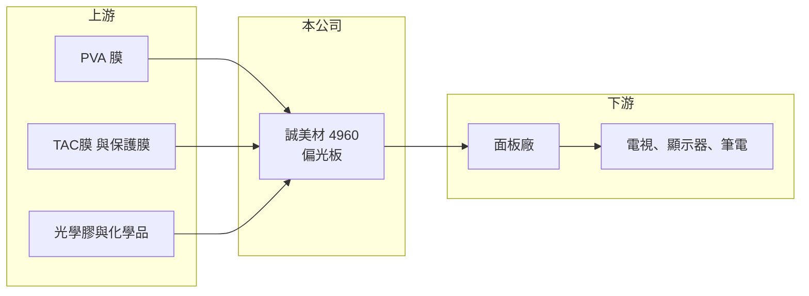

# 4960 誠美材

> 上市｜[[產業索引-光電業|光電業]]｜上市（櫃）日期 2011/10/24

# 第一章：企業模式與商業藍圖

> [!info] 撰寫說明
> 精簡版，由 Claude 依公開資料整理，架構比照 [[2330台積電]]，資料截至 2026-10-07。來源：winvest.tw 誠美材營收快訊與公司簡介。公開資料有限。#待校對

誠美材是台灣的[[偏光板]]製造商，產品供應液晶面板廠，近年持續虧損。

- **核心業務：** 公司成立於 2005 年，2011 年上市，主要業務為偏光板的生產與銷售。
- **營收結構：** 本次未查到應用別營收比重，推估以電視與 IT 面板用偏光板為主。
- **營運據點：** 生產據點本次未查到明細，本文不推測。
- **長期方向：** 公開資料有限，關鍵在於提高高階與大尺寸產品比重、改善稼動率以回到損益兩平。

# 第二章：護城河深度與競爭優勢

偏光板產業由日韓與中國大廠主導，誠美材規模較小，護城河有限。

- **競爭優勢：** 位於台灣、貼近面板客戶，具交期與服務優勢；但關鍵原料與技術多仰賴外部供應。
- **主要對手：** 日東電工、住友化學，以及中國杉杉、三利譜等大廠，台灣同業有 [[8215明基材]]。
- **觀察重點：** 虧損是否持續收斂，以及面板廠稼動率與偏光板報價變化。

# 第三章：財務體質與盈利規模

資料日期：2026-10-07，以下數字是撰寫當時的快照；最新月營收、毛利率、累計 EPS 由自動排程寫在本筆記的屬性欄位（月營收、毛利率、累計EPS 等）。#待校對

誠美材營收規模推估每年約 70 至 80 億元，但仍處虧損，2026 年虧損幅度較 2025 年縮小。

- **營收規模：** 2026 年 1 至 8 月累計 51.19 億元，年減 9.73%；8 月單月 6.05 億元，年減 13.9%。
- **獲利：** 2025 年 EPS -2.58 元；2026 年第二季 EPS -0.33 元，上半年累計 -0.6 元。
- **財務特色：** 資本額 57.17 億元，股本相對營收偏大，獲利回升時 EPS 彈性有限。

# 第四章：總體風險與地緣政治

誠美材的風險在於面板景氣、價格競爭與持續虧損。

- **產業週期：** 偏光板需求跟著面板廠稼動率走，電視與 IT 面板景氣下滑時量價同步承壓。
- **營運風險：** 中國偏光板產能持續擴充，報價競爭激烈；持續虧損會侵蝕淨值。
- **其他風險：** 關鍵原料（[[TAC膜]]、PVA 膜等）推估多數進口，匯率與原料價格波動影響成本。

# 專有名詞解析

## 應用

- **[[LCD]]**：液晶顯示器，以液晶控制背光通過量來顯示畫面，需搭配背光模組與偏光板。

## 產業

- **[[偏光板]]**：貼在液晶面板上下兩側、只讓特定方向光線通過的光學膜，是液晶顯示不可缺少的材料。
- **[[TAC膜]]**：三醋酸纖維素膜，作為偏光板的保護層，主要由日本廠商供應。

# 核心供應鏈

- 上游：PVA 膜、TAC膜、保護膜與光學膠供應商（多為日本廠）
- 下游／客戶：[[LCD]]面板廠，例如 [[3481群創]]、[[2409友達]]、[[6116彩晶]]（推估）
- 同業：[[8215明基材]]、日東電工、住友化學、杉杉、三利譜

## 最新新聞
<!-- news:start -->
<!-- news:end -->

## 相關連結
- [公開資訊觀測站](https://mopsov.twse.com.tw/mops/web/t05st03?step=1&firstin=1&co_id=4960)
- [Goodinfo](https://goodinfo.tw/tw/StockDetail.asp?STOCK_ID=4960)
- [Yahoo 股市](https://tw.stock.yahoo.com/quote/4960)
- [鉅亨網新聞](https://www.cnyes.com/twstock/4960/news)
