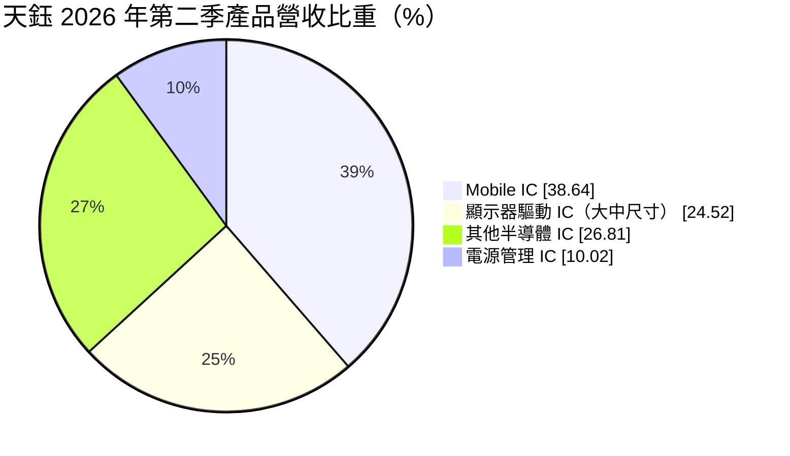
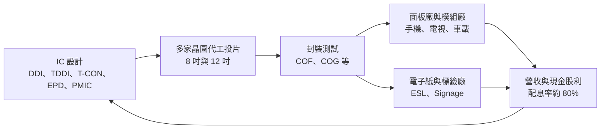
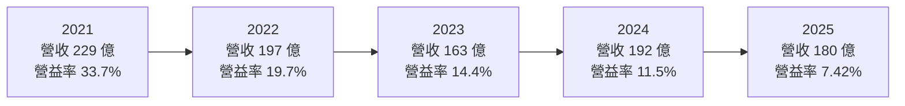
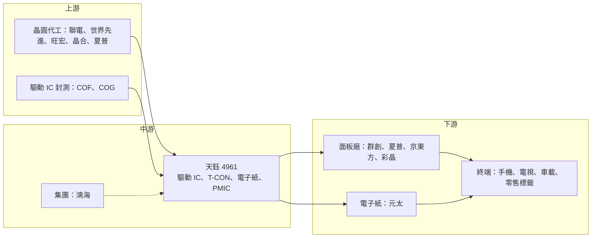

# 4961 天鈺

> 上市｜[[產業索引-半導體業|半導體業]]｜上市（櫃）日期 2018/10/17

# 第一章：企業模式與商業藍圖

> [!info] 撰寫說明
> 本文由 Claude 依公開資料整理，架構比照 [[2330台積電]] 的四章研究，資料截至 2026-10-08。財務數字來源：Goodinfo 年度經營績效、股利政策與基本資料頁，poorstock 整理之 2026 年第二季法說會重點，優分析、工商時報、財訊與 CMoney 研究報告；產業描述為整理性內容，尚未逐條比對原始文件。#待校對

在評估單一個股的長期投資價值時，首要步驟是拆解企業的底層獲利邏輯。本章針對天鈺科技（股票代號：4961，以下簡稱天鈺）的商業模式進行定性分析，說明它如何從鴻海集團內的面板驅動 IC 供應商，逐步轉型為涵蓋[[電子紙]]、時序控制與電源管理的多元 IC 平台。

## 一、核心定位：鴻海集團的顯示晶片設計公司

天鈺成立於 1995 年，總部位於新竹科學園區，英文名稱為 Fitipower，2018 年在證交所上市。公司是 [[2317鴻海]] 旗下的 IC 設計公司，依 2021 年 CMoney 研究報告，截至 2020 年 11 月鴻海集團合計持股約三成。天鈺起家於小尺寸 LCD 驅動 IC，2006 年合併鴻海轉投資的宏鑫後，拓展到大尺寸面板驅動 IC；在中國設有子公司天德鈺，負責手機面板驅動 IC 等產品的研發與銷售。

天鈺的核心產品是 [[DDI]]（顯示驅動 IC），也就是控制面板上每一個像素亮暗的晶片。每一片手機、電視、筆電或車用面板，都需要一顆到數十顆驅動 IC。天鈺的定位有兩個特點：

* **集團綁定帶來的穩定基本盤：** 依 2021 年研究報告，前三大客戶為 [[3481群創]]、瑞達輝與夏普，泛鴻海體系（群創、夏普等）的營收貢獻估計超過四成。集團內有面板廠，也有夏普的晶圓廠可投片，讓天鈺在產能吃緊時較有保障。
* **少數同時擁有驅動 IC 與電源 IC 的公司：** 天鈺同時設計 DDI 與 [[PMIC]]，可以提供面板廠一整套顯示與電源方案，這是多數同業沒有的組合。

## 二、終端應用與產品板塊

依 2026 年第二季法說會，天鈺的產品營收結構如下：

* **Mobile IC（約 39%）：** 手機面板用驅動 IC，包括 [[TDDI]]（觸控與驅動整合晶片）與 OLED 驅動 IC。這是天鈺營收占比最大、但競爭最激烈的板塊。
* **顯示器驅動 IC（約 25%）：** 電視、筆電、桌上型顯示器等大尺寸，以及車載與工控等中尺寸面板。車載與工控面板的生命週期長、毛利率較高，是公司刻意擴大的方向。
* **其他半導體 IC（約 27%）：** 包含 [[T-CON]] 時序控制 IC、電子紙驅動 IC、[[ESL]] 電子貨架標籤驅動 IC，以及 Edge AI 晶片。這個板塊占比由 2023 年約 12% 提高到 2025 年約 30%，是近年最重要的結構變化。
* **電源管理 IC（約 10%）：** 手機電源 IC 擴大在印度與中國的市占，未來將轉向非消費性與工業用產品。

公司在法說會上反覆強調「不只是 Driver IC 公司」，其他半導體與電源 IC 的毛利率都高於傳統手機驅動 IC，因此這兩個板塊占比上升，是毛利率能否回穩的關鍵。

## 三、資本轉化邏輯：多元投片、平台化出貨

天鈺是 [[Fabless]] 模式，本身不擁有晶圓廠。依 2021 年研究報告，投片來源相當分散：夏普的 8 吋晶圓廠、[[2337旺宏]]（電源 IC 主要來源）、合肥晶合（小尺寸驅動 IC 的 12 吋主要來源），以及 [[2303聯電]]、[[5347世界先進]]。多元的代工夥伴讓天鈺在 2021 年晶圓產能短缺時取得較多產能，也是當年營收翻倍的重要原因。

資本配置方面，天鈺 2023 年辦理成立以來首次[[現金減資]]，減資比例約 35%，每股退還 3.5 元，退還股款約 6.5 億元，實收資本額由約 18.7 億元降至約 12.1 億元。公司說明目的是調整資本結構、提升 ROE。加上 2023 年起[[配息率]]約八成，可以看出經營層傾向把多餘現金還給股東，而不是長期囤積。

## 四、企業長期藍圖

* **從驅動 IC 轉型為多元 IC 平台：** 降低對手機驅動 IC 的依賴，把資源投入電子紙、T-CON、Edge AI 晶片與工業電源 IC。
* **電子紙與電子貨架標籤：** 北美大型零售商與歐洲的彩色電子標籤換機潮，是天鈺電子紙驅動 IC 的主要需求來源。公司正開發新一代 ESL E5 三位元產品，以及支援 E6 多彩電子紙的大尺寸、高解析度 Signage IC。電子紙模組龍頭 [[8069元太]] 是這個產業的指標。
* **車載與工控面板：** 中尺寸車載與工業面板驗證期長、價格穩定，是天鈺從消費性市場往高附加價值市場移動的路徑。
* **全球出海口：** 透過各地區子公司分散出貨地點，降低地緣政治與關稅風險。

# 第二章：護城河深度與競爭優勢

護城河決定企業能否長期守住獲利。本章分析天鈺在顯示驅動 IC 這個高度競爭的市場裡，依靠什麼維持地位，以及中國同業崛起帶來的威脅。

## 一、護城河的核心組成要素

* **集團客戶與產能支援：** 鴻海集團內的群創、夏普等面板廠提供穩定訂單，夏普晶圓廠提供部分產能。這種集團綁定在景氣低迷時能提供基本盤，在產能吃緊時能確保供貨，是一般獨立 IC 設計公司難以複製的優勢。
* **顯示加電源的整合能力：** 同時擁有驅動 IC 與電源管理 IC，可以為面板廠提供成套方案，減少客戶的設計與驗證工作。
* **電子紙驅動 IC 的先行者地位：** 天鈺很早就透過元太供應電子書閱讀器，在電子紙驅動領域累積經驗。電子紙需要特殊的波形控制與低功耗設計，進入門檻高於一般 LCD 驅動 IC。
* **多元晶圓代工關係：** 與多家晶圓廠合作，讓天鈺在產能分配上較有彈性，不容易被單一代工廠卡住。

## 二、全球主要競爭對手格局

| 對手 | 定位 | 對天鈺的威脅 |
|---|---|---|
| [[3034聯詠]] | 全球前段班的驅動 IC 與 SoC 設計公司 | 規模與產品線遠大於天鈺，在大尺寸與 TDDI 具領先地位 |
| 奇景光電 | 驅動 IC 與 T-CON，車用顯示布局深 | 在車用驅動 IC 與 T-CON 直接競爭 |
| [[3592瑞鼎]] | 友達集團的驅動 IC 設計公司 | 同樣具面板集團背景，在大尺寸驅動 IC 競爭 |
| [[8016矽創]] | 中小尺寸驅動 IC | 在中小尺寸與工控面板競爭 |
| 中國驅動 IC 設計公司 | 本土面板廠支持、擴大供應 | 以降價搶單壓低大、中、小尺寸驅動 IC 的平均售價 |

電源管理 IC 方面，競爭對手包括 [[6138茂達]]、[[8081致新]] 等台灣類比 IC 公司，以及德州儀器等國際大廠。

## 三、優勢轉化：哪些市場守得住、哪些守不住

* **守得住：** 電子紙與電子貨架標籤驅動 IC、車載與工控中尺寸面板、集團面板廠的長期訂單。這些市場有技術或關係門檻，價格競爭相對溫和。
* **守不住：** 手機 TDDI 與一般 LCD 驅動 IC 的價格。中國同業透過擴大供應與降價搶單，天鈺毛利率由 2021 年高峰約 47% 降到 2025 年的 28.5%，反映的正是這股壓力，加上晶圓代工、封測、基板與金價上漲難以完全轉嫁。
* **觀察重點：** 第一是其他半導體 IC 與電源 IC 的合計占比能否持續上升；第二是成本上漲能否透過調價與產品組合轉嫁，讓毛利率回到 30% 以上；第三是電子紙應用能否從零售標籤擴展到大尺寸看板等新市場。

# 第三章：財務體質與盈利規模

資料日期：2026-10-08。數字取自 Goodinfo 年度經營績效與股利政策頁、poorstock 法說會整理，表格是撰寫當時的快照；最新月營收、毛利率、累計 EPS 由自動排程寫在本筆記的屬性欄位（月營收、毛利率、累計EPS 等）。#待校對

財務報表是檢驗護城河是否真實存在的最終標準。本章用五年的三率、[[ROE]]、股利與資本報酬，檢視天鈺在驅動 IC 景氣循環中的獲利品質。

## 一、獲利能力的基石：三率

| 年度 | 營收（新台幣） | [[毛利率]] | [[營業利益率]] | EPS（元） | [[ROE]] |
|---|---|---|---|---|---|
| 2021 | 229 億 | 46.6% | 33.7% | 33.83 | 54.0% |
| 2022 | 197 億 | 36.3% | 19.7% | 16.49 | 17.0% |
| 2023 | 163 億 | 32.4% | 14.4% | 13.29 | 11.2% |
| 2024 | 192 億 | 28.6% | 11.5% | 16.08 | 11.4% |
| 2025 | 180 億 | 28.5% | 7.42% | 9.65 | 7.23% |

這張表需要放在更長的時間軸上看。依 Goodinfo，2016 至 2020 年天鈺營收從 69 億元成長到 109 億元，毛利率約 19% 至 22%，營業利益率只有約 3% 至 7%。2021 年因晶圓產能短缺、驅動 IC 大漲價，營收翻倍到 229 億元，毛利率衝上 46.6%，這是產業特殊年份，而非常態。

2022 年後毛利率逐年回落，但 2025 年的 28.5% 仍明顯高於疫情前約 20% 的水準，說明產品組合確實已經升級，電子紙、T-CON 與電源 IC 的占比提高有實質效果。問題在營業利益率：2025 年只有 7.42%，研發與管理費用在高峰期擴張後，成了營收持平時的負擔。2016 至 2025 年營收年複合成長率約 11.2%（推算），2020 至 2025 年約 10.6%（推算），長期成長性在驅動 IC 同業中算是突出。

另外要注意，2023 年現金減資後股本由約 18.7 億元降至約 12.1 億元，因此 2023 年以後的 EPS 與 2022 年以前不能直接比較。

## 二、[[ROE]]：資本效率

2021 至 2025 年平均 ROE 約 20.2%（推算），但主要由 2021 年的 54% 撐起；排除 2021 年，2022 至 2025 年平均約 11.7%（推算）。疫情前 2017 至 2020 年 ROE 約 6% 至 14%。天鈺負債比不高，2025 年 ROA 6.14% 與 ROE 7.23% 相近，ROE 主要由本業獲利決定。2023 年的現金減資就是為了提高 ROE，但最終仍要靠營業利益率回升才能真正改善資本效率。

## 三、資本支出與[[自由現金流]]

天鈺屬 Fabless 模式，資本支出主要是研發設備與光罩，金額相對營收很小（具體金額未查得），[[自由現金流]]在多數年度應為正（推估）。2026 年上半年營業現金流約 12.7 億元，平均收現天數約 50 天，營運資金周轉正常。

股利方面，依 Goodinfo，2021 至 2025 年度現金股利分別為 17、8.5、10.64、12.87、7.72 元；對照 EPS，配息率約為 50%、52%、80%、80%、80%（推算）。天鈺自 2016 年度起每年都配發現金股利，2023 年以後配息率穩定在八成左右，加上現金減資，資本回饋政策明顯變得更積極。

## 四、[[ROIC]] 與 [[WACC]]：價值創造利差

**ROIC 推算：** 2025 年營業利益約 13.4 億元（180 億 × 7.42%），以 20% 稅率計算，稅後營業利益約 10.7 億元。投入資本以股東權益計算，用淨利 11.7 億元與 ROE 7.23% 回推權益約 162 億元（有息負債不重大；權益可能含子公司非控制權益），ROIC 約 6.6%（推算）。2024 年稅後營業利益約 17.7 億元（192 億 × 11.5% × 0.8），權益約 171 億元，ROIC 約 10%（推算）。2021 年 ROIC 則高達約 57%（推算）。

**WACC 推算：** 權益成本用 CAPM 估計，假設台灣 10 年期公債殖利率 1.75%、市場風險溢酬 6%、β 取驅動 IC 同業常見值 1.1，權益成本約 8.35%。公司沒有重大有息負債，WACC 約 8.4%（推算）。

**結論：** 天鈺在 2021 至 2024 年的 ROIC 高於 WACC，持續創造價值；但 2025 年 ROIC 約 6.6%，已低於約 8.4% 的資金成本。這說明驅動 IC 價格競爭與成本上漲已經侵蝕到價值創造的邊界。未來能否重新拉開利差，取決於高毛利的其他半導體與電源 IC 占比能否持續提升，以及費用能否隨營收規模更有效率地攤提。

# 第四章：總體風險與地緣政治

任何企業都無法脫離宏觀環境獨立存在。本章分析天鈺未來必須面對的地緣政治、產業週期、營運與技術風險。

## 一、地緣政治

* **面板產業集中在中國：** 全球 LCD 面板產能大幅集中在中國，天鈺的大量客戶與中國子公司都在中國營運。中國面板廠在本土化政策下，傾向優先採用中國驅動 IC 設計公司，對天鈺形成長期壓力。
* **投片地點與出口管制：** 部分產品在中國晶圓廠投片，若美中科技管制擴大到成熟製程，或兩岸關係緊張，可能影響產能取得與出貨。公司正透過各地子公司分散出海口來降低風險。

## 二、產業週期與市場結構

* **驅動 IC 的強烈景氣循環：** 驅動 IC 需求隨面板出貨與電視、手機、筆電換機週期起伏，價格則隨晶圓代工產能鬆緊大幅波動。2021 年的暴漲與之後的回落，是這個產業週期性的典型例子。
* **[[長鞭效應]]：** 面板廠與品牌的庫存調整會放大到上游驅動 IC 的訂單，造成營收波動遠大於終端需求變化。
* **中國同業的長期擴張：** 中國驅動 IC 設計公司持續擴大供應並降價，使驅動 IC 逐漸走向價格競爭，這是結構性而非短期的壓力。

## 三、營運環境的隱性風險

* **成本上漲難以轉嫁：** 晶圓代工、封裝測試、基板與金價上漲，在需求不旺時很難完全轉給客戶，直接壓縮毛利率。
* **集團客戶依賴：** 泛鴻海體系貢獻相當比例營收，若集團面板事業策略改變，天鈺的基本盤也會受影響。
* **匯率：** 營收以美元為主，新台幣升值會壓縮以台幣計算的獲利。

## 四、科技或法規演進

* **顯示技術的世代交替：** 手機面板從 LCD 轉向 OLED，車用與筆電也逐步導入 OLED 與 Mini LED，驅動 IC 的設計門檻隨之提高。天鈺子公司已開發 OLED 驅動 IC，但在 OLED 領域仍需追趕韓系與領先同業。
* **電子紙的應用擴展：** 電子貨架標籤由黑白走向彩色、由小尺寸走向大尺寸看板，對驅動 IC 的解析度與色彩控制要求更高。這既是天鈺的機會，也需要持續研發投入才能維持領先。
* **Edge AI 新領域：** 天鈺開始投入 Edge AI 晶片，屬於全新的產品類別，技術與市場風險都較高，成效仍待觀察。

# 專有名詞解析

## 半導體

- **[[DDI]]**：顯示驅動 IC，負責控制面板每個像素的電壓，是每片面板都需要的關鍵晶片。
- **[[TDDI]]**：觸控與顯示驅動整合晶片，把觸控感測與顯示驅動做在同一顆 IC，主要用於手機 LCD 面板。
- **[[T-CON]]**：時序控制器，負責把影像訊號依時序分配給各顆驅動 IC，是面板的訊號指揮中心。
- **[[PMIC]]**：電源管理 IC，負責電壓轉換與電力分配，讓系統中不同元件取得所需電壓。
- **[[Fabless]]**：無晶圓廠 IC 設計公司，只負責設計晶片，生產委託晶圓代工與封測廠完成。

## 應用

- **[[ESL]]**：電子貨架標籤，取代紙本價格標籤，零售商可遠端即時修改價格，多使用電子紙顯示。

## 金融

- **[[現金減資]]**：公司減少股本並把現金退還給股東，可降低股本、提高每股盈餘與 ROE。
- **[[配息率]]**：現金股利占每股盈餘的比例，反映公司把多少盈餘發給股東。
- **[[長鞭效應]]**：終端需求的小幅變動，沿供應鏈往上游傳遞時被逐級放大，造成上游庫存與訂單劇烈波動。
- **[[ROE]]**：股東權益報酬率，稅後淨利除以股東權益，衡量股東投入的資金每年賺回多少。
- **[[ROIC]]**：投入資本報酬率，稅後營業利益除以股東權益加有息負債，衡量本業運用資本的效率。
- **[[WACC]]**：加權平均資金成本，股東與債權人要求報酬率的加權平均，是 ROIC 需要超越的門檻。
- **[[自由現金流]]**：營業活動現金流減去資本支出，代表企業可自由用於配息、還債或併購的現金。

## 產業

- **[[電子紙]]**：以帶電粒子顯示影像的反射式顯示技術，畫面不更新時幾乎不耗電，用於電子書與電子標籤。

# 核心供應鏈

## 1. 上游：晶圓代工與封裝測試
- 晶圓代工：[[2303聯電]]、[[5347世界先進]]、[[2337旺宏]]、合肥晶合、夏普晶圓廠（依 2021 年研究報告）
- 驅動 IC 封測：[[6147頎邦]]、[[8150南茂]]（產業常見驅動 IC 封測廠，非公司揭露之合作對象）

## 2. 中游：天鈺本身與集團
- 集團母公司：[[2317鴻海]]
- 子公司：天德鈺（中國）

## 3. 下游：面板廠與電子紙
- 面板廠：[[3481群創]]、[[6116彩晶]]、京東方、夏普（依 2021 年研究報告）
- 電子紙模組：[[8069元太]]

## 4. 同業與競爭者
- 驅動 IC：[[3034聯詠]]、[[3592瑞鼎]]、[[8016矽創]]、奇景光電
- 電源管理 IC：[[6138茂達]]、[[8081致新]]

## 最新新聞
<!-- news:start（自動產生，請勿手動編輯此範圍） -->
- 2026-10-05 📰 媒體 19:50｜營收速報 - 天鈺(4961)9月營收21.75億元年增率高達56.95％｜[鉅亨網](https://news.cnyes.com/news/id/6621990)

完整紀錄：[[4961天鈺 新聞]]
<!-- news:end -->

## 相關連結
- [公開資訊觀測站](https://mopsov.twse.com.tw/mops/web/t05st03?step=1&firstin=1&co_id=4961)
- [Goodinfo](https://goodinfo.tw/tw/StockDetail.asp?STOCK_ID=4961)
- [Yahoo 股市](https://tw.stock.yahoo.com/quote/4961)
- [鉅亨網新聞](https://www.cnyes.com/twstock/4961/news)
