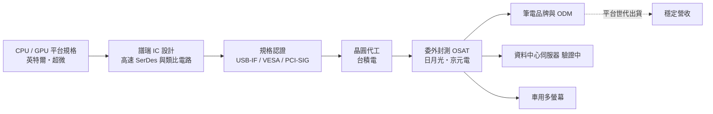
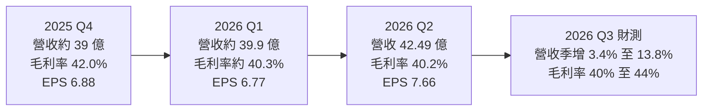
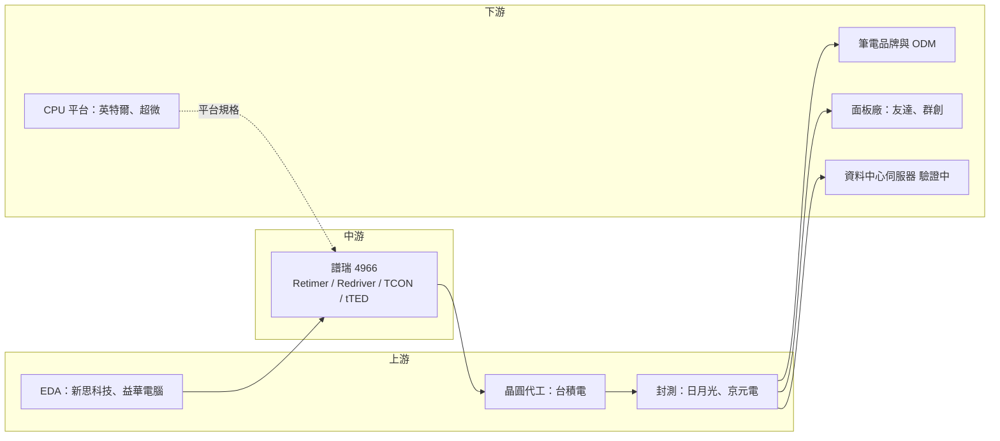

# 4966 譜瑞-KY

> 上櫃｜[[產業索引-半導體業|半導體業]]｜上市（櫃）日期 2011/09/13

# 第一章：企業模式與商業藍圖

> [!info] 撰寫說明
> 本文由 Claude 依公開資料整理，架構比照 [[2330台積電]] 的四章研究，資料截至 2026-10-07。財務數字來源：譜瑞 2026 年第二季財報新聞稿附表（公司官網）、2025 年第四季與 2026 年第一季、第二季法說會報導（工商時報、聯合新聞網、經濟日報、永豐金證券豐雲學堂）；產業描述為整理性內容，尚未逐條比對原始文件。產品線精確營收比重本次未查得，因此未繪製營收結構圓餅圖。#待校對

在評估單一個股的長期投資價值時，首要步驟是拆解企業的底層獲利邏輯。本章針對譜瑞科技（股票代號：4966，台股簡稱譜瑞-KY，以下簡稱譜瑞）的商業模式進行定性分析，說明它如何靠「讓高速訊號跑得更遠、更穩」的技術，在筆電市場站穩腳步，又為何必須把觸角伸向資料中心與車用。

## 一、核心定位：筆電與資料中心的高速訊號「接力手」

譜瑞是註冊於開曼群島、研發與營運橫跨台灣與美國矽谷的 [[Fabless]] IC 設計公司，董事長為趙捷。譜瑞的專長是「高速訊號傳輸與顯示介面」，產品讓 CPU、GPU 與螢幕、外接裝置、伺服器內部元件之間能以極高速度穩定傳送資料。

訊號在高速傳輸時會衰減與失真，傳輸距離越長、速度越快，問題越嚴重。譜瑞的 [[Retimer]] 與 [[Redriver]] 晶片就像「接力手」，把衰減的訊號重新整形或放大後再送出，讓傳輸距離拉長、錯誤率降低。這個定位有兩個商業意義：

* **規格越快，需求越多：** 每一次 [[USB4]]、[[PCIe]] 規格升級，訊號衰減問題都更嚴重，對 Retimer 的需求與單價都會提高。
* **跟著平台一起設計：** 這類晶片必須與 CPU 平台、面板與品牌廠同步開發，一旦被設計進平台，就會跟著整個產品世代出貨。

## 二、終端應用／產品板塊：高速傳輸與顯示介面

譜瑞的產品大致分成兩大類：

* **高速傳輸介面：** USB4／USB-C 的 Redriver 與 Retimer、PCIe Retimer、DisplayPort 轉換晶片等，應用在筆電、擴充基座，以及 AI 伺服器內 GPU、CPU、網卡之間的 PCIe 連結。
* **顯示介面：** 筆電面板用的時序控制器（[[TCON]]）、[[eDP]] 介面晶片，以及整合 TCON 與驅動功能的 [[tTED]] 晶片；另有觸控控制器等周邊產品。

依 2025 年第四季法說會報導，高速傳輸產品的營收占比在 2025 年第四季跌破 50%，顯示兩大類產品的比重會隨產品週期變動（精確比重本次未查得）。

主要成長動能：

* **tTED：** 2026 年第二季的主要動能來自 tTED 晶片放量。法說會指出 tTED 幾乎沒有明顯競爭對手，市場滲透率預期將超過 10%。
* **高速傳輸：** USB4 滲透率提升、PCIe Retimer 出貨是近年成長主軸；PCIe Gen6 與網通 Retimer 正在客戶驗證中。
* **資料中心：** 乙太網路 Retimer 與訊號 Redriver 正由客戶評估中。
* **車用：** 車用多螢幕顯示應用，公司預估 2026 年車用營收超過 1,000 萬美元，2027 年至少年增 50%。
* **類 [[ASIC]] 業務：** 替特定客戶開發客製化晶片，預期 2027 年底開始貢獻明顯營收。

## 三、資本轉化邏輯：研發人力換平台設計導入

* **輕資產：** 譜瑞在台灣與美國矽谷設有研發中心，並在中國、日本、韓國設有業務與技術支援據點（細節本次未逐一查證）。晶圓與封測都委外，固定成本以研發人力為主，每季營業費用約 3,300 萬至 3,600 萬美元。
* **成本傳導：** 2026 年第二季法說會提到，委外封測（[[OSAT]]）漲價與記憶體成本上升是毛利率承壓的主因，公司計畫以漲價改善第三季毛利率。

## 四、企業長期藍圖：從 PC 周邊走向資料中心與車用

譜瑞過去高度依賴筆電市場，2025 年第四季法說會時，公司預期 2026 年筆電出貨與 2025 年持平。長期策略因此是：

* **把高速介面延伸到資料中心：** PCIe Gen6 Retimer、乙太網路 Retimer，切入 AI 伺服器互連。
* **車用顯示：** 以顯示介面技術打入車用多螢幕市場。
* **類 ASIC 業務：** 以客製化晶片分散客戶與應用，預計 2027 年底開始貢獻。

# 第二章：護城河深度與競爭優勢

在長期價值投資中，「護城河」指企業抵禦競爭、維持超額利潤的保護機制。本章分析譜瑞的護城河構成、筆電與資料中心兩個戰場的競爭格局，以及譜瑞的優勢在不同市場能守住多少。

## 一、護城河的核心組成要素

譜瑞的護城河屬於「窄到中等」，主要來自三個要素：

* **1. 高速類比與混合訊號設計能力：** Retimer 與 TCON 都需要高速 [[SerDes]] 與類比電路設計能力，並需通過 USB-IF、VESA、PCI-SIG 等規格認證，新進者進入門檻高。
* **2. 與筆電平台和品牌的長期合作：** 筆電的顯示與介面晶片需要配合 CPU 平台、面板廠與品牌廠同步開發，多年累積的平台驗證經驗與客戶關係形成轉換成本。
* **3. tTED 的先發優勢：** 法說會指出 tTED 目前沒有明顯競爭對手，這是譜瑞在顯示產品上的差異化來源。

## 二、全球主要競爭對手格局

| 對手 | 定位 | 對譜瑞的威脅 |
|---|---|---|
| Astera Labs | 美國 PCIe／[[CXL]] Retimer 領導廠商 | AI 伺服器 Retimer 市占率高，是譜瑞切入資料中心的最大對手 |
| [[MRVL邁威爾]]、[[AVGO博通]] | 資料中心高速互連完整產品線 | 可用 PCIe Switch、乙太網路晶片組合銷售 |
| [[INTC英特爾]] | Thunderbolt／USB4 平台提供者 | 主導 USB4 規格方向，影響周邊晶片設計 |
| [[5269祥碩]] | 台灣 USB4 與 PCIe 介面同業 | 在 USB4 裝置端與 PCIe 部分重疊 |
| [[3034聯詠]]、[[4961天鈺]]、[[3592瑞鼎]] | 面板相關晶片 | 在 TCON 與面板晶片部分重疊；德州儀器、Diodes 在 Redriver 競爭 |

## 三、優勢轉化：哪些市場守得住、哪些守不住

* **守得住：** 筆電 TCON、tTED 與 USB-C／USB4 周邊晶片是譜瑞的主場，客戶黏著度高。
* **守不住：** AI 伺服器 PCIe Retimer 市場目前由 Astera Labs 主導，譜瑞的 PCIe Gen6 與乙太網路 Retimer 仍在驗證階段，短期內要取得大量市占並不容易。
* **毛利率壓力：** 記憶體成本上升與封測漲價，讓毛利率從 2025 年上半年的 42.8% 降到 2026 年上半年的 40.3%，第三季公司預期透過漲價改善到 40% 至 44%。
* **觀察重點：** PCIe Gen6 與乙太網路 Retimer 的驗證結果、tTED 滲透率、車用營收能否在 2027 年成長五成，以及類 ASIC 業務 2027 年底能否如期貢獻。

# 第三章：財務體質與盈利規模

資料日期：2026-10-07。數字取自公司財報新聞稿附表與財經媒體整理（譜瑞官網、工商時報、聯合新聞網、經濟日報），表格是撰寫當時的快照；最新月營收、毛利率、累計 EPS 由自動排程寫在本筆記的屬性欄位（月營收、毛利率、累計EPS 等）。#待校對

財務報表是檢驗護城河是否真實存在的最終標準。本章用三率、ROE、現金流與資本報酬，檢視譜瑞在筆電市場持平與成本上升下的獲利品質。

## 一、獲利能力的基石：三率

| 項目 | 2025 全年 | 2025 Q4 | 2026 Q1 | 2026 Q2 |
|---|---|---|---|---|
| 營收（新台幣） | 約 162 億（由季營收推算） | 約 39 億 | 約 39.9 億 | 42.49 億 |
| [[毛利率]] | 未查得 | 42.0% | 約 40.3% | 40.2% |
| [[營業利益率]] | 未查得 | 13.7% | 約 13.5% | 14.0% |
| 稅後淨利 | 27.27 億 | 5.45 億 | 約 5.29 億 | 5.93 億 |
| EPS（元） | 34.51 | 6.88 | 6.77 | 7.66 |

* **[[毛利率]]：** 2026 年上半年毛利率 40.3%，較前一年同期的 42.8% 下滑 2.5 個百分點，主因記憶體成本與封測漲價。能否以漲價轉嫁，是第三季毛利率能否回到 40% 至 44% 區間的關鍵。
* **[[營業利益率]]：** 維持在 13% 至 14%，營業費用以研發人力為主、相對固定，營收成長有限時營業利益率不易擴張。
* **2025 年：** 稅後淨利 27.27 億元、年增 5.2%，EPS 34.51 元為三年新高，但第四季淨利季減 33%，下半年明顯轉弱。
* **2026 年上半年：** 營收 82.39 億元，與前一年同期持平；EPS 14.43 元、年減 16.7%。第二季營收季增 6.5%、年增約 3%，但營業淨利年減 15.9%，EPS 年減 14.4%。

## 二、[[ROE]]：資本效率

譜瑞屬輕資產 IC 設計公司，營業利益率維持在一成多，2025 年 EPS 34.51 元，資本效率不差。ROE 精確值本次未查得，以近年獲利水準推估約在 15% 至 20% 之間（推估）。2026 年毛利率下滑與研發費用維持高檔，使 ROE 可能較 2025 年略降。

## 三、資本支出與自由現金流

* **[[CapEx]]：** 主要為研發設備、測試設備與 [[EDA]] 工具，規模相對營收不大，具體金額本次未查得。
* **[[自由現金流]]：** 輕資產模式下，營業現金流大部分可轉為自由現金流（推估）。
* **股利政策：** 譜瑞採半年配息，2025 年下半年盈餘配發每股 8.75 元現金股利。全年配發總額與配發率本次未查得。

## 四、[[ROIC]] 與 [[WACC]]：價值創造利差

IC 設計公司的投入資本主要是營運資金與研發，譜瑞在營業利益率一成多的水準下，ROIC 推估仍高於資金成本（推估，具體數值未查得）。未來利差能否擴大，取決於資料中心 Retimer 這類高單價產品能否放量。

# 第四章：總體風險與地緣政治

任何企業都無法脫離宏觀環境獨立存在。本章分析譜瑞未來必須面對的地緣政治、產業週期、營運與技術風險。

## 一、地緣政治風險

* **供應鏈與關稅：** 筆電與伺服器多在中國、東南亞組裝後銷往美國，美國關稅政策會影響終端出貨節奏。2025 年法說會曾提到關稅影響仍待觀察。
* **台灣與中國的營運據點：** 研發與晶圓代工夥伴集中在台灣，部分業務據點在中國，兩岸情勢變化可能影響營運。
* **美中科技管制：** 若美國擴大對中國高速介面或 AI 相關晶片的出口管制，可能影響部分中國客戶的出貨。

## 二、產業週期與市場結構風險

* **筆電市場依賴：** 筆電仍是最大應用市場，2026 年筆電出貨預期持平，加上記憶體漲價可能抑制筆電需求，營收成長空間有限。
* **成本上升：** 記憶體成本與封測漲價壓縮毛利率，能否把成本轉嫁給客戶是關鍵。
* **匯率：** 營收以美元計價，新台幣升值會影響以台幣計算的營收與獲利。

## 三、營運環境的隱性風險

* **新產品驗證：** PCIe Gen6、乙太網路 Retimer 與類 ASIC 業務都還在驗證或開發階段，若時程延後，非 PC 成長動能會遞延。
* **客戶集中：** 筆電顯示與介面晶片的客戶集中在少數平台與品牌，單一客戶設計變更影響大。

## 四、科技演進風險

高速介面規格演進很快，PCIe 從 Gen5 進入 Gen6、Gen7，資料中心互連也可能轉向 CXL 或光學互連。若譜瑞無法及時推出新世代產品，或 AI 伺服器架構改用整合式方案降低 Retimer 需求，資料中心布局的效益會打折。

# 專有名詞解析

## 半導體

- **[[Fabless]]**：無晶圓廠的 IC 設計公司，只負責設計晶片，生產委由晶圓代工廠與封測廠完成。
- **[[Retimer]]**：重定時器，把衰減的高速訊號完整還原、重新整形後再送出的晶片，可大幅延長傳輸距離。
- **[[Redriver]]**：訊號放大器，把高速訊號放大補償衰減的晶片，成本較 Retimer 低但修正能力較弱。
- **[[SerDes]]**：串列器與解串器，把平行資料轉成高速串列訊號傳輸的電路，是晶片間高速互連的核心 IP。
- **[[TCON]]**：時序控制器，把顯示卡送出的影像訊號轉換成面板驅動 IC 可用的時序與資料。
- **[[tTED]]**：譜瑞把 TCON 與面板驅動功能整合在一起的筆電面板晶片方案，可減少零件數與功耗。
- **[[ASIC]]**：特定應用積體電路，為單一客戶或單一用途量身設計的晶片，例如雲端業者自用的 AI 加速器。
- **[[EDA]]**：電子設計自動化軟體，晶片設計必備的工具，主要由新思科技與益華電腦提供。

## 應用

- **[[USB4]]**：USB 規格的第四代，以 Thunderbolt 技術為基礎，單一接頭可傳輸資料、影像與電力，速度達 40Gbps 以上。
- **[[PCIe]]**：周邊元件高速互連標準，電腦與伺服器內 CPU、GPU、SSD、網卡之間的主要連接介面，每一代頻寬約倍增。
- **[[eDP]]**：嵌入式 DisplayPort，筆電主機板與內建面板之間的標準顯示介面。
- **[[CXL]]**：建立在 PCIe 之上的高速互連協定，讓 CPU、加速器與記憶體共享資料，是資料中心新一代互連架構。

## 金融

- **[[自由現金流]]**：營業活動現金流減去資本支出，代表企業可自由用於配息、還債或併購的現金。

## 產業

- **[[OSAT]]**：委外封裝測試廠，替 IC 設計公司與晶圓廠進行晶片封裝與測試的專業廠商，例如日月光。

# 核心供應鏈

## 1. 上游：晶圓代工與封測
- 晶圓代工：[[2330台積電]]
- 封裝測試：[[3711日月光投控]]、[[2449京元電子]]
- EDA 工具：[[SNPS新思科技]]、[[CDNS益華電腦]]

## 2. 中游：譜瑞本身
- 高速傳輸介面與顯示時序控制 IC 設計

## 3. 下游：主要應用與客戶類型
- CPU 平台：[[INTC英特爾]]、[[AMD超微]]
- 筆電品牌與代工（推估，依產業報導整理）：[[AAPL蘋果]]、[[2357華碩]]、[[2353宏碁]]、[[2382廣達]]、[[4938和碩]]
- 面板廠：[[2409友達]]、[[3481群創]]
- 資料中心伺服器（客戶驗證中，未具名）

## 4. 同業與競爭者
- 國外：Astera Labs、[[MRVL邁威爾]]、[[AVGO博通]]
- 國內：[[5269祥碩]]、[[3034聯詠]]、[[3592瑞鼎]]

延伸閱讀：[[台積電供應鏈]]

## 最新新聞
<!-- news:start（自動產生，請勿手動編輯此範圍） -->
- 2026-10-08 🏛️ 重訊 14:41｜更正本公司西元2026年第二季合併財報及iXBRL申報資訊 會計科目誤植，此更正對合併財報損益並無影響。｜[觀測站](https://mops.twse.com.tw/mops/#/web/t05st01)

完整紀錄：[[4966譜瑞-KY 新聞]]
<!-- news:end -->

## 相關連結
- [公開資訊觀測站](https://mopsov.twse.com.tw/mops/web/t05st03?step=1&firstin=1&co_id=4966)
- [Goodinfo](https://goodinfo.tw/tw/StockDetail.asp?STOCK_ID=4966)
- [Yahoo 股市](https://tw.stock.yahoo.com/quote/4966)
- [鉅亨網新聞](https://www.cnyes.com/twstock/4966/news)
