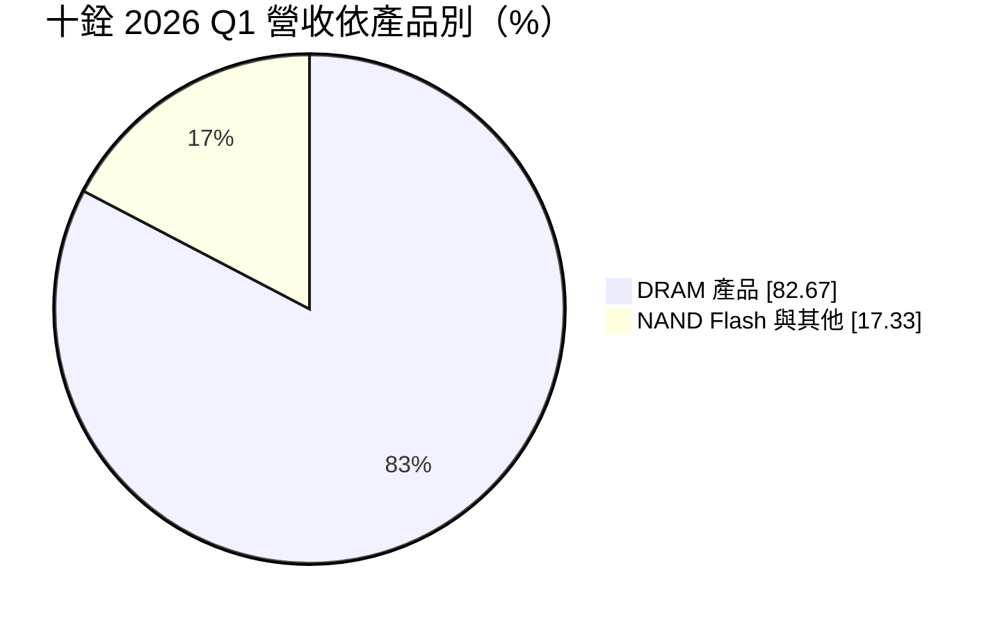
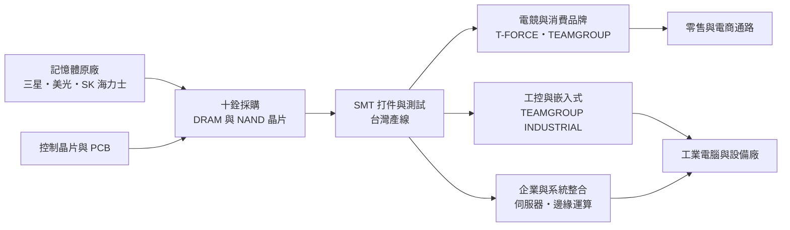
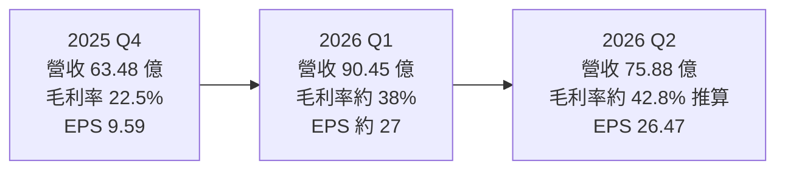
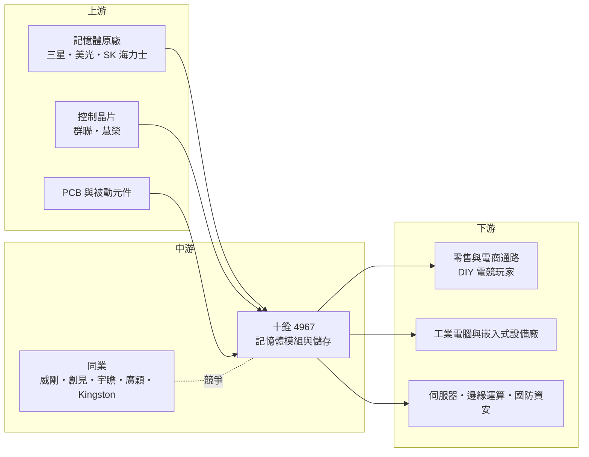

# 4967 十銓

> 上市｜[[產業索引-半導體業|半導體業]]｜上市（櫃）日期 2019/01/14

# 第一章：企業模式與商業藍圖

> [!info] 撰寫說明
> 本文由 Claude 依公開資料整理，架構比照 [[2330台積電]] 的四章研究，資料截至 2026-10-08。財務數字來源：StockAnalysis（S&P Global Market Intelligence）年度損益與財務比率、優分析與工商時報的財報報導、富果研究整理的 2026 年 4 月法說會內容、證交所 OpenAPI 的 2026 年上半年財報；產業描述為整理性內容，尚未逐條比對原始文件。#待校對

在評估單一個股的長期投資價值時，首要步驟是拆解企業的底層獲利邏輯。本章針對十銓科技（股票代號：4967，以下簡稱十銓）的商業模式進行定性分析，說明一家不生產晶片的記憶體模組廠如何賺錢，以及它為何在 2023 年以後從電競品牌轉向企業與工控市場。

## 一、核心定位：向原廠買晶片、加值成模組的記憶體品牌商

十銓成立於 1997 年，2019 年在證交所上市，總部位於新北市中和。它的本業是記憶體模組與儲存裝置：向 [[005930三星電子]]、美光（Micron）、SK 海力士等記憶體原廠採購 [[DRAM]] 與 [[NAND Flash]] 晶片，再搭配控制晶片、印刷電路板與散熱設計，組裝成記憶體模組、[[SSD]]、記憶卡與隨身碟，以自有品牌或替企業客戶客製後出貨。

理解十銓的關鍵，是它在記憶體產業中的位置。全球 DRAM 與 NAND Flash 晶片產能高度集中在少數原廠手上，模組廠本身沒有晶圓廠，毛利來自兩個地方：一是設計、測試與品牌帶來的加值，二是庫存的時間價差。當晶片價格上漲時，模組廠手上較早買進的低價庫存會產生「庫存利益」，毛利率跳升；價格下跌時則相反，必須認列存貨跌價損失。這使得十銓的獲利高度跟隨記憶體價格週期擺盪，過去五年的毛利率從 5.9%（2021 年）到 2026 年上半年的 40.18%，落差極大。

## 二、終端應用與產品板塊：從電競品牌走向 B2B

十銓的產品以 DRAM 為主。依富果研究整理的 2026 年 4 月法說會內容，2026 年第一季 DRAM 產品占營收 82.67%，其中 [[DDR5]] 約占 DRAM 的 84%、DDR4 約 15%，其餘為 NAND Flash 相關的 SSD、記憶卡等產品。

在品牌與客群上，十銓經營四條主要產品線：

* **電競與消費性（T-FORCE、TEAMGROUP、T-CREATE）：** 這是十銓過去最知名的業務，透過電腦零售與電商通路銷售超頻記憶體、電競 SSD 與創作者用儲存產品。這類產品重視外觀設計與效能，品牌知名度高，但需求跟著個人電腦與遊戲市場起伏，價格競爭也最激烈。
* **工業與嵌入式（TEAMGROUP INDUSTRIAL）：** 提供[[工業電腦]]、網通設備、醫療與國防設備使用的寬溫、抗震記憶體與儲存。工控客戶一旦完成驗證，通常會在產品生命週期內持續採用同一規格，訂單穩定、毛利較好。
* **企業與系統整合：** 面向伺服器、資料中心與[[邊緣運算]]設備的企業級記憶體與 SSD，以及與系統整合商合作的專案。
* **國防與資安：** 公司近年參加德國 Embedded World、法國 Eurosatory 等展會，推廣具資安功能的儲存方案，切入國防與關鍵基礎設施市場。

B2B 業務是十銓近年最重要的結構轉變。依法說會資料，B2B 營收比重由 2025 年第一季的 16.8% 升至 2026 年第一季的 47.5%，2026 年 3 月單月已達六成以上。這代表十銓正從「看天吃飯的零售品牌」轉向「有長期客戶關係的解決方案供應商」。

## 三、資本轉化邏輯（營運模式）：以採購能力與測試能力換取價差

十銓的營運模式可以拆成三個環節。第一是採購：模組廠的命脈是能否在缺貨時拿到晶片。十銓與三大原廠維持長期合作關係，在 2026 年記憶體供不應求的環境中，穩定的配貨本身就是競爭力。第二是加工與測試：晶片進廠後經過 SMT 打件、燒機與相容性測試，才能出貨給要求嚴格的工控與企業客戶。依法說會資料，十銓在 2026 年前幾個月已把測試產能擴增兩倍，並規劃增加兩條 SMT 產線。第三是通路：消費性產品靠全球零售與電商，B2B 產品則靠業務團隊與客戶共同設計導入。

這個模式的資本需求不高，主要資產是存貨與應收帳款，而不是廠房設備。因此十銓的資本效率主要取決於「存貨周轉」與「買賣價差」，景氣上行時 [[ROE]] 可以快速拉高，景氣反轉時也可能迅速轉為虧損。

## 四、企業長期藍圖：用 B2B 降低景氣波動

十銓的長期策略很清楚，就是降低對消費性市場與價格週期的依賴。具體方向包括：持續提高工控、企業與系統整合業務比重，透過客製化設計與長期供貨合約，讓毛利不再只隨晶片價格漲跌；擴大台灣的測試與 SMT 產能，以支撐工控客戶對品質與交期的要求；以及布局 AI 伺服器、邊緣運算與國防資安等高附加價值應用。

這個方向能否成功，關鍵在於下一次記憶體價格下跌時，B2B 業務能否守住毛利。若 B2B 客戶黏著度足夠，十銓的獲利底部會比過去高；若轉型只是搭上漲價順風，景氣反轉時仍會回到低毛利的老路。這是長期投資人最需要追蹤的問題。

# 第二章：護城河深度與競爭優勢

在長期價值投資中，「護城河」指企業抵禦競爭、維持超額利潤的保護機制。本章分析十銓的護城河構成、國內外主要競爭對手，以及這些優勢在記憶體價格週期中能守住多少。

## 一、十銓護城河的核心組成要素

記憶體模組業的進入門檻不高，產品規格由 JEDEC 標準決定，晶片則掌握在原廠手中，因此整體產業屬於護城河偏窄的行業。十銓的優勢主要來自以下三點：

* **1. 與原廠的長期供貨關係：** 在記憶體缺貨時期，原廠會優先把晶片分配給長期合作、付款穩定的模組廠。十銓與三星、美光、SK 海力士都有長期合作，這讓它在供不應求時拿得到貨，也是 2026 年營收大幅成長的前提。這種關係需要多年累積，新進者難以複製。
* **2. 工控驗證與測試能力：** 工業電腦、醫療與網通設備的客戶需要寬溫、長期供貨與嚴格的相容性測試，一旦完成驗證，客戶通常不會為了小幅價差更換供應商。十銓把測試能力列為工控領域的主要差異化優勢，這是 B2B 毛利較高的原因。
* **3. 電競品牌的認知度：** T-FORCE 在全球 DIY 電腦玩家間有一定知名度，品牌溢價讓高階電競產品的毛利略高於無品牌產品。不過消費者對記憶體品牌的忠誠度有限，這項優勢在價格戰中保護力較弱。

## 二、全球主要競爭對手格局

| 對手 | 定位 | 對十銓的威脅 |
|---|---|---|
| Kingston（金士頓） | 全球最大獨立記憶體模組廠，通路與規模最大 | 在消費與企業市場都有規模與議價優勢 |
| Corsair、G.Skill | 電競記憶體與周邊品牌 | 在高階電競記憶體直接競爭 |
| [[3260威剛]] | 台灣最大記憶體模組品牌之一 | 產品線與通路高度重疊，庫存策略相似 |
| [[2451創見]]、[[8271宇瞻]]、[[4973廣穎]] | 台灣工控與消費性儲存品牌 | 工控與嵌入式市場直接競爭 |
| 記憶體原廠自有品牌 | 美光 Crucial、三星等 | 缺貨時優先供應自家通路，擠壓模組廠 |

## 三、優勢轉化：哪些市場守得住、哪些守不住

* **守得住：** 已完成驗證的工控、嵌入式與國防客戶。這些客戶看重長期供貨與品質一致性，更換供應商需要重新測試，因此即使在價格下跌時，訂單也相對穩定。B2B 比重提升到五成左右以後，這部分業務能為十銓提供較穩定的獲利底盤。
* **守不住：** 消費性與電競市場的價格。這類產品規格標準化，消費者容易比價，景氣下行時各家模組廠同時降價去化庫存，十銓也無法倖免。2021 至 2022 年十銓營業利益率為負，就是消費市場低迷與價格下跌的結果。
* **觀察重點：** 第一，記憶體價格反轉後毛利率能維持在什麼水準，這是檢驗 B2B 轉型成效的最佳時機。第二，B2B 比重能否在景氣下行時維持，而不是因消費性產品降價促銷而被稀釋。第三，存貨管理紀律，也就是公司在價格高點時是否過度囤貨。

# 第三章：財務體質與盈利規模

資料日期：2026-10-08。數字取自 StockAnalysis（S&P Global）年度損益與財務比率、優分析財報報導與證交所 OpenAPI，表格是撰寫當時的快照；最新月營收、毛利率、累計 EPS 由自動排程寫在本筆記的屬性欄位（月營收、毛利率、累計EPS 等）。#待校對

財務報表是檢驗護城河是否真實存在的最終標準。本章用多年度三率、ROE、現金流與資本報酬，檢視十銓在記憶體週期中的獲利品質。

## 一、獲利能力的基石：三率

| 年度 | 營收（新台幣） | [[毛利率]] | [[營業利益率]] | EPS（元） | [[ROE]] |
|---|---|---|---|---|---|
| 2021 | 76.5 億 | 5.90% | -2.10% | -1.46 | -4.77% |
| 2022 | 67.2 億 | 9.31% | -0.76% | 0.01 | 0.02% |
| 2023 | 165.7 億 | 7.83% | 1.86% | 3.36 | 11.09% |
| 2024 | 199.4 億 | 11.16% | 2.70% | 6.30 | 16.97% |
| 2025 | 204.3 億 | 14.26% | 6.90% | 13.06 | 25.08% |
| 2026 上半年 | 166.3 億 | 40.18% | 35.94% | 53.44 | 未查得 |

註：2021 至 2024 年 EPS 為 StockAnalysis 稀釋後數字，2025 年為優分析報導的基本 EPS；ROE 取自 StockAnalysis。

* **[[毛利率]]：** 十銓過去的毛利率長期落在 5% 至 15% 之間，這是典型模組廠的水準，代表多數時間只賺加工與通路的薄利。2025 年第四季起記憶體價格急漲，低價庫存與 B2B 比重提升同時發酵，毛利率在 2026 年上半年達到 40.18%，遠高於歷史常態。投資人應把這段時期視為週期高峰，而不是新的常態水準。
* **[[營業利益率]]：** 模組廠的營業費用相對固定，營收與毛利同步放大時，營業利益率擴張更快。2026 年上半年營業利益率 35.94%，與毛利率只差約 4 個百分點，顯示費用在高峰期幾乎可以忽略；但在景氣低谷時，費用就足以讓營業利益轉負，2021 與 2022 年即是如此。
* **營收規模：** 2021 至 2025 年營收年複合成長率約 27.8%（推算），主要成長發生在 2023 年，營收由 67 億元跳升到 166 億元。

## 二、[[ROE]]：資本效率

近五年（2021 至 2025 年）ROE 平均約 9.7%（推算），但分布極不平均：2021 至 2022 年接近零或為負，2025 年升至 25%，2026 年上半年單季 EPS 就超過 26 元，年化 ROE 推估將遠高於過去水準。這種「平均值普通、峰值極高」的型態，是記憶體模組業的典型特徵。評估十銓時，比起單一年度的 ROE，更應觀察一個完整週期內的平均報酬。

## 三、資本支出與自由現金流

* **[[CapEx]]：** 十銓的固定資產投資主要是 SMT 產線與測試設備，規模遠小於營收，屬於輕資產模式。2026 年擴增測試產能與 SMT 產線，金額未查得，但相對於營收應屬有限（推估）。
* **[[自由現金流]]：** 模組廠的現金流主要受存貨與應收帳款影響。依 StockAnalysis 的自由現金流殖利率，2021、2023 與 2025 年為負，2022 與 2024 年為正，代表景氣上行、積極備貨的年度現金會被存貨吃掉，景氣下行去化庫存時反而回收現金。這種逆向的現金流型態，使十銓在漲價期間需要借款支應營運資金，2025 年底負債權益比升至 0.68。
* **股利：** 2025 年度配發現金股利 10 元，配發率約 77%（優分析）。依 StockAnalysis，2023 與 2024 年配發率分別約 30% 與 27%，2021 與 2022 年未配息。股利會隨週期大幅變動，不適合當成穩定收息股看待。

## 四、[[ROIC]] 與 [[WACC]]：價值創造利差

依 StockAnalysis，十銓的 ROIC 在 2021 年為 -5.66%、2022 年約 0%、2023 年 9.80%、2024 年 15.24%、2025 年 22.06%。

WACC 以 CAPM 推估：無風險利率取台灣 10 年期公債約 1.75%，市場風險溢酬 6%，β 取記憶體模組同業常見的 1.3（假設值，未查得公司實際 β），股東權益成本約 1.75% ＋ 1.3 × 6% ＝ 9.55%。負債成本假設 2.5%，稅率 20%，稅後約 2.0%。資本結構依 2025 年底負債權益比 0.68 換算為權益約 60%、負債約 40%（此處把總負債視為資金來源，偏保守），WACC 約 0.6 × 9.55% ＋ 0.4 × 2.0% ≒ 6.5%（推算）。

比較兩者：2023 至 2025 年 ROIC 明顯高於 WACC，2026 年在記憶體漲價高峰下利差更大，公司正在創造價值；但 2021 至 2022 年 ROIC 低於 WACC，代表景氣低谷時資本報酬不足以支應資金成本。以完整週期來看，十銓過去是「景氣好時大幅創造價值、景氣差時侵蝕價值」的公司，B2B 轉型的意義正是要把低谷期的 ROIC 拉到 WACC 以上。

# 第四章：總體風險與地緣政治

任何企業都無法脫離宏觀環境獨立存在。本章分析十銓未來必須面對的地緣政治、產業週期、營運與技術風險。

## 一、地緣政治

十銓的晶片來源集中在韓國與美國原廠，生產與測試主要在台灣，客戶遍布全球。美國對中國的半導體出口管制、各國關稅政策，以及中國記憶體廠（長鑫存儲、長江存儲）擴產，都會改變全球記憶體的供需與價格。若中國原廠低價產品大量流入市場，可能壓縮模組廠在消費性市場的價格；反過來說，國防與關鍵基礎設施客戶傾向排除中國晶片，這對以台、韓、美晶片為主的十銓是有利因素。

## 二、產業週期與市場結構

記憶體是半導體中週期最劇烈的產品，價格常在一至兩年內大漲或大跌。2026 年的上漲由 AI 伺服器需求帶動，原廠把產能轉向 [[HBM]] 與伺服器記憶體，使一般 DRAM 與 NAND Flash 供給吃緊。這種結構性因素可能讓本輪週期比過去更長，但原廠擴產最終會使供需轉向。模組廠處在原廠與終端之間，[[長鞭效應]]明顯，價格反轉時庫存跌價損失往往比營收下滑更快出現。

## 三、營運環境的隱性風險

* **存貨風險：** 漲價期間模組廠傾向多備貨，一旦價格反轉，高價庫存會轉為跌價損失。2026 年營收與存貨同步擴大，存貨水位是下一階段最重要的風險指標。
* **原廠配貨政策：** 缺貨時原廠的分配優先順序決定模組廠能出多少貨。若原廠改為優先供應自有品牌或大型客戶，十銓的營收會受限。
* **營運資金與負債：** 漲價期間需要更多營運資金，負債比上升，若價格急跌，償債與存貨壓力會同時出現。

## 四、科技或法規演進

記憶體規格約每五至七年換代一次，DDR4 轉 DDR5、PCIe 4.0 轉 5.0 SSD，每次換代都考驗模組廠的設計與測試能力。另一個長期趨勢是記憶體與處理器整合越來越緊密，例如筆電採用焊死在主機板上的 LPDDR，以及 AI 伺服器採用 HBM 與 CAMM 等新型態模組，這會縮小可插拔模組的市場。十銓能否在企業級與工控規格上持續跟上，是長期競爭力的關鍵。

# 專有名詞解析

## 半導體

- **[[DRAM]]**：動態隨機存取記憶體，電腦與伺服器的主記憶體，斷電後資料會消失，價格週期波動大。
- **[[NAND Flash]]**：斷電後仍能保存資料的快閃記憶體，是 SSD、記憶卡與隨身碟的核心元件。
- **[[DDR5]]**：第五代 DDR 記憶體標準，頻寬與容量高於 DDR4，2022 年起逐步成為電腦與伺服器主流。
- **[[SSD]]**：固態硬碟，以 NAND Flash 加控制晶片組成，讀寫速度遠快於傳統硬碟。
- **[[HBM]]**：高頻寬記憶體，把多層 DRAM 垂直堆疊後與 AI 晶片封裝在一起，原廠擴產 HBM 會排擠一般 DRAM 產能。

## 應用

- **[[邊緣運算]]**：在靠近資料來源的設備端直接運算，而不是全部傳回雲端，可降低延遲與頻寬成本。

## 金融

- **[[庫存利益]]**：原料或商品價格上漲時，較早以低價買進的存貨以較高價格售出所產生的額外毛利，屬週期性收益。
- **[[ROE]]**：股東權益報酬率，稅後淨利除以股東權益，衡量公司運用股東資金賺錢的效率。
- **[[ROIC]]**：投入資本報酬率，衡量公司投入營運的資本能產生多少稅後營業利益。
- **[[WACC]]**：加權平均資金成本，股東與債權人要求報酬率的加權平均，ROIC 高於 WACC 才代表創造價值。
- **[[自由現金流]]**：營業活動現金流減去資本支出，代表企業可自由用於配息、還債或併購的現金。
- **[[長鞭效應]]**：終端需求的小幅變動，沿供應鏈往上游傳遞時被逐級放大，造成上游庫存與訂單劇烈波動。

## 產業

- **[[DRAM模組]]**：把多顆 DRAM 晶片焊在電路板上做成可插拔的記憶體條，模組廠向原廠買晶片後加工銷售。
- **[[工業電腦]]**：用於工廠自動化、交通、醫療等場域的電腦，強調寬溫、耐震與長期供貨，對零組件驗證要求嚴格。

# 核心供應鏈

## 1. 上游：記憶體晶片與控制晶片
- DRAM 與 NAND Flash 原廠：[[005930三星電子]]、美光（Micron）、SK 海力士
- SSD 控制晶片：[[8299群聯]]、慧榮（Silicon Motion）

## 2. 中游：十銓本身與同業
- 台灣模組同業：[[3260威剛]]、[[2451創見]]、[[8271宇瞻]]、[[4973廣穎]]
- 國際同業：Kingston、Corsair、G.Skill

## 3. 下游：通路與終端客戶
- 消費性：全球電腦零售與電商通路
- 工控與嵌入式：工業電腦、網通與醫療設備廠（十銓未揭露具名客戶）
- 企業與國防：伺服器、邊緣運算與資安設備整合商

## 最新新聞
<!-- news:start（自動產生，請勿手動編輯此範圍） -->
- 2026-10-07 📰 媒體 17:50｜營收速報 - 十銓(4967)9月營收40.81億元年增率高達109.69％｜[鉅亨網](https://news.cnyes.com/news/id/6623802)

完整紀錄：[[4967十銓 新聞]]
<!-- news:end -->

## 相關連結
- [公開資訊觀測站](https://mopsov.twse.com.tw/mops/web/t05st03?step=1&firstin=1&co_id=4967)
- [Goodinfo](https://goodinfo.tw/tw/StockDetail.asp?STOCK_ID=4967)
- [Yahoo 股市](https://tw.stock.yahoo.com/quote/4967)
- [鉅亨網新聞](https://www.cnyes.com/twstock/4967/news)
