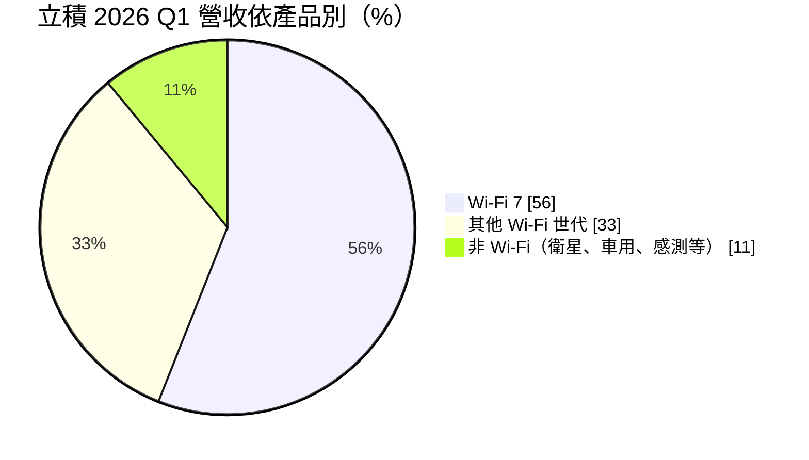
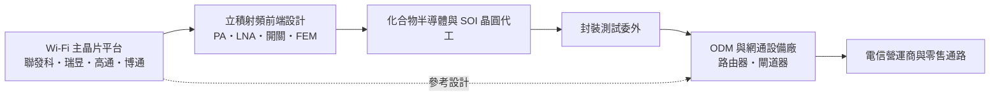
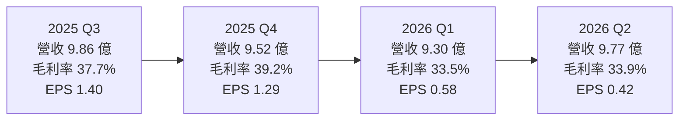
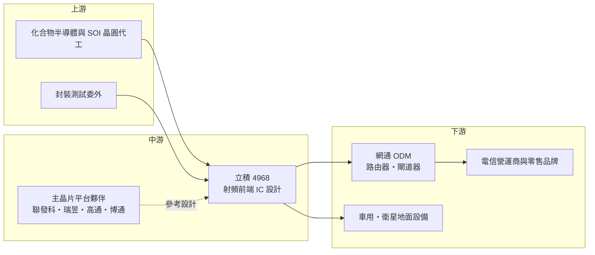

# 4968 立積

> 上市｜[[產業索引-半導體業|半導體業]]｜上市（櫃）日期 2015/11/13

# 第一章：企業模式與商業藍圖

> [!info] 撰寫說明
> 本文由 Claude 依公開資料整理，架構比照 [[2330台積電]] 的四章研究，資料截至 2026-10-08。財務數字來源：StockAnalysis（S&P Global Market Intelligence）年度與季度損益、財務比率，聯合報、工商時報對立積 2025 年第三季至 2026 年第二季財報與法說會的報導，證交所 OpenAPI 的 2026 年上半年財報；產業描述為整理性內容，尚未逐條比對原始文件。#待校對

在評估單一個股的長期投資價值時，首要步驟是拆解企業的底層獲利邏輯。本章針對立積電子（股票代號：4968，以下簡稱立積）的商業模式進行定性分析，說明一家台灣射頻 IC 設計公司如何在美系大廠主導的市場中找到位置，以及它的成長為何與 Wi-Fi 世代更替緊密相連。

## 一、核心定位：台灣少數專攻射頻前端的 IC 設計公司

立積成立於 2004 年，2015 年上市，總部位於台北內湖，是一家 [[Fabless]] IC 設計公司，專門設計無線通訊中的[[射頻前端]]元件，包括功率放大器（[[PA]]）、低雜訊放大器（LNA）、射頻開關，以及把這些元件整合在一起的前端模組（[[FEM]]）。

射頻前端位在無線晶片與天線之間，負責把訊號放大後送出，並把天線收到的微弱訊號乾淨地放大給主晶片處理。主晶片（例如 Wi-Fi SoC）由 [[2454聯發科]]、[[2379瑞昱]]、[[QCOM高通]]、[[AVGO博通]] 等公司設計，但射頻前端涉及高頻類比電路、[[GaAs]] 等[[化合物半導體]]與 SOI 製程，需要另外的專業。全球射頻前端市場長期由 Skyworks、Qorvo、[[AVGO博通]] 與村田等美日大廠主導，立積是少數能在 Wi-Fi 前端模組打入國際平台參考設計的台灣公司。

## 二、終端應用與產品板塊：Wi-Fi 占九成

立積的營收高度集中在 Wi-Fi。依工商時報對 2026 年第一季法說會的報導，Wi-Fi 產品營收約 8.25 億元，占總營收 89%；其中 [[Wi-Fi 7]] 產品占總營收 56%，年增 475%。

* **Wi-Fi 前端模組：** 用於路由器、電信業者的家用閘道器（CPE）、網狀網路設備與部分手機，是立積的核心業務。電信業者每隔幾年會隨 Wi-Fi 世代升級設備，這是立積營收最主要的驅動力。
* **衛星與廣播：** 包括低雜訊放大器等衛星接收元件，以及[[低軌衛星]]地面設備（CPE）相關產品。
* **車用：** 車用前端模組已開始導入，車用產品一旦採用通常有長達十年的供貨週期，毛利也較好。
* **感測與其他：** 雷達感測等新應用，目前比重仍小。

法說會中公司表示非 Wi-Fi 業務約占營收 15% 至 20%（聯合報報導），與上圖 11% 的計算口徑不同，可能因為統計期間或分類方式差異，需以公司簡報為準。

## 三、資本轉化邏輯（營運模式）：設計導入平台、委外製造

立積的獲利模式有兩個關鍵。第一是「進入參考設計」：Wi-Fi 主晶片廠推出新平台時，會搭配經過驗證的前端模組做成參考設計，網通設備廠（ODM）通常沿用這套設計開發產品。立積若在新世代 Wi-Fi 平台開發初期就與主晶片廠合作，後續幾年就能隨著該平台出貨。依工商時報報導，立積已與多個平台合作開發 Wi-Fi 8 相關產品。

第二是輕資產的 Fabless 模式：立積只負責設計，晶圓製造與封測委外，資本支出低。它的主要成本是研發人力與晶圓代工成本，因此營收規模放大時有明顯的營運槓桿；營收停滯時，研發費用則會壓縮營業利益，2023 年就因營收下滑而出現虧損。

## 四、企業長期藍圖：跟著 Wi-Fi 世代成長，並分散到車用與衛星

立積的長期成長有兩條主線。第一條是 Wi-Fi 世代更替：每一代 Wi-Fi 使用更高頻段、更多天線與更高功率要求，單一設備所需的前端元件數量與單價都會提高。Wi-Fi 7 在 2025 至 2026 年快速放量，公司表示 Wi-Fi 7 毛利率優於 Wi-Fi 6；Wi-Fi 8 預計最快 2027 年下半年才有明顯營收。立積的成長節奏因此大致跟著 Wi-Fi 標準約四至五年一次的換代週期走。

第二條是分散應用：車用、低軌衛星地面設備、[[AIoT]] 與感測，目的是降低對單一 Wi-Fi 市場的依賴。這些市場驗證時間長、量較小，但產品生命週期也長，若能累積到一定比重，可以讓立積在 Wi-Fi 換代的空窗期維持穩定獲利。

# 第二章：護城河深度與競爭優勢

在長期價值投資中，「護城河」指企業抵禦競爭、維持超額利潤的保護機制。本章分析立積的護城河構成、全球主要競爭對手，以及這些優勢能否在美系大廠與中國對手的夾擊下守住。

## 一、立積護城河的核心組成要素

* **1. 高頻類比設計的技術門檻：** 射頻前端需要在高頻下兼顧輸出功率、線性度與效率，設計高度依賴經驗累積，不像數位電路可以靠工具大量自動化。立積二十多年累積的 Wi-Fi 前端設計經驗，是新進者短期難以追上的。
* **2. 與主晶片平台的長期合作：** 進入主晶片廠的參考設計需要長時間的共同驗證。一旦在某一世代 Wi-Fi 平台站穩，網通設備廠多數會沿用，這形成一定程度的轉換成本。
* **3. 非美系的供應選擇：** 對亞洲網通設備廠與電信營運商而言，立積提供美系大廠以外的第二來源，價格與服務彈性較好。依工商時報 2025 年 11 月報導，Skyworks 與 Qorvo 宣布合併後，立積認為客戶分散供應來源的需求可能提高，並已接獲韓、日、美系廠商洽詢產能規劃。

## 二、全球主要競爭對手格局

| 對手 | 定位 | 對立積的威脅 |
|---|---|---|
| Skyworks、Qorvo（宣布合併） | 全球射頻前端龍頭，手機與 Wi-Fi 產品線完整 | 規模、專利與手機客戶關係遠大於立積 |
| [[AVGO博通]]、[[QCOM高通]] | 主晶片廠，部分平台自行整合前端 | 若主晶片廠把前端整合進自家方案，會壓縮獨立前端廠空間 |
| 村田等日系廠 | 射頻模組與被動元件整合 | 在高階模組整合上有優勢 |
| 中國射頻前端廠（卓勝微等） | 中國本土化政策扶植 | 以低價搶中國網通與手機市場 |

## 三、優勢轉化：哪些市場守得住、哪些守不住

* **守得住：** 電信營運商的 Wi-Fi 閘道器與路由器市場。這類產品重視穩定供貨與與主晶片的相容性，立積在 Wi-Fi 6 與 Wi-Fi 7 都已建立平台合作，是目前最穩固的基本盤。
* **守不住：** 手機射頻前端與中國低階網通市場。手機前端由美系大廠以整合模組與專利壁壘主導，中國市場則面臨本土廠商的價格競爭，立積在這兩塊較難取得高市占或高毛利。
* **觀察重點：** 第一，Wi-Fi 8 平台的參與程度，這決定 2027 年後的成長。第二，非 Wi-Fi 業務比重能否穩定提升到兩成以上。第三，毛利率能否回到公司 35% 的目標，這反映產品組合與成本控制能力。

# 第三章：財務體質與盈利規模

資料日期：2026-10-08。數字取自 StockAnalysis（S&P Global）年度與季度損益、財務比率，以及聯合報、工商時報的財報報導，表格是撰寫當時的快照；最新月營收、毛利率、累計 EPS 由自動排程寫在本筆記的屬性欄位（月營收、毛利率、累計EPS 等）。#待校對

財務報表是檢驗護城河是否真實存在的最終標準。本章用多年度三率、ROE、現金流與資本報酬，檢視立積的獲利品質。

## 一、獲利能力的基石：三率

| 年度 | 營收（新台幣） | [[毛利率]] | [[營業利益率]] | EPS（元） | [[ROE]] |
|---|---|---|---|---|---|
| 2021 | 53.2 億 | 29.08% | 10.04% | 5.26 | 20.31% |
| 2022 | 34.3 億 | 30.87% | -0.50% | 0.62 | 2.31% |
| 2023 | 29.9 億 | 26.87% | -9.97% | -2.46 | -9.72% |
| 2024 | 36.8 億 | 33.53% | 2.14% | 1.73 | 6.58% |
| 2025 | 37.6 億 | 36.27% | 6.35% | 2.66 | 9.23% |
| 2026 上半年 | 19.1 億 | 33.68% | 3.27% | 1.00 | 未查得 |

* **[[毛利率]]：** 立積的毛利率長期在 27% 至 39% 之間，低於國際射頻大廠，反映它在價格上仍需讓利給客戶。毛利率主要受產品世代影響：新世代產品（例如 Wi-Fi 7）初期單價與毛利較高，隨著競爭者跟進逐漸下滑。2026 年上半年毛利率由 2025 年第四季的 39% 降到約 33.5%，公司解釋為供應鏈與原物料成本上升。
* **[[營業利益率]]：** 研發費用是立積最大的固定成本，因此營業利益率對營收規模極度敏感。2021 年營收 53 億元時營業利益率 10%，2023 年營收縮到 30 億元就轉為 -10%。這說明立積需要營收規模持續擴大，才能把技術優勢轉成穩定獲利。
* **業外：** 立積以美元計價銷售，匯兌損益影響明顯。2025 年第二季本業獲利但因匯兌損失使單季 EPS 為負，2026 年第一季營業利益率僅 2.1%，EPS 卻有 0.58 元，也與業外收益有關。

## 二、[[ROE]]：資本效率

近五年（2021 至 2025 年）ROE 平均約 5.7%（推算），波動很大：2021 年 Wi-Fi 6 與疫情拉貨高峰時達 20%，2023 年庫存調整時為 -9.7%。2021 至 2025 年營收年複合成長率約 -8.3%（推算），代表 2021 年的高峰到 2025 年仍未回到。立積幾乎沒有負債（2025 年負債權益比 0.03），ROE 的波動完全來自本業獲利本身。

## 三、資本支出與自由現金流

* **[[CapEx]]：** Fabless 模式不需建廠，資本支出主要是研發設備與測試儀器，規模很小。
* **[[自由現金流]]：** 依 StockAnalysis，2021、2022、2024、2025 年自由現金流殖利率為正，2023 年接近零，顯示即使在虧損年度，現金流也大致能維持平衡，這是輕資產模式的優點。
* **股利：** 2025 年度配發現金股利 1.6 元，依 StockAnalysis 配發率約 41%；2021 年配發率約 54%，2023 與 2024 年資料顯示未配發或未列出。股利隨獲利波動，屬中等穩定度。

## 四、[[ROIC]] 與 [[WACC]]：價值創造利差

依 StockAnalysis，立積 ROIC 在 2021 年為 27.8%，2022 年 -0.8%，2023 年 -18.2%，2024 年 3.8%，2025 年 12.1%。

WACC 以 CAPM 推估：無風險利率取台灣 10 年期公債約 1.75%，市場風險溢酬 6%，β 取台灣網通與射頻 IC 設計同業常見的 1.2（假設值，未查得公司實際 β），股東權益成本約 1.75% ＋ 1.2 × 6% ＝ 8.95%。立積幾乎沒有有息負債，WACC 約等於股東權益成本，約 9%（推算）。

比較兩者：2021 年與 2025 年 ROIC 高於 9%，有創造價值；2022 至 2024 年 ROIC 遠低於 WACC，價值被侵蝕。以五年平均來看，ROIC 約在 5% 上下（推算），仍低於資金成本。這代表立積的技術優勢尚未轉化為穩定的超額報酬，關鍵在於能否在 Wi-Fi 換代空窗期維持營收規模。

# 第四章：總體風險與地緣政治

任何企業都無法脫離宏觀環境獨立存在。本章分析立積未來必須面對的地緣政治、產業週期、營運與技術風險。

## 一、地緣政治

立積的客戶多為亞洲網通設備廠，終端銷往全球電信營運商。美中科技競爭帶來兩面影響：一方面，部分歐美電信營運商希望減少中國元件，立積作為台灣供應商具有優勢；另一方面，中國市場本土化政策會讓中國設備廠優先採用本土射頻廠，壓縮立積在中國的空間。美國關稅政策與各國對網通設備的資安審查，也可能改變 ODM 的生產地點與採購決策。

## 二、產業週期與市場結構

網通設備屬消費與電信資本支出混合的市場，2021 年疫情帶動居家上網需求，之後 2022 至 2023 年進入長達兩年的庫存調整，立積營收從 53 億元降到 30 億元。這種[[長鞭效應]]在網通產業很常見。此外，Skyworks 與 Qorvo 合併後的產業整併，可能改變大廠的產品策略與定價，對立積既是機會也是壓力。

## 三、營運環境的隱性風險

* **客戶與平台集中：** 營收高度依賴 Wi-Fi 與少數主晶片平台，若在新世代平台的參考設計中失去位置，影響會延續數年。
* **成本與匯率：** 晶圓代工與封測成本上漲時，立積議價能力有限，2026 年上半年毛利率下滑即是例子；美元計價也使匯率波動影響業外損益。
* **記憶體漲價的間接影響：** 2026 年記憶體價格大漲推升網通設備整機成本，部分客戶對需求看法保守，可能延後拉貨。

## 四、科技或法規演進

主晶片廠把射頻前端整合進 SoC 或模組，是獨立前端廠長期最大的技術風險。另一方面，Wi-Fi 8 與更高頻段（6 GHz 以上）的應用，對前端線性度與功耗要求更高，反而可能提高獨立前端廠的價值。各國對 6 GHz 頻段開放的政策進度，也會影響 Wi-Fi 7 與 Wi-Fi 8 的普及速度。

# 專有名詞解析

## 半導體

- **[[射頻前端]]**：位在無線晶片與天線之間的電路，包含功率放大器、低雜訊放大器、開關與濾波器，負責訊號的放大與切換。
- **[[PA]]**：功率放大器，把要發射的無線訊號放大到足夠功率再送到天線，是射頻前端中最關鍵的元件。
- **[[FEM]]**：前端模組，把功率放大器、低雜訊放大器與開關整合在同一封裝，簡化設備廠的設計。
- **[[GaAs]]**：砷化鎵，一種化合物半導體材料，高頻特性佳，常用於手機與 Wi-Fi 的功率放大器。
- **[[化合物半導體]]**：由兩種以上元素組成的半導體材料，例如砷化鎵、磷化銦、氮化鎵，適合高頻、高功率與光電應用。
- **[[Fabless]]**：只做 IC 設計、不擁有晶圓廠的商業模式，製造委託晶圓代工廠。

## 應用

- **[[Wi-Fi 7]]**：IEEE 802.11be 無線網路標準，支援 320 MHz 頻寬與多連結操作，速度與延遲明顯優於 Wi-Fi 6。
- **[[低軌衛星]]**：在約 500 至 2,000 公里高度運行的通訊衛星，傳輸延遲低，需要大量地面接收設備。
- **[[AIoT]]**：人工智慧與物聯網的結合，讓連網設備具備在地判斷能力。

## 金融

- **[[ROE]]**：股東權益報酬率，稅後淨利除以股東權益，衡量公司運用股東資金賺錢的效率。
- **[[ROIC]]**：投入資本報酬率，衡量公司投入營運的資本能產生多少稅後營業利益。
- **[[WACC]]**：加權平均資金成本，股東與債權人要求報酬率的加權平均，ROIC 高於 WACC 才代表創造價值。
- **[[長鞭效應]]**：終端需求的小幅變動，沿供應鏈往上游傳遞時被逐級放大，造成上游庫存與訂單劇烈波動。

# 核心供應鏈

## 1. 上游：晶圓代工與封測
- 射頻元件多採砷化鎵與 SOI 製程，台灣砷化鎵代工廠如 [[3105穩懋]]、[[8086宏捷科]]（立積未公開具體代工夥伴，此為產業常見供應來源，推估）

## 2. 中游：立積本身與平台夥伴
- Wi-Fi 主晶片平台：[[2454聯發科]]、[[2379瑞昱]]、[[QCOM高通]]、[[AVGO博通]]

## 3. 下游：網通設備與終端
- 網通 ODM 與品牌：路由器、電信閘道器與網狀網路設備廠（具名客戶未查得）
- 電信營運商：歐美日韓電信業者的家用閘道器標案

## 4. 競爭同業
- Skyworks、Qorvo、村田、卓勝微

## 最新新聞
<!-- news:start -->
<!-- news:end -->

## 相關連結
- [公開資訊觀測站](https://mopsov.twse.com.tw/mops/web/t05st03?step=1&firstin=1&co_id=4968)
- [Goodinfo](https://goodinfo.tw/tw/StockDetail.asp?STOCK_ID=4968)
- [Yahoo 股市](https://tw.stock.yahoo.com/quote/4968)
- [鉅亨網新聞](https://www.cnyes.com/twstock/4968/news)
