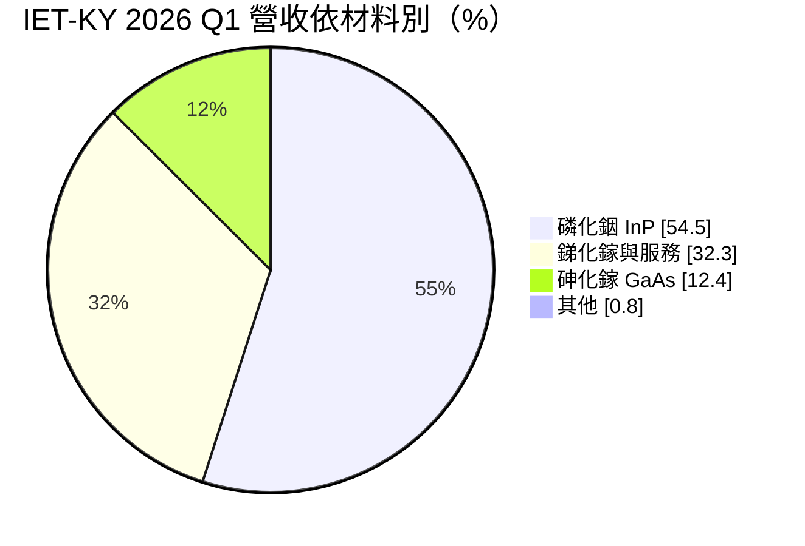
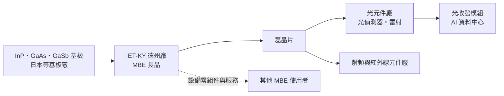
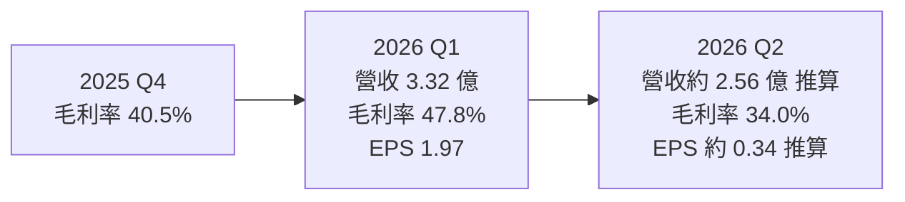
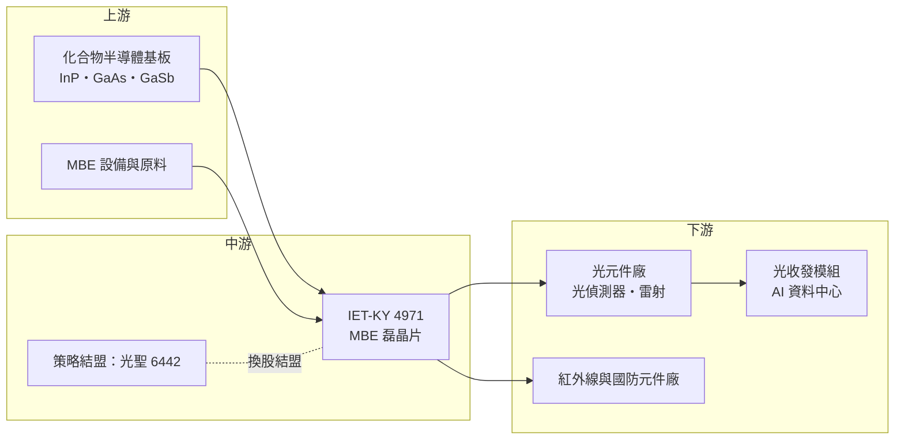

# 4971 IET-KY

> 上櫃｜[[產業索引-半導體業|半導體業]]｜上市（櫃）日期 2013/07/24

# 第一章：企業模式與商業藍圖

> [!info] 撰寫說明
> 本文由 Claude 依公開資料整理，架構比照 [[2330台積電]] 的四章研究，資料截至 2026-10-08。財務數字來源：StockAnalysis（S&P Global Market Intelligence）年度損益與財務比率、富果研究整理的 2026 年 5 月法說會內容、三立新聞與工商時報的財報報導、櫃買中心 OpenAPI 的 2026 年上半年財報；產業描述為整理性內容，尚未逐條比對原始文件。#待校對

在評估單一個股的長期投資價值時，首要步驟是拆解企業的底層獲利邏輯。本章針對英特磊（IntelliEPI，股票代號：4971，簡稱 IET-KY）的商業模式進行定性分析，說明一家位於美國德州的磊晶片廠如何在 AI 光通訊需求中取得位置，以及它為何受制於上游基板供應。

## 一、核心定位：以分子束磊晶技術生產化合物半導體磊晶片

IET-KY 是在開曼群島註冊、2013 年於櫃買中心掛牌的 [[KY股]]，主要營運據點在美國德州。它的本業是[[化合物半導體]]的[[磊晶]]片：在[[InP]]（磷化銦）、[[GaAs]]（砷化鎵）或銻化鎵等基板上，一層一層長出厚度只有奈米等級、成分精確控制的晶體薄膜，再賣給下游的元件廠，由它們製成光偵測器、雷射或射頻電晶體。

IET-KY 使用的長晶技術是分子束磊晶（[[MBE]]）。相較於業界更普遍的有機金屬化學氣相沉積（MOCVD），MBE 能更精準地控制每一層的厚度與介面，特別適合高速光接收器（[[PD]]、APD）與 InP HBT 等需要極陡峭介面的元件。全球專業 MBE 磊晶代工廠數量不多，這是 IET-KY 的利基所在。公司也自行開發與銷售 MBE 設備的硬體零組件與服務，成為另一個營收來源。

## 二、終端應用與產品板塊：光通訊接收端是主力

依富果研究整理的 2026 年 5 月法說會內容，2026 年第一季營收依材料別為：InP 占 54.5%、銻化鎵與服務占 32.3%、GaAs 占 12.4%。

依終端應用，光纖網路占 45.1%，主要是 AI 資料中心光收發模組的光偵測器磊晶；MBE 設備硬體零組件占 22.1%；紅外線偵測占 10.4%，其餘為無線通訊、國防與研究用途。

* **光通訊：** 光收發模組的接收端需要高速光偵測器，InP 是 1310 與 1550 奈米光通訊波段的主要材料。AI 資料中心從 400G 升級到 800G、1.6T，每個模組需要的高速光偵測器數量與規格都提高，這是 IET-KY 過去兩年營收成長的主因。
* **紅外線偵測：** 銻化鎵材料可用於中長波紅外線感測，應用在國防、安防與工業檢測，屬於量小、驗證長、競爭者少的市場。
* **射頻與其他：** GaAs 與 InP HBT 可用於高頻通訊與國防雷達；公司也在開發量子點雷射與 200G [[VCSEL]] 磊晶，屬於驗證中的新產品。

## 三、資本轉化邏輯（營運模式）：基板加長晶、按片計價

IET-KY 的營運模式是向基板廠買進晶圓基板，在自家 MBE 機台上長晶後按片出售。營收取決於三個變數：機台數量與稼動率、可取得的基板數量，以及產品組合（高速光通訊磊晶的單價與毛利較高）。MBE 機台與廠房屬於重資產，產能利用率低時折舊會壓縮毛利，2023 至 2024 年營收下滑時，毛利率就從 39% 降到 16%。

2026 年最大的限制來自上游。依法說會內容，全球 InP 基板產能約每年 6,000 萬至 7,000 萬單位（法說原文單位，可能為平方英吋），需求約 2.5 億至 3 億，缺口逾七成，預期持續一至兩年；公司表示若沒有基板限制，InP 產品營收可望倍增。2026 年第二季日本主要基板供應商停產檢修，使單季毛利率由第一季的 47.8% 降到 34.0%。

## 四、企業長期藍圖：德州擴產與往下游整合

IET-KY 的長期布局有兩個方向。第一是擴產：德州廠二期於 2026 年 2 月動工，預計 2027 年第一季完工投產，並申請美國聯邦與德州的晶片法案補助。在美國本土生產化合物半導體磊晶，對美國國防與重視供應鏈安全的客戶是加分。

第二是往下游整合。2025 年 12 月，IET-KY 與光通訊元件廠光聖（[[6442光聖]]）董事會通過以換股方式策略結盟，IET-KY 每 5.1 股換發 1 股光聖股份。這讓 IET-KY 從上游材料延伸到光通訊元件與模組，更早取得終端規格、縮短研發週期，並借助光聖在資料中心、5G 與低軌衛星的客戶關係。長期而言，這項結盟能否帶來穩定訂單，是觀察 IET-KY 能否擺脫「單純材料供應商」角色的重點。

# 第二章：護城河深度與競爭優勢

在長期價值投資中，「護城河」指企業抵禦競爭、維持超額利潤的保護機制。本章分析 IET-KY 的護城河構成、全球主要競爭對手，以及這些優勢能否在磊晶市場的價格與產能競爭中守住。

## 一、IET-KY 護城河的核心組成要素

* **1. MBE 製程的專業累積：** MBE 長晶需要長期累積的配方與機台調校經驗，每一種元件結構都要與客戶反覆驗證。客戶一旦以某家磊晶廠的片子完成元件驗證，更換供應商需要重新驗證整個元件，轉換成本高。
* **2. 光通訊接收端的技術定位：** 高速 PIN 與 APD 光偵測器需要陡峭介面與低缺陷，MBE 的特性正好符合。IET-KY 在 InP HBT 與高速光偵測器磊晶上具備技術口碑，這是它在 AI 光通訊需求中受惠的原因。
* **3. 美國本土產能與國防應用：** 營運據點在德州，可以服務重視供應鏈安全的美國國防與政府相關客戶，紅外線與國防應用也是少數廠商才能參與的市場。

## 二、全球主要競爭對手格局

| 對手 | 定位 | 對 IET-KY 的威脅 |
|---|---|---|
| IQE（英國） | 全球最大化合物半導體磊晶代工廠，MBE 與 MOCVD 皆有 | 規模與產品線最完整，客戶基礎廣 |
| [[2455全新]] | 台灣 GaAs 與 InP 磊晶廠，以 MOCVD 為主 | 射頻與光通訊磊晶直接競爭 |
| [[3081聯亞]] | 台灣 InP 光通訊磊晶與雷射元件 | 在光通訊 InP 磊晶市場競爭 |
| 元件廠自製磊晶 | 大型光元件廠內部長晶 | 大客戶自製會縮小外包市場 |

## 三、優勢轉化：哪些市場守得住、哪些守不住

* **守得住：** 已驗證的高速光偵測器磊晶與國防紅外線應用。這些產品驗證時間長、規格嚴格，客戶不輕易更換，且 MBE 在這些結構上有技術優勢。
* **守不住：** 標準化程度較高、可用 MOCVD 大量生產的產品。MOCVD 單批產能較大、成本較低，若產品規格成熟，價格競爭會轉向有規模的廠商。
* **觀察重點：** 第一，InP 基板供應何時恢復充足，這直接決定營收上限。第二，德州二期產能於 2027 年開出後的利用率。第三，與光聖的結盟能否轉化為長期穩定訂單，以及 VCSEL、量子點雷射等新產品的驗證進度。

# 第三章：財務體質與盈利規模

資料日期：2026-10-08。數字取自 StockAnalysis（S&P Global）年度損益與財務比率、富果研究法說會整理、三立新聞財報報導與櫃買中心 OpenAPI，表格是撰寫當時的快照；最新月營收、毛利率、累計 EPS 由自動排程寫在本筆記的屬性欄位（月營收、毛利率、累計EPS 等）。#待校對

財務報表是檢驗護城河是否真實存在的最終標準。本章用多年度三率、ROE、現金流與資本報酬，檢視 IET-KY 的獲利品質。

## 一、獲利能力的基石：三率

| 年度 | 營收（新台幣） | [[毛利率]] | [[營業利益率]] | EPS（元） | [[ROE]] |
|---|---|---|---|---|---|
| 2021 | 7.54 億 | 35.04% | 12.62% | 2.45 | 6.14% |
| 2022 | 8.93 億 | 39.23% | 18.63% | 4.34 | 9.92% |
| 2023 | 6.62 億 | 23.33% | -4.92% | 0.23 | 0.49% |
| 2024 | 7.17 億 | 15.82% | -12.96% | -3.58 | -7.70% |
| 2025 | 10.79 億 | 35.65% | 16.10% | 1.65 | 3.46% |
| 2026 上半年 | 5.88 億 | 41.81% | 20.08% | 2.31 | 未查得 |

註：2025 年 ROE 3.46% 與 EPS 1.65 元之間的關係需核對原始財報（StockAnalysis 的 ROE 計算口徑未說明）。

* **[[毛利率]]：** IET-KY 的毛利率由產能利用率與產品組合決定。2022 年光通訊需求旺盛時接近 40%，2023 至 2024 年需求下滑、機台閒置時降到 16%；2026 年第一季在 AI 光通訊需求下創下 47.8% 的新高，第二季又因基板斷料回到 34%。這說明重資產磊晶廠的毛利對「能不能滿載」極為敏感。
* **[[營業利益率]]：** 營業費用規模固定，營收每增減一成，營業利益率就大幅波動，2024 年為 -13%，2026 年上半年回升到 20%。
* **營收規模：** 2021 至 2025 年營收年複合成長率約 9.4%（推算）。營收規模仍小，單一大客戶或基板供應的變化就足以影響全年表現。

## 二、[[ROE]]：資本效率

近五年（2021 至 2025 年）ROE 平均約 2.5%（推算），低於多數半導體公司。原因是 IET-KY 的股東權益中有相當部分是現金與長期投資，而本業規模不大；依法說會資料，與光聖換股完成後股東權益將接近倍增；2026 年第一季底總資產約 23 億元，第二季底股東權益已達約 44.1 億元（櫃買中心資料），推估換股於第二季入帳，短期內會稀釋 ROE。2026 年上半年 EPS 2.31 元已超過 2025 年全年，若基板供應改善，ROE 有機會明顯回升（推估）。

## 三、資本支出與自由現金流

* **[[CapEx]]：** MBE 機台與無塵室屬重資產，德州二期擴建是 2026 至 2027 年的主要資本支出，部分由美國聯邦與德州晶片法案補助支應（德州補助總額依法說會為新台幣約 4,000 萬元，聯邦補助金額未查得）。
* **[[自由現金流]]：** 依 StockAnalysis 的自由現金流殖利率，2021 至 2022 年為正，2023 至 2025 年為負或接近零，反映虧損期與擴產期的現金消耗。負債權益比長期接近零，財務結構保守。
* **股利：** 依櫃買中心資料，最近一期每股配發約 0.85 元。2023 年配發率因獲利極低而異常偏高，2024 年虧損未配息，股利穩定度偏低。

## 四、[[ROIC]] 與 [[WACC]]：價值創造利差

依 StockAnalysis，IET-KY 的 ROIC 在 2021 年為 6.5%，2022 年 10.3%，2023 年 -2.2%，2024 年 -5.8%，2025 年 9.2%。

WACC 以 CAPM 推估：無風險利率取台灣 10 年期公債約 1.75%，市場風險溢酬 6%，β 取台灣化合物半導體與光通訊同業常見的 1.3（假設值，未查得公司實際 β），股東權益成本約 1.75% ＋ 1.3 × 6% ＝ 9.55%。公司幾乎沒有有息負債，WACC 約等於股東權益成本，約 9.5%（推算）。

比較兩者：只有 2022 年 ROIC 明顯高於 WACC，2025 年大致持平，其餘年度都低於資金成本。也就是說，過去五年 IET-KY 整體而言並未持續創造超額價值。2026 年第一季的毛利與獲利顯示在滿載情況下 ROIC 可以遠高於 WACC，因此長期關鍵是基板供應與新產能能否讓高利用率維持數年，而不只是一兩季。

# 第四章：總體風險與地緣政治

任何企業都無法脫離宏觀環境獨立存在。本章分析 IET-KY 未來必須面對的地緣政治、產業週期、營運與技術風險。

## 一、地緣政治

IET-KY 的營運在美國，這在美中科技競爭下是優勢：美國國防與政府相關客戶偏好本土供應，聯邦與州政府的晶片法案也提供補助。風險在於關鍵原料的供應鏈：InP 基板產能集中在少數日本與中國廠商，中國近年對鎵、鍺、銦等關鍵礦物實施出口管制，若管制範圍擴大或基板廠受影響，IET-KY 的原料取得會更加困難。

## 二、產業週期與市場結構

光通訊需求有明顯週期。2021 至 2022 年資料中心與 5G 建設熱絡，2023 至 2024 年雲端業者消化庫存，IET-KY 營收與毛利同步下滑並轉虧。2025 年以後 AI 資料中心帶動 800G、1.6T 光模組需求，但雲端業者的資本支出若放緩，需求可能再次修正。光模組供應鏈的[[長鞭效應]]明顯，上游磊晶廠的訂單波動往往大於終端需求。

## 三、營運環境的隱性風險

* **基板供應集中：** InP 基板供給嚴重不足，且少數供應商停產檢修就足以讓單季毛利大降，2026 年第二季即是如此。
* **客戶集中：** 營收規模小，前幾大光元件客戶的訂單變化會直接反映在財報。
* **擴產執行：** 德州二期若完工後需求轉弱，新增折舊會壓縮毛利；若基板仍不足，新產能也無法充分利用。
* **換股結盟的整合：** 與光聖的換股讓雙方持有對方股份，對方股價與營運表現會影響 IET-KY 的投資價值與業外損益。

## 四、科技或法規演進

光通訊技術路線正在快速變化。[[矽光子]]與共同封裝光學（[[CPO]]）可能改變光偵測器與雷射的數量與規格，部分功能可能整合到矽晶片上，減少對傳統 InP 分立元件的需求；但 CW 雷射光源仍需要 InP 材料。此外，MOCVD 技術進步也可能縮小 MBE 的優勢。IET-KY 能否跟上 200G 每通道、1.6T 以上的規格演進，是長期競爭力的關鍵。

# 專有名詞解析

## 半導體

- **[[化合物半導體]]**：由兩種以上元素組成的半導體材料，例如砷化鎵、磷化銦、氮化鎵，適合高頻、高功率與光電應用。
- **[[磊晶]]**：在基板上以原子層級精準長出晶體薄膜的製程，薄膜的成分與厚度決定元件的電性與光學特性。
- **[[MBE]]**：分子束磊晶，在超高真空中以原子束逐層長晶，厚度與介面控制精準，適合高速光偵測器與 HBT。
- **[[InP]]**：磷化銦，一種化合物半導體，是光通訊波段雷射與光偵測器的主要材料，基板產能有限。
- **[[GaAs]]**：砷化鎵，一種化合物半導體材料，高頻特性佳，常用於功率放大器與 VCSEL。
- **[[PD]]**：光偵測器，把光訊號轉成電訊號的元件，是光收發模組接收端的核心。
- **[[VCSEL]]**：垂直共振腔面射型雷射，從晶片表面垂直發光，常用於短距離光通訊與 3D 感測。
- **[[矽光子]]**：在矽晶片上製作光學元件，以光取代電傳輸資料，可降低 AI 資料中心的傳輸耗電。
- **[[CPO]]**：共同封裝光學，把光學引擎與交換器晶片封裝在一起，縮短電訊號路徑以降低功耗。

## 金融

- **[[KY股]]**：在開曼群島等境外註冊、來台上市櫃的公司，營運據點多在海外，資訊揭露與法規環境與本國公司不同。
- **[[ROE]]**：股東權益報酬率，稅後淨利除以股東權益，衡量公司運用股東資金賺錢的效率。
- **[[ROIC]]**：投入資本報酬率，衡量公司投入營運的資本能產生多少稅後營業利益。
- **[[WACC]]**：加權平均資金成本，股東與債權人要求報酬率的加權平均，ROIC 高於 WACC 才代表創造價值。
- **[[長鞭效應]]**：終端需求的小幅變動，沿供應鏈往上游傳遞時被逐級放大，造成上游庫存與訂單劇烈波動。

# 核心供應鏈

## 1. 上游：基板與設備
- InP、GaAs、銻化鎵基板：日本等少數基板廠（具體供應商未揭露）
- MBE 設備：國際 MBE 設備商，IET-KY 本身也銷售 MBE 零組件與服務

## 2. 中游：IET-KY 本身與同業
- 策略結盟：[[6442光聖]]（2025 年 12 月董事會通過換股）
- 磊晶同業：IQE、[[2455全新]]、[[3081聯亞]]

## 3. 下游：元件與模組
- 光偵測器與雷射元件廠，終端為 AI 資料中心 800G、1.6T 光收發模組
- 紅外線偵測與國防元件廠

## 最新新聞
<!-- news:start -->
<!-- news:end -->

## 相關連結
- [公開資訊觀測站](https://mopsov.twse.com.tw/mops/web/t05st03?step=1&firstin=1&co_id=4971)
- [Goodinfo](https://goodinfo.tw/tw/StockDetail.asp?STOCK_ID=4971)
- [Yahoo 股市](https://tw.stock.yahoo.com/quote/4971)
- [鉅亨網新聞](https://www.cnyes.com/twstock/4971/news)
