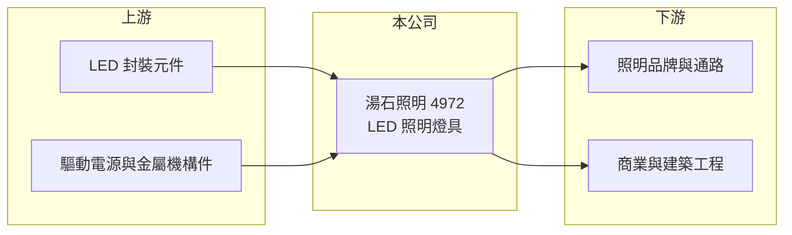

# 4972 湯石照明

> 上櫃｜[[產業索引-光電業|光電業]]｜上市（櫃）日期 2013/06/17

# 第一章：企業模式與商業藍圖

> [!info] 撰寫說明
> 精簡版，由 Claude 依公開資料整理，架構比照 [[2330台積電]]，資料截至 2026-10-07。來源：nstock.tw 湯石照明公司概況、winvest.tw 營收快訊、經濟日報。公開資料有限。#待校對

湯石照明是 [[LED照明]] 燈具製造商，位於 LED 產業鏈的應用端。

- **核心業務：** 照明設備與燈具的製造買賣，以及 LED 半導體照明相關應用產品的研發、生產與銷售。
- **營收結構：** 本次未查到產品或地區別營收比重。
- **營運據點：** 生產據點本次未查到明細，本文不推測。
- **長期方向：** 公開資料有限，需追蹤公司在商業照明與智慧照明等高附加價值產品的布局。

# 第二章：護城河深度與競爭優勢

照明燈具門檻不高，湯石照明的競爭力主要在設計與客戶關係。

- **競爭優勢：** 公開資料有限，推估以燈具設計、品質認證與長期客戶關係為主。
- **主要對手：** 台灣同業如 [[6164華興]]、[[3591艾笛森]]，以及中國大量的 LED 燈具廠。
- **觀察重點：** 營收回升能否帶動營業利益轉正。

# 第三章：財務體質與盈利規模

資料日期：2026-10-07，以下數字是撰寫當時的快照；最新月營收、毛利率、累計 EPS 由自動排程寫在本筆記的屬性欄位（月營收、毛利率、累計EPS 等）。#待校對

湯石照明 2026 年營收回溫，但本業仍虧損。

- **營收規模：** 2025 年全年營收 9.33 億元；2026 年 1 至 9 月累計 7.42 億元，年增 9.56%，9 月單月 0.78 億元。
- **獲利：** 2025 年 EPS -1.84 元；2026 年第二季 EPS -0.39 元，[[毛利率]] 23.51%、營業利益率 -12.86%。
- **財務特色：** 近五年平均現金股利 1.04 元，2025 年度配發 0.8 元，虧損年度仍有配息。

# 第四章：總體風險與地緣政治

湯石照明的風險在於價格競爭與費用結構偏重。

- **產業週期：** 照明需求跟著建築與商業空間投資起伏，LED 燈具價格長期下滑。
- **營運風險：** 營業費用相對營收偏高，營收若無法持續成長，虧損難以收斂。
- **其他風險：** 中國低價競爭、美國關稅政策，以及匯率與金屬、電子零件成本波動。

# 專有名詞解析

## 半導體

- **[[LED封裝]]**：把 LED 晶粒固定在支架或基板上，接線並以膠體保護，做成可焊接使用的元件。

## 應用

- **[[LED照明]]**：以 LED 為光源的照明產品，比傳統燈泡省電、壽命長，已成為照明主流。

## 金融

- **[[毛利率]]**：營業毛利占營收的比例，反映產品的定價能力與成本控制。

# 核心供應鏈

- 上游：[[LED封裝]]元件（如 [[2393億光]]、[[6168宏齊]]）、驅動電源與金屬機構件供應商（推估）
- 下游／客戶：照明品牌、通路與商業建築工程（推估）
- 同業：[[6164華興]]、[[3591艾笛森]]

## 最新新聞
<!-- news:start -->
<!-- news:end -->

## 相關連結
- [公開資訊觀測站](https://mopsov.twse.com.tw/mops/web/t05st03?step=1&firstin=1&co_id=4972)
- [Goodinfo](https://goodinfo.tw/tw/StockDetail.asp?STOCK_ID=4972)
- [Yahoo 股市](https://tw.stock.yahoo.com/quote/4972)
- [鉅亨網新聞](https://www.cnyes.com/twstock/4972/news)
