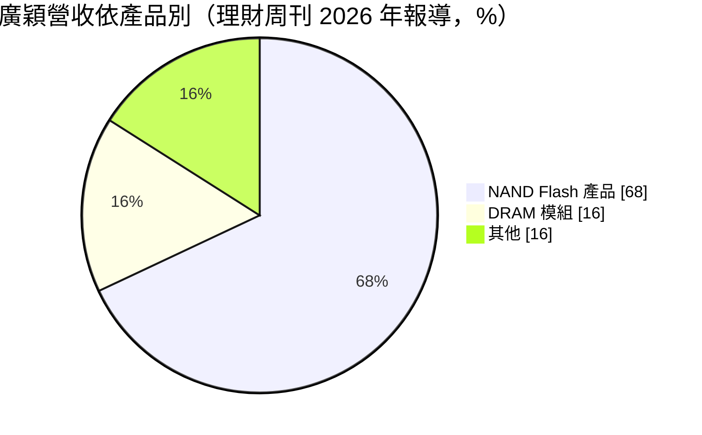
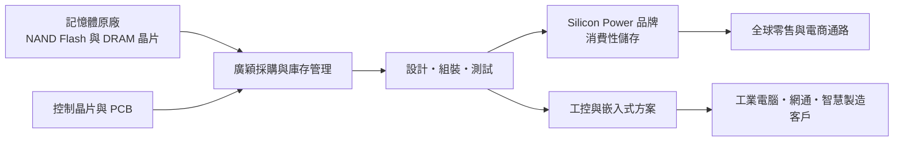
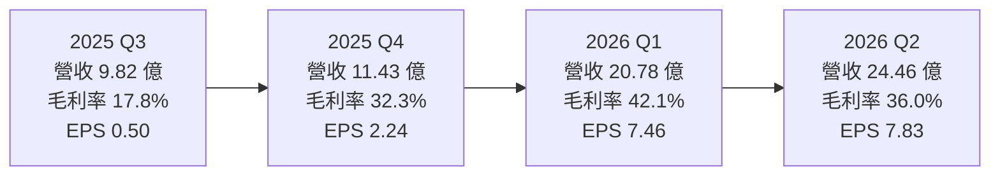
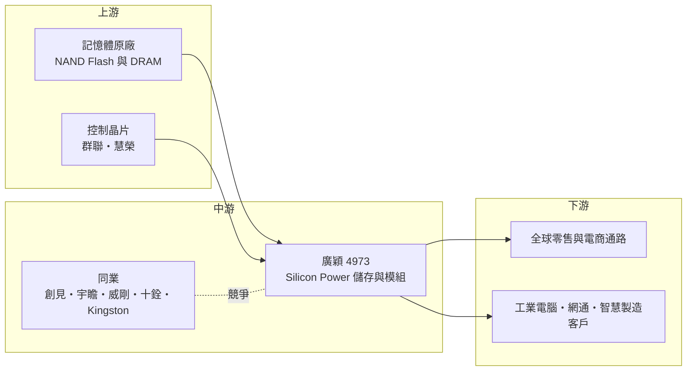

# 4973 廣穎

> 上櫃｜[[產業索引-半導體業|半導體業]]｜上市（櫃）日期 2012/06/19

# 第一章：企業模式與商業藍圖

> [!info] 撰寫說明
> 本文由 Claude 依公開資料整理，架構比照 [[2330台積電]] 的四章研究，資料截至 2026-10-08。財務數字來源：StockAnalysis（S&P Global Market Intelligence）年度與季度損益、財務比率，理財周刊與工商時報對廣穎 2026 年營運的報導，nStock 公司資料頁，櫃買中心 OpenAPI 的 2026 年上半年財報；產業描述為整理性內容，尚未逐條比對原始文件。#待校對

在評估單一個股的長期投資價值時，首要步驟是拆解企業的底層獲利邏輯。本章針對廣穎電通（股票代號：4973，以下簡稱廣穎）的商業模式進行定性分析，說明它如何以 Silicon Power 品牌經營全球儲存市場，以及為何近年把重心轉向工控應用。

## 一、核心定位：以 NAND Flash 為主的儲存品牌與工控方案商

廣穎成立於 2003 年，2012 年在櫃買中心掛牌，總部位於台北內湖，品牌名稱為 Silicon Power（SP）。它和其他記憶體模組廠一樣不生產晶片，而是向原廠採購 [[NAND Flash]] 與 [[DRAM]] 晶片，搭配控制晶片與電路板，做成 [[SSD]]、記憶卡、隨身碟、外接式硬碟與記憶體模組，以自有品牌或替工控客戶客製出貨。

廣穎與同業最大的差異在產品重心。多數台灣模組廠以 DRAM 模組為主，廣穎則以 NAND Flash 產品為主。依理財周刊 2026 年的報導，NAND Flash 模組占營收約 68%、[[DRAM模組]]約 16%。NAND Flash 價格週期與 DRAM 不完全同步，這讓廣穎的獲利節奏與 DRAM 為主的同業有所不同。

## 二、終端應用與產品板塊：從消費性零售轉向工控

* **消費性儲存：** SSD、記憶卡、隨身碟與外接硬碟，透過全球零售與電商通路以 Silicon Power 品牌銷售。這是廣穎過去營收的主體，品牌在海外電商平台有一定能見度（推估，比重未查得），但消費性產品規格標準化、價格競爭激烈，毛利率長期偏低。
* **工控與嵌入式：** 提供[[工業電腦]]、網通設備、智慧製造與[[邊緣運算]]設備使用的寬溫、高耐用度儲存產品。依理財周刊報導，工控在 2025 至 2026 年初約占營收一至兩成；工商時報報導 2026 年第二季工控產品已超過總營收五成。兩個數字差距大，可能是統計口徑或期間不同，需以公司資料核對，但方向一致：工控已成為廣穎的主要成長來源。
* **企業級與高附加價值產品：** 隨著 [[AI PC]]、邊緣 AI 與數位轉型需求，企業級與高規格產品比重提高。

## 三、資本轉化邏輯（營運模式）：採購、品牌與工控驗證

廣穎的獲利來自三個環節。第一是採購與庫存：模組廠的毛利很大一部分取決於買進晶片的時點與庫存水位，價格上漲期間低價庫存能帶來額外毛利，下跌期間則需要認列跌價損失。依理財周刊報導，2026 年初廣穎獲利大增的原因包括庫存結構調整、產品組合優化與低價庫存獲利回補。第二是品牌與通路：消費性產品靠品牌與電商通路的規模經濟。第三是工控驗證：工控客戶要求長期供貨與嚴格測試，一旦導入，訂單較穩定，毛利也較好。

這是一個輕資產模式，主要資產是存貨與應收帳款，資本支出很低。廣穎的資本報酬率因此主要取決於存貨周轉與價差，而不是設備投資。

## 四、企業長期藍圖：工控比重提升與供應鏈夥伴關係

廣穎的長期策略是提高工控與企業級產品比重，降低消費性市場的價格波動影響。公司把智慧製造、邊緣 AI 與數位轉型列為主要成長動能，並強調與上游供應鏈的合作與庫存優化策略。另一個結構性機會是原廠逐步減產 DDR4 等舊規格產品，仍需要舊規格的工控客戶轉向模組廠尋求長期供貨，依理財周刊報導，這是 2025 年第四季起工控拉貨增加的原因之一。

長期來看，廣穎能否在下一次記憶體價格下跌時守住工控業務的毛利，是檢驗轉型成果的關鍵。

# 第二章：護城河深度與競爭優勢

在長期價值投資中，「護城河」指企業抵禦競爭、維持超額利潤的保護機制。本章分析廣穎的護城河構成、主要競爭對手，以及這些優勢在記憶體價格週期中能守住多少。

## 一、廣穎護城河的核心組成要素

記憶體模組產業規格標準化、晶片由原廠掌握，整體護城河偏窄。廣穎的優勢主要來自以下三點：

* **1. 工控客戶的轉換成本：** 工業電腦與嵌入式設備的儲存元件需要通過寬溫、耐震與長期穩定性測試，客戶完成驗證後通常會在整個產品生命週期沿用同一供應商。這讓工控業務的訂單黏著度高於消費性產品。
* **2. 舊規格長期供貨能力：** 原廠為了把產能轉向高階產品，會逐步停產舊規格晶片，但工控設備往往需要同一規格供貨五到十年。模組廠若能管理舊規格庫存並提供替代方案，就能在這個利基市場取得較好的定價。
* **3. 品牌與電商通路：** Silicon Power 在全球零售與電商通路經營多年，具備一定的品牌認知與通路規模。不過消費者對儲存品牌忠誠度有限，這項優勢在價格戰中保護力較弱。

## 二、全球主要競爭對手格局

| 對手 | 定位 | 對廣穎的威脅 |
|---|---|---|
| Kingston（金士頓） | 全球最大獨立記憶體模組與儲存廠 | 消費與企業市場的規模與通路優勢 |
| 記憶體原廠自有品牌 | 三星、美光 Crucial、SanDisk 等 | 掌握晶片成本，缺貨時優先供應自家品牌 |
| [[2451創見]]、[[8271宇瞻]] | 台灣工控與消費性儲存品牌 | 工控與嵌入式市場直接競爭 |
| [[3260威剛]]、[[4967十銓]] | 台灣記憶體模組品牌 | 消費性 SSD 與記憶體模組重疊 |

## 三、優勢轉化：哪些市場守得住、哪些守不住

* **守得住：** 已完成驗證的工控與嵌入式客戶，以及需要舊規格長期供貨的設備廠。這類客戶看重穩定與品質，價格敏感度較低。
* **守不住：** 消費性 SSD、記憶卡與隨身碟的價格。這些產品高度標準化，原廠自有品牌與大型模組廠在成本上更有優勢，景氣下行時價格競爭最激烈。2021 至 2025 年廣穎營業利益率大多在 1% 至 3% 之間，反映的正是消費性產品的薄利。
* **觀察重點：** 第一，記憶體價格反轉後毛利率能否守在 2021 至 2025 年平均水準之上。第二，工控比重能否在景氣下行時維持五成左右。第三，存貨水位與跌價風險。

# 第三章：財務體質與盈利規模

資料日期：2026-10-08。數字取自 StockAnalysis（S&P Global）年度與季度損益、財務比率，以及櫃買中心 OpenAPI，表格是撰寫當時的快照；最新月營收、毛利率、累計 EPS 由自動排程寫在本筆記的屬性欄位（月營收、毛利率、累計EPS 等）。#待校對

財務報表是檢驗護城河是否真實存在的最終標準。本章用多年度三率、ROE、現金流與資本報酬，檢視廣穎在記憶體週期中的獲利品質。

## 一、獲利能力的基石：三率

| 年度 | 營收（新台幣） | [[毛利率]] | [[營業利益率]] | EPS（元） | [[ROE]] |
|---|---|---|---|---|---|
| 2021 | 41.9 億 | 11.64% | 0.80% | 0.35 | 1.11% |
| 2022 | 43.5 億 | 15.59% | 0.62% | 2.89 | 8.74% |
| 2023 | 44.9 億 | 21.09% | 3.07% | 3.12 | 9.28% |
| 2024 | 44.0 億 | 20.04% | 1.65% | 1.79 | 5.10% |
| 2025 | 42.6 億 | 23.69% | 2.72% | 2.11 | 6.39% |
| 2026 上半年 | 45.2 億 | 38.80% | 26.87% | 15.29 | 未查得 |

* **[[毛利率]]：** 2021 至 2025 年毛利率由 12% 逐步提升到 24%，顯示產品組合往工控移動的效果。2026 年上半年在記憶體漲價與低價庫存回補下達 38.8%，屬於週期高峰。
* **[[營業利益率]]：** 過去五年營業利益率只有 1% 至 3%，毛利大多被營業費用吃掉，這是消費性品牌需要大量行銷與通路費用的結果。2026 年上半年營業利益率 26.87%，是毛利擴張遠快於費用成長所致。
* **業外：** 2022 年營業利益率 0.6%，EPS 卻有 2.89 元，代表該年獲利有相當部分來自業外（推估為匯兌或投資收益，原因未查得）。
* **營收規模：** 2021 至 2025 年營收持平在 42 億至 45 億元，年複合成長率約 0.4%（推算）；2026 年上半年營收就已超過 2025 年全年。

## 二、[[ROE]]：資本效率

近五年（2021 至 2025 年）ROE 平均約 6.1%（推算），低於台股平均水準，主因是本業營業利益率太薄。2026 年上半年 EPS 15.29 元，是 2025 年全年的七倍以上，年化 ROE 推估將大幅跳升。對投資人而言，比起高峰年度的 ROE，更重要的是週期低谷時 ROE 能否維持在 5% 以上。

## 三、資本支出與自由現金流

* **[[CapEx]]：** 輕資產模式，資本支出很小。
* **[[自由現金流]]：** 依 StockAnalysis 的自由現金流殖利率，2022 與 2024 年為正，2021、2023 與 2025 年為負，與存貨增減高度相關：漲價期間備貨會消耗現金。2025 年底負債權益比升至 0.45，2026 年上半年負債約占總資產一半，反映營運資金需求擴大。
* **股利：** 2025 年度配發現金股利 1 元，nStock 資料顯示近五年平均現金股利約 1.4 元。依 StockAnalysis，配發率在 35% 至 114% 之間變動，2021 年因獲利極低而配發率超過 100%，顯示公司傾向維持一定的股利水準。

## 四、[[ROIC]] 與 [[WACC]]：價值創造利差

依 StockAnalysis，廣穎的 ROIC 在 2021 至 2025 年分別為 1.6%、1.1%、5.6%、2.7%、3.9%，五年都在 6% 以下。

WACC 以 CAPM 推估：無風險利率取台灣 10 年期公債約 1.75%，市場風險溢酬 6%，β 取記憶體模組同業常見的 1.2（假設值，未查得公司實際 β），股東權益成本約 8.95%。負債成本假設 2.5%，稅率 20%，稅後約 2.0%。依 2025 年底負債權益比 0.45 換算權益約 69%、負債約 31%（把總負債視為資金來源，偏保守），WACC 約 0.69 × 8.95% ＋ 0.31 × 2.0% ≒ 6.8%（推算）。

比較兩者：2021 至 2025 年 ROIC 始終低於 WACC，廣穎在這段期間並未創造超額價值。2026 年的獲利跳升讓 ROIC 推估將遠高於資金成本，但這主要來自記憶體週期。長期而言，只有當工控業務讓週期低谷的 ROIC 也能接近或超過 7%，廣穎才算真正建立價值創造能力。

# 第四章：總體風險與地緣政治

任何企業都無法脫離宏觀環境獨立存在。本章分析廣穎未來必須面對的地緣政治、產業週期、營運與技術風險。

## 一、地緣政治

廣穎的晶片來自韓、美、日原廠，產品銷往全球。中國記憶體廠擴產若使低價 NAND Flash 大量流入消費市場，會壓縮廣穎消費性產品的價格；美國關稅與各國對中國元件的限制，則可能讓工控與企業客戶更偏好非中國晶片供應鏈，對台灣模組廠相對有利。

## 二、產業週期與市場結構

NAND Flash 是半導體中價格波動最大的產品之一，供給由少數原廠決定，原廠擴產或減產都會造成價格劇烈變動。2026 年 AI 伺服器帶動企業級 SSD 需求，原廠產能轉向高階產品，使消費性與工控產品供給吃緊、價格上漲。這一輪週期反轉的時點難以預測，但歷史經驗顯示，原廠擴產後一至兩年內常出現價格回落。模組廠位於供應鏈中段，[[長鞭效應]]會放大庫存與價格的影響。

## 三、營運環境的隱性風險

* **存貨跌價：** 高峰期備貨越多，反轉時的跌價損失越大，存貨水位是最重要的風險指標。
* **原廠配貨：** 缺貨時拿不到晶片會限制營收，原廠優先供應自有品牌也會擠壓模組廠。
* **營運資金壓力：** 2026 年負債比上升，若價格急跌，存貨與負債壓力會同時出現。

## 四、科技或法規演進

SSD 介面由 PCIe 4.0 往 5.0、6.0 演進，NAND Flash 由 TLC 往 QLC 發展，工控與企業客戶對耐用度、資安加密與韌體管理的要求越來越高。模組廠若只做組裝，附加價值會被原廠與控制晶片廠擠壓；若能在韌體、資安與長期供貨管理上建立能力，才能維持工控市場的定價權。

# 專有名詞解析

## 半導體

- **[[NAND Flash]]**：斷電後仍能保存資料的快閃記憶體，是 SSD、記憶卡與隨身碟的核心元件。
- **[[DRAM]]**：動態隨機存取記憶體，電腦與伺服器的主記憶體，斷電後資料會消失，價格週期波動大。
- **[[SSD]]**：固態硬碟，以 NAND Flash 加控制晶片組成，讀寫速度遠快於傳統硬碟。

## 應用

- **[[邊緣運算]]**：在靠近資料來源的設備端直接運算，而不是全部傳回雲端，可降低延遲與頻寬成本。
- **[[AI PC]]**：內建神經網路處理器、可在本機執行 AI 運算的個人電腦，通常需要更大容量的記憶體與儲存。

## 金融

- **[[庫存利益]]**：原料或商品價格上漲時，較早以低價買進的存貨以較高價格售出所產生的額外毛利，屬週期性收益。
- **[[ROE]]**：股東權益報酬率，稅後淨利除以股東權益，衡量公司運用股東資金賺錢的效率。
- **[[ROIC]]**：投入資本報酬率，衡量公司投入營運的資本能產生多少稅後營業利益。
- **[[WACC]]**：加權平均資金成本，股東與債權人要求報酬率的加權平均，ROIC 高於 WACC 才代表創造價值。
- **[[長鞭效應]]**：終端需求的小幅變動，沿供應鏈往上游傳遞時被逐級放大，造成上游庫存與訂單劇烈波動。

## 產業

- **[[DRAM模組]]**：把多顆 DRAM 晶片焊在電路板上做成可插拔的記憶體條，模組廠向原廠買晶片後加工銷售。
- **[[工業電腦]]**：用於工廠自動化、交通、醫療等場域的電腦，強調寬溫、耐震與長期供貨，對零組件驗證要求嚴格。

# 核心供應鏈

## 1. 上游：記憶體晶片與控制晶片
- NAND Flash 與 DRAM 原廠：[[005930三星電子]]、美光（Micron）、SK 海力士、鎧俠（Kioxia）等（廣穎未揭露具體採購比重）
- SSD 控制晶片：[[8299群聯]]、慧榮（Silicon Motion）

## 2. 中游：廣穎本身與同業
- 台灣同業：[[2451創見]]、[[8271宇瞻]]、[[3260威剛]]、[[4967十銓]]
- 國際同業：Kingston

## 3. 下游：通路與終端客戶
- 消費性：全球零售與電商通路
- 工控與嵌入式：工業電腦、網通與智慧製造設備廠（具名客戶未查得）

## 最新新聞
<!-- news:start（自動產生，請勿手動編輯此範圍） -->
- 2026-10-07 📰 媒體 18:53｜營收速報 - 廣穎(4973)9月營收13.06億元年增率高達277.71％｜[鉅亨網](https://news.cnyes.com/news/id/6623865)

完整紀錄：[[4973廣穎 新聞]]
<!-- news:end -->

## 相關連結
- [公開資訊觀測站](https://mopsov.twse.com.tw/mops/web/t05st03?step=1&firstin=1&co_id=4973)
- [Goodinfo](https://goodinfo.tw/tw/StockDetail.asp?STOCK_ID=4973)
- [Yahoo 股市](https://tw.stock.yahoo.com/quote/4973)
- [鉅亨網新聞](https://www.cnyes.com/twstock/4973/news)
