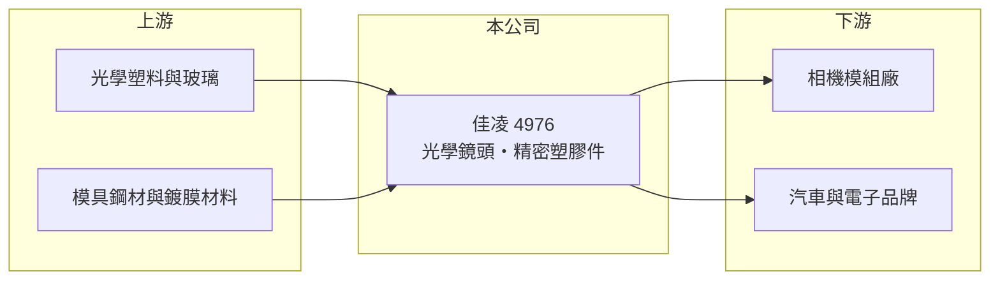

# 4976 佳凌

> 上市｜[[產業索引-光電業|光電業]]｜上市（櫃）日期 2012/11/20

# 第一章：企業模式與商業藍圖

> [!info] 撰寫說明
> 精簡版，由 Claude 依公開資料整理，架構比照 [[2330台積電]]，資料截至 2026-10-07。來源：nstock.tw 佳凌公司概況、winvest.tw 營收快訊。公開資料有限。#待校對

佳凌是台中的光學元件廠，產品包括[[光學鏡頭]]模組、精密塑膠件與汽車零件。

- **核心業務：** 登記業務涵蓋光學儀器、電子零組件、工業用塑膠製品、模具製造與表面處理，以及汽車零件與光學鏡頭模組製造。
- **營收結構：** 本次未查到產品或應用別營收比重。
- **營運據點：** 公司登記於台中市潭子區，其他生產據點本次未查到。
- **長期方向：** 公開資料有限，推估重點在車用與其他利基型鏡頭，需追蹤公司說明。

# 第二章：護城河深度與競爭優勢

光學鏡頭產業由大廠主導，佳凌規模小，目前處於虧損，護城河不明顯。

- **競爭優勢：** 具備鏡片模具、射出成型與表面處理的一貫製程，推估能服務少量多樣的客製化需求。
- **主要對手：** [[3008大立光]]、[[3406玉晶光]]、[[4974亞泰]] 等台灣鏡頭廠，以及中國舜宇光學等大廠。
- **觀察重點：** 毛利率何時轉正，以及新產品能否提高產能利用率。

# 第三章：財務體質與盈利規模

資料日期：2026-10-07，以下數字是撰寫當時的快照；最新月營收、毛利率、累計 EPS 由自動排程寫在本筆記的屬性欄位（月營收、毛利率、累計EPS 等）。#待校對

佳凌營收小幅成長，但 2026 年上半年虧損擴大。

- **營收規模：** 2026 年 1 至 8 月累計 7.25 億元，8 月單月約 1 億元，年增 13.26%。
- **獲利：** 2026 年第二季 EPS -1.14 元，上半年累計 -1.63 元；nstock 顯示第二季[[毛利率]] -49.06%，數值異常偏低，推估含存貨跌價或一次性費用，待以財報確認。
- **財務特色：** 資本額約 14.14 億元；近五年沒有配息紀錄。

# 第四章：總體風險與地緣政治

佳凌的風險在於持續虧損與在大廠夾擊下的定位。

- **產業週期：** 手機與消費電子鏡頭需求成熟，車用鏡頭成長較快但認證期長。
- **營運風險：** 毛利率為負代表產能或產品組合出現問題，若無法改善，虧損將侵蝕淨值。
- **其他風險：** 中國鏡頭廠的價格競爭、匯率與光學塑料原料價格波動。

# 專有名詞解析

## 應用

- **[[車用鏡頭]]**：裝在車輛上供倒車、環景與駕駛輔助使用的鏡頭，需通過車規可靠度測試。

## 金融

- **[[毛利率]]**：營業毛利占營收的比例，反映產品的定價能力與成本控制。

## 產業

- **[[光學鏡頭]]**：由多片鏡片組成、把光線聚焦到感測器上的元件，用於手機、車用與監控相機。

# 核心供應鏈

- 上游：光學塑料、玻璃、模具鋼材與鍍膜材料供應商
- 下游／客戶：相機模組廠、[[車用鏡頭]]與電子產品客戶（推估）
- 同業：[[3008大立光]]、[[3406玉晶光]]、[[4974亞泰]]、舜宇光學

## 最新新聞
<!-- news:start -->
<!-- news:end -->

## 相關連結
- [公開資訊觀測站](https://mopsov.twse.com.tw/mops/web/t05st03?step=1&firstin=1&co_id=4976)
- [Goodinfo](https://goodinfo.tw/tw/StockDetail.asp?STOCK_ID=4976)
- [Yahoo 股市](https://tw.stock.yahoo.com/quote/4976)
- [鉅亨網新聞](https://www.cnyes.com/twstock/4976/news)
